# 在国家级贫困县的所见所感

**尽管两免一补政策落实之后上小学实际上没什么费用，但是很多人家还是不让自己的孩子去上，宁可让他们留在家里帮着干农活。在我们调查的家庭之中，父母的文盲率估计接近或者超过50%，这些文盲父母对孩子的负面影响实际上非常严重，很多家长并不知道外面的世界是什么样子，他们从出生到现在最远到过的地方不过是县城而已。在他们的世界里文化并没有那么有用，所以他们宁可让孩子辍学去做农活。**

# 在国家级贫困县的所见所感

## 文/张韧刚（洛阳大学）

夏日的一天，一位老朋友，百蹊的义工忽然邀请我和她一起去甘肃清水做一个对党和村受捐助的孩子们的回访，百无聊赖，我随口答应，却没想到此行给我带来了如此深刻的记忆，引起了那么多思考。

**L老师与百蹊**

来到白家乡之后第一个让我记住的面孔是一位L老师，个子不高，话不多，说话也不快很有条理，穿着简单的西装和皮鞋，操着一口不太标准的普通话。据L老师自己说，他在上完高中之后，由于家里缺少壮劳力，地没人种，L老师自己又不会种地，于是他顶替了自己父亲在学校的岗位，成为了一名民办教师，后来因为工作优秀，在第一批就被转正成为正式教师。在这个山沟里，L老师在老师的岗位上一干就是20年。L老师对学校的情况，学生的情况都了如指掌，他的经历一定程度上见证了20年来中国基层教育政策的变化，也见证了7年来该志愿项目让这个村子发生的变化。

 L老师工作的党河小学

L老师刚刚工作的时候就是在党河小学，20年来，L老师经过几次调动之后，依然回到了这座他第一次开始走上讲台的小学。在这20年里，老师的足迹踏遍了几乎党河村几乎每一个家庭，他的学生有的已经结婚生子，并且将自己的孩子送到老师门下。刚开始的时候，整个学校不过60多个学生，但是男女比例非常惊人，一度达到58:3，升学率也非常惨淡，义务教育在这片土地上的普及率之低，让人难以想象。

后来他的一位在城里做记者的远房亲戚回到山村探亲时目睹了这里的落后现状，并且决心为此做一些事情，于是在2002年的时候写下了一篇文章《[救救关山深处的孩子们――陇东山区农村写真(杨耀峰) ](http://forum.lohcn.org.cn/forum/viewtopic.php?t=5824)》这篇文章引起了带我们来的那位义工的注意，于是辗转多次，百蹊通过这位义工和李老师建立了联系开始援助这个村子。

**贫困与愚昧伴生。**

义工们告诉我，512地震之后，由于距四川不算远，而且很多房屋年久失修，使得党河受灾情况比较严重，不少村民的房屋沦为危房，个别乡村小学的围墙倒塌，出现伤亡事件。

百蹊在地震之后援助了白家乡党和村希望小学的厕所和围墙重建工程，工程之中，为了节约善款，L老师及相关施工人员甚至把原先围墙上的一部分砖都重复使用了。随着5万多元的善款的迅速到位，在义工和当地人的严密监管之下，善款的使用效率很高，小学的围墙和厕所的建设很快完成。但是在512地震中沦为危房的学校教室却一直没有得到来自政府的拨款，百蹊曾经对是否应该对学校教室修缮项目进行了争论，但是最后没有达成共识。于是从512到现在，校舍依然没有得到有效修缮。

地震带来的影响并不仅仅是学校，经过512地震之后大量民房处于危房状态。国家的政策是只要住房成为危房，必须重建的，每户可以领取1.3万元灾后重建补助，剩余经费自筹。但是当地山大沟深，建材价格高，而且运费昂贵，所以建房的价格大致在2.2万元左右（2008年，10年的价格大概在2.6-3万元之间），国家的补助也是分批发放，根据房屋的建设情况一笔一笔的给。比如最后如果不贴瓷砖则被认为是没有完工，会被扣除4000元。虽然有政府的补贴，但是很多农民依然为了重建房屋背上了沉重的贷款负担。在我们的调查过程之中，凡是家庭特别贫困我们考虑资助的学生，每一家都有沉重的债务。不少家庭背上了数万元的贷款，并且驴打滚的利息，让债务以每年上千元的速度递增。问及很多家庭打算如何还款很多人回答等把孩子供出来慢慢还，或者干脆就告诉我们，还不上么，怎么办？然后用一双无奈的眼睛看着我们。

[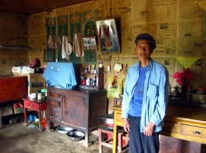](d7f67094-f666-4fbf-878a-8d002b33d7f2.jpg) 在清水他家情况还不算太差。但也背上了很重的债务

[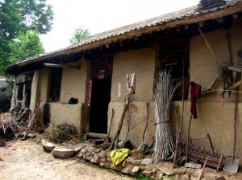 ](24c4053b-0086-42bc-b87b-eda586357978.jpg)这是一户家境非常贫困的农户家

[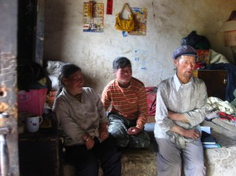](ec625c4c-c80b-473d-8124-e77cdfc1b6c7.jpg) 家里母亲是一个侏儒，父亲身体不好劳动能力一般，孩子16岁的时候才上小学四年级。

[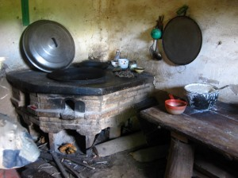](a20cce60-2246-4466-a2ae-1c8af3d34f09.jpg) 家徒四壁的现实。 

而根据我们的调查的情况，当地不少家庭如果没有新的经济来源，是根本没有能力偿还贷款的。地处陇东的清水县，以山地和丘陵为主，气候在西北属于较为阴冷的，排水不畅，降水偏多，曾有某些年份出现内涝导致种植的麦子颗粒无收的结果。但是由于庄稼只能重在沟里，所以一旦雨水过多就会出现内涝。据L老师讲，曾经有某些年份因为内涝导致小麦成片的发黑，绝收。而即便像是今年这样的丰年，小麦的亩产依然很难超过200斤每亩，而当地的小麦收购价不过0.9元左右，而效益较好的玉米，亩产虽然可以达到500-600斤，但是需要投入的农膜，化肥也多的多，所以种植面积并不大。按这个情况计算，有的家庭贷款数额达到3万元的，每年就要有2000多元的利息。所以当时走访的很多人家用家徒四壁来形容并不为过，除了简单的炕和家具之外，他们几乎一无所有。即便是情况最好的家里，也不过是能有几间房子，一台电视机，一辆摩托车而已。

然而贫困并不仅仅是因为自然原因，以贷款为例，很多农民从农信社弄来的用于生产的贷款经常被消费掉，很多农民家里贷款的用途上写着养殖，但是最后却用在了修房子和买摩托车之类的事情上。而且农民信用意识淡薄，在调查过程之中我们还看到了农信社起诉农民之后法院发来的传票。更可悲的是愚昧，走访之中我们发现有人家的孩子出去打工，然后误入传销陷阱，结果打电话回村子说能赚大钱，叫走了几个亲戚，带走了家里从农信社贷出来的几万元之后，人财两空。由于收入低，环境闭塞，加上劳动强度大，很多当地人都被命运压弯了腰，看上去很木讷，常常连普通话都说不清楚，而且越是住在深山里的，越是沟通起来很困难。

[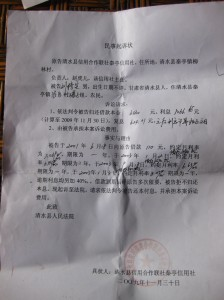](d39c6352-ada7-4469-9d25-2b0ea1b267e1.jpg) 被农信社起诉农民的诉状

由于严重的闭塞，所以当地重男轻女的思想残留依然严重，之前不让女孩上学的情况，在这些年的援助过程之中一点点的好转，但是人们依然对男孩有特殊的偏爱，为了养一个男孩，很多家里不惜一而再再而三的超生，生下孩子就跑到外地躲避结扎，只有过年才回来。志愿者深入农家调查的时候还曾经被当做过计生委的工作人员，家长就撒谎说自己的孩子是亲戚家的，不是自己的。而且很多家人甚至连孩子的准确年龄出生年份都记不清楚，岁数往往都是虚岁，一虚就是两岁，志愿者只好问孩子的属相来推算出生年份。

[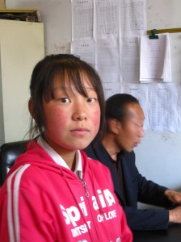](9ffe0374-7439-4d31-b507-a933728c8686.jpg) 一位受到援助的初中女生，如果没有这些援助，她现在可能已经辍学了。

然而虽然家长们喜欢男孩，但是男孩依然是个巨大的负担，生了小孩之后就要想办法给孩子成家，在农村，一个女孩出嫁的财礼要6-10万元，很多人家女孩多的，就非常看重这笔一次性收入，为了保住这笔彩礼，所以很多孩子的婚姻都是父母做主定下的，而且这种情况直接导致了家长们不愿意让自己的孩子走出大山去外面打工或者上学，害怕孩子们出去谈恋爱，回来拿不到那笔彩礼。

在上学的问题上很多人家的考虑角度也不同，尽管两免一补政策落实之后上小学实际上没什么费用，但是很多人家还是不让自己的孩子去上，宁可让他们留在家里帮着干农活。在我们调查的家庭之中，父母的文盲率估计接近或者超过50%，这些文盲父母对孩子的负面影响实际上非常严重，很多家长并不知道外面的世界是什么样子，他们从出生到现在最远到过的地方不过是县城而已。在他们的世界里文化并没有那么有用，所以他们宁可让孩子辍学去做农活。但是只要教育程度稍微好一些的家长，哪怕他们只读过小学，都会更多的支持自己的孩子上学。贫困往往与愚昧伴生，越是闭塞的地方，就越是贫困，在走访之中我们明显能感觉到，住在公路边的那些孩子的家长普通话的程度就要好很多，而住在山上村子里的很多家长，即便自己有电视也很难听懂我们说的普通话，沟通都相当困难。

[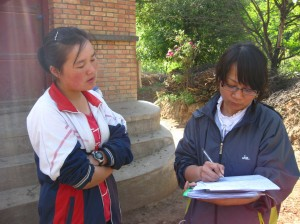](ba04e067-7a91-4f57-8ea4-2a7edf7ad0cb.jpg) 很有主见的高中女生，面对志愿者侃侃而谈。

在调查之中，曾经遇到一个今年高考的女孩，她的谈吐就明显与那些神情麻木的家长不同，一点也不显得羞涩，落落大方，侃侃而谈，同时眼睛里闪烁着坚定的光芒，在她身边能感受到她与父辈们那种听天由命不一样的与命运抗争的那种愿望。她不但自己学习非常好，还常常鼓励周围的女孩子坚持上学，并且自己去规劝那些家长，让他们继续支持孩子上学。这在一个重男轻女的环境之中是颇为难得的。这让我感受到了教育带来的强大的力量，它不光可以改变一个人对这个社会的认识方式，更多的是可以改变对待命运的态度，而这种态度的改变在这样贫困的山沟里，对他们的未来而言，往往是有决定性作用的。

当地的一些扶贫项目我们也能看到实际的效果，比如村村通工程就让每家每户都能看上电视。比如最近的搞的一些路面硬化工程就让我们访问的党和村直接受益，我们的车可以直接开到小学门口。

[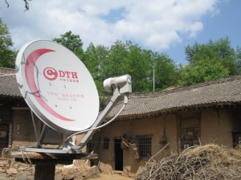 ](e980ae19-8944-4291-a08b-577444929019.jpg)村村通工程的卫星接收天线

**基层教育现状**

上到县领导，下到学生家长实际上谁都知道多读些书有好处，但是到了需要真金白银的投入的时候，大家就开始犹豫了。

在国家的两免一补政策实施之前，一些学生的家长交不起学费，但是依然把孩子送到学校，学校就不给这些孩子发书，于是很多孩子共用一本书的情况非常常见。加上教育质量差，缺课等等原因，很多学生在一年级之后没办法很好的掌握所学内容，学校只好因地制宜在一二年级之间设置考试，保证2年级以上的学生都能跟的上课程进度。我们在村子里还遇到过一个一年级读了四年的女孩子，还有一个孩子因为上学晚，加上中间辍学等原因，16岁，才上小学四年级，最后和班上的同学的年龄差距太大，不好意思继续上，就辍学了。

虽然义务教育免费迟到了二十多年，但是两免一补政策实施之后，小学的情况的确好了很多，义务教育费用得到了实质性的降低，但是实际上在当地还是需要交一部分教辅材料的钱，这一部分钱按照政策来说就属于乱收费，但是实际情况是当地山高路远，学生的确需要一部分教辅。

初中以上的情况就变得复杂了很多，由于很多初中学生是在学校住校的，所以住宿费还是需要交给学校，此外还有伙食费，教辅材料和少量的作业本试卷之类的费用，其中，每学期的教辅120元左右，住宿40元，每顿饭1.3元。这些对于当地那些年收入不过几千元的农民来讲并不是小数目。虽然两免一补政策每学期会补助375元给农民，但是针对在校生的补助经常不到位，所以一些农民还是不愿意把孩子送到学校去。同时初中生和小学生不同，上初中的孩子一般都具有与成年人接近的劳动能力，所以很多农民家庭还是愿意让孩子去干农活。由于很多家长没有钱供孩子上高中（高中不属于义务教育不享受两免一补的政策优惠）所以没有机会考大学，于是一些孩子的家长就觉得上初中也没有必要，小学上完一些学生就辍学了。由于高中不享受义务教育待遇，实际上剥夺了很多孩子改变命运的机会。

志愿者告诉我，其实援助他们的原因不是要让他们拿这些钱给自己孩子交学费，而是用经济刺激的方式让家长把孩子送去学校。在两免一补政策实施之后，小学阶段的费用就仅仅是每学期80元的教辅钱，除此之外并没有其他费用，所以每学期200元左右的捐款实际上是大大超过上学的费用的。而就是这样，在百家中学走访时，学校校长依然向我们抱怨，有的农民，两免一补的375元钱到了自己的“一折明一卡通”（这是一个农信社的账户，其中两免一补，退耕还林，农资化肥的补贴等等都在这个账户上）里面，但是他们依然会拖欠，甚至不交那40元的住宿费。让校长颇为头疼。

而更为恶劣的是村子里原先有孩子申请了百蹊的资助，但是在中途辍学离校去新疆打工，于是L老师把已经汇到学校的善款退回了百蹊，结果因此导致被资助的学生家长不满，甚至威胁要找人打L老师。

[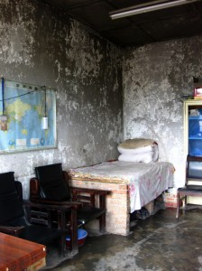](86ccbcb9-e24f-41f3-86bf-7c0002435781.jpg)

党河小学的教师宿舍

然而，这些问题还仅仅是在经济上的。在陕北陇东等地，乡村小学一般把中心小学建在乡镇一级的行政单位所在地，以百家为例百家乡有一座中心小学和一座初中。中心小学校长兼任学区区长。初中学生多为住校生，而小学基本都建在各个村子里，小学生都住在自己家里。在陕北一些地方，由于一些村级小学的学生非常少，有时候一所学校只有十来个学生，所以这些地方的学校开始陆续撤编，开始让小学生到中心小学就读。这让一些孩子的负担大大加重，有时候每天上学要走三个多小时山路去学校，天不亮就得出门，早上不吃饭，中午在学校啃馒头和干粮，晚上回家吃一顿饭。据志愿者说，这种局面让很多家长也看不下去，于是个别村子甚至自己聘请老师来给孩子们讲课。

[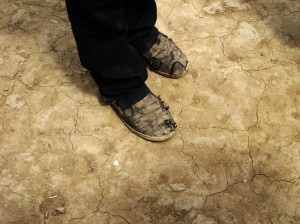 ](6d232f43-5edb-4a2f-9ad9-a71964e89736.jpg)山大沟深，每天走好几公里山路上学的孩子们

由于教师素质不高，很多学校的老师并不能保证很好的教育质量，但是分数又是这些老师的考核标准，所以一些压力被转化成课业负担转嫁给了学生，在我们的调查中很多小学生回家之后居然需要花两个小时来完成家庭作业。而由于山区的情况较差，每每有好的老师分配到这里都会仪仗自己的才能想方设法调动到中心小学，或者县城去，这让原本就捉襟见肘的师资力量进一步分配不公。

[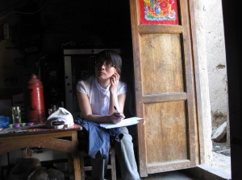](9201d1c9-ea90-41d0-8732-eef9df9844f1.jpg) 志愿者在农户家调查。

虽然一些支教志愿者们会深入一些山村开展支教，一定程度上改善了这种教育资源的分配不公，但是支教本身也带来了一些问题。支教本身分两种情况，一种是由学校组织的，一种是类似中国支教网这样的民间自发行为。学校组织的支教一部分以合同形式派来的，政府承诺支教一定时间之后会分配工作并且每个月给600快补助。这一部分支教人员实际上不能算作志愿者，他们是有着自己的目的的。另外一些学校或者团组织搞的支教具体情况比较复杂这里先于篇幅不多讲。这些通过学校组织来到山村的支教人员由于刚出校门，对外界了解较少，所以对支教过程之中看到的当地的一些不公正现象提出了自己的批评，在陕西的一些地方甚至和当地出现了一些冲突。

但是尽管如此，地方还是非常喜欢支教人员，因为他们不需要地方给他们开工资，不占编制，不会对当地的财政构成压力，也不会和当地老师竞争调动工作的机会。而且更有实际意义的是，支教的志愿者往往来自发展程度较好的地区，有比较好的沟通能力和知识面，教育水平较好，所以可以比较好的改变当地教育质量。尤其是在一些小学开设英语课之后，支教老师的水平就要比当地老师好很多。

**事后整理的一些想法：**

  * 捐助并不是解决他们的经济问题，而是通过经济方式刺激家长的积极性。

其实之前我对希望工程这样的项目的理解一直是这些项目让穷人家的孩子得到捐助，帮他们出教育上的费用。这次和志愿者们近距离接触了这些家长之后我才明白，其实这些捐款本质上改变的是家长送孩子上学的积极性。实际上，对小学阶段的捐助，基本上都是超过孩子们在学校里交的钱的——虽然这些钱是乱收费。而在调查之中，一些上过学的父母即便经济情况更糟也比那些文盲父母更愿意送自己的孩子去上学。让父母有一种送孩子上学的积极性这实际上是改变这些村子的教育程度的关键，当孩子的父母们不想让孩子上学的时候，或者希望他们去做农活的时候，我们应该如何改变这些父母对教育的看法？显然，一些父母并没有困难到那个地步，但是限于他们对教育的认识，他们依然愿意让孩子们辍学。

其实捐助是一种经济上的正面激励，尤其是百蹊的方式，受捐助的孩子一旦辍学，则立即停止捐助。但是教育的本身并不仅仅能给父母带来一年几百元的补助，更多的是它能改变孩子们的命运。但是我们应该如何让家长意识到他们的所做所为可能会剥夺孩子改变自己命运的机会？

很显然，我们在改变家长们的积极性方面，除了经济刺激，没有更有效的手段。

  * 没有监管，善款的效果就会打折扣。

512之后，很多NGO包括一些志愿者进入四川进行救灾，在网上披露了很多救灾过程之中的腐败。然而实际上没有监督的话，任何一个NGO，任何一个个人，都可能出现问题。

百蹊通过志愿者下去对那些接受捐助的家庭进行回访其实是相当累人的过程，很多志愿者千里迢迢从其他省份赶过来，集中之后下去进行回访。实际上有些时候，这个回访过程的花费要比资助四五个学生还要高。而这种决策透明和有效监管带来非常好的效率，以党河小学为例，在6月6日百蹊义工到达党河小学确认灾情之后，9月2号，善款就到位了，工程开建。到10月底，所有工程就都完工了。11月15号，百蹊的志愿者第二次下去复查。并且给出了详细的预决算清单。

而政府方面的拨款一共仅仅拨了3000，也没有进一步的动静，百蹊没有参与维修的学校教室，目前（2010年）依然是危房。

想保证经费的有效使用，监管就必须到位，国家在这几年也明白了这个道理，512之后的对居民危房翻修的1.3万灾后重建资金实际上就是有监管的分批次发放的，在走访之中，我们去的很多家庭都用着1.3万元翻修了房子，到现在都没听说一家有挪用这笔款项的事情。然而，农信社的贷款，教育部门灾后对小学的拨款，包括一些扶贫项目的拨款，实际上都处在一种无监管的状态之中，挪用情况非常普遍。甚至有以养殖为名的贷款，最后被传销团伙骗走的事情。

而在百蹊的论坛上，我看到这么一句话：“资助人越是信任我们，我们的责任也越大。”不知道512之后出问题的各地红十字会是怎么看待这个问题的。

  * 基层政府与NGO的合作问题

在一些大型公共事件的处理上，NGO比起政府组织在信息，经验，执行效率上都有一定优势。政府要处理的事务非常繁杂，整体效率也偏低，在一些行动的运作之中耗费也比较高。但是政府的优势在于他们有巨大的力量。以512之后灾后重建为例，如果为一家提供1.3万元来计算的话，一个清水县可能就需要上千万元资金。让NGO去筹集这么大笔的资金在当前国内显然是有困难的。但是面对一些更为复杂而琐碎的问题，NGO的优势就会体现出来，比如在党河小学的围墙重建项目上，如果按照政府的方式，可能是一次性拨款，然后回头验收工程就完了，资金能否落实，监管是否到位都很难讲。但是NGO来做这些事情的时候他们的监管就可以细致到实际使用了多少工人，重复使用了多少块砖这样的细节上。

当面对成千上万的家庭的房屋沦为危房这样的事情的时候政府巨大的力量有目共睹，但是当我们需要面对一些比较特殊的问题，需要对具体案例制定专门的细致的设施方案的时候，政府就变的力不从心，而NGO就可以在这种环境之中发挥自己的优势让有限的资金发挥最大的作用。

当然，NGO作为一个新兴事物在中国的影响力并不大，政府，尤其是基层政府还是有一种救灾的事情都归我管，你们少插手的官本位心态。在百家乡，学区区长曾经一次提供了几百名贫困学生的资料并且说：“你们最好能把这些学生的资料都报上去，然后把学生都资助了”。愿望是好的，但是学区区长显然不了解百蹊的做事方式。百蹊不是扶贫办，不是那种你能争取多少扶贫资金就争取多少的办事方式。对于NGO而言，他们并不对灾民负责，他们要对捐助者负责，保证捐助者的资金获得了最佳的使用。

而国内对NGO的压制依然没有完全解除，对NGO的注册成立并没有完全放开，而政府和NGO之间，还需要更长的时间来彼此适应。
