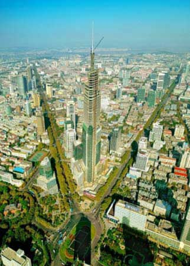

# 消失的古城 虚浮的繁荣

**从某种程度上，热衷于修建高楼大厦，并不是自信，而是自卑。如今，南京拥有了全球第七高楼——紫峰大厦。南京似乎在这座直冲云霄的建筑中，找寻自己京城的架势，故都的气派。二十多年前，南京市中心崛起一座金陵饭店，成为当时中国大陆最高建筑，号称“神州第一楼”，宣示的也是那座城市三十多年来一直没有消失过的对于自己“王气”的坚守，甚至是炫耀。**

**但是，南京真的应该拥有这样的地标吗？笔者一直都很怀疑。今天有了紫峰大厦，明天可以有红峰大厦、黄蜂大厦、金峰大厦云云，这样的所谓“地标”，对于南京而言，原本并不是那么重要。因为秦淮河不可复制，紫金山不可复制，燕子矶的斜阳不可复制，浩浩荡荡的长江不可复制。**

# 消失的古城 虚浮的繁荣

## 文/元淦恭（中国人民大学）

不知从什么时候起，有很多人开始喜欢分享自己家乡或者所在城市的高楼大厦的照片。摩天大楼配上令人炫目的三位数的高度数字，莫名地成为自己骄傲的来源。 我其实并不理解这种打了鸡血似的自豪感从哪里产生。全球天际线最高的城市，就在中国。我还从来没听说过那个城市的市民以自己城市的高楼大厦作为自己内心真实骄傲的源泉。香港最珍贵的东西，并不是有多少高楼，而是这些高楼背后创造的价值，以及支撑这些经济价值的制度基础。 全球天际线第二高的城市是迪拜。迪拜这座城市的炫富，有着很多复杂的因素。对于一个除了富有得除了石油一无所有的城市而言，寻求转型的过程，人为制造“景点”也是不得已而为之。更何况这个国家的政府的确有钱，而且“酋长国“是完全的君主专制国家，即使是政府进行大规模固定资产投资，也不会有人来对政府进行任何监督。 中国城市的天际线，如今以超乎想象的速度在快速增长。全球天际线前十名的城市，中国就有一半。西方国家在全球天际线排名中基本上已经没有位置，尤其是欧洲，几乎没有什么摩天楼。德国第三大城市慕尼黑的建筑限高是165米，在中国绝大多数省会随便拿一个高度排名前三的高楼，很可能在慕尼黑就是非法的了。 但是，拥有摩天大楼的中国城市，就真正不得了吗？ 我家住一栋六层的楼房。小时候，南北两侧都是平房，一栋楼房鹤立鸡群。后来，两边先后建起和我家所在楼高度相仿的七层楼房，于是家中的视野也大受阻挡，通风也远不如以前优越。到了现在，在这个居住区四周开始建起十几层、几十层的高楼，我们的高度，逐渐从台基之顶沦为盆地之谷。 一个城市，就这样长高。然而，这长高过程的背后是什么？ 抗战时候，成都被外来的文人们称为”小北平“。之所以如此，原因很多。北平和成都都是古城，都地处平原，恰好在所在区域又都没有被开作商埠。北平和成都都有河流，然而不像附近的天津、重庆有舟楫之便，航海之利，因而受到西方影响也不如津、渝大，保留了较完整的古都风貌。北平和成都都是老城，茶馆文化绵延深远。而且成都几乎是南方所有城市中旧城结构和北京旧城结构最为相似的。市中心的蜀王府旧址与北平的紫禁城对应，只是城市面积略小，全城略呈15度倾斜角，这与北平不同罢了。 成都在长江流域大都会中居于最西端。在1949年之前，基本上处于前现代化时期，这与重庆、武汉、南京、上海有着本质上的不同。也正因为此，如果说北京是1949年中国北方保留得最好的古城，成都就当之无愧是1949年之时中国南方保存状况最好的古城。 成都的城墙，修建于明朝，是中国南方除南京外最长的城垣。城墙坚固而富有特色，然而1957年，最高领袖一句：“城墙不利于交通”，就让当时的四川书记马上做出决定，拆掉成都的所有城墙。现在成都城墙残址已经只剩下西北的两三百米，这个城市的符号就这样消失。1969年，为了建设“万岁展览馆”，中国南方最大的明朝藩王府建筑，蜀王府正门被拆毁。同样在五六十年代，出于备战需要，成都城市中心的河流金河被填埋，原本横穿城市中心的碧波，就化为无形，只剩下人民公园里的一段。 成都的平房原系川西民居模样，大规模的拆迁，让成都旧城的平房基本全部被清除。成都旧城已经完全没有任何“古城”的特质。所以我觉得成都不像是一个“历史文化名城”，倒可以算做一个“非物质文化遗产”。比起全国其他的“历史文化名城”，成都的历史遗存并不算多，只是成都人的生活方式，保留了这座城市几千年温和富庶的特色。 成都的历史文化遗产，是杯盘碗盏中自在闲适的市民，和茶馆里沸沸扬扬的麻将声。 然而，那一个历史意义上的成都，从外观上已经消失了。 台北，比很多大陆的城市都要残破。其实香港的旧楼，都比内地许多城市要多。对私有财产的保护，使得在实行资本主义制度的地区，拆迁成为很困难的一件事。 由私产神圣推演出的拆迁难题，再由此导致的城市更新速度的下降，在我看来，是个自然的逻辑。所谓“发展才是硬道理”，不能忘记了这到底是为了谁的发展？如果发展是建立在对个人权利的剥夺之上，这并不是真正的发展。 譬如近年来在拆迁问题上出现的一幕幕悲剧，就是活生生的例子。城市正在加速现代化，然而却有越来越多的人为此付出牺牲。 所以，每当有人为成都增加一座高楼欢呼的时候，我就会想，其实这光鲜和浮华，很大程度上是建筑在唐福珍们消失的肉体上的。 追求无限增长城市天际线的发展，本质上是不同城市同质化恶性竞争的产物。当一个城市没有足够的历史遗迹可供炫耀，没有足够多的文化传承值得珍惜，于是就把那些所谓的“地标式”建筑作为城市骄傲的源泉，来证明这个城市的发达和繁荣。 可惜，这是虚浮的繁荣。这只是凯恩斯主义拉动固定资产投资的戏码，这只是为地方政府的GDP崇拜添砖加瓦，这只是一场地产商和地方官员掀起的一场又一场造富狂欢。普通的民众，除了瞻仰其高度，不能从中得到任何的现实利益。当然，这可以满足一部分人虚幻的“自豪感”。 从某种程度上，热衷于修建高楼大厦，并不是自信，而是自卑。如今，南京拥有了全球第七高楼——紫峰大厦。南京似乎在这座直冲云霄的建筑中，找寻自己京城的架势，故都的气派。二十多年前，南京市中心崛起一座金陵饭店，成为当时中国大陆最高建筑，号称“神州第一楼”，宣示的也是那座城市三十多年来一直没有消失过的对于自己“王气”的坚守，甚至是炫耀。 但是，南京真的应该拥有这样的地标吗？笔者一直都很怀疑。今天有了紫峰大厦，明天可以有红峰大厦、黄蜂大厦、金峰大厦云云，这样的所谓“地标”，对于南京而言，原本并不是那么重要。因为秦淮河不可复制，紫金山不可复制，燕子矶的斜阳不可复制，浩浩荡荡的长江不可复制。 丧失了首都地位的南京，用努力超越北京的天际线，证明不了任何东西。南京原本的骄傲，只需脚踏实地去体会，并不用仰望星空去制造。 过高的摩天大楼，尤其是400米以上的摩天楼，在经济上是完全不合算的。只是有这么多地方和企业都热衷于“赔本赚吆喝”，这不能不说是中国的一景。 刚刚看到一个相册，里面有成都海洋馆的设计，据说那将超越首都机场T3航站楼，成为全球最大的单体建筑。我想要是真是那样，倒是成都的悲剧。成都有许多属于OECD国家的友好城市，那些富裕的国家建不出来的奢侈建筑，倒是成都能建设。 作为公共设施，首要的功能是实用，然后才是其他。如果先追求形式后考虑内容，这样的建筑无疑是失败的。大成都市人均GDP仅仅6000美元，虽然在西部很是了不得，但却还没达到长沙、武汉的水平，遑论与东部发达地区相比。有这个钱来“炫富”，不如拿来好好改善民生。 有人会说，有了地标性建筑，可以展示一个城市的气势和风貌，展示出这个城市的精气神，从而更好的招商引资。这话明显是鬼话。 投资商选择投资地点的时候，首先是要看一个地方的硬环境、软环境，硬环境包括地形、交通、气候、基础设施建设等因素，软环境则是营商保护，法治，高效政府等等。无论硬环境还是软环境，都和一个地方有没有高天际线没有什么必然联系。 拥有高楼大厦的城市，并不会因为此就真正得到别人的尊重。就如今天，拥有全球最多摩天楼的国家中国，并没有因为摩天楼的增加而真正让世界感受到它的文明。因为在浮华和喧嚣的背后，是这个国家的躁动，而不是成熟。在光鲜外表背后隐藏的，是越来越巨大的贫富差距和社会鸿沟。 中国每天都在发展，以极其惊人的速度。然而，却有越来越多的人被这发展所抛弃。 在摩天楼里上班的人，一个月的收入，可能还买不下半个办公桌的面积，这就是中国残酷的现实。 重庆和成都，在川渝分治之后围绕天际线的竞争似乎没有停止的意思。许多重庆人对于重庆的高度感到骄傲，可悲的是成都有人要去应和。 成都的天际线，理所应当地比重庆矮。我发自内心地希望重庆拥有傲决西部的高度。因为，她是个值得拥有哪些所谓“地标”的城市。 从很大意义上说，摩天楼是为夜晚准备的。人家提到香港的风景，都会说欣赏“维港夜色”，不会说欣赏“维港日色”，就是一个例子。夜景好的城市，必须要有合适的夜景观景点，譬如山，譬如海湾，譬如大江大河。河流至少宽度要有500米以上，隔河看夜景才有价值，如果有山势连绵起伏，夜景就更加丰富而富有层次。 上海有条黄浦江，所以才可以说欣赏浦江两岸的夜色。香港有太平山和维港，因而港岛的建筑才显出其气势磅礴，重庆有两江抱城，山峦连绵，才更有其山城夜景的大气。 我不是反对一切的摩天楼，而是反对那些不必要的地标建筑。成都要是有和重庆一样多的高楼，又怎么样呢？我们难不成在府河南河看对面的高楼，或是人人包个直升飞机跑到天上去兜一圈？ 物质上的老成都消失了，消失得几乎不着痕迹。文殊坊、锦里、宽窄巷子，通通只是“仿古街道”，那不是真正的古物。 成都的命运，照见全中国城市的命运。 几十年来，许多古城就这样无声无息地消失，许多城市的真正的独特地标，就在机器声轰鸣中彻底被摧毁。 然后，他们去兴建新的地标，去创造一个个随时可能被人家刷新的高度。他们试图消灭恒久的记忆，然后去创造暂时的繁荣。 我最珍视的是一个城市的文明水准和幸福程度，至于天际线的高度，市容的崭新程度，我一点都不在乎。 老成都消失了，还好的是那里人们的生活没有改变过往的安逸，保护不了物质的遗产，就珍存这份非物质的文化遗存吧。我痛悼那些消失的古城，只希望那些城市原有的特质，不要完全随老建筑一起灰飞烟灭。 至于那些光怪陆离的现代建筑和摩天大楼，那只象征了虚浮的繁荣。钢筋混凝土，终究是无情的。
