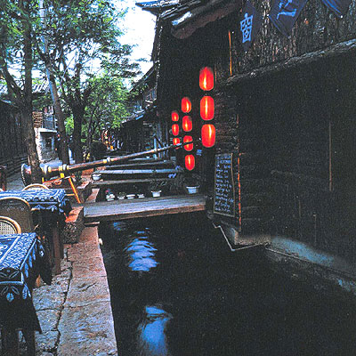

# 丽江的隐秘魅力

**西南高原的景色都如此吧，有高原的大气、开阔、干爽，又不似黄土高原那般荒芜，当然更不似青藏高原的铁血，云贵高原躲在青藏高原背后，却又接受了印度洋气流的滋润，自然又有东部平原的那些植物、动物和风水。丽江处在这样的环境中，又保留了古城的原生态，那里又住着好几个民族，纳西族、彝族、白族，通往香格里拉的茶马古道也在此，藏族在这里也一直保持着他们的影响。这么说，丽江沾了各种的好。只不过我知道，人们爱丽江多数不是因为这些，不因为丽江的人文，也不因为丽江的自然，大抵还是因为丽江的另一个身份，便是所谓的艳遇之都。** ** **

# 丽江的隐秘魅力

## 文/朱迅垚（中国人民大学）

五一去了丽江。住在朋友家在丽江开的客栈，结果没两天就高原反应，一个人到傍晚间睡在客栈的大床上，木门上的窗外透出一点暮色的光照，风起得很大，灯笼摇来摇去，让人觉得是在新龙门客栈，只不过所处的不是塞外，是在大西南。

要是没有高原反应这种讨厌的东西的话，大西南的高原景色真是令人舒服。大山近在眼前，可又不像岭南的山那般逼仄，堵得你眼睛难受，在拉市海下面，山色辽远，那所谓的海不过是一片安静不深的湖，不同于江南式小桥流水的幽深，水面是开阔的，小舟行在上边颇有安全感。空气呢，我深受其苦，因为干燥，也因为缺氧，可是，若能适应下来，必定是凉爽怡人的。东部的山区总是很潮湿，固然烟雾缭绕的景象也值得看，只可惜人并不舒服，身上也湿湿的，脚下也湿湿的。所以丽江的好处就在于既有高原的优点又有江南的景色：比如高山下可以跑马的草原，碧蓝的湖水，随处可见的不知名字的飞禽，若要早一点，便能看到云贵高原特有的油菜花景色，而江南的景多在古城里，不管云南的旱灾如何，玉龙雪山的水总是能把全城灌溉得满满的。丽江的污水系统和古城中四处横溢的河流毫不相关，这是城市管理的厉害之处了，也可见丽江发展旅游的眼光，我从没到哪座城市，那么多的人口，光是古城中的客栈就2000多家，还能有这么好的水。 西南高原的景色都如此吧，有高原的大气、开阔、干爽，又不似黄土高原那般荒芜，当然更不似青藏高原的铁血，云贵高原躲在青藏高原背后，却又接受了印度洋气流的滋润，自然又有东部平原的那些植物、动物和风水。丽江处在这样的环境中，又保留了古城的原生态，那里又住着好几个民族，纳西族、彝族、白族，通往香格里拉的茶马古道也在此，藏族在这里也一直保持着他们的影响。这么说，丽江沾了各种的好。只不过我知道，人们爱丽江多数不是因为这些，不因为丽江的人文，也不因为丽江的自然，大抵还是因为丽江的另一个身份，便是所谓的艳遇之都。丽江的酒吧比广州北京都要疯狂不少，酒吧的类别自然也有很多，只不过最惹火的当然还是所谓的艳遇酒吧。每个夜晚都挤满了各地来丽江的孤单的人群，酒吧的主持人和DJ用各种煽动的语言和音乐调动在场男女的情绪，到午夜时分，快散场之前，无论是身体还是语言，已经到了极为露骨的程度，欢乐达旦是做不到的，否则那几千家客栈的床位是做什么用的呢？ 丽江的魅力其实发生了异化，很多人每年要去两三趟丽江，那里的自然环境，那里的人文环境固然是吸引他们的重要原因，但最吸引他们的怕还是这种夹杂着艳遇、放纵、狂欢的丽江文化。这里是每个人的异乡，每个人都是陌生人，却也最容易接近，没有那些平日里城市中的阻隔，没有层次、工作的分别，正常生活中隐秘的渴望在这里都可以释放出来。从机场送我们去客栈的师傅说他们接的最多的就是背着包的单身女孩，客栈的老板总结说来这里最多的是两种人，失恋了或者受到打击的，寻找艳遇想要放纵一次的，有求有需，自然合拍，歌舞升平中奏出了属于丽江夜晚的狂欢曲。 所以，丽江永远有魅力。这魅力不来自文化，不来自自然，还是来自人本身，来自人的欲望，人自己造出来的江湖。如果只是看文化，或是看古城，看自然，都比不上丽江的这种隐秘魅力，这是颇有意思的地方，也正因此，丽江的旅游其实有一个新的市场点，这个市场点在别处难寻，也只有在丽江那样的环境下才产生的了。我去的时候，买了一本《被遗忘的王国》，这是目前看到的关于古丽江最好的纪录，无论是自然还是民族的原始生态还是丽江古城从前的情况，这是了解丽江一手的资料，只可惜多数游人并不真的爱丽江的文化，要是真喜欢，哪会忽略这本书只爱钻到酒吧里寻艳遇呢。
