# 深圳下厂经历

# 深圳下厂经历

## 文/alexmaoist（北京航空航天大学）

（分序言，找工，进厂，企业概况，开工，辞工，尾声，总结，花絮九部分） 

### 序言

回到学校，躺在躺椅上，听着Lily Allen那俏皮的音乐，享受着空调的凉风，如此惬意，这不就是我在工厂打工时天天梦想的幸福生活吗？ 我只不过在工厂里做了二十天而已，而工友们，在这样的炎炎夏日，他们不仍然在车间里忙碌吗？ 至今，我感觉自己幸运，在这空余的一个月中，没有游山逛水，没有蹉跎校内，而是选择走入深圳的工厂之中，作了一名普通打工仔。 作为一个自命毛派的左青，长期混迹于北京的学生圈子里，虽然在全国各地搞过不少走访调查，但对南方的工厂，对于新一代的工人几乎没有了解。虽然出身于农村，自己的亲戚，小学同学中有不少都是年纪轻轻在南方打工，但和他们交流总是有颇感隔膜，毕竟我们的生活是两个完全不同的世界。再加上今年刚刚看完了《韩国工人》这本书，心潮澎湃，今天中国的情况与韩国有颇多类似之处，韩国的经验也颇值得我们借鉴。但真实情况如何，还必须要深入工厂，体验了解， 未来中国社会运动的主要力量在于工人，这是不少自由派都能够认识到的问题。而目标指向社会主义，共产主义的左翼，不能空喊与工农群众结合，而应该真正深入工农之中，去寻找我们所应立足的大地，寻找我们的力量之源。 

### 找工

作为一个手持假身份证，没有任何学历证明，没有任何工厂工作经验，年纪也不算小的男性，要想在深圳找到一份符合自己下厂要求的工作，还真有点困难。 初到深圳的第一感觉，这里真是名副其实的世界工厂，是一个超级城市。从广深高速路放眼望去，两侧都是拥挤的房屋和一个个工厂的铭牌。从沙井汽车站下车，满街都是年轻人，手机店里嘈杂的音乐敲打着耳膜。这就是深圳，依靠着打工者们勤劳的双手，每天数不清的商品从这里生产出来，运往全世界。 为了下厂的方便，到深圳之后，我便四处寻找办证的小广告，办理假身份证和健康证。办证的广告当然遍地都是，原来觉得很烦人的办证广告，现在觉得还真是方便人民群众。打电话谈好价钱，提供个人照片和身份证信息，两个小时之后就拿到了假的证件，深圳速度就是不一样。两个证件40元，做工质量还可以。有了身份证明，就可以光明正大的找工了。 因为办的是假身份证，类似富士康，德昌电机等这种比较大的企业就不太可能进了，因为他们进厂手续比较严格，假证不容易蒙混过关，所以我把目标定位于做一名普工，找那种规模百人以上，提供住宿，最好是生产线作业的工厂。 到深圳之后，身上只剩下50多块钱，身上的银行卡里也只剩下40多块钱，如今，我可是真正的无产阶级了，只能靠出卖自己的劳动力才能生存下去。 我所在的沙井镇，位于深圳市宝安区，这里简直遍地都是工业区，（当地人每个村子会成立一家股份合作公司，在本村的土地上建设工业区，将厂房出租给企业，当地人依靠房租就可以过上很优裕的生活），大街上到处贴得都是招工的广告，但我一共用了三天的时间，才终于找到一个比较符合自己要求的工厂（但后来想想，如果开始不是太挑，找工应该也不是太难）。 [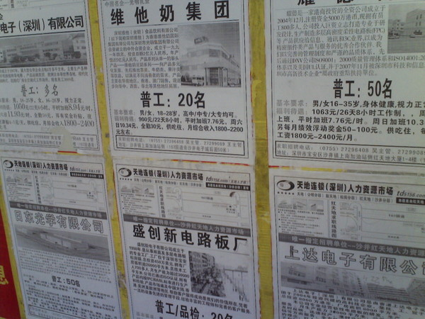](0f5d7d19-d0db-4774-ba20-0ce33ef0dd0f.jpg)

街头的招工广告

首先是刚开始找工时，还颇有些拘束，走了不少厂子，但缺乏走进去尝试的勇气。在第一天走了七八个工业区，大多都是都是电子厂，五金厂，模具厂，塑胶厂等，在每一个工厂的门口都贴着招聘的通知，街边也有不少在找工的工友，既有初次来深圳打工的人，也有辞了工要找新工作的人，还有现在有工作，但不满意，趁着中午出来找新工作的人。

大街上的招聘广告大多是职业介绍中心贴出来的，还需要交介绍费，其中自然也有不少是骗人的。一位好心的保安大哥还专门告诉我街边的一些待遇诱人的广告都是骗人的。一般在每个工业区门口的招聘广告会相对靠谱一些，直接进去面谈就可以。（在这里，工人确实很自由，他们充分享有挑选被哪个资本家剥削的自由。） 这一天我一共进了两家企业面试，其中有一个作坊式的工厂基本工资900，加班6.5元/小时，不包食宿，补助200，压一个月工资，没有住宿，放弃。有两个企业的保安很好心，直接劝我不要进他们所在的工厂，说厂子很不怎么样。 大多数企业都要加班，每天平均加班三四个小时，如果订单紧，赶活的话要更多的加班。路过宜家的供货商，还有三洋的厂子，询问了一下，都明确表示不招人。确实，找工的其他工友告诉我，这种比较大的企业一般比较正规，待遇相对较好，年初人就招满了，那种打着大招牌“常年招工”的厂子一般都不怎么样，留不住人，所以才常年招工。 [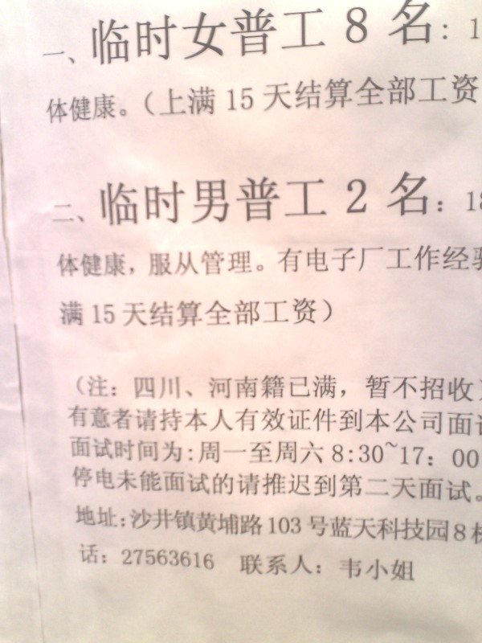](4669c00b-d9bc-4e2f-a601-32dfe76b29c6.jpg)

（河南人，四川人已满。其实意思就是不要，工厂主为了防止某一地方的工人太多拉帮结派，进而团结起来斗争，会有意限制）

第二天继续找工，大多数工厂要求工作经验，普工大多数只招女工，偶尔碰见招男工的竟然还写明河南人，四川人已满，总之是各种各样的限制。进了一个纸箱厂，老板说工作很累，主要是搬运纸箱，压一个月工资，大概看我身材瘦弱，态度很差。另外一个电子厂问了一下有没有电子厂工作经验，又觉得我是个男的，干脆不要。直到下午找到一个生产控制柜的工厂，直接找厂长面试，厂长介绍情况，第一句就是没有加班费，说原来有，但工人老是磨洋工，后来就没有加班费，月底算效益奖金。工厂总共也就几十个人，基本工资1000，有住宿，吃饭补助400，每月15号发工资，如果愿意，明天或者后天可以来上班。看这个工厂颇有黑工厂的嫌疑，不过总算有人要了，心中还是有些宽慰。 后来又去了规模很大的德昌电机公司，光看宿舍区规模就很惊人，厂区的宣传栏上还有温YD（此处非淫荡，莫误解）到这里视察的照片。这里有一个巨大的招聘大厅，找工作的人排起了源源不断的长龙，普工还是只招女工。技术工需要有学历证明，我虽然带了本科的毕业证，但怎么想觉得不合适，就放弃了。打听了一下，普通技术工人的工资并不比普工高，甚至要更低些，因为技术工人不直接为企业创造效益，工作相对轻松，也没有那么多加班。路过了一个规模颇大的人才市场，里面也挤满了要找工的工友。  第三天又在工业区走了一天，在万丰工业区的一家生产充电器的企业，计件收入，但被老板发现身份证有些问题，无奈，没有争辩，离开。 中午在路边休息时，碰到三个年轻工人模样的人打架，下手又快又恨，仅仅是电动车刮蹭，双方恶语相向，很快就扭打在一起，另一个人抄起电动车的链子锁就朝对方的头上猛抽，顿时血流如注，流了满脸的血，打斗戛然而止，受伤者蹲到了地上。围观的人很多，其中还有好几个穿着保安，巡逻制服的人，大家似乎司空见惯，只是围观议论，无人上去制止。获胜的两个打人青年骑车面无表情的离开，被打者抱着头以仇恨和怨毒的目光看他们离开（我当时真怕他抽出一把刀，冲向那两个人。如果他有刀，他一定会的）。长期在北京学校待的我很久没见过这么血腥的场面了，当时就有点懵，反应过来想打110的时候，战斗已经结束，想起来要打120的时候，被打者已经骑车离开了，流了一地的血。每个人心中大概都淤积了太多的怨毒，压抑了太多的愤懑，一有机会，就极端的宣泄出来，富士康自杀是一种形式，这种血腥的打斗不也是另一种形式吗？ 下午在一个招品管的小型机械加工厂被一个老板教育了半天，因为履历编造的不够翔实，这个老板眼光也够厉害，问了几个刁钻的问题就看出我所说的履历有问题，还对我教育了近半个小时，什么要踏实肯干啊，要诚实守信啊，要刻苦打拼啊。我很无语，不断点头称是，还好没有全露馅。另一个五金厂，态度更恶劣，大声朝我吼：戴眼镜的不要！！另一个玩具厂，保安说压三个月工资，不包吃住，干不干？我说这么差的条件，有人愿意来这个厂吗？保安说下午还招了两个男工呢，实在没钱吃饭了，也得干。 找个工作有这么难吗？我心中很失落，是啊，没有工作，就无法生存，在这里，没有了工作也就没有了一切。 几乎不抱什么希望了，在天要黑的时候，游荡到黄埔村的一个工业区，招男普工，到门卫室问保安招不招人，保安打了个电话之后说明天来上班吧。天啊，有这等好事，连面试都没有，直接上班？是不是黑厂啊？ 刚好旁边有一个工友来辞工，询问了一下这个厂的情况，这个工厂试工三天，然后才正式录用。工厂有三百人左右，每天上班12个小时，两班倒，每月休息两到四天，压15天工资，加班费6元/小时，不管吃，住宿要交住宿费。 好了，不管怎样，就这个厂了，终于算是找到工作。 补充深圳市的工资待遇： 深圳市的最低工资标准是关内1000元，关外900元（7月1日之后统一为1100元），但基本上所有的企业的基本工资都是按照最低工资标准，要拿到更多的收入，必须靠加班，而所谓的工厂正轨与否，或者收入的主要决定因素是加班时间的长短和加班工资的多少。有不少工厂在招工启事上专门注明“加班多”，有不少工人辞工也是因为工厂订单不多，加班太少导致收入不高。 按照国家法律规定，平时加班加班费为平时工资的1.5倍，周末加班费为2倍，国家法定节假日为3倍。按照基本工资900元计算，每小时正常工资为900/21.75/8=5.17元/小时。平时加班费应为5.17*1.5=7.76元/小时，周末加班费应为5.17*2=10.34元/小时，国家法定节假日加班费为5.17*3=15.52元/小时。**所谓的正规大厂，比如富士康，他们的加班费按照法律执行，所以工人们都愿意到这些工厂去。（但即使富士康的每月加班时间也达到了****120****个小时，国家法律规定是不超过36****小时。在富士康，如果你某天不想加班，可以不加班，但是再一两个月内你就很难再得到加班机会，你的收入也就只有别人的一半）**但是其他的工厂大部分都不会按照劳动法执行，我所在工厂工作不满一年的工人加班费无论什么时候都是6元/小时。其他的工厂有些计件工作，不给加班费，或者为6.5元/小时，或者再有一定提高，但均达不到法律规定。 [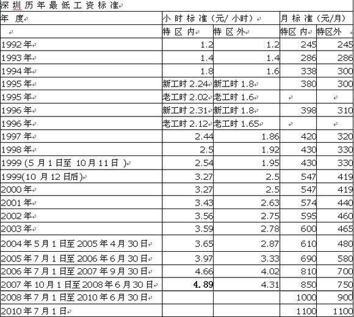](17213d79-6255-4136-b9c0-85a0ef21ddd2.jpg)

### 进厂

第二天一早就起床进厂，被分配到一层的挤出组试工，挤出组的组长看上去并不面善，给我再次讲了一下这个厂的待遇，说条件就这样，让我考虑一下。我当时就表示，找工找了好多天了，已经没钱吃饭了，愿意在这个厂里干。组长点头，把我带到一个小伙子跟前，让他教我，打工生活正式开始。 在进厂的第五天左右，保安拿出了一堆合同，让我签字。劳动合同，新员工服务承诺书，协议书，加班申请，不购买养老保险申请等等。 [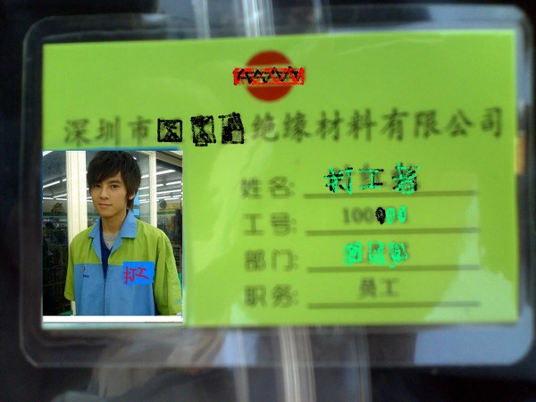](4bbfe88c-966b-4a6d-9022-6f5d95ac87ba.jpg)

厂牌（毫无PS的痕迹）

服务承诺书的内容大概都是“我自愿、我接受、我同意，我不追究公司，我不会起诉等等”。大部分内容都和相关法律抵触，如第九条：试用期内本人因故辞职，愿意接受公司三十天以内的工作移交时间，自愿接受公司现行的培训损失赔偿。（劳动法规定试用期辞工为三天）等。

但工人们如果没有法律意识的话，会认为自己签了这个协议，就应该按这个协议来，不能违反。 在这么一大堆合同协议上签完字，我要求保留一份劳动合同，保安指着公司乙方签名说公司还没有盖章，你拿着也没用。没办法，也不太和保安争辩，看来这个公司也是不给工人合同副本的。 签完字，再摁上红手印，颇有卖身的感觉。 [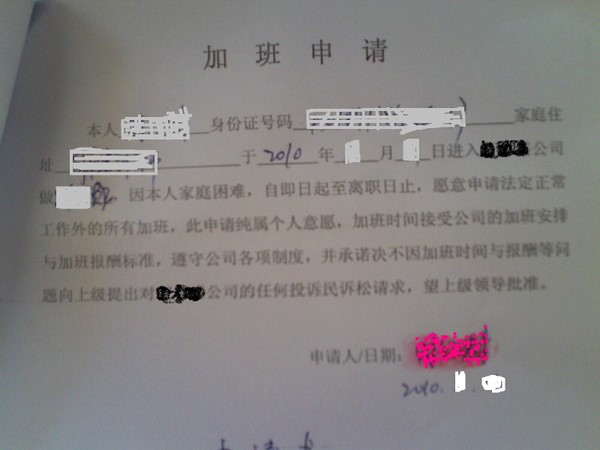](59b3f2a4-91b4-4978-af7e-ebe505badb74.jpg) 加班申请：“……承诺决不因加班时间与报酬等问题向上级提出对***公司的任何投诉民诉请求，望上级领导批准。”申请加班还要低三下四的，望领导批准，嗤—— [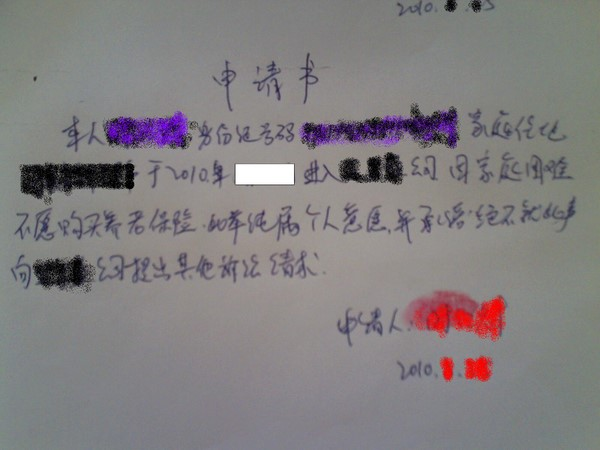](6ed3884e-62c4-473a-9004-dd423f3fdfd9.jpg) 不购买养老保险申请 （这些申请和条款都是在深圳的大部分工厂中都存在，这都是他们规避劳动法的手段。在深圳，经常会有一些法律专家给资本家讲课，共同研讨如何规避法律） 

### 企业概况

这是一家生产电线的企业，员工总数为280人左右，老板为湖北人，去年的产值约为8000万元，产品大部分供应家电企业，部分产品出口国外。 工人中男女工比例约为6:4，工人大部分年龄在18-24岁之间，我刚进工厂时带我的两个工友都是90后。 这个厂里工人流动性也比较大，在厂里干的时间超过三个月，就可以算的上老工人了，基本上可以和厂里大部分的人混个脸熟。厂里只有不多的几个人干的时间超过两年，那样的话厂里所有人都认识， 厂里的工人大部分是由老乡或者亲戚介绍来的，也有一部分是像我一样，在街上找工找进来的。我了解到的几个找工找进来的都是干了几天就不想干了，但是厂里不准辞工，没办法，也就这样干了下去。 企业位于工业园内一栋四层厂房，一层为挤出组，涂覆组和裁线组。工作中要接触硅胶烟雾和油墨溶剂二甲苯，涂覆组还要接触其他的化学物质，另外还有玻璃纤维等。硅胶烟雾的气味极其难闻，被烟雾熏到眼睛都睁不开。二甲苯作为苯基化合物，对人体也有毒。涂覆组接触的玻璃纤维很细小，扎到身上会起很多的红疙瘩，工友们意见也很大。没有人专门讲解过安全知识，工友们也不清楚烟雾和二甲苯的危害，工作中会发放手套，但戴手套工作很不方便，很多工人也就不戴，经常会搞得满手都是二甲苯。车间通风条件一般，有三个大的排风扇，但有时候也不开。 我所在的车间在一楼，所在的班组为挤出组，一共有六条生产线，每条线由两人负责，另外有物料员，炼胶员等，每班共有20人左右。白班和夜班每班各有一个班长，班长不脱离生产。整个挤出组设置一名组长，组长为专职，但在车间里也就是有一张桌子和椅子，基本也不脱离生产。组长之上是课长，课长之上是生产部经理。另设行政部，财务部等部门，机构设置基本如此。 二层为编织车间，主要是编织机械，车间里机器轰鸣，吵得要命，我曾经在二层帮过两天忙，没有耳塞，待上半个小时就觉得心慌头疼，只能找点卫生纸把耳朵堵上，长期在这种环境工作，对人健康肯定是有害的。三四层为车间，办公区，仓库，没有在那里工作过，对情况还不是很了解。 

### 开工

作为一名学机械的工科学生，初进车间，看到隆隆响的机器，颇感到亲切，可以实际操作这些机器，搞清楚他们的原理，是一件多么令人兴奋的事情啊。 但工作上一两天之后，我就在琢磨怎么能技术性地把这些机器搞废掉，因为机器不停，我们工人就不能休息。 挤出组的工作只能站着，不能坐着，这是最痛苦的事情，如果你坐着被领导发现，就会被叼，我们组由于组长相对较好，管得不是很严，上厕所是可以随便去的。但是听说在三层的车间里，上厕所是受限制的，每天上的次数和时间都是有一定限制的。 [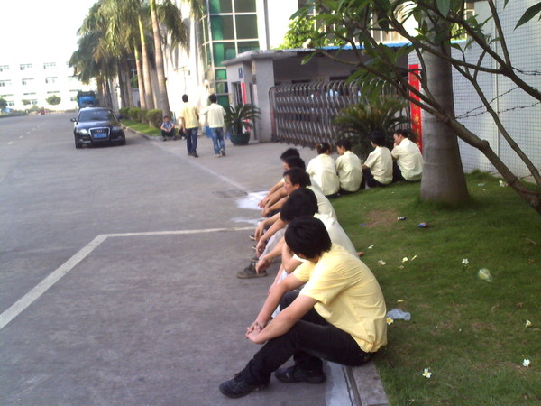](c20e24ed-4473-47f9-9181-c5cd90217734.jpg) 吃完饭了，休息一下，看着表，不能超过半个小时，不然扣工资哦。 我们分白班和夜班两班倒的工人每天的工作时间是12个小时，白班是早上7：30到晚上7：30，中午吃饭半个小时，晚饭半个小时，吃饭就是在工业区门口的小餐馆里，每顿饭基本是4-5元（每天的吃饭开销在10-15元之间）。在吃饭期间，机器是不能停的，所以，几条线的工人是轮流吃饭，你如果吃饭要托别人照看你的机器，别人吃饭，你也要照看。如果班组长发现出去吃饭的时候机器停了，那也是一定会被骂的。扣除吃饭的一个小时，每天的算3个小时的加班。夜班在半夜会有半个小时的夜宵时间，扣除之后，每个夜班算三个半小时的加班。 因为我在工厂里待得时间不到一个月，还没有上夜班，据工友们说夜班相对自由一些，领导人都不在，可以吃东西，玩手机。但是夜班保安会经常到车间里巡查，也可以通过车间的摄像头监视工人的工作状态，被抓到都是要被罚款的。 在厂门口的通告栏上经常会有某人上夜班打瞌睡或者玩手机，给予什么处分，罚款多少的通告。一般视情节不同，最少罚款30，多者上百。 厂里的仓库等部门的工人是不倒班的，如果工作不是太多的话，他们可以每天八小时下班，但如果赶上活多，他们从早上7:30加班到晚上十一二点也是经常的。 每天早上上班都有早会，组长分配今天的工作任务和需要注意的问题， 在工作之中当然也会出差错，生产都是按照订单来的，铜丝，硅胶，印字等等一项都不能出错，也要保证电线不出质量问题，有专门的品管负责监督质量，同时操作者和班组长也负有保证质量的责任。一旦发现问题，一定要追究责任。收线员要随时注意。电线经常出现的质量问题包括：偏芯，松芯，粘胶，气泡或者印字不清，印字模糊。如果出现更严重的质量问题比如说铜丝用错，印字错误。 所以做工的时候要非常注意，非常小心，上夜班的时候会经常犯困，最容易出错误了，夜班的一个工友就因为不注意印错了五万多米的线，五万多米是一个巨大的数字，如果要照价赔偿的话，恐怕一两年的工资不够，后来我也不太清楚是什么结果（按照深圳市工资条例规定，给工厂造成损失，最多赔付工资的20%）。我在离厂之前还出过一次错，用错的铜丝，还好自己及时发现，只做了几百米的电线，不然可能工资就全赔进去了。 [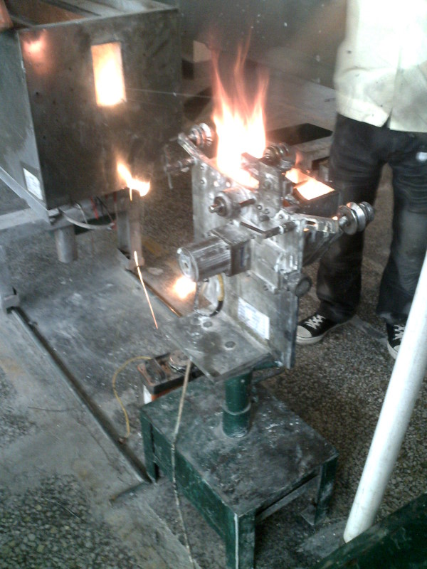](f48720b0-6ffd-4955-b068-a74d43206120.jpg)

着火了，快拿灭火器来！！

挤出组也比较容易起火，如果突然线断，包了胶皮的电线会断在卧式炉中，这是如果没有及时把炉盖打开散热，电线就会起火，这是要把电线从炉子中拉出来，不小心，火苗就会落到油墨里，火会烧得更旺，这是就要用灭火器了。在车间里我还第一次使用了灭火器，第一下没有操作好，结果喷了自己一头的干粉，第二下才把火灭掉。

电线的产量并没有明确的要求，一般每天能做到四万米以上就可以，如果机器不出太大的问题，这个产量基本能够达到。听说做到六万米以上的产量会有奖励。有一天我们拼死拼活做满了六万米，后来听说才奖励两块钱。我的天哪，资本家也太抠门了吧，妈的，以后能做到六万米也坚决不做了！ 线又断了，又要开炉穿线，痛苦啊，今天的报废不会又超标了吧。 每天的报废率有限制，如果超标，扣工资没得说。 

### 辞工

辞工是打工经历中最有意思，也是最有意义的一段。在辞工的过程中，和工友，组长，厂长，经理有了充分的交流，自己也亲身感受到作为一名普通工人维权的困难。 因为要回校参加毕业典礼，我计算了一下时间，在工厂的第十四天，向我们组长提出想要辞工，编造了一个家里人催促要回家的理由，组长并没有特别强烈的反对，但他觉得我的理由是假的，拍拍我的肩膀，要我好好干。第二天是周六，我再次向组长提出辞工，他说我昨天的理由是假的，不要骗他，我说组长你真厉害，昨天确实是编的理由，真实情况是我的同学给我在关内介绍了一个更好的工作，没这么辛苦，工资也更高。组长似乎相信了这个理由，但还是劝了我半天。说现在辞工肯定是不可能的，即使他批准了，厂里也不会批准的。 工友们知道我想辞工，都劝我不要想了，不可能的，有一个辞工的工友说他的辞工申请五十多天才批下来，还是踏实干吧，如果真不想干了，直接卷铺盖走人吧，不要想辞工了。我向他们讲法律规定试用期三天就可以辞工，他们都不太相信。我说这里的工资待遇太差，他们教育我要踏实，打工的还能怎么样呢？大家都要高工资，老板怎么过呢？我给他们讲广州本田罢工的事情，讲最好全深圳，全中国的工人团结起来才好，那样才能维护我们工人的权益。他们说工人们各顾各，哪会那么容易团结啊？ 有工人甚至还认为罢工恐怕要影响经济发展。 其实有不少工友都有辞工的想法，因为这个工厂的工作条件和工资待遇确实不高，但他们提出辞工后大多被拒绝，很多人也就没有坚持，接着这么干下去；或者实在不行，等发工资就走人。工厂押着的半个月工资就不要了（这也是深圳市的普遍情况，辞工很难，工厂会拿出各种理由拒绝或者拖延，相当一部分工人选择自离）。 中午又去找组长，组长答应帮我领一张辞工申请，下午填了辞工申请，在辞工理由中写道：**加班费不符合劳动法相关规定，车间二甲苯和橡胶烟雾有毒，安全防护措施不到位，另本人已找到更好的工作。**趁着晚饭时间，把辞工申请拿出去复印了几份，回来之后，交给了组长。 接下来是周日，周日因为生产任务不是很紧，六条生产线中的两条可以休息，其他四条继续上班，我刚好休息。找了个快递公司，把复印的辞工申请快递到公司去，在托寄品内容一栏中注明：“本人离职申请报告”，存根作为证据，以备到劳动部门投诉使用（投诉的时候你要向劳动部门证明你向工厂提交了辞职并且工厂收到）。 周一上班，正在送印好的成品线到四楼，组长冲了过来，把快递摔到我面前，开始叼我，质问我。原来他被厂长叼了一顿，我无所谓了，跟组长争辩了几句，也没有跟组长太多顶撞，组长其实人不坏，我也没有必要和组长翻脸。 周二上午被厂里管人事的小姑娘叫住，问我为什么没有穿厂服，我直接向她表示，我辞工了，也不想再花钱买厂服了。小姑娘的态度很恶劣，查了一下她那里的记录，说我的辞工申请还没有被批准。刚好厂长（厂长不等于老板，只是老板雇来管理工厂生产的，其实也是一个打工的，据说他月工资只有3500元，在厂里还要兼职做电工）也在那里，厂长就开始教训起我来，我自然毫不示弱和厂长吵了起来，厂长的态度很是恶劣，满嘴的歪理：**“深圳市哪个厂符合劳动法？连富士康都不符合！按照劳动法的话，工人每月****900****块钱的工资就不要活了。你不配和我讲劳动法，要讲的话找劳动局的人来讲……”** 厂长的嘴巴很厉害，又蛮不讲理，最后他说辞工要经理才能批准，他管不了。我说那我只能找经理了。他又表示找谁都没用，得按公司规定来。我不多和他理论，转身离开。 又等了一天，已经是六月十号，再去问管人事的小姑娘，告诉我说辞职被批准了，六月三十号可以离厂，我当即表示肯定不行，就自己去找经理。等了一上午，找到了那个经理，经理戴着眼睛，但态度一点不比厂长好。 **“批准你六月三十号已经算早了，没有留你两个月就不错了……劳动法啊，我不懂的，你去找厂长吧……我的态度已经很耐心了，你有什么资格跟我讲辞工，你应该先找你们组长，再找课长，我没把你赶出去就不错了……”** 我说你个做经理的不懂劳动法也太搞笑了吧，厂长我已经找过了，实在不行我只能去劳动部门投诉了。经理的语气仍然很硬，但态度上软了一点，说要和厂长商量一下。我心中还以为难道有戏？ 没想到没过二十分钟，组长通知我辞工还是六月三十号，并且对我未经他同意直接去找经理非常生气，在车间里叼起我来，我当然要和他争辩，这时候经理也走过来了，周围的很多工友们也围了上来。 组长骂我太幼稚了，还想去投诉？隔壁的鼎科厂罢工了又怎么样？劳动局的人也来了，不还是老板说了算？（该厂罢工的具体情况没有了解到，大概是罢工之后，劳动局的人也来了，警察也来了，老板站在高处宣布愿意干的站这边，不愿意干的站那边，结果大多数人都选择了愿意干，这大概是一次失败的罢工） 其他的工友们也纷纷帮腔“**干活就要踏实，这个厂的条件还算不错了，你现在已经很好了，原来一个人要看两条线，三条线不也是这么多钱？”“劳动法全是扯淡，你竟然还信？”**我争不过这么多人，只是大声向他们表示，我明天肯定不来上班了，肯定会去投诉的。组长最后生气的走了，经理也走了，大家都散开了，生我一个人呆立在那里，心头涌起一股无助，凄凉的感觉，为什么会这样？这是谁的可悲？ 

[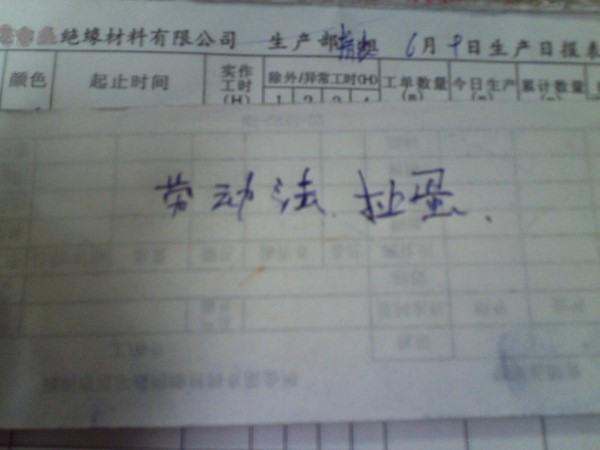](d4fbc1a6-e0f4-495a-affd-5a3ce472d17c.jpg)在工厂里向工人宣传劳动法后，工人的反应

经理走之后，又有几个工友围了上来，其中的几个人还在劝我，说我刚出来吧，混社会的经验太少了，老板有钱有势，和当官的勾结在一起的，我们没有办法的。一个工友还给我讲他经历的某个工厂几个工人反抗，被保安打断双腿，没有人管，最后也不了了之的故事。工友们劝我把学校里的幼稚的观念丢掉，要面对现实。还有工友说我一个人去投诉，劳动局肯定不会管的，没用的。**有两个工友还信誓旦旦的和我打赌，他们赌上一个月的工资我肯定辞工不成也拿不到工资。** 另外还有几个工友只是在看，在听，没有说话，有一个工友问我准备到哪投诉，他们大概处在一种观望状态。而此时的我是打定主意明天不会上班，肯定要去投诉了，其实心中还在犯嘀咕，不知道劳动部门会不会管，不知道自己的假身份证到时候会不会有麻烦，能不能要到工资。 晚上下班前，组长还好心劝了我一下，说如果明天不来上班，按照厂里规定，旷工一天扣三天工资，连续旷工三天就算自离，到时候什么都没有。组长的好意我心领了，但我还是坚决表示明天一定回去投诉的。 [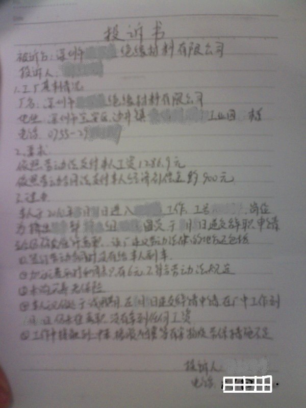](c60116c6-4e4d-4c31-ae5d-3ce232dd8b18.jpg)

投诉书

第二天，6月11日，早上起床，带上所有的材料，写好的投诉书来到沙井劳动站（**在百度上搜索沙井劳动局或者福永劳动局，可以看到不少工友们的遭遇和对劳动部门的抱怨**），还好不需要查身份证，填好了表格，交给工作人员，工作人员在处理意见上写：交由上南劳动分站处理。然后让我去上南劳动分站，还好不是很远，劳动分站工作人员看了我的投诉书，先是直接把我的要求中的“依照劳动合同法支付本人经济补偿金约900元”划掉了，说这个肯定是要不到了，你能拿到工资就不错了。我也没什么可争辩的，他开始给厂里打电话，打了好久才打通。似乎是那个人事的小姑娘接的，那个小姑娘还在讲厂里的规定是三十天才可以辞工（这小姑娘管人事的真不懂劳动法？），劳动站的工作人员给他讲解了一番劳动法，又说了一会儿，然后就让我去厂里，说问题可以解决了。 我的心里还挺高兴，深圳的劳动部门办事效率还挺高的嘛，特区还真不一样，要工资这么顺利啊。我也没有向工作人员索要处理回执（**在维权过程中，在任何机构都最好索要回执**），就兴冲冲得向工厂奔去。 到了工厂里，管人事的小姑娘黑着脸，先骂了我一顿，然后说厂长和经理都不在，她一个人做不了主，下午再来。我心说看来事情没那么简单，厂子不会那么容易给工资的，没办法，下午再来吧。 等到下午，一进办公室，厂长在，这个老油条，还是先骂了我一顿，不过态度没有那么凶了，但还是满嘴的歪理。 我：厂长你就放我走了吧，你早把工资给我了，我不去投诉，哪有这么多事啊，你今天把工资给我结了不就行了，我也不来烦你了。 厂长：今天可不行，财务的回家生孩子去了…… 厂长：你说什么二甲苯有毒，烟雾有毒，我给你发手套，再发口罩，行了吧。 我：我不干了，你给其他工人发当然更好了…… 厂长：你知道我们厂不符合劳动法怎么还进我们厂？当初是你进自己我们这个厂的吧，不是我们保安拉你进来的吧。 我：深圳99%的厂都不符合劳动法啊，我要生活啊，我不进厂怎么办？ 厂长：进厂的那些承诺书都是你签的吧，都摁了手印的，我是我们抓住你的手摁的吧，你怎么不遵守呢？ 我：那些承诺书我不签字能进厂吗？况且你那些承诺书都是违法的，我签了也没有法律效力，你们办工厂没有向国家承诺过遵守劳动法吗？你遵守了吗？ 厂长：深圳有几个工厂符合劳动法，你说加班不合理，那我不给你加班，你每个月拿900块钱行吧，打工的还不都饿死？ 我：900块钱根本就不够生活，本身深圳市规定的900块钱最低工资就不合理，最低工资应该再高一些，让工人不用加班就能维持生活。 厂长：你也知道不公平吧，你去投诉看到劳动局的那些人了吧，他们一个月三四千呢，嫌这里工资低，你怎么不去考公务员呢？让你上学的时候不好好读书…… 我：………………无语…………………… 跟厂长吵了半个小时，厂长说你现在去上班，等到14号发工资的时候，会给你发的。我想了想，倒也行，最多再等两三天，我还可以和工友们再交流交流。哪知道厂长接着说，你今天没有请假，算旷工，旷工一天扣三天工资。我当时就急了，这算什么事啊，我再干三天，你再给我扣了，不干了。厂长接着说，你明天再不来上班，再扣三天，后天再不来，就算你自离，到时候你什么都没有。 他们根本就没有诚意，就是想一拖再拖，我也听过不少工人被这样一次又一次欺骗的故事，这可不行，明天接着投诉，实在不行的话，就到工会，纪委，街道办各个部门都找一遍。 第二天一早，我又去了上南劳动分站，那个工作人员一看我来了，就表现的很不耐烦，说你怎么又来了？我说我对你们的处理结果很不满意，那个工作人员给厂里又打了个电话，好像没什么效果，他说要厂长来劳动站调解，管人事的姑娘说厂长没有时间，让经理来，经理也没有时间。工作人员挂了电话，无奈地看了我一眼。说你也听到了，他们没时间，接着就开始指责我太不懂事了，再工作三天，等他们发工资怎么了，非要闹，把公司惹急了，他们不给你钱让你走仲裁程序，拖你个一两个月，你等得了吗？ 我质问他：你们就这么没用吗？难道你们管不了这个工厂吗？他们明明存在那么多违法的地方。你们对他们没有约束力吗？管不了他们吗？你们不能去查他们厂吗？ 工作人员一副不耐烦的表情，说你这点事算什么事？这里比这个厂黑的工厂多得很，每天那么多罢工的，跳楼的，自杀的，我们还管不过来，你这点事本来你去上班就得了，给搞得这么麻烦。（实际情况是，对于工厂普遍存在的违法情况，劳动部门基本上是不管不问的状态，除非出了事情，要做做样子） 我说我都已经和工友们说了要到劳动部门投诉，结果投诉了没一点用，以后他们还怎么相信你们劳动部门，你们还有什么用。 工作人员抽着烟，一幅懒得理我的表情。这是他的电话响了，厂里打来电话，说我12，13号可以不上班，14号可以去领工资，但是11号那天肯定是旷工，肯定要扣工资。工作人员向我转述了厂里的意见，说这已经是最好的结果了，你要不接受只能去仲裁了。 我想了想，也只能先这样了，看来再在这里闹应该也不会有什么结果，要仲裁的话，我实在也拖不起。 

### 尾声：

6月14号，到厂里领工资，保安大哥原来和我一个宿舍的，买六合彩，天天在宿舍里研究码报，当年也是疯狂的看《天线宝宝》，应该有很多年码龄了，对我的辞工很奇怪，不过也没说什么。 到三楼财务领工资，我一共在工厂工作18天，按照劳动法，我计算的我的工资应该是1286.9元，按照公司的规定，我应该拿到工资1027.2元，但实际我拿到手的工资为836元，厂子确实扣发了我三天的工资。 厂长似乎精神不错，还和我打趣：今天穿的真干净啊，有时间来玩儿啊。气氛似乎还不错。 领到工资我要到车间里转转，给工友们讲述一下经历，也向他们宣传一下。到车间里，刚打了招呼，告诉他们我拿到了工资，还没说几句话，组长就把我叫到一边，问我拿到多少工资，然后就厉声赶我走。我跟组长磨了半天，组长都不允许我再跟工友们说话，组长说：车间里到处都是摄像头，被厂长看到我在车间里，他肯定又要被叼的。我也理解组长的苦衷，厂里是不愿意我再有机会和工友们讲维权经历的，只有离开了。 此行一共拿到工资836元，在深圳花费包括吃饭220元左右，办理假证件40元，交通上网等费用50元，从郑州到广州火车200元，从广州到深圳汽车50元，从深圳到北京车费260元。单以此计算，此行收支基本相抵，有小额赤字。 由于刚到深圳及辞工之后大多数时间都是在朋友家寄居，完全白吃白住，此项费用未计算在内，估算约为200元左右。 

### 总结

总结这次下厂实践，进工厂之前心中其实没有明确的目的，在工厂里待了一周左右以后，初步为自己设定了体验，了解，再反思三个目标。 1、 体验 首先是体力劳动的体验，在工厂之中，几乎每天手上都要受点小伤，第一天小指上就被砸了一个血泡，后来砸伤，磕伤，挂伤，烧伤统统没有落下，脚上还被小车磕肿，被线轴砸破。还好没收什么太大的工伤，刚开始收线没有经验，有一次手被线缠住，还有另一个工友及时把机器关停，后来想想还是挺后怕的。工厂里还有可能被电到，为了检验电线的绝缘性能，有专门的火花机做击穿试验，但是火花机如果操作不当，会漏电，并且有些火花机本身就有一定的质量问题，我还没有被电到过，但做的时间稍微长一些的工友都被电过，那可是6KV的电压啊。 刚上班的时候很不习惯，太累了，一直站着，觉得腿都要肿了，晚上下班之后往床上一躺，什么都不想干，晚上八点多就睡觉了，一觉睡到早上六点，又该起床上班了，好痛苦啊。 刚到工厂的第一天，就被组长指派去搬运线轴装车，三个人，另两个人很精明的挑选了推线轴和摆线轴的工作，而我则负责把线轴从地上搬到车上去，轻的线轴还好，稍微重一些的要攒足了劲才能举起来，有那么一次，举到一半手上没劲，眼看就要掉下来砸到自己，还好司机大哥过来帮忙托了一下。 讨厌的工作是搬运铜丝轴，虽然可以滚来滚去，但需要用手扳动方向，有好几次，面对500斤的线轴，一个人怎么就弄不动，真是无助。不过后来才发现，这个工作是有技巧的，大量搬运的时候甚至有专门的工具，只是自己太笨，力气太小而已。 [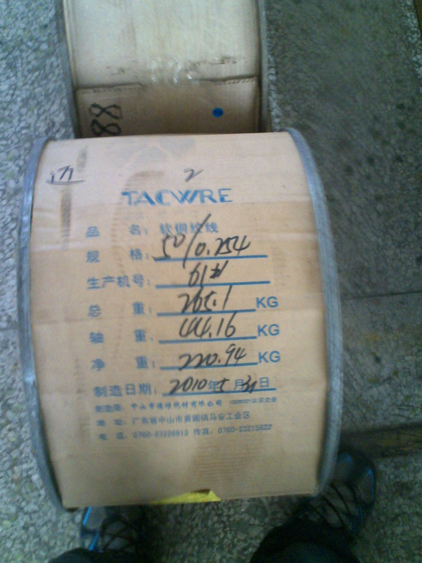](0696ba6e-d998-40e5-803d-c67126e7b897.jpg)

毛重265.1KG，这个家伙曾经让我伤透了脑筋

痛苦的工作是机器断线，要把卧式炉打开重新走线，炉子的常规温度是350度，炉盖打开，一股热浪袭来，觉得胡子好像就要马上糊了一样。机器突然断线时，有可能被线抽到，还有可能被灼热的铜丝烫到。 [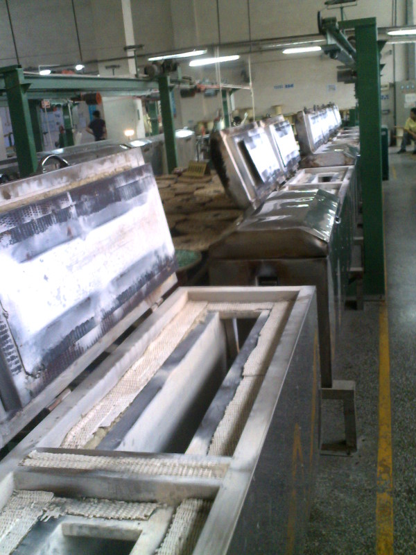](c520be10-3943-4005-ad8a-6aa75cb1a6cb.jpg)

炉盖一打开，一股热浪袭来

二、了解 了解工人的生活状态，工作状态和思想状态，总体上这个目标达成的不够好，因为在工厂里待的时间有限，加上我这个人不太爱说话，更工友们的交流也不够。时间有限，和工友们的关系不够亲近，有些问题也不太合适去问。 工人的组成 在深圳市，女工的比例要远高于男工，在我所在的工厂，女工比男工略少，工人来自全国各地，其中也有白族，彝族等少数民族同胞。年龄主要在18-24岁之间，可以称之为第二代工人。 进厂的途径有通过朋友同学介绍来的，也有自己看到招工广告进来的。文化水平至少都是初中毕业，有相当一部分是高中毕业或者中专毕业。 工人们对于劳动法基本不了解，或者不太清楚，对于他们有哪些正当权益，如何维护也不清楚。**其实这一点也不奇怪，即使是我们重点大学毕业的本科生研究生，他们对于劳动法，劳动合同法往往也是一知半解……** 工友们的工作状态也一般，每天完成工作任务就可以，即使有产量奖金，但大多数人并不看重，甚至工厂中普遍存在偷懒的现象。跟在工厂里干了一年多的一个工友送货，把做好的成品线从一楼送到四楼，到四楼之后，如果电梯里没有其他人，他总是会在出电梯之前摁下一楼的按钮，这样的话我们就可以再四楼等一会电梯，休息一下…… 工人的生活状态： 工厂的工作很辛苦，每天的加班时间很长，所以工人们几乎没有什么娱乐活动，每天下班之后去上网打游戏时最主要的娱乐，大部分的男工友都打网游，有些打得还很凶，甚至有晚上打通宵，白天上班打瞌睡的情况，工余要么玩玩手机，要么在厂门口打台球。 他们没有时间娱乐，也没有时间看电视，看报纸，甚至对于广州本田罢工也没听说过。 他们的月收入并不高，相当一部分工人都是月光族，等到发工资的时候手里基本没剩什么钱，发了工资就要还债，买衣服等等，由于都是年轻人，消费欲望都很强，买衣服花上在三五百也不奇怪。 工人目前的工资收入让他们无法完成在城市的简单再生产，让人精疲力竭的长时间工作，甚至周末也不能得到正常的休息，几乎没有闲暇时间，不能和家人和亲人相聚，工人不仅把自己的全部生活都献给了工厂，换取的不够维持生计的工资，也失去了“像人一样生活”的权力。他们把青春和血汗留在工厂里，等到他们年纪稍大，就再也不能找到工作， 工友们普遍状况就是不停的换厂，在厂里干得不爽，或者这段时间想歇一歇，就辞工不干，歇一段时间把钱花光了，就再进厂。 其实工人们的要求并不高，如果每天八小时内的收入可以满足工人生活的基本需求，不需要那么长时间的加班。工友们的生活就会好很多，他们有工余时间可以娱乐，可以读书，可以运动。另外再把相应的工伤，失业，养老，医疗等福利保障建设完全，让工人能过上基本的有尊严的生活，这样基本的经济目标就可以达到了。 这一代新工人独立意识都比较强，对工厂对领导没有太多的畏惧服从意识，你可以骂我，但我可以完全不听你的，实在不爽的话，老子就不干走人了。 工友们对于社会主义的看法没有深入交流，他们一谈到这个就说全是扯淡而已。 工人们没有形成独立的阶级意识，他们还往往会站在国家的，甚至资本家的立场思考问题，还没有认识到自己的力量所在。 他们还看不清他们处于这种境地的原因，虽然大多数工人已经不再相信个人奋斗，但他们仍旧相信这个社会灌输给他们的价值理念。自己生活过得不好是因为自己学习不够努力，不够勤奋，而那些资本家们过得好也是有道理的。 更多的工人对于工人权益的看法，对于社会的看法，对于未来的打算都没有交流到。我本身也是一个比较不善言谈的人，更多只是看到的，听到的，真正自己主动去询问了解的有限。 三、再反思 其实是想站在工人的角度对自己原来的想法进行再反思，站在工人的角度再去认识这个世界，但因为在工厂时间太短，所得有限。 那天中午吃饭路过商店，看到电视上在播放上海世博会的新闻，我的第一反应是：什么狗屁SB会，跟我一个工人有屁关系 从工人的角度来看，对工人来说提高待遇是主要的。但我们之中的很多人会想，工人待遇提高了，工厂是不是要搬到柬埔寨孟加拉啦，我们的出口是不是下降啦，国家竞争力是不是没有啦等等。 （没太多内容，不拿出来献丑了） 其他杂记： 1.在工厂里参加了一次培训和一次全厂大会，在培训中厂长讲话表现得很坦诚，直言***公司的待遇还不太好，但强调他们一直在努力提高工人的待遇，看起来是一个很好的人。每一个单个的资本家或者地主作为个人，表现出来可能都是坦诚的，友善的。但一旦他们以阶级的面目在社会中出现，尤其出现利益冲突时，他们的本性就会暴露无疑，即使一个资本家想对工人好，资本主义竞争的本质也决定着他们必须增加工时，压低工资才能在竞争中获胜。 2.在全厂大会上，厂长专门讲了富士康的问题，讲了压力的问题。厂长大讲那一套如今社会广泛流传的理论。这个社会就是这样子，你改变不了环境，只能适应环境，这个社会是适者生存，你们只有去适应它，要知足常乐，不要期望过高云云…… 3.在深圳的最后几天，去登了沙井旁边的一座死火山，山上竟然还有一座烈士纪念碑，纪念的是沙井镇参加东江纵队抗日，解放战争和抗美援朝牺牲的烈士，碑是沙井镇政府01年新立的，碑文上还写着什么特色社会主义，为共同富裕，共产主义奋斗云云，我心中不禁失笑。 看着山下那一眼望不到头的工业区，这里埋葬了多少年青人的血汗和青春啊。在看看那一个个烈士的名字，他们牺牲的时候也正年轻，大概和山下工业区的工人们年纪相仿，但他们看到今天的沙井，能够瞑目吗？这是他们当年所追求的吗？ 工厂花絮： 1. 车间里机器轰隆隆响，一个人无聊的时候就唱歌，尝试把国际歌三段完整的唱下来，尝试回忆《咱们工人有力量》的歌词，唱得还蛮High的其实。 2. 在和厂长吵架的时候，厂长揶揄我说：你去劳动局了吧，你看那些劳动局的公务员工资高啊，一个月三四千，你怎么不去考公务员啊，让你当年不好好读书，只能出来做普工吧……打工还不好好打……我很无语…… 3. 在工厂里的最后一天，老板带着两个貌似印度人的南亚人到车间参观，大概是外国的客户。我在肚子里酝酿了一肚子的英语想要控诉这个工厂的单词语句。后来印度人没朝我这边走过来，再看看印度人那一副成功人士的感觉，还是算了…… 4. 在深圳期间，大街小巷都是播放《爱情买卖》这首歌，不少工友的铃声也都是这种歌，我终于明白了这类歌的市场所在？莫非这才是群众喜闻乐见的文艺？ 

### 个人观察和思考

除了在工厂里之外，在深圳也通过其他渠道了解到南方工人的一些情况，在此做简单补充。网络上有更多更翔实的资料，大家可以自己搜索。 整个世界全球化以来，全球的资本家们早已经联合起来，而工人们长期处于一种一盘散沙的状态。 中国的资本家有政协，工商联，各种商会等组织，还有各种的培训班，一部分知识分子们也和资本家勾结起来，深圳经常有“应对劳动合同法研讨会”等活动。 资本家们可以互相沟通信息，交流经验，对于应对工人的反抗有比较成熟的应对策略，据说在某些地方，资本家手中还有一份黑名单，专门记录那些喜欢闹事，组织反抗的工人名单。 **工伤** 在深圳期间，随某NGO的工作人员去了一趟沙井医院，深圳的手外科是全国最先进的，尤其是断指接活，移植技术。因为医生们有足够的机会锻炼。李成瑞老人撰文写过一首诗《千人断指叹》，在深圳大大小小的医院里，每天都收治大量的断指断臂工人，看到这些年轻的工人，虽然他们有时候还面带笑容，但我的心里却在不断抽搐，年轻的花朵就这样残缺了，其中还有一个小男孩，他说他有16岁了，我根本就不相信，刚进工厂两个月，指头也残了，谁之过？ 在深圳市职业病防治医院，有更多惨不忍睹的景象，除了之前炒得沸沸扬扬的**深圳尘肺门事件****外****(****大学生尘肺病调查小组[http://nmworkers.blog.163.com/](http://nmworkers.blog.163.com/))**。在职业病防治医院，有大量接触白电油（正己烷）和香蕉水等化学物质中毒的工人，有二十多个在同一个工厂接触白电油中毒的女工，现在患有严重的肌无力，手脚无力，肌肉萎缩。她们走起路来，双手耷拉着，两腿也外掰，那情景就像我们在恐怖片中看到的僵尸的姿势一样，是谁造成了这种人间恐怖？ **罢工** 南方工厂的罢工其实很多，各种层次，各种规模，几乎每一个存在罢工土壤的企业都出现过。在深圳遇到的一个工友，他们的工厂在三个月内发生过四次罢工。 （略） 在目前的情况下，如果有带有一定阶级觉悟和组织能力的人能够参与组织，目前工人运动的状况将大有改观。所以如果有一定理论水平和觉悟的青年能够走入工厂之中，同工人们真正结合起来，大有作为。 **青年下厂** 这种下厂包括长期下厂和短期下厂。要想真正取得效果，我们需要一批有较高阶级觉悟和奉献精神的青年走入工厂之中，通过五年，十年的努力，为工人争取经济权益和政治权益，改善工人的生活状况，推动中国工人运动的发展。 作为较高知识水平的青年学生，到工厂中，即使不是到工厂里做一个普工，到各种企业中做一个技术人员，我们同样广阔天地大有作为。 在工厂里，与普通的工友们打好关系，建立小组，经常交流，传播革命理论，组织参与经济斗争（已有的众多罢工多是有中层管理人员或者技术人员参与鼓动）。推动工会建设，把官办的黄色工会变成工人自己的工会。同时在这个过程中，启发工人阶级觉悟，宣传马克思主义，甚至发展马克思主义，为更长远的工人阶级政党和政权做准备。 除了长期下厂之外，短期的下厂也是比较可行和值得提倡的。 在短期下厂的过程中，受到最大教育的下厂青年，通过短期下厂，体验工厂生活，同工人交朋友，了解真实的社会状况和工人状况，走出知识分子的圈子，在实践中检验自己头脑中的理论和概念，完成自我改造。同时这种短期的下厂对提升工人觉悟也是有意义的，现有的经验表明，短期下厂的青年，通过刻意制造在一定限度内的与厂方的冲突（要自己能控制自己的情绪和冲突的激烈程度），比如拒绝加班，要求改善工作条件，或者辞工讨要工资，在冲突过程中，尝试做到对工人的启发，以冲突为话题与工友开展交流。 中国目前的工人运动条件要比当年的韩国强很多（参见**中国工人运动与韩国相比的优势****[http://blog.renren.com/blog/268934027/475305929?from=fanyeOld](http://blog.renren.com/blog/268934027/475305929?from=fanyeOld)**），我们广大的左分子（当然也欢迎中和右分子）大有可为。
