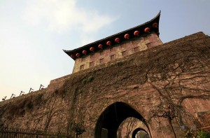

# 投降 (独幕历史剧)

**1645年（弘光元年）阴历四月，清军大举进犯江南，扬州沦陷，南京兵部尚书史可法殉国，全城八十余万军民被清军屠杀。五月初九，清军从镇江渡江，兵锋直指南京。明安宗朱由崧听到消息后惊惶失据，带领大学士马士英等数人，来不及通知百官，便连夜出逃。次日早晨，南京的官绅居民听说皇帝已经弃城，顿时不知所措，全城陷入一片混乱……**

# 投降 (独幕历史剧)

## 文/许懿达（牛津大学）

**历史背景：** 1645年（弘光元年）阴历四月，清军大举进犯江南，扬州沦陷，南京兵部尚书史可法殉国，全城八十余万军民被清军屠杀。五月初九，清军从镇江渡江，兵锋直指南京。明安宗朱由崧听到消息后惊惶失据，带领大学士马士英等数人，来不及通知百官，便连夜出逃。次日早晨，南京的官绅居民听说皇帝已经弃城，顿时不知所措，全城陷入一片混乱…… **剧情人物：** 赵之龙：靖难功臣赵彝第九世孙，世袭忻城伯，时任留守南京勋臣 冯可宗：时任南京锦衣卫指挥同知 徐久爵：开国功臣中山王徐达第十一世孙，世袭魏国公 朱国弼：景泰年间功臣宣平王朱永第六世孙，世袭保国公 王铎：时任南京东阁大学士 钱谦益：时任南京礼部尚书 李沾：时任南京都察院左都御史 卢九德：时任南京司礼监秉笔太监 韩赞周：时任守备南京太监 地点： 南京中军都督府 时间： 1645年（弘光元年）阴历五月初十 （幕启，半光。赵之龙坐在主座上，侧过身来在手边的桌案上写字。冯可宗上。） 冯可宗（上前，作揖）：秉大帅，乱民已经被末将统统驱散了。 赵之龙（抬头）：好啊，冯指挥办的好差事。那个假太子跑了么？ 冯可宗：大帅交代的事情，末将怎敢有一丁点闪失。末将的属下接到大帅将令就直奔武英殿，把那个贼人搜了出来，当场碎尸万段。 赵之龙（捻须）：好，好，省得再有乱民打他的主意。 冯可宗：大帅，末将是否要带人把大帅的告示给贴了。 赵之龙：大胆！什么我的告示！ 冯可宗（下跪，诚惶诚恐）：大帅恕罪！大帅恕罪！那末将立即回去整队，听从大帅调遣，誓与满虏一决死战！ 赵之龙（轻蔑状）：哼，皇上都不在了，你还想一决死战？ 冯可宗（迷惑状）：那……大帅的意思是？ 赵之龙（慢条斯理）：要是我贴了告示，皇上转了个圈再回来了怎么办？（瞪冯可宗）你让我一个人等着被杀头？ 冯可宗（恍然大悟状）：啊，大帅的意思，末将明白了！末将这就去派人把他们都叫来。（起身要走） 赵之龙（抬掌阻止）：慢！只有那个人，冯指挥可别给我叫来，知道了吗？ 冯可宗（作揖）：末将明白，大帅尽管放心！（退步，下）。 （全光，徐久爵上） 冯可宗（画外）：秉大帅，徐公爷到了！ 赵之龙（起立，作揖，作焦急状）：公爷，您可来了，（举手示意）快请上座。 徐久爵（作揖）：岂敢岂敢。今日还真热，这才五月，怎么就热得让人心神不宁。赵大帅请上坐，在中府，自然还是您老人家做主啊。 赵之龙：哎，公爷这是哪里的话，皇上如今出了城，南京城里就数您最大了。我坐上座，您坐我下手，这不合规矩啊，待会儿大家都来了，还不得人人侧目啊。（笑） 徐久爵：哎哟这哪能行啊，皇上说不定是到黄大帅那儿调兵去了，过两天还得回来，我哪敢在这儿尊大啊，不妥，不妥啊。（摆手，笑） 赵之龙（做严肃状）：公爷，您真觉得，皇上会回来么？（注视徐久爵） 徐久爵：这……按说要是鞑子真过了江，还是南京城里头最安全，皇上不会自置于险地吧……（摇头，叹气） 赵之龙（做严肃状）：公爷真觉得城里头最安全？ 徐久爵（怔了一下）：呃，大帅的意思是，咱们也该撤？ 赵之龙（叹气）：南京周边卫所的军队，都跟史阁部一起扔在扬州了，靖国公的大军在太平府防备左良玉那厮，现在城里只剩锦衣卫和应天府的衙役了，这些人拉到城墙上依次站住了，估计是两边一望，谁也看不着谁啊。公爷别看我挂着中府的大印，我还能指挥得了谁啊。 徐久爵（以拳击掌）：啊呀，这，这，这可如何是好啊。太祖爷当年筑了这么大的城，可要是没有兵，那它也守不住啊。唉，这，咱们还是都回府收拾收拾，赶快撤到太平府……不对！咱们还是往杭州府撤吧，要不……（被打断） 赵之龙（略带调侃）：公爷，这样恐怕不妥吧，您家里人口多，东西更多，清军恐怕这两日就要到，别说还未必能出得了城，就算是出了城都可能要被追上，到时候可就难办了啊。 徐久爵（作不知所措状）：这可如何是好，如何是好啊，唉！（摇头） （赵之龙扶徐久爵在上座坐下，自己坐在旁边） 徐久爵（摇头，叹气，突然抬起头看赵之龙，用询问的语气）：按大帅的意思，咱们守也不是，逃也不是，应当开城投降么？ 赵之龙（叹气）：唉，真是罪过啊。公爷和我都是世受国恩，有遇如今之大难，本当与国同休戚，同满虏决一死战，这样才能上不负君恩，下不辱家门啊！（停顿，看徐久爵） 徐久爵（语塞）：这……这固然没错，可是……（被打断） 赵之龙（语气坚决）：可是如今皇上却自己撂下百官先弃城了，君尚如此，又奈臣下何？皇上不顾太祖高皇帝陵寝一人独奔，说句杀头的话，皇上这是大不孝啊！千秋万代之后自有公论。皇上都弃了国，咱们就只能顾得上保家了啊。公爷和我两家的祖陵都在南京。咱们若是弃城逃走，便是把祖宗丢给人家了啊，这……这让我于心何忍啊……（抬袖遮脸，假哭） 徐久爵：唉，唉，是啊……（叹气，右手轻轻拍椅把，左手假装擦泪） 赵之龙：公爷，咱们若是留下了，想来新朝初立，要笼络人心，不会太难为咱们，说不定还看咱们献城有功，照样给咱们留个爵位。（徐久爵抬头，赵之龙停顿一下，声音放低，语气恳切）就算清人不打算用咱们，最差也就是把咱们削爵让咱们回家当老百姓，即便是这样咱们也能上对得起祖宗陵寝下保全身家，何乐而不为啊。（向后靠在椅背上，捻须） 徐久爵（略想了一下，点头）：嗯，大帅说的极是。自古没有不败的家，皇上都看不住了，何况我们，能给祖宗守墓也就知足了啊。只是不知清人是否会放过咱们，要是……（停顿，看赵之龙） 赵之龙：这公爷不必担心。清人说了，我朝藩王都一律恩养，藩王都不杀，哪能轮得着咱们。再说了，咱们若是献了城，便是有功于新朝，定当恩赏，哪能难为咱们呢。公爷可看看孔有德、吴三桂那些人，无非是些武夫，势穷事败投降了清人，现如今都得到重用。咱们若是献上南京，（语气激动）说不定还能位列新朝开国功臣啊！ 徐久爵（豁然开朗）：好！好！大帅说的极是！要真是这样也不至于辱没了祖宗。那咱们现在就赶快派人赶到润州接洽，亦早不宜迟啊，不然恐被别人抢了功劳啊！ 赵之龙（略带嘲讽）：公爷，咱们先不忙。这献城的事儿，毕竟容易给人落下口实，要是以后……啊，是吧，咱们当然要领头，但是事情还得所有人一块儿来做，不知公爷意下如何啊。 徐久爵（恍然大悟状）：啊，大帅说的是……（被打断） 冯可宗（画外）：大帅，朱少傅驾到。 （朱国弼上，风风火火状，赵之龙、徐久爵起身） 朱国弼（语气急切）：两位大帅，皇上扔下咱们不管自己一个人弃城了！哦对，还有马士英那个奸贼，肯定是他怂恿的！这下让咱们怎么办！（摊手，做无奈、愤怒状） 赵之龙（摆手示意朱国弼冷静）：朱少傅，咱们今天聚在这里不就是为了想办法么。您别急，咱们议一议。 朱国弼（摆手，语气坚决）：赵大帅，皇上都不在了，咱们还想什么办法。当年烈皇帝说我不守规矩，一度夺了我的爵位，我也认了，谁让咱们都指着人家的禄米呢。可现如今，那是他们家的人不守规矩。哼，清军才刚到润州，就谁也不告诉，带着马士英老贼跑了，留下这么大一座城，谁给他们家守？嗯？ 徐久爵：朱少傅，您先别动气。这个守城，也未必是为皇上守，咱们自己家里不还有那么多人，那么多东西么。 朱国弼（随便找了把椅子坐下）：唉，是啊，我正为这事发愁呢。皇上跑了，反正他跑到哪里都有人管饭，当年两手空空地来南京，现在两手空空又出了南京，对他来说也不赚不赔。咱们可就不一样，家里老老少少的几百号口子，还有那些家私。啊当然啦，我也不是那号驽马恋栈的人，不过总得给我家人留条活路吧。现如今，只有听赵大帅吩咐了。（起立，向赵之龙作长揖） 赵之龙（赶忙上前扶住）：哎使不得使不得。少傅要是信得过赵某的话，就让赵某料理此事，想来清人也不是不通情理，咱们献上城池，他们给咱们一条活路，总比咱们带人出去跟他们死拼，然后两败俱伤好吧。 徐久爵（点头附和）：是啊，赵大帅说的极是啊。 朱国弼（看看两人）：原来两位大帅已经想好了，太好了！那朱某就拜托两位了。赵大帅，您说咱们该怎么办？是不是然后赶快送个人到润州。 赵之龙（叹气）：唉，少傅说的是。不过这投降的事情，毕竟不光彩，恐人议论。这样，让那些文官来写个告示，平日里这些人都是自诩为清流，舞文弄墨，唯恐屈居人后，看看他们到这个时候，能不能再给自己找个名号，让咱们献城也献得光彩些。 朱国弼（使劲拍桌子）：好！好！赵大帅想得周全。他们来了么，要不要我派人去找？ （冯可宗上） 冯可宗（作揖）：大帅，门外来了很多大人，说是要见大帅。要不要都让他们进来？ 赵之龙：蠢货！让那么多人都进来，是让他们说话还是让我们说话！ 冯可宗（下跪）：末将愚钝，末将愚钝。请大帅示下。 赵之龙：王阁老、钱尚书、李御史三个人都来了么？ 冯可宗：秉大帅，这三位大人末将刚才好像都看见了。 赵之龙：好，就把他们三个人喊进来。让其余的人都在前堂等着，让你的部下把人都看好了，来的人一个也不许回去，走了一个，拿你是问，听见没有！ 冯可宗：末将明白，末将明白。（起身）末将这就去喊这三位大人进来。（转身要走） 赵之龙：回来！ 冯可宗（急忙转身，作揖）：大帅还有什么吩咐？ 赵之龙：司礼监的卢公公来了没有？ 冯可宗（想了一下）：呃，刚才好像没看见…… 赵之龙（大怒）：怎么回事，卢公公住的地方离中府最近，怎么反倒现在还没来。该不是你派去传话的人当了逃兵吧！ 冯可宗（惊慌失措）：不会，不会，肯定是路上又遇到闹事的乱民耽搁了……末将立刻亲自去请…… 赵之龙：还不快去！ 朱国弼：大帅，您还把卢公公叫来干什么，咱们现在调兵又不用请旨了，干司礼监什么事。 赵之龙（摆手）：唉，朱国弼，我是怕那个人到时候来搅局，到时候让卢公公出面压一下，比较合适。 朱国弼（疑惑）：那个人？大帅是说…… （王铎、钱谦益、李沾上） 王铎、钱谦益、李沾（作揖，齐声说）：参见三位大帅。 赵之龙（抬手示意）：三位大人请坐。 （徐久爵坐在上座，赵之龙、朱国弼分坐两侧，王铎、钱谦益、李沾依次坐下） 赵之龙（看了看徐久爵、朱国弼，做忧愁状）：唉，三位大人想必也听说了，皇上今天凌晨带着太后和马阁老等人出城了。我们都是今天早上才听到这个消息，唉，真是晴天霹雳啊。现在满人已经过了江，郑将军的队伍土崩瓦解啊。满人据了润州，离南京不过数十里之遥，旦夕可至啊。这如何是好，如何是好啊……（摇头，叹气） （王铎、钱谦益、李沾三人沉默、摇头） 赵之龙：现在城中战士已不足万人，而且除了锦衣卫，其余都是老弱残兵。本帅欲通令下去，让他们死守，誓与满人战至最后一矢一弹。王阁老，您觉得本帅这样做行么。 王铎（怔了一下，咳嗽了一声，慢条斯理地说）：赵大帅不畏劲虏，誓守南都，忠心可鉴日月啊！赵大帅真乃我大明之柱石啊！赵……（被打断） 赵之龙（不耐烦）：阁老，您就不要绕弯子了。阁老觉得本帅这样做，对么？ 王铎（迟疑了一下）：呃，秉大帅，老朽不知军旅之事，城防之事，还是请大帅和徐公爷、朱公爷商议着办，三位大帅都是世代名将，想来并无差失。若有需要老朽的地方，比如筹备军需、书写檄文之类，老朽愿意效劳啊。 朱国弼（起身，做愤怒状）：王阁老！火烧眉毛了，你还想推诿！今日之势，是战，是走，是降，你拿个主意！ 王铎（起身，作揖）：少傅恕罪，老朽，老朽…… 赵之龙（示意朱国弼坐下）：王阁老请坐，王阁老请坐。本帅知道王阁老贯通经史，今日之事，可否以天命论之啊？ 王铎（坐下）：老朽不才，岂敢妄言天命。承蒙大帅明问，老朽不敢不答。自我太祖高皇帝起自草莽，灭虏平寇而终有天下，至今已历十七帝。孟子曰，“君子之泽，五世而斩”，我大明以天下为家，传二百余年，岂不因天命在我乎。然延至昨年，闯贼破北京，我毅宗烈皇帝殉国；三桂启关，上至十二陵寝，下至河北土地人民，顿非我大明所有。烈皇帝宵衣旰食，人事已尽矣，而终身死国灭，其不亦天命乎。今岁清兵南下，以史阁部之才、江北之雄兵，扬州之坚城，惟半日乃破。念及此事，老朽亦常觉伤感。高皇帝在上，非我等不用命，实乃，实乃天命已属他人矣，唉……（以袖掩面，假哭） 赵之龙（点头）：嗯，王阁老之言，甚是高论啊。既然如王阁老所说，吾等若是用兵，乃是逆天而行，那么依阁老之见，吾等当如何。 王铎：老朽愚钝。今清人似已有天命在彼，当下之势，恐如赵宋末年；逆天而动，必终无善果。若新朝初立，百废待举，虽有彼之大老元臣充当要职，然仍必留用我朝旧人以安民。以大帅，噢，还有徐公爷和朱公爷之才之美，想必是新朝求之不得之人啊。 徐久爵（点头，作高兴状）：嗯，阁老之言甚善，如此说来，吾等顺天而动，必然上可以全祖陵，下可以安身家。此论甚妙啊！钱大人、李大人，你们有什么高论。 钱谦益（若有所思状）：王阁老言之以天命，下官不才，不敢共论。（王铎睁大眼睛，看钱谦益）钱某本庸才，忝列堂官，敢不竭身效命，以报国家。如今虏骑已饮马长江，南京朝不保夕，本当一死，以报君恩…… 王铎（作焦急状）：钱大人，不可啊，不可啊…… 钱谦益（摆手，起立）：如今天子已不在城中，欲死君，无人可死，欲死于太祖陵，已出城不得。孟子曰，“民为贵，社稷次之，君为轻”，此虽非人臣之语，然今日既然死君王、死社稷已为不可，自当尽忠保民。下官听逃回来的人说，满人在扬州大开杀戒十日有余，全城血流漂杵，几无活口啊。下官每闻此言，莫不心惊肉跳，这几日常在梦里梦见满人破城，血洗南京，然后必一身大汗而惊醒。若如此，吾等尸骨无存尚且是小事，如何对得起全城百万绅民啊……（抽泣） 徐久爵（叹气）：唉，钱大人所说的，正是本爵所担心的啊，本爵身家是小，全城百姓是大啊，唉……（叹气） 赵之龙（白了徐久爵一眼，转向钱谦益）：钱大人爱民之心，本帅自愧不如啊，无论如何，当以保全生民为上啊。李大人，您说呢？ 李沾（起立，做愤恨状）：国事如此，都是阉党余孽害的。马士英、阮大铖，都是他们两个恶贼惑言天子，把南京城搞得乌烟瘴气，如今清兵过了江，居然还敢挟持天子逃走，简直是丧尽天良！王大人和钱大人都是国之栋梁，怎奈为阉党余孽掣肘，弄成今天这副模样，吾恨不得将这二贼千刀万剐…… 赵之龙（打断李沾）：李大人，李大人，如今还是议一议咱们该怎么办吧。 李沾（叹气）：唉，圣人有云，“其人亡，则其政息”，如今天子为阉党怂恿出了城，咱们还能有什么办法啊…… 冯可宗（画外）：大帅，卢公公来了！ （卢九德上） 卢九德（气喘吁吁）：啊呀赵大帅，咱家刚接到冯指挥传的帅令就急急忙忙一路小跑赶过来了，啊呀这一身汗。哟，两位公爷也在（作揖），还有三位大人也在（作揖），（停顿一下，看赵之龙，口气略带责难）赵大帅，咱家没错过什么吧？ 赵之龙（满脸堆笑）：啊，卢公公这是哪里的话。本帅最早派人去请公公，可是那个传令的小卒居然敢半路逃跑了！哼，量他也跑不出城，本帅已经派了两个亲兵去捉拿他了，抓住了一定就地正法！ 卢九德（干笑两声，坐下，语气略带嘲讽）：如今大敌当前，赵大帅就不要为一个小卒动气了啊。唉，我们这些人都是自身难保，下人们要逃命，也算是意料中事。（大声叹气）唉，皇上居然会听信那两个老贼的话弃城了，居然连咱家也蒙在鼓里，皇上看来是不要咱们了啊，唉……（假装哭泣） 赵之龙：卢公公不必难过，想来皇上也是误听奸人之言…… 冯可宗（疾步跑上，跪倒）：大帅！大帅！不好了！韩公公来了！ 赵之龙（起身）啊！这是怎么回事！ 卢九德（起身，板着脸，语气僵硬）：哦，原来大帅还叫上了韩公公，那咱家在这儿就没什么意思了啊，咱家回家听信儿去，赵大帅慢慢商议吧！ 赵之龙（语气急迫）：卢公公！卢公公！这肯定是误会！（转向冯可宗）冯指挥！你办的什么差事，究竟怎么回事！ 冯可宗（掌嘴两下）：末将无能！末将无能！属下派去传令的小卒不知是听错了命令还是故意犯混，居然跑到韩公公家去了！韩公公现在已经在往二堂里面走了！ 赵之龙：什么！还不快给我拦住！ 冯可宗（诚惶诚恐）：末将是想拦，可是……可是韩公公居然从袖子里掏出一道圣旨，末将实在是不敢阻拦啊…… 赵之龙（大为惊讶）：啊？圣旨？！什么圣旨？皇上还能给他留什么旨意？ （韩赞周上，众人皆起立） 赵之龙（做诘问状）：韩公公，听冯指挥说，您来传旨了，不知圣上有何旨意啊？ 韩赞周（微笑）：赵大帅，咱家不是来传旨的，只不过锦衣卫的这些个奴才不让咱家进门，咱家只好拿出份圣旨给他们看看了。 赵之龙：嗯？什么圣旨？现在还能有什么圣旨？ 韩赞周（正色）：崇祯十七年，烈皇帝任命咱家为守备南京太监的圣旨！ （众人惊愕片刻） 卢九德（突然大笑，走到韩赞周前）：哈哈哈哈，韩公公，咱家还以为是当今圣上给了你什么圣旨了，居然还把这老皇历拿出来，哈哈！（踱步，作揶揄状）韩公公，当今圣上登基以来，似乎不论干什么都没你什么事，司礼监事情，也不让你管，怎么，如今圣上不在城里，韩公公就要当家了么？ 韩赞周（斜眼看卢九德）：卢公公，咱家不过是皇上的一个奴才，谈得上什么当家。只怕是有些人……（扫视所有人）只怕是有些人该当家却不肯当啊！（直视赵之龙） 赵之龙（避开韩赞周目光）：韩公公，此话从何说起，本帅这不是正和诸位大人商议着么，怎么就是不肯当家了？ 韩赞周（厉声）：赵大帅！咱家刚才想到镇抚司派人去把守十三门，防备奸人进出，说是人都让冯指挥带到大帅这儿来了。现在鞑子就在几十里之外，皇上又不在城中，大帅身为守备勋臣，这个时候不加强城防戒严街道，反倒先要议事，真不知议的是什么事！ 朱国弼（迈步上前，大声）：韩公公！你这话什么意思！你是说我们在这议事，是要投降么！（自觉失语，掩口而退） 徐久爵：韩公公，您先别着急。我们这些人刚才已经议了一阵子，赵大帅，啊，还有三位大人，说的很多话都很有道理，让本爵茅塞顿开啊。这些肺腑之言，公公都没听着，来来，本爵给公公再说一遍，啊，这个……（被打断） 韩赞周（表情痛苦）：公爷，怎么您也要投降啊！皇上如今不在城中，您就更得带着大家守城啊！想当年中山王率百万雄师驱逐胡虏，光复中原，也没要太祖高皇帝在身后督战啊。现如今不论皇上在不在，公爷都应当同赵大帅一起，统兵痛击清虏啊！ 徐久爵（面带愧色）：呃……本爵不才，哪敢跟我家老祖相比啊……（坐下，低头） 韩赞周（大声叹气，转向王铎三人）：王大人，钱大人，李大人，你们可都是朝中清流啊，怎么到这个时候，圣人教诲都抛到脑后呢。咱家读过的书不如你们多，可也知道华夷之辨，也知道取义成仁，也知道明知其不可而为之，难道三位大人现在只想着保全乌纱，还是只想着保全性命了？！（做恳切状） 李沾（大声）：韩公公！这话怎么说！难道你想让南京像扬州一样，满城流血么！ 韩赞周：李大人！你以为献了城就可以不流血了么！你以为不投降就一定会让百姓死绝么！南京乃天下第一坚城，当下武库中火铳弹药无数，粮库中存粮可支数年，虽然城中无兵无将，但是黄大帅的兵就在太平府，朝传夕至；左良玉虽然素来自以为是，但是毕竟未丧天良，如今国事如此，只要派一能言善辩之人前往说服之，然后赦免其罪，加封公爵，让其顺江而下直取润、扬，断鞑子后路。我等在城中召集精壮义民守城，鞑子怎能轻易攻取城池！太祖高皇帝在天有灵，必然能保佑我等！（声音颤抖） （众人许久不答话） 韩赞周（踱步，转向）：赵大帅，您拿个主意，咱家这就带人去街上招募义民。就算是把他们带上城站着，各自拿好火铳，估计鞑子也不敢贸然攻城…… 卢九德（大怒）：韩赞周！你算什么东西，不过是烈皇帝派来的背了时的人，也赶在这儿妄语军国大事！赵大帅、徐公爷和王阁老他们都没说什么，你在这儿倒又要招安又要雇人的！我问你，左良玉要不听怎么办，要是有人乘机勾结鞑子怎么办，要是你招募的那些人一触即溃，把鞑子放了进来，又怎么办！到时候我们这些人都得给你陪葬！ （韩赞周大怒，冲着卢九德走去，卢九德向后退，韩赞周停下，慢慢冷静下来） 韩赞周：卢公公，你说的没错，咱家什么都不是，说这些都没有用。可真没想到，在座的勋臣大老，噢，还有受圣上百般恩宠的卢公公，到了这个节骨眼上，都胆小如鼠！赵大帅，徐公爷，朱公爷，你们大概都在想着如何保全祖宗家产，然后说不定还能再弄个禄米恩养吧。三位大人大概还在想着怎么给新主子效命，说不定还能入阁封疆，光宗耀祖呢。卢公公，呵呵，听说满人也要用宦官，您老人家自可以去伺候新主子，到时候估计还能让你兼领司礼监，或者外放苏杭织造呢。呵呵，（脸色大变，大声）无耻之极！ （众人怔了一下） 韩赞周：烈皇帝当年跟咱家说，要咱家好生辅佐赵大帅。如今赵大帅既然想当贰臣，咱家还有什么好说的。国破家亡，咱家这样做奴才的，不能文不能武，到时候无非一死而已。不过真没想到，满朝那么多文官武将，到最后都要背叛祖宗，做无父无君的降贼，仰异族鼻息而苟活！咱家无非是个阉人，只剩半条命，但就这半条命，也绝不为鞑子而活！各位大人，咱家这儿先走了，你们慢慢地议，议出个千秋万岁，然后把降表给递了，等着满人来封赏你们，给你们加官进爵吧！等你们献完城，哪位大人要是有点良心，带块席子，来给咱家收尸吧！（拂袖，大步流星而去。众人都坐下。卢九德、李沾表情呆滞，王铎迷眼捋须不说话，钱谦益面有愧色，朱国弼余怒未消，徐久爵呆坐并且斜眼偷看赵之龙，赵之龙右肘枕在椅把上托着脑袋，众人沉默一会儿） 赵之龙（咳嗽）：啊，咱们刚才议到哪儿了啊。啊，既然卢公公没什么意见，那么就这样吧。冯指挥，进来！快带上你的人，把这份告示贴满南京城，告诉老百姓，咱们——投降！ （半光，众人不动） 画外音：阴历五月十四日，清军先锋抵达洪武门外，赵之龙、朱国弼出城接洽投降。十五日，清军主力抵达，赵之龙等数十人在滂沱大雨中跪迎，衣冠扫地。清军入城后将城北、城东的汉族居民全部扫荡，供满人居住。此后十余年中，明军和江南人民抗清组织曾多次组织收复南京的军事行动，但终因种种原因功败垂成。南京陷落后，随着满清种种残酷的民族压迫政策的相继实施，江南大地烽烟四起，不愿受奴役的人民在这里又上演了一部部可歌可泣的英雄史诗…… （全光，舞台上所有人起立，演员谢幕）
