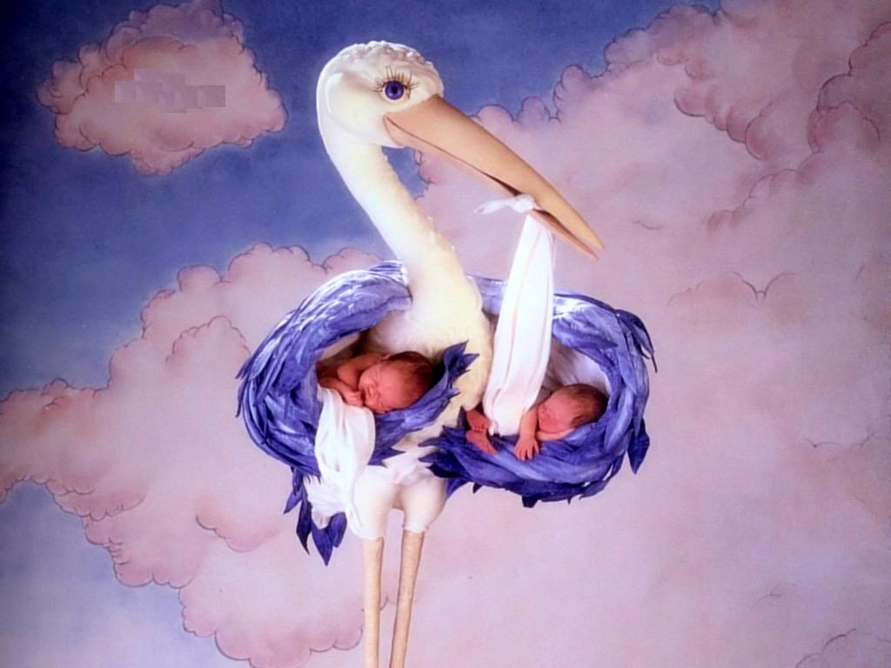
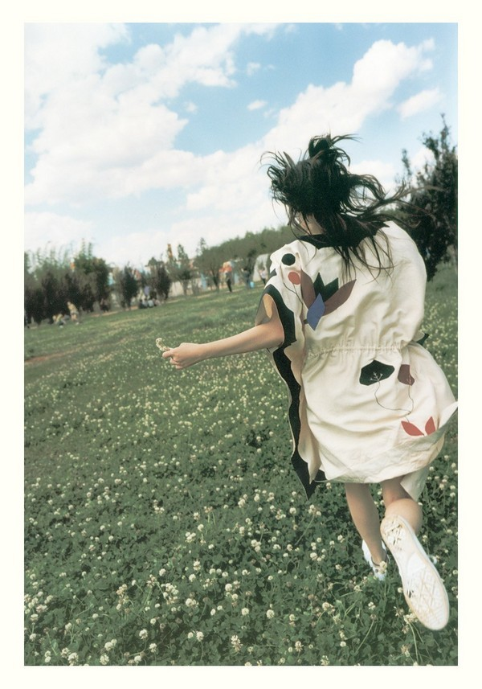
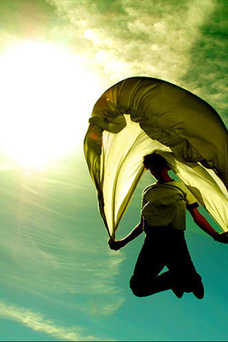

# 唱歌的孩子跳舞的草

**“五月明亮的阳光像穿过玻璃弹子球一样炫目闪耀。我觉得整个世界都开始反光，就连他紫黑色的笑脸也都闪亮着旋转起来。我听到遥远的东方传来他轻飘飘的歌声，他在唱，擦干泪，不要怕，至少我们还有梦。”**

** **

****

**** ** 编者按：圣经有言： “ 天国之中，孩子最大 ” 。孩子像一面闪闪发亮的平面镜，他能照出你内心的一切。他们是天真纯洁的花朵，手指触处就是一片生机蓬发，暖意融融。他们带给这世界最真诚的嗓音，最干净的笑脸，最纯粹的美好。即使这冰清玉洁的心灵有时会被成人的世界所误解，但固执的孩子，万人说痴也无挡他歌唱的梦想与飞翔的渴望。**

# 唱歌的孩子跳舞的草

** **

## 文 / 浙江财经学生

一九九四年的五月是我记忆里最干净的五月，阳光和煦，空气里划满清新的稻苗的味道，风安分而恬静，穿过树梢抚动树叶带来淳朴的大自然的旋律，就连那清晨或者黄昏时鼓着下巴努力鸣唱着的青蛙田鸡的歌声，也都显得韵味十足。作为一个孤僻的小孩，我只有一个朋友。我总是和他混在一起消磨望不到头的空闲时间。 一个下过雨的傍晚，衣衫邋遢的他坐在我家的大门外。好几天前我去他家找他的时候，他妈没好气的告诉我说他走亲戚去了，很久都不会回家的。很久是多久我不知道，不过还是懵懂地觉得肯定不止几天。 这么快就回来了？我好奇的问他，你怎么弄得这么脏？抓龙虾了？ 他摇摇头，小声地告诉我，我爸妈不要我了，他们把我丢在一个很远的地方…… 我瞪大了眼睛，几乎不敢相信他的话，我说不要骗人了，你妈说你去亲戚家玩了。 他怔怔地看我，笑着说，他们想扔掉我，嘿嘿，可是我会飞的，我认得回来的路。 我刚想说你撒谎呢，他的爸妈突然出现在墙角那条小弄堂的拐角处。什么也没说，过来就把他拖了起来。他顺从地跟着他们回家去了，在几个看客幸灾乐祸的笑容里，我看到了一抹灰色的冷漠。我关上门回屋写作业，窗外一只被狗欺负了的野猫愤怒的叫声吵得我没法专心。厨房里传来的香味越来越浓烈，我咽了口唾沫，妈妈就在楼下大声地喊，吃饭了。 第二天我又碰到了他，他大方地掏出了几块牛皮糖给我，然后和我一起找地方玩。桑树林边的空地上长满了青草，他翻了好几个筋斗，得意地告诉我他在学一种已经失传了的绝世轻功。 你知道吗，他躺在草堆里朝我喊，当你跑得和我一样快的时候，你就能飞了。他嚼着牛皮糖的嘴角流下了几缕口水，含糊不清地还在唠叨着，你知道刘三婆家的鸡是怎么死的么？是脏东西。你知道什么是脏东西吗？你肯定没见过。我见过，我还知道怎么弄死脏东西。他朝我诡异地一笑，用手作出一个拧断脖子的动作。脏东西和蛇一样，弱点是七寸，只要拽着他的七寸用力一扭，他就会翘辫子了。 我半信半疑地点了点头，他又给了我一把牛皮糖。你怎么有这么多糖吃啊？我奇怪地问他，你亲戚给你买的吗？ 他摇摇头说，我也不知道，昨天回家我爸妈给我买的。他们明明不要我了，还给我买糖吃——真是奇怪…… 他们昨天那么凶，回去打你了吗？我剥去糖纸把糖塞进嘴里，一边嚼着一边问他。 他又摇了摇头，没有，我也以为回去了他们会打我的，不知道怎么回事。他的眼神黯淡了一下，突然又睁大了眼睛，你想飞吗？你拜我做师父，我就教你。 你真的会飞吗？你飞给我看。 不行，他拒绝的很认真，不能随便飞的。你看过奥特曼吧，他们也不能随便变身的。不能随便飞的。 那我要怎么学呢？ 你先叫我一声师父，我就教你。他亮了亮口袋里的糖。 师父。我乖乖叫了他一声，眼睛直愣愣地盯着那个鼓鼓的口袋。 他笑得很开心，一边掏糖给我，一边说，好，我决定教你飞了。他看着我把糖塞进裤袋，然后严肃地说，想飞，你得先学会唱歌。你会唱歌吗？ 我点了点头，我唱得很好的。可是，为什么要唱歌呢？ 这你就不知道了，我每次唱歌的时候整个人都轻飘飘的好像要飞起来，练唱歌是为了练飞的感觉。 哦，那随便唱什么都可以吗？ 嗯，不过最好还是唱水手，每次我唱水手的时候最有飞的感觉。 水手，就是广播机里天天在放的那首？ 嗯，他点了点头，然后扭过头去扯着嗓子开始唱，他说风雨中这点痛算什么，擦干泪不要怕至少我们还有梦…… 我静静地躺在草丛里。他的歌声还算好听。和煦的风，青草和泥土的气息混在阳光里发酵，远处破庙前的树上几只喜鹊唧唧喳喳的似乎在为他伴奏。午后温暖的空气像被子一样铺在我的身上。他唱到第三遍的时候，睡意沉沉袭来，我一晃神，睡着了。 

不知道过了多久，他把我摇醒，告诉我，我感觉到家里又有脏东西了，我要回去弄死他们。 我揉了揉眼睛，迷迷糊糊地说，我和你一起去。 不行。他严肃地拒绝了，你没有练过功夫你打不过他们的，你留在这里，我很快就回来。 我只好又躺了下去，在青草的缝隙里我看到他唱着歌飞快地奔跑着。我惊讶的发现，他的两只腿越蹬越快，渐渐腾空而起。他真的会飞！我一下子醒了过来，怔怔地坐在草地上看着他的背影消失在拐角的柴垛。 我没有等他回来，傍晚了我得回家吃晚饭，否则我妈又得说我。天色渐渐暗了下来，刘三婆又在村口骂骂咧咧了，她老是在村口唾沫糊了嘴角地用最恶毒的语言骂人。这回是在骂什么我没听见，因为我的脑子里全是他腾空飞起来时的样子。 吃饭到一半的时候，妈妈虎着脸问我，在哪儿疯了一下午？弄得一身泥，是不是又和那个傻子在一起？ 他不是傻子！我不满的嘟哝着。 他不是傻子？他没脑子你也没脑子？刚才他跑到刘三婆家把三只鸡都给掐死了，你还说他不是傻子。以后你不要找他玩！ 我本来还想告诉妈妈他很厉害的他会飞的，可是妈妈阴着的脸着实让我害怕，于是把话都憋了回去。扒拉完最后几口饭，撅着嘴看动画片去了。埃迪奥特曼再一次成功击败了外星怪兽，拯救了地球。那个晚上我做了一个很美的梦，梦见我和他一起帮助埃迪奥特曼打败了两面怪人达达，唱着水手一起飞向 M87 星云…… 他被他爸妈用铁链锁在了楼上。我在他家围墙外大声地问他，是不是因为你掐死了刘三婆家的鸡啊？ 他没好气地说，你们这群傻子怎么都一样的？我说了那不是鸡，是脏东西！脏东西很凶的你知不知道？不杀了他们，他们会要了你们的命！ 我沉默着不说话，他在阳台上探出了大半个身子，晃着脑袋大声地唱歌。他闭着眼睛神情陶醉的样子着实让人觉得好笑。我说，那你怎么办？你爸妈要锁你多久？ 不知道。他的歌声戛然而止。我也不知道，不过这种烂锁根本就锁不住我，我练过功夫的，这种烂锁。他不屑地吐了口唾沫，嗷嗷地叫着，一边使劲地晃着锁住他的脚链。 我朝他做了个鬼脸，飞一般的跑了。不知道为什么，我很自然地就唱起水手，我觉得脚底生风，跑得如同要飞起来了，很舒服。 

他被锁住后的几天我的生活很单调，一个人去抓龙虾可是就连蛤蟆都逮不着一只。五月的风含着粘呼呼的甜味，我在破庙前的小木船上一坐就是一个傍晚。作为一个孤僻的孩子，我只有一个朋友，就是那个被人们唤作傻子的他。现在他被锁住了，我在太阳底下半眯着眼发呆的时候突然觉得自己的脚上仿佛也缠上了一条铁锁。他的爸妈锁住的不止是他一个人。我每次路过他家时都同情地朝他张望。大多数时间他似乎都在唱歌，有一次他在阳台上倒立锁住脚的铁链虽然生了锈在阳光下还是闪闪发光。刘三婆佝偻着腰颤巍巍地背着一筐猪草经过时吓得连镰刀都掉在了地上，她用惊诧的眼神看着他，用骂惯人的语调含糊不清地感叹，作啊，真是罪过……怎么有这样的傻子哟……他不屑地朝刘三婆白了一眼，笑嘻嘻地朝她吐口水。我呆在家里翻小人书，百无聊赖。吃饭的时候妈妈慈眉善目地问我要不要吃带鱼明天她买。我问妈妈，他真是傻子吗？他？妈妈顿了一下，然后想起来了我是指谁。他就是个傻子，不然他干吗要被锁起来？可是，我疑惑地问，他怎么就是个傻子呢？他总是陪我玩总是给糖吃，他还会唱歌，哦，他还会飞呢！他怎么会是傻子呢？妈妈用筷子为我夹了一块瘦肉，说，小孩子知道什么，你给我好好读书，不要老跟他混在一起，和傻子待久了脑子会变笨的我茫然地点了点头。吃完饭看完动画片，离睡觉还有很长时间。五月的太阳已经很迟下山了，我在桑树林边的草地上一边唱歌一边看着太阳由黄变红，越来越暗，青草的气味在一片错有致的蛙鸣里蒸腾而起，像雾气一样汇成他双脚离地时轻盈的步态。我一睁眼，恍然看到他的背影消失在拐角的柴垛。 几天后他又神气活现地在我面前晃来晃去了。也许是他这次比较安分，除了唱歌没有什么别的不雅的举动，他爸妈提前为他开了锁。桑树林边的草还是那么的茂盛，任凭刘三婆她们那几个老奶奶隔三差五地刈来喂猪，它们还是覆盖了每一寸灰色的泥地。我在放学后又欢蹦着和他在那片草地上交流着最近看的动画片。 你还没教会我飞呢，我突然想了起来，我把那首歌唱得很熟了的，接下来呢 ? 接下来要做什么啊？ 接下来你要跑步，你一定要跑得像我一样快，你才能飞起来。 跑得和你一样快？我的眼神一下子黯淡了。他最大的特点就是跑得比狗还快，每次和他一起惹了别人家的狗遭殃的都是我的裤腿。我怎么可能和你跑得一样快啊？ 他得意地笑，说不要紧，你不会飞也没关系，我会飞就行了。我们是好朋友对不对？我会保护你的。 他的确是保护过我。刘三婆的孙子欺负我，好几回都是他大声嚷嚷着冲上去和那个大块头扭打在一起。有时他吃亏，落了下风，那个大块头就会呼哧呼哧地把他摁倒在地上后又不忘踹他一脚，骂上一句，傻子，然后扬长而去；但也有他赢的时候，那个大块头被他掀翻在地后摔疼了屁股，居然也会呜呜噎噎地哭起来。这样的胜利总是让他笑得很茫然。有一次他忍不住问我，他哭什么？他打我的时候我什么时候哭过？这个傻子，他哭什么！事实证明那大块头的鼻涕眼泪还是很有后劲的，因为只要大块头哭着回去，他爸妈免不了要对他一番管教，或骂或打。 那个五月早早地迎来了夏天的气息，当我最后穿过的一件毛衣被妈妈晾干折好藏进衣橱的时候，我和他穿着衬衫奔驰在春种过后的田野。干净的微风，和煦的阳光，我和他唱着歌撒着腿漫无目的的跑。刘三婆家的胖孙子在放一个蝴蝶风筝。迎着风的蝴蝶风筝栩栩如生，那个大块头噢噢地嚷着，不停地牵扯拴风筝的线，同时一圈一圈的转动着线轴。风筝越飞越高，塑料纸的质地在阳光下有点炫目。我和他羡慕地站在一旁看着，那个大块头得意地瞟了们几眼，然后继续专注着放他的风筝。突然风向似乎乱了一下，那只蝴蝶风筝如受重创，竟然直线下坠。那个大块头慌了手脚，七弄八弄的那个风筝就挂在了电线上。真是个傻子，有电的还在这里放风筝。我俩幸灾乐祸地在一边笑。大块头怒气冲冲地用力一扯，线断了，风筝就挂在电线杆上，顺着风还在飘来晃去。他回过头来突然就大吼大叫起来，都是你们两个傻子不好，都怪你们，你们还笑，你们赔我的风筝！ 关我们什么事？是你自己不会放风筝，还赖我们，你这个傻子！我们毫不客气地回敬他的无理取闹。 傻子？你们两个才是傻子！你们赔不赔？不赔我告诉你妈去 ! 那个大块头的眼里突然闪过了一丝狡黠的光。 要告你告去好了！我理直气壮地朝他喊。 大块头看了看他，然后说，你个傻子，我告诉你妈，看你妈不打你！说着他径直朝田野的另一边走去。 他愤怒地睁大了眼。赔就赔 ! 我给你拿下来还不行？ 来不及喽。那个大块头隔着一块稻田朝他喊，我这就告诉你妈去，看她怎么打你。 我也很生气，可是那个大块头最会的就是撒谎，假话编得跟真的一样。我看了看他，问，怎么办？ 他瞪着眼睛撅着嘴说，我把风筝弄下来，我们自己玩！ 他朝着大块头的背影狠狠地骂了一句，这个傻子！然后让我站到一边去。我会飞的反正，他回过头对我说，我飞上去把他拿下来。 于是我看到这个世界上最绚丽的一幕。他吸了一口气，开始唱水手，轻轻地跳跃着，蹬地，像原地高抬腿一样。等他唱到 “ 他说风雨中这点痛算什么 ” 时，他开始奔跑，用惊人的速度朝那根电线杆奔去，然后高高跃起，双脚用力一蹬那个电线杆，我惊讶地发现他像那蝴蝶风筝一样轻盈的飞了起来。五月的阳光像火一样燃烧起来，在他背后的广袤天空由原本的蓝色变成一片火红，我看到他紧紧地撰住风筝，转过头来朝我微微一笑。 

是风托住了他的身体。我在下面羡慕地看着他飞起后的笑脸，但很快他整个人都开始痉挛抽搐，他的笑容僵住了像马路上被碾死的狗一样让人觉得害怕。我喊他，你快下来啊！可是他根本就不回答我，只是那么僵僵地笑。我看到一抹紫黑像蛇一样缠住他的全身，又在他的脸部蔓延散开。我看到他攥着风筝的手像扔进了火盆里的塑料一样冒出黑烟散出难闻的味道。透过他的身体，五月明亮的阳光像穿过玻璃弹子球一样炫目闪耀。我觉得整个世界都开反光，就连他紫黑色的笑脸也都闪亮着旋转起来。我听到遥远的东方传来他轻飘飘的歌声，他在唱，擦干泪，不要怕，至少我们还有梦。 我昏迷了一天一夜，等我醒来的时候，他的尸体已经被他的家里急不可耐地送去火化了。但对于我这个唯一的目击者，没有人问过我当时到底是怎么一回事。妈妈心疼地把我搂在胸口，我的脑海一片空白，什么也想不起来了。几天后我又去了那片田野，电线上已经干干净净的什么都没了，他不在，那个风筝也不在，真的什么都没有留下。刘三婆颤巍巍地偷偷去电线杆那边烧纸，一边点着火一边唠唠叨叨让他走好，再也不要回来。火光燃起的时候，我的眼里全是泪水。 直到很久以后，妈妈觉得提到他不会再刺激我了，一次在饭桌上感慨地说，这个傻子，为了个风筝怎么就去爬电线杆呀……过了一会儿，她又恍然大悟般地说，是命哟，以前都说他命硬，大冬天掉河里也没淹死，被他爸扔到千里之外也让他给找回来了，这下倒好，为了个风筝，竟然去爬电线杆……是命哟…… 他是飞上去的，不是爬上去的。我在心里小声地给妈妈纠正。 可是，那不重要，所有人都不会因为他的死而难过，因为所有人都在盼着他消失。从医生告诉他爸妈他的大脑少了一块的时候起，就注定他是多余的。没有人会在意，除了我，那个曾经全村最孤僻的小孩。不过很快我的生活就开始蜕变，我的舌头像被压抑了很久终于得到释放一样不肯冷落自己了。我每天都不甘平静，对不同的人笑，对不同的人说话。很快，我有了很多新朋友。很快，我真的也忘掉了他。 

