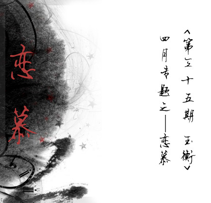

# 恋·慕

# 恋·慕

## 专题汇编 / 北斗

 

### 

### “我喜欢我

### 让蔷薇开出一种结果

### 孤独的沙漠里

### 一样盛放的赤裸裸”

 镁光灯下妖娆，摄影机前搔首。过分地向世人展现自己的美丽，把孤寂的灵魂舞给镜中的自己。 Leslie 始终在寻求生命的意义。 谭张对垒，告别歌坛，纷繁芜杂的事情，让他的包袱一层一层的加重。他想要走的洒脱，走的轻松，走的放肆，走的再无顾忌。 皮裙短，长发飘。兰花指一翘，红高跟一踏。风华绝代的 Leslie 。持男人的派头，拿女人的腔调，跨两性之间，暧昧至极，世无几人可比。 即使另类遭人妒，畸情惹人议， Leslie 也不愿在意，匆匆一世，他只想为自己而活，只求问心无愧。蜚短流长，实在不该加之于这样一个愿望单纯的人身上。 Leslie 喜欢买房子，买下后，自己画图纸，设计装修，忙忙碌碌，心满意足住上一段日子，厌倦后再买再装修，如此反复，他自得其乐。 大笔家产由唐唐打理，或亏或盈，都无所谓。如果可以， Leslie 愿意将所有的钱换做实实在在的生活。 从踏入演艺圈以来，他就像是一只无脚鸟，不停的飞呀飞，再苦再累，不能停。年少时虽不快乐，但至少实在，现在连痛，都模糊了。 他有时也会退缩，他会想，终有一天，他要停下来，停下来休息。 

### 为你钟情，倾我至诚

### 请你珍藏，这份情

### 然后百年，终你一生

### 用那真心痴爱来作证

 Leslie 以前并不是 homosexual ，他也是有女朋友的。虽不是非常漂亮，但他喜欢。后来因为一些原因或者没有什么原因就散了，仍是好朋友，常常会联络。 Leslie 自己也说，如果当初他和她在一起，也许事情就会不同。 可是没有如果，也没有也许。 Leslie 邂逅此生最心爱的唐唐，为关注八卦新闻的闲人提供了说辞。 夜阑静，有谁共鸣。唐唐挽联一副，哭的肝肠寸断。 只为这一句，天大的错，也原谅他了。 手抱遗像，泪如雨下，任谁见了都会为之动容，任谁见了再不会质疑他们的感情。是不是畸恋，这很重要吗？ 17 年，人世沉浮； 17 年，鹣鲽情浓。也不是说散就散，说断就断的。 不知道可不可以这样说，哥哥和唐唐为现代速食爱情提供了最佳的悖论。 Leslie 演痴了程蝶衣，演真了何宝荣，演空了阿飞，演书生，演小人物，言此演彼，赋予了太多不该存在于人们心中的人物生命，却忘了演自己。 成角至今，人戏难分。男人把他当女人，女人把他当男人。 究竟不是霸王别姬，乃是姬别霸王。 最终竟也是啊，一具皮囊，空无一物。 不疯魔，不成活。 这是蝶衣的宿命，也是 Leslie 的。  

### “不行！说的是一辈子，差一年，一个月，一天，一个时辰……都不算一辈子。”

 这话说的入骨，说的心痛。每次看到蝶衣说这句话时那倔强的泪，不免心痛。我的蝶衣啊，你可曾知道人世间本不是你想的那般忠诚？“从一而终”又哪里是这行于尘世的平凡人可以遵守的誓言？你可知变化才是人性中唯一的不变？ “你们都骗我，都骗我。我也揭发，揭发姹紫嫣红，揭发断井残垣。段小楼你狼心狗肺丧尽天良，空剩一张人皮了。” 文革批斗的那段戏每每都让我看到辛酸。 “ 那都是四人帮闹的” ，但这不能掩盖人性的懦弱和龌龊！蝶衣不明白，他不曾为时代所改变，他是个可怜的孩子，他固守着他的戏，那份独特的艺术韵味，唯有他还在矢志不渝的坚守着。一直试图抓住他身边唯一的真情……但螳臂挡车式的无望之争，最终让这个执著的戏子成为信仰的祭品。历史的车轮滚滚向前，我脆弱的蝶衣，天真偏执的守望者，你只是随风扬起的那粒尘埃啊…… 辛酸的回忆把一段段凋零往事演绎成了这部不朽的霸王别姬。人生如戏，戏如人生，一把宝剑横空出鞘，刀起人落。死的不是别人，是自己。 曲终……人散…… 正如当年的《纽约时报》的时评 : “这是一部看了后会让你长大的片子，了解人生中的无奈， 了解什么才是执着的追求，了解什么才是真正的爱情……”电影的成功，一半是哥哥的。 哥哥是个有心人。记得曾有报道说，那部电影拍摄结束时他恋恋不舍，又一次做东请全剧组吃饭，席间难过得忍不住流泪，跟每一个人对饮，喝了三杯茅台十二杯白酒，素来不擅饮酒的他回到房间后呕吐了四个小时爬不起身。张丰毅和巩俐都劝他说以后还有相聚的机会，张国荣说：不同了，以后就算再见，寻不到这份心情了…… 2003 年初，已经被抑郁症折磨一年的张国荣专程去北京拜会《霸王别姬》剧组的老友，一一见面，吃饭，扮演小豆子的尹志当时没有见到，张国荣回到香港之后还给他打了电话：“我是你国荣大哥啊，有机会再去看你……”  

### “我听别人说这世界上有一种鸟是没有脚的，

### 它只能够一直的飞呀飞呀，飞累了就在风里面睡觉，

### 这种鸟一辈子只能下地一次，那一次就是它死亡的时候。”

 哥哥从来不是去演绎角色，而是每一个角色在演绎他。《霸王别姬》的蝶衣，《阿飞正传》的阿飞，《春光乍泄》的何宝荣……现在想来不都是我们熟悉的那个张国荣么，只不过是他的不同侧面而已。各异的故事，以相同的悲情落幕，不禁然人感叹，感叹人生如戏，感叹造物弄人…… 留在印象里的永远是《阿飞正传》最后一个长镜头中哥哥落寞的背影，走向没有尽头的远方。他一生都是个在剑梢上孤单的舞者，喜爱他的人难以计数，但始终未曾被人理解。 哥哥的婉柔无需任何文字来评述，那亦是寂寞的粉墨。他的一笑一颦都是千转百回的心事，那种美早已超越了性别的界限。我喜欢哥哥垂目时的眼角，上帝应该很宠爱那张容颜，不然怎会有灵感勾勒出这么美的弧线。那种感觉……我不想用评论家笔下的“风华绝代”或“洗净铅华”去形容，那类词藻不适合这个被寂寞宠坏的生灵。哥哥的美是决绝的，圣洁到不沾染一丝尘埃。只要视线碰到他的双眸，便不忍离开，失魂的凝望，望久了，便读懂了藏在之后的深深哀伤，怜惜的泪，夺目而出。  

### 今生今世

### 我只是个戏子

### 永远在别人的故事里

### 流着自己的泪

### —— 席慕蓉 《戏子》

 都说《英雄本色》的年代是香港电影的黄金时代。也就是那个时代，“平民”和“偶像”还是互斥的词汇，明星少说是万里挑一高高在上的，影视行业不脱其神秘性和神圣性，狗仔业虽然风生水起，到底还不像今天这样，成为亿万国人娱乐精神的发源地。 所以用今天明星的抗压能力来检验当年的人，实在是脆弱得很。就好像阮玲玉，所谓众口铄金，无非是些不堪入耳的闲言碎语，放到上世纪 80 年代，怕也不过是家常便饭。 今天看来他们都太“不职业”了，“美誉度”不能当饭吃，“知名度”才是无往不利，花花世界，何必当真？ “戏如人生”这样的情节，在娱乐业还没有异彩纷呈穷凶极恶的年代，还常常在他们身上上演。对吃饭的行当不够职业，多是因为对人生太认真。太入戏了。所以才会有《霸王别姬》这样的电影。据说，在片场，开拍，程蝶衣痴痴地望着段小楼，张丰毅大呼 : “国荣，我受不了。” 《霸王别姬》是我看过的最好的中国电影，一个导演，哪怕终其一生只有这么一部戏，也足以笑看风云。因为它以及后来的《风月》，让我认定，陈凯歌才是最能让张国荣入戏的导演。 关锦鹏是精致细腻无以言说的，怀旧而不卖弄，伤痛而不造作，可惜还是擅长女人戏。张曼玉无可挑剔，但如果张国荣是女的，那阮玲玉就应该不是她来演了： 在王家卫那里，终究还是梁朝伟吃重。张国荣的《阿飞正传》和《春光乍泄》，多少任意而为，自然天成。梁朝伟虽则一贯忧郁，技术上的雕琢却稍胜一筹，合作多了，节奏上也和王家卫更为契合。 当年陈凯歌说“那个虞姬就是我”，不论矫情与否，我是感动的。虞姬爱戏，只认得懂戏的人，不知道什么是“懂戏的敌人”，不懂“是非”，所以“失节”。这样的人，不是极单纯，便是极无谓。梅兰芳会蓄须明志，毕竟比虞姬“明理”而“有节”。“理”多于“痴”的角色，大约不用那么入戏的。 不管怎样，该演梅兰芳的那个人，也不在了。  

### 轻风吹到胆瓶梅，心字已成灰。

### ——纳兰性德《梦江南》

 5 年后的 4 月 1 号，坐在海南的大巴上，繁花经眼，弱水朝天。敬业的导游阿莫，面对老人占多数的一车游客，费尽唇舌调动大家的情绪。 “啊，你说你们大城市来的人，到了我们海南，还问我肯德基在哪，我说了不要吃肯德基嘛，来了我们海南就要吃文昌鸡，肯德基的鸡，都是在黑屋子里养大的，一辈子没见过阳光，吃的有是有激素的东西，又不运动，不好，不健康，是有病的鸡，是瘟鸡！” “就像张国荣！” 呵，还是笑了一下。 大约是纬度相近，觉得海南和想象中的东南亚，有相似的味道，有时乡间的色调，是微绿的，就像《阿飞正传》里那种。  

### “一辈子 失去了你

### 夜的精灵遗忘爱的咒语 相爱的人从此两分离

### 你任我憔悴 我任你枯萎

### 怎么也无法将天意挽回”

 四月的一天，时而飘着细雨，下不具体，潮湿空气，郁闷。 Leslie 优雅的一跃，哀思遍涌，天空也为他落泪。 童年的不快，少年的不得志，青年的红楼初上，中年的星光无限好，俱烟消云散。 你的痛，我的伤，他的累，转成空。 Leslie 的归去，似乎标志着一个时代的终结。在开头的几天里，有爱凑热闹的人铺天盖地的以此做文章，待新鲜事物到来又忙着转向去了。喧闹过后，总会有一些人依然深深将他记取，会执著的爱着这个眉目如画的人。对他们而言，以后的每一年的这天将不再是搞笑的节日。 世界玩弄了你，你也愚弄了众人。 罢罢罢，娱人娱己，愚人愚己。  

### 明明还映在我眼中

### 怎么转眼旧了

### 明明握在我双手中

### 怎么却成了空

### 明明含在我的口中

### 怎么还没跟你说

 记得去年林夕来沪，与会者众。场中有迷者凄凄哀哀求解：老爷你给哥哥写过 49 首歌，自他殁后你再听会得伤感？我是不论在何时何地，只要听着他的歌便悲从中来的，可怎么办好。老爷凝神而听，一时闻后默然，随即回复，你认识哥哥吗？你跟哥哥生活中有过实际的交集吗？对方答曰否。老爷续道，如此便是了，你既不认得他，又何来如此伤心动肺，你听他的歌在电影里看到他，顶多一时三刻，辐射未臻深广，我认识他，我才情怯。 扪心自问，你悲恸的是他本人，还是悲恸寄生于他身上之情感投放的终归失去呢？ 悼念心情，后者居多。西毒欧阳锋曾有独白，“当你不再能够拥有，你唯一可以做的，就是令自己不要忘记”。而林夕所给予他们的解药是，“我们不断成长，就是为了遗忘”。 有时候忘记不定是背叛。比方活下去才是最好的抗争那样，别人都死了，就他仍活着，哪怕鹤发残颜，鸡皮皱肤，仍是胜利象征，如马寅初，时间会还原真相厘清事实，余下公道自在人心。 回头看，因为爱侬，所以原谅你的轻易纵身；因为爱着，所以宽宥，连你选择那条最艰难的道路，亦放任自流。向来秉承爱，是为了让他快乐而付出的，如果他不能快乐，你对其再好，好到别人全觉得你更委曲求全，也是枉然。于我私心，当然希望再累再苦再肮脏再颓势都要熬下去会有出头日，于我理性，却是无论如何不愿给你我自以为是的爱，我每会选择“如果你能快乐，就别顾我想你。”哪怕这个选择，伤我至深。 慢慢地，谁不会习惯呢；慢慢地，蝴蝶梦见周庄是为它；慢慢地，沧海成桑田，哪里还有巫山云不能嬗变为天池水？ 只有吾知道，深爱过侬，一天可抵上一岁。（安小羽） 

**专题完**

  **【引用及作者地址】** [《这篇思念 迟了六年....张国荣.6年.祭》](http://blog.xiaonei.com/GetEntry.do?id=374846000&owner=235710438&ref=newsfeed ) [《【花痴记】张国荣》](http://blog.xiaonei.com/GetEntry.do?id=326261416&owner=232278642 ) [《挚爱 张国荣》](http://blog.stnn.cc/StBlogPageMain/Efp_BlogLogKan.aspx?cBlogLog=1000213426 ) [《深爱过侬，一天可抵上一岁》](http://blog.stnn.cc/StBlogPageMain/Efp_BlogLogKan.aspx?cBlogLog=1002325295 )  
