# 佛罗伦萨漫步

# 

# 佛罗伦萨漫步

## 图文 南开大学学生

佛罗伦萨，意大利语的原意是“鲜花之城”，文艺复兴的发源地，城内到处是我们所熟悉的雕塑和建筑。 在中文里她曾经有过一个更美丽的译名——翡冷翠，其实这个译名更接近意大利语的读音，可以说是音义俱佳。佛罗伦萨被誉为意大利的雅典，因为它是文艺复兴的摇篮和发源地，在闪耀着无数星辰的夜空中，只要提到但丁、乔托、米开朗琪罗、达芬奇...这些辉煌巨星就足以使佛罗伦萨名震千古，同时人们也不会忘记这座城市的保护人美迪奇家族，在她的庇护下产生了无数艺术巨匠和杰作，甚至应该对这座城市的普通市民也致以崇高的敬意，因为他们对于艺术的巨大热情使文艺复兴运动得到有力的支持，而他们拥有的惊人的鉴别能力也使不少艺术家因为忍受不了的挑剔而逃离这里。今天的佛罗伦萨不仅以其璀璨无比的文化艺术遗产吸引着全世界的游人，而且以其葡萄酒与足球赛事、时装表演与大型音乐节目在当代西方文化中焕发着迷人的光彩。 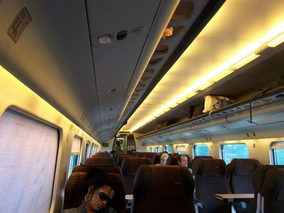 欧洲之星列车上的意大利美眉 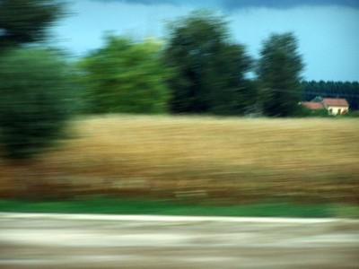 飞驶的欧洲之星列车上拍照，这张照片有点印象派的意思，呵呵 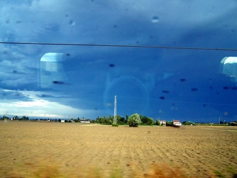 去往佛罗伦萨的列车上 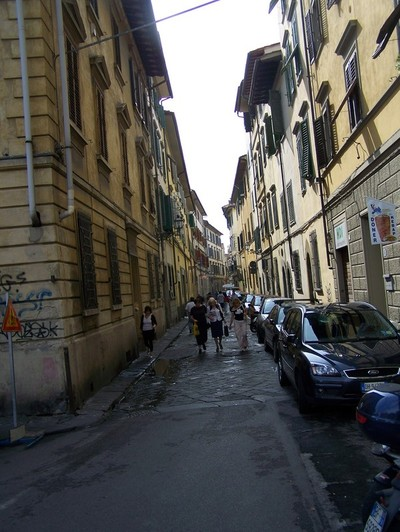 这样曲折的小巷是佛罗伦萨的标志 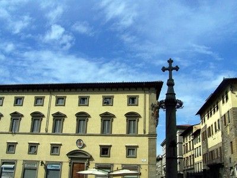 蓝天和十字架 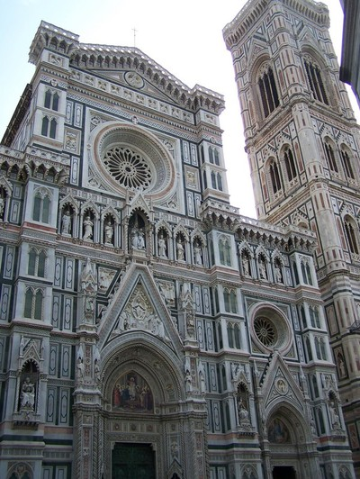 想必到佛罗伦萨的游客更多的是为了看圣母百花大教堂，从来人们都是记住的都是第一的，或者世界第一高，世界第一大，世界第一早.....圣母百花大教堂是世界上第一座大圆顶建筑，圆顶由十块浮雕组成，宛如一朵美丽的巨型花，据说高达106米，仅圆顶建造就用了14年时间，整个大教堂建设经过几代人、历时 150年，因此，现如今它已经成为佛罗伦萨的代名词。 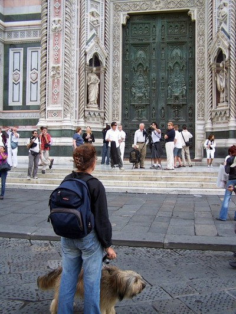 圣母百花教堂前的游客 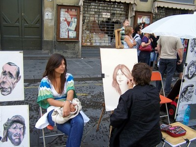 经常在电视上看到的一幕 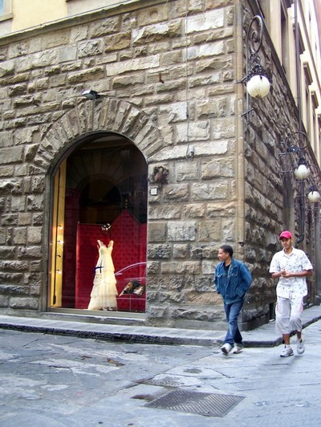 在这样一座艺术之都披上婚纱应该是个不错的选择 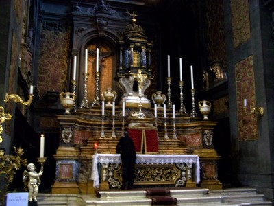 教堂太多了，没有记住这个叫什么 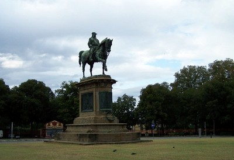 和佛罗伦萨多如牛毛的古迹相比，这个在城边的铜像显得是那么的普通，我甚至不知道这是谁的雕像，但是就是很喜欢这样静静的感觉 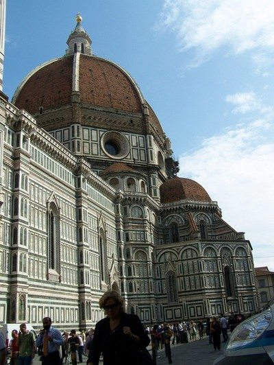 圣母百花教堂的穹顶 大教堂另一著名之处在于它的外表全部是用天然理石所砌，由粉红色、绿色和奶油白三色大理石所砌成的图案使大教堂更具有女性优雅高贵的气质，并千百年来保持本色，不过，大教堂的内部可远没有圣彼得大教堂那样富丽豪华，据说是为了让来前来祷告的人们更加专心祈祷 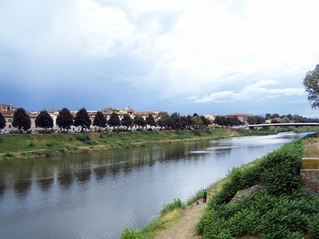 穿成而过的阿诺河 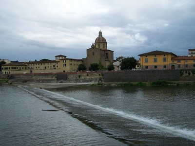 有水的城市都很有灵气 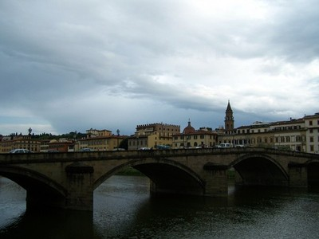 阿诺河上是小桥  老天很配合，时不时地来点小雨恰如其分地浸湿佛罗伦萨小巷的石板路，太有感觉了 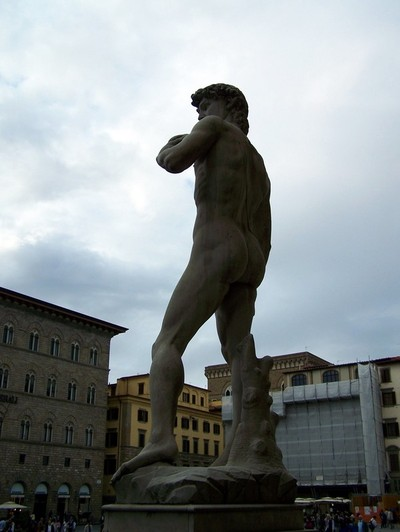 尽管大卫可以说是世界上最著名的裸男，但大卫的背部和屁股相信对很多人来说还是处男秀，来窥视一个，哈哈 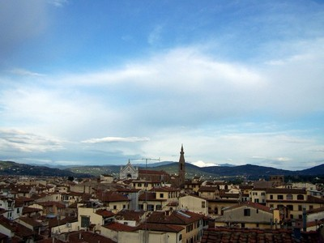 佛城鸟瞰 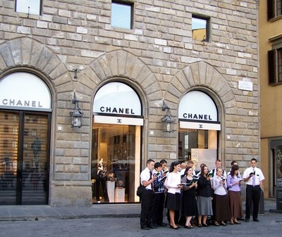 米开朗基罗广场，不知从哪冒出了一干人马，在夏奈尔专卖店前唱起了圣歌。 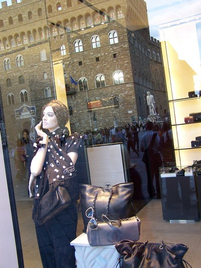 我最得意的一张照片。一家夏奈尔专卖店橱窗玻璃上映衬着对面的大卫雕像和国立美术馆。古典与现代，这就是佛罗伦萨。 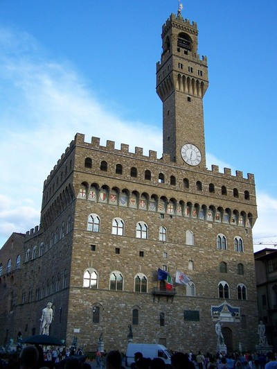 国立巴吉洛美术馆，米开朗基罗最著名的雕像《大卫》就矗立在美术馆前，供游人免费观赏。美术馆的门票也很便宜，只有4.5欧元，还不及当地半个披萨的价格 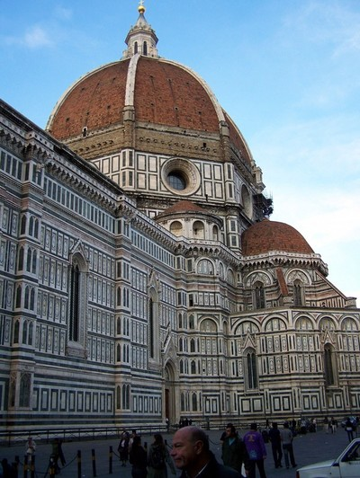 这是当时世界上最大穹顶。可惜我去的时候是周日，一周只有周日闭门休息。 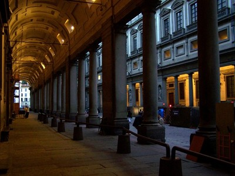 大剧院的走廊 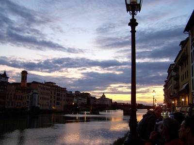 日落佛罗伦萨 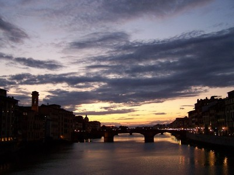 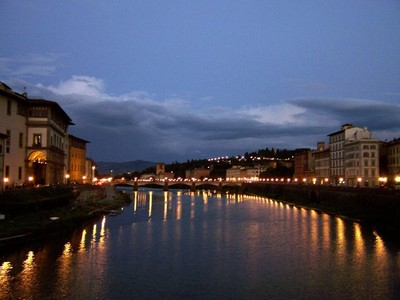 阿诺河华灯初上 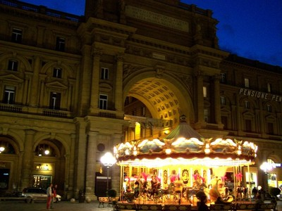 古迹前的旋转马车，有点梦幻的味道 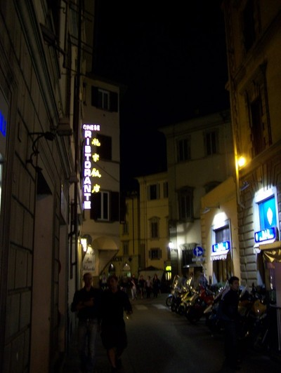 佛罗伦萨是一座百变之城，同样的巷子，白天晚上大不相同 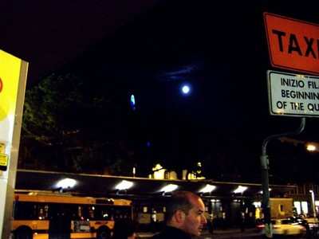 晚上要搭火车去往慕尼黑，突然想起来这天是中国个中秋节，急忙跑出火车站拍下一轮意大利的圆月
