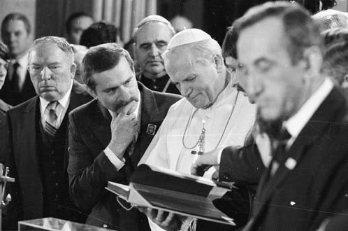
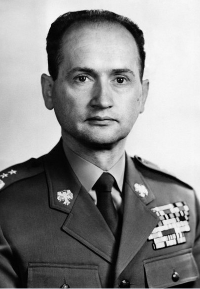
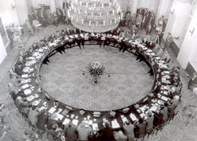

# 东欧剧变二十年——系列之一·波兰不会灭亡

**“这个月刚好是波兰第一次民主选举的20周年，回望这20年， 波兰的民主转型是成功的——它成功的完成了共产主义国家的第一次民主转型，建立起了一个公民社会；但波兰的转型同样充满了自我矛盾——团结工会引起的自由派内部倾轧，协议转型本身的不健全性，以及最最重要的，经济改革的波折。但是不管怎样，我们都希望波兰的经验能给以我们更多的启示，他们，始终是我们的先行者。” **

# 东欧剧变二十年

#  ——系列之一·波兰不会灭亡

## 图文/孟小你

波兰人民共和国，用波兰语写作Polska Rzeczpospolita Ludowa，念起来抑扬顿挫，这个国家成立于1952年，最终在1989年更名为波兰共和国，并揭开了东欧剧变。到如今，已经过去了整整二十年。 看到这里有些同学可能就会问了，1952年才成立？之前它跑哪里去打酱油了？这个……虽然1947年波兰就宣布了建国（1947年之前在打内战），但是直到52年波兰才通过了社会主义的宪法。而且在建国后的一段时间内，波兰的军事首领是一个波兰裔苏联元帅，还进了波兰政治局，大家可以想象下，我也不多说啥了。 不过国家的架子好歹是搭起来了，不久，波兰统一工人党第一书记、亲苏派博莱斯瓦夫·贝鲁特被选举为波兰总统，开始率领波兰人民热火朝天地进行社会主义建设。 如同大多数新兴社会主义国家，波兰在经历了两三年的经济繁荣期后，重视重工业轻视民生的政策的弊端开始显露出来，波兰人民开始逐渐对当政派不满了。 到了1956年， 苏共二十大，赫鲁晓夫作了著名的 “秘密报告”，严厉批判了斯大林的个人崇拜，结果刚刚还在大会上发了言的波兰代表团首领贝鲁特同志受惊过度，直接在莫斯科猝死了（有一种说法是被毒杀的， 作为一个国家的领导人在外国首都被毒死，这还是比较骇人的，反正我不大信），结果奥哈布被选举为新任的第一书记。 要知道，波兰人民有着深厚的天主教和反俄传统，秘密报告一出来，波兰的人民群众一听，我靠，这还得了，早就被你们压迫的喘不过气来，这下主动把料送上门来，马上开始动手闹革命喽。于是拉开了浩浩荡荡的1956年波兹南事件。 其实波兹南事件也不是什么大事，民众的诉求非常简单——工业重镇波兹南市的工人要求加工资和减税，结果机械工业部领导态度蛮横，这一来二去，爆发了严重的冲突，波兰政府出动了军警（注意，出动的军队并没有开火）平息了这一切，但是没过几个月，随着全国各地暗潮不断，统一工人党的领导们又开始反思，结果在七中全会上，决定对政治局改组，尽管赫鲁晓夫等人亲临华沙，给波兰党施加了强大的压力，但是由于民心所向，更加民族主义和“右倾”的哥穆尔卡（值得一提的是， 哥穆尔卡一系所倡导的经济政策在八十年代很受我国当时的领导人重视）还是上台了。随后波兰开始了一些政治和经济改革，然而，这些改革还是没有触及到波兰所面临的问题核心所在。 1978年，对于波兰的民煮运动而言是重要的一年，波兰克拉科夫市的天主教枢机主教卡罗尔·约泽夫·沃伊蒂瓦当选为新任教宗，是为约翰·保罗二世。他是教廷历史上第一个斯拉夫人教宗，也是历史上第四位获封号“the Great”的教宗，更是一个非常牛逼非常娴熟的反共宗教人士，他曾经多次访问波兰，给以了波兰的反革命人士强大的信心。在波兰国内估计应该是被归类为“与国外反波实力相勾结的宗教集团”之类的。 到了1980年， 著名的反革命组织“团结工会”终于在格但斯克——对，就是那个引起了二战全面爆发的但泽市——成立了。著名的民煮人士、反革命阴谋家、波兰统一工人党的掘墓人列赫·瓦文萨正式登上了历史舞台。在此之前的七十年代，他已经因为在组织罢工坐了一年的牢，可见这厮是一个老牌右派。此时，瓦文萨的对手统一工人党的 第一书记已经换成了沃依切赫·雅鲁泽尔斯基将军。不过需要提醒大家的是，雅鲁泽尔斯基虽然是一位军人，但是在政治上他却是一名温和派。 

列赫·瓦文萨与教皇约翰·保罗二世在一起。版权属于原作者。 

雅鲁泽尔斯基将军标准像。他是一名相对温和的当权派。

由于强大的凝聚力，团结工会不仅吸引了广大工人，知识分子和学生也是其重要的支持者，在其活动的高潮期，波兰总共有一千多万人参加它所发起的活动（主要是罢工和游行）。团结工会的号召力是如此的强大，以至于在1980年8月，波兰统一工人党不得不承认了它的合法地位——在共产主义国家中，这可是史无前例的。 1981年12月， 感到有可能失去统治地位的雅鲁泽尔斯基将军宣布波兰进入戒严状态，大量的军人进入了政府高层。此后的数年间，波兰一直处在“团结工会——天主教会”为一方，“军方——安全部门——统一工人党（注意，党此时的排序已经在最后一位了）”为另一方的两头争霸中。民众的生活水平也持续地恶化：一个小笑话中提到， 一名波兰文书员为了挣钱养家，不得不去刷皮鞋，在工作的时候他遇到了自己的主管——主管也是来刷皮鞋挣外快的。 时间前进到了1987年6月，教宗约翰·保罗二世第三次访问波兰，成千上万的天主教徒涌上街头朝拜；同年11月，雅鲁泽尔斯基的一揽子经济改革计划在全民公决中被驳回；同一时期，戈尔巴乔夫开始了“新思维”政策。凡此种种裹挟着民意最终通向了1988年团结工会领导的新一轮大罢工和1989年的圆桌会议。统一工人党被迫接受了团结工会关于民煮选举的要求——需要说明的是，雅鲁泽尔斯基将军在这次事件中起到了推动作用——当然了，大多数马克思主义者则称他“在波兰事件中犯了严重的、不可挽回的右倾错误”。 

最著名的一张波兰政治圆桌会议的照片。版权属于原作者。

当年6月，波兰举行了40年来头一次自由的参议院选举，统一工人党遭遇了未料想到的惨败（有多惨？团结工会获得了参院99%的席位……）并在次年一月宣布解散。东欧剧变也由此次选举拉开了大幕。紧接着就是人所共知的苏联解体，冷战结束，西方喜悦地迎来了“历史的终结”。 不过，剧变后的波兰政治却相当长的一段时间中陷入混乱，1991年的选举中，没有任何一个党派的得票数超过七分之一，最大的几个政党之间对立十分严重。1993年的选举中，得票最多的民煮左派联盟也仅仅获得了20%的选票（但是却获得了37%的议席，比例严重失衡）。波兰的经济在2000年之前也仅比东欧的其他国家略好（但落后于捷克）。直到2001年，波兰的人均可支配收入才开始大幅度地上涨，但速度也仅仅与西班牙等国持平。 这个月刚好是波兰第一次民煮选举的20周年，回望这20年， 波兰的民煮转型是成功的——它成功的完成了共产主义国家的第一次民煮转型，建立起了一个公民社会；但波兰的转型同样充满了自我矛盾——团结工会引起的自由派内部倾轧，协议转型本身的不健全性，以及最最重要的，经济改革的波折。但是不管怎样，我们都希望波兰的经验能给以我们更多的启示，他们，始终是我们的先行者。  关于波兰的一些小八卦： ·据说列赫·瓦文萨是一名同性恋，但是他本人并未证实或否认这一点。考虑到波兰的天主教传统，我们应该对他的这种态度报以理解。 ·无论是红色波兰还是白色波兰，其国旗、国徽和国歌（就是那首帅气的“波兰没有灭亡”,这也是本文的标题）都是一样的。 ·1945-1947年的波兰内战中，苏联并未大规模直接出兵干预的原因是波兰是二战的战胜国。某种意义上，这是波兰对于苏联更为独立的原因之一——我们知道，另一个东欧的二战战胜国是更为离心的南斯拉夫。 ·在波兰的社会主义改造中，并没有没收农民的土地，换句话说，土地一直是农民私有的。 ·历史上波兰人民共和国一直是进行着“自由”选举的，协助统一工人党搭台的是农民党和民主党，结果在1989年的参院半自由选举中，这两党当了叛徒，狠狠地阴了统一工人党一把。
