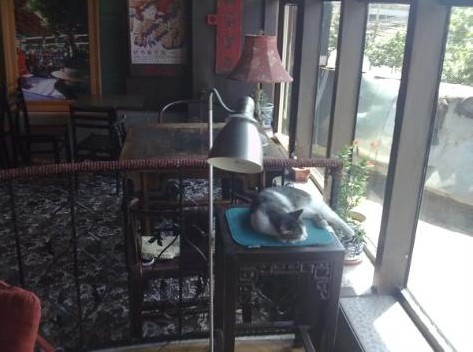
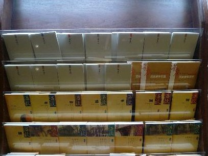

# 是谁传下这行业，黄昏里亮起一盏灯

# <第五十一期•玉衡>万圣的施书人

**编者按：读过这一篇我不知道为什么想到了老六的那篇《爱情的另外一种译法》，“弗兰克死后，海伦来到查令十字街84号，站立的地方，正是他深情凝视的所在。我惊异地发现，经过了二十年岁月的打磨，他们的眼神都那么一致。 **

** 海伦所推崇的英国玄学诗人、散文家多恩（John Donne；片中译成邓恩）有一句话：“全体人类就是一本书。当一个人死亡，这并非有一章被从书中撕去，而是被翻译成一种更好的语言。” **

** 我想，当爱情以另外一种方式展现铺陈时，也并非被撕去，而是翻译成了一种更好的语言。上帝派来的那几个译者，名叫机缘，名叫责任，名叫蕴藉，名叫沉默。还有一位，名叫怀恋。 爱情的另外一种译法。”**

(图片来源：四月)

## 文/白泽

今天早晨去万圣，瞅见二层最深处那排绘画雕刻美工的冷门书架下站了一位出家人。  其实原计划早晨是去车公庄提保证金的，听说松子要去书店，我正好有意去万圣买本开放时代，就一起上了公交。每次陪松子出门，都会想起那部电影《被抛弃的松子的一生》，我没看过，却听Ninio叨咕过不知多少次。当然这联想是名不副实的，但每个人出门时确实总会希望能有个人陪着一起走。即便我这厢独来独往惯了的游魂，有时也会陷于马斯洛那五层金字塔迷阵中左冲右突而不得脱释罢。  我觉得，这世界上的“陪伴”统共只有三种：男女之间、男人之间、孩子之间（不过，不妨给这个划分加上一个“在现代叙事中”的前提）。说到这里我还是忍不住要歌颂性的伟大，自从有了性，地球的面貌就焕然一新了。人类全部社会与历史都建构在圣杯与剑那电光火石一瞬间之上，常言道，是亚当和夏娃那历史性的插入，才有了北京市政府（也包括工业与信息化部），从这个意义上讲，《圣经》真是一部奇书……它就是在讲一个男人与女人之间的性关系如何发展成为权力的故事嘛，所以嘛有位伟人才说，《圣经》是宣言书，《圣经》是宣传队，《圣经》是播种机，确实是播种机嘛。  男女之间不清不楚的授受关系中，一个明显的特征就是男性为授而女性为受，这导致了男人们为了争取女性的青睐，一方面结成伙伴参与集体狩猎，以求获得稳定的高品质蛋白质来源吸引女性的目光；一方面为了争夺对女性的主动权爆发冲突、决斗乃至战争。由此诞生这第二种陪伴关系。女性之间不存在陪伴的关系，从根源上讲她们没有相互结合的必要，即使相互结合也是世系群内的亲属互助，归根结底只是男女性关系的衍生物。我们平时所看到的女孩子之间（包括很多男孩子之间）的纯真友情，其实是一种孩子之间的陪伴关系。 

男女结合之后诞生的下一代组成了儿童之间的游戏群体和伙伴群体，其目的既不是生殖所隐喻的权力，也不是狩猎所象征的资本，而在于适应社会和社会化。事实上，不只孩子，成年人，男人和女人，也都有自我调试于社会和继续社会化的需要。因此孩子之间的陪伴关系并不只出现在“孩子”之间。我记得原来在谈阿尔及利亚卡比尔人的民族志时提过，一些社会和一些家庭中的女性在成年后是仍然生活在一种孩子气的连续性当中的。

 （图片来源：王津）

我不懂佛法，然我以为真正的出家人便是这样的孩子。他们戒女色，戒酒肉，远离权力和资本，他们在尘世间或有苦恼难以化解、或有深虑难以理清，因而出家为僧投身冥想与清修之境，以西学眼光视之这正是一种借助对体制外的寻求而调适于整个社会的行为。以此为目的，僧人们不仅相互之间建立一种真诚共享的关系，还将这种关系推己及人及至天下众生。正如喜欢的那首歌，“我们都是好孩子”——漫步于大街上，或在天桥上俯瞰车来车往，或在地下道里关东煮蒸腾起的烟雾和流浪吉他奏出的音符间徜徉那么一小会儿，望一望脚下匆匆的行人们，望一望那一张张沧桑或稚嫩的面庞，抑或就拿出那么一眨眼的功夫，留心一下穿七分裤的姑娘和掉了小半圈头发的大叔在聊些什么话题，是天气吗……当然这肯定是总挂在嘴边的那几句咯，你追初恋女友的时候不也在结结巴巴地想着亦或讲着今天下雨我可不可以帮你撑伞的桥段么，于是你顺着那青石板上的泥泞与氤氲，看哪，看哪，这一个个面容鲜亮的好孩子！

看他们，看他们在走，在笑，在跑，在吵，在洗碗筷，在刷油漆，在开飞机，或者在打飞机——看他们多么可爱，多么美好，多么真实，他们都在都在都在眨眼睛呢！看那十几岁的小姑娘，刚刚采摘了蘑菇或者卖完了火柴，看她的眼睛；看那年逾耄耋的老人，才打完太极拳散步回家的，或者刚刚勉强从肥硕的裤袋里掏出速效救心丸来吞了三颗的，看他的眼睛；看那年富力强的青年人，把汗巾胡乱揣在腰带上低头黄土抬头皇天的农人，或者收拢了一脸倦容把最后一摞文件提交给领导的副总经理，看他的眼睛；甚至那自由地游弋喷吐于大西洋海底（也可能是霍格沃茨湖底）的巨乌贼，那背上被插了十七把鱼叉大口大口的吐着气的北极小须鲸，看他们的眼睛！那一双双眼睛中的光景，在岁月流年中一眨一眨，眨得人心如鹿撞抑或心惊肉跳，所以这就叫作了生命。如果能够的话，真的恨不得从心神中分出亿万个我，去陪伴这世上亿万个生命，他们可都是我的好孩子呢。

 于是便是那样容易理解，为什么波伏娃为了自由的写作而终身不婚，便是那样容易理解，她与萨特那坚X不渝的爱情与约定，因为她，他们，他们不愿终其一生陪伴那某一个男人或女人，不愿举其全力陪伴那某几位师长或兄弟，他们要写书，要送出自己的思想与理想，要那火热的心肠与铅版熔铸自己的希望和他人的未来，要自己的灵魂永远陪伴着自己、陪伴着别人、陪伴着这整个世界，因为每一个人都是他们的好孩子，他们每一个人都是好孩子！ 

所以这位施主，你我是有缘人，请收下这本书吧。在付款台，那出家人从采购的书中任取一本，送给了……可惜不是我。 

