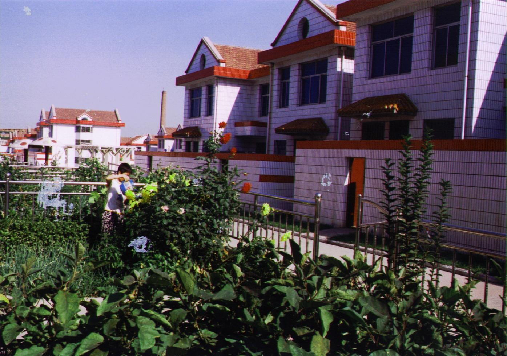

# 农民的生存空间今何在？

# 农民的生存空间今何在？

## 文/三月的阳光（湖州师范）

打电话回家，拉了几句家常后我小心翼翼地问：“地基的事情怎样了？”父亲沉默了一会说：“这你就别管了。”于是我们都沉默了。 我所住的小岛要开发建成全国第五个保税港区，征地通知已经发下来了，赔偿款将包括：土地、房屋、人口。土地是公有的，几十年前分配给每户人家几乎都差不多的面积，只是现在大多数人已经不再靠种田为生，土地纷纷转租，我自己都不清楚自家到底拥有几亩田地。人口是固定的，一个家庭三到四个人，除了一部分适龄青年加紧结婚生子外其他人家不可能凭空多出人来。所以只能在房屋上动动心思，平房建楼房，二层变三层。一时间岛上尘土飞扬，到处是建筑工程队，到处是新建成的别墅式小洋房。 我家的房子是几十平米的平房。面积狭小，位置逼仄，夹在几栋二层楼间，见不到阳光吹不到风，甚至邻居的下水管直接修到了我家院子。有次水管爆裂，污水排满了小院。母亲对这房子一直没有好感，不仅由于以上的原因，更因为一个很玄乎的东西：风水。 农村人很信风水，而房子是我们安生立命最重要的场所，是生活中高于一切的依靠。几乎每户人家建房前都会花几百甚至上千请风水大师查看地形，若是位置不好，他们只能买新地基。母亲一直认为现在这房子的朝向位置都阻碍了全家的财运福运。我并不信这种说法，但是搬家或者旧地重建确实也是我很久以来的愿望。 不在农村生长的人或许真的不清楚一栋房子对农民来说有多重要。我们把大量的注意力投在城市高昂的房价上，计算一套普通房子要耗费一户普通人家多少年的纯收入。我们咒骂中国房地产商的贪婪，政府的不作为，悲哀人民用尽一生心血却只能一辈子做个房奴。相比之下，很少有人关注农民的住房问题。正如一般人心里对农村的理解只有特穷和特富一样，他们对农村住房也只有两种概念：一是岌岌可危的土屋草房，根本不应用来住人；二是别墅式小洋房，也就是政府大力宣传的新农村形象。然而在这贫富两重天中间，大多数的农民都只拥有一套简单粗糙的房子，它一代代传下来，在岁月中凝聚了几辈人的感情。而有感情有血脉跳动的房子，才叫家。 

当全岛开发的通知发出来，村民意识到一栋楼房以后能换多少钱的时候，所有人都开始疯狂地拆建，所有人都想尽可能地扩大自己的住房面积，所有人都费尽心机拉关系走后面送豪礼只为上面能批个更大的地基。房子突然成了比钱更像财产的财产，所有人都等着看自己现在新建成的楼房被推土机推倒，然后换来大把大把的钱。 对不起，我家亦不能免俗，我们也想要宽适的三层楼，还有将来那大把大把的钱。 在农村，修建房子是一件与结婚同等的大事。看风水、选吉日、打地基、上梁，再加上后期装修，一幢房子需要农民付出大半辈子的心血。造房不易，需要钱、地产、面子，还有极度微妙的关系和政府有条件的通行证，往往房子落成，一家人便要开始了拼命挣钱还债的生活。宁波在国内也算是名列前茅的经济城市了，我的家乡跟一般的农村比起来是比较“有钱”的农村，然而有钱的农民仍逃不过被房子掏空的命运，建房子仍是那么复杂的一件事，尤其是现在这个时候。 我可以给你们算一笔账，以2009年上半年浙江宁波北仑地区的建筑材料市场价格为准。 水泥：350/吨。白水泥：600/吨。黄砂：40/吨。碎石：30/吨。红砖：350/千块。石灰：220/吨。钢筋：3800/吨。加上人工费，机械费，运输费，水电费，综合起来每平方米的造价大概为550到750。也就是说，一幢总面积约为250平米的小洋楼需要14万到19万。这还不包括前期的地基费，后期的装修费，以及或明或暗的政府通行费。这样一套房子总共需要20到30万，对一个不当官不做生意的农民来说，又是多少年不吃不喝才能完成的目标？ 或许你们会对一户农民竟然要建造250平米的房子感到不可思议，但正是因为我们是农民，我们对生存空间有着更简单的概念——宽阔，通风，亮堂。财富基于厚实的地基中，福禄来自朝东的大门外。更何况现在每平米都意味着质感十足的钞票，于是扩张成了不可避免的趋势。 近两年政府开始限制村民狂热的扩张，规定要新建房子必须先得到邻居的签字。这导致人们一边扩大自己的领地一边限制邻居的扩建，人情在房产面前不堪一击。贿赂，告密，举报，暗中破坏，甚至打架，砍人，雇凶拆房。这样匪夷所思的事件全部出现在这个原本安分的小岛上。我每次回家都能发现建了一半的新房，主人笑着，而他的邻居阴沉着脸。我亲眼看到亲兄弟为了争夺几平米而大打出手，撕破脸皮，打断肋骨；我小姨家新建了三层楼，因为房子高于邻居家（这边认为一爿地区最高的房屋会占据最好的风水）而被告发，城管毫无理由地强行推倒了还未建完的围墙；我外婆的邻居修建新房却把路修到了她家的柴房，八十多岁的老人争不过，大病一场；而我家迟迟得不到地基批文的一部分原因正是邻居的阻挠，而且这还是一个有官职的邻居。 

我不敢对这种现象表示出强烈的谴责，因为我明白，不是大家想争吵，实在是我们太想要过更好的生活了。很多时候我们真的相亲相爱，我可以在任何一户人家吃晚饭，我管他们叫叔叔大嫂阿公阿婆，但这个前提是大家没有金钱的疙瘩。一旦跟钱扯上关系，人情断的比什么都快。人自私的一面在这个以房换钱的时刻毫不保留地体现出来，大家无法控制地去谋求最大的利益。我们确实很爱自己的房子，但是开发势在必行，这些房子无论如何都保不住的。开发以后，赖以生存的土地没有了，大部分人得依赖这拆迁费生活，可是钱是个再多也填不满人心的东西，大家现在削减脑袋拼命敛财其实正是源于对未来生活的恐慌。 我们就这样在抗拒开发中期待开发，在夏夜一起乘凉的堤坝上伤了亲友邻居的感情，在对老房子的深深眷恋中推平了自己的家。 母亲一提到房子就有一大堆话要说，委屈、怨恨、着急、憧憬。她已经年老，对房子的期盼也随着年龄的增长愈加强烈。那混凝土搭建的盒子包容的不仅是一家几口人的温暖稳固，更是家族得以延续下去的重要承载点。老人在这里死去，小孩在这里新生，即使离家再远，老了也仍想回家，在属于自己的房子里走完最后一段路。母亲或许还未想得那么远，但我明白她的焦急和盼望，新房子代表了新生活，也包含着农村人一直放不下的面子和虚荣。她要看到我风风光光地从新房子里出嫁，要在这片即将天翻地覆的土地上尽可能充裕地享受自己的空间。 然而年初开始的申请至今未被批准，即使家里艰难地筹备了钱，却仍只能等着那张纸来控制钢筋水泥的动工。没有房子，所有的幸福愿望都像是被拆了地基，变得岌岌可危。 十年以后，梅山乡变成了梅山保税港区，我们将住进单元房，用五把钥匙才能进家门；没有院子，没有打开大门时吹进的海风，也没有了属于自己家的地基。当我们原本独门独户但彼此相连的生活被公寓大门分隔成一小块一小块，“家”被偷换了概念，谁还能讲清这是不是农民真正的生存空间。
