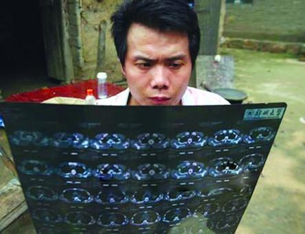
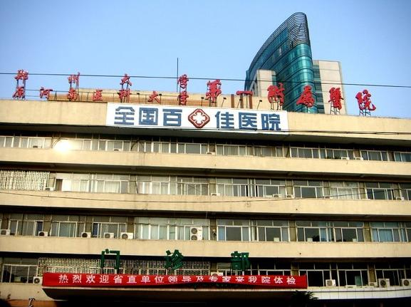
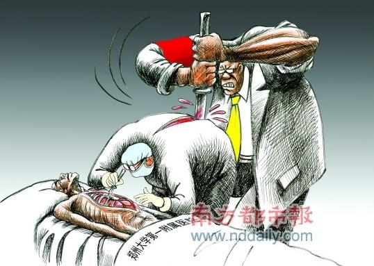

# 从孙大午到郑大一附院

#  从孙大午到郑大一附院

##  文/周维恭

时光划过了多年，可我们依旧不能对一些事情释怀，因为总有些人有些事在提醒着我们。 2003年初夏还没到来，名噪一时的孙大午便锒铛入狱了。随后，徐水县抽调了40名干部组成工作组，带着一支500人的武警防暴队，进驻、接管大午集团各公司，号召农民配合工作组揭发、检举孙大午的违法行径。大午集团的财务部门首当其冲被查封，保险柜里的300万元现金和图章、账本被抄走。可是农民却不吃这一套，仍然源源不断地把玉米送到饲料公司的场院上。工作组成天用大喇叭向村民播讲宽严政策，宣扬孙大午“非法集资”的罪行，并威胁说：你们如果还坚持说是自愿把钱借给孙大午的，那这钱就不还了！接着刑事拘留了张庆余等三位竟敢为孙大午说话的大午集团员工。就在这种高压态势下，冯庄村民王瑞英对前来采访的《人民政协报》记者说：“我借给了大午公司20万，人家打了借条还犯法吗？等大午出来，我有钱还借给他，这回还不打借条了，口头协议，还犯法吗？”  出乎徐水县方面的意料，新华社、大公报、美联社、路透社、BBC、CNN从天而降，《人民日报》数日连篇累牍的报道事件的最新进展、CCTV2经济档连续三天作出专题访谈。与政府部门的强势相比，来自民间更多的是理解的声音。著名经济学家茅于轼为了这个素不相识的农民四处奔走疾呼，联想集团的老总柳传志也给尚在囹圄之中的孙大午发来了慰问电。徐水县政府迫于无奈，终于判三缓四释放了这个被称为“中国企业家良心”的所谓非法集资犯。孙大午回到家，当捡废品的父亲告诉他，家里收养的几个孤儿在他入狱期间因无钱缴纳学杂费已经被学校扫地出门时，这个肝胆人前大丈夫的中年农民不禁黯然下泪。 刚刚崛起的民间舆论终于在这里取得了象征性的胜利，我们似乎看到了民间舆论在信息时代的初战告捷。我们以为这是一个时代的开始，曙光开始照耀这片被阴霾笼罩已久的土地。 可是这样的声音这样奔走很快就烟消云散开来，昙花一现的摸样并没有改变什么，人们还是按部就班的生活在圈内，我们的期望一时间遥遥无期。 于是有了6年之后张海超舍命一搏的一幕。在郑大一附院开胸验肺，终于证实了自己的矽肺病患者的身份，在此之前郑州、新密两级职业病防治所不是把他拒之于门外，就是做出他根本没有矽肺病的诊断。当河南省委书记徐光春和卫生部部长陈竺的批示下来后，我们以为这场草菅人命的闹剧到此为止，其实大幕才刚刚拉开。  8月12日，郑大一附院受到了河南省卫生厅的系统内通报批评，省厅将派出调查组立案调查，主刀医师吊销执业资格。理由是：郑大一附院不具备职业病诊断资质，其作出“尘肺病”诊断的行为违反了《职业病防治法》。 坚决执行《执业病防治法》的郑州、新密两级职防所收到如此大的冤屈，自有省厅替他们出头，惩治不听话让大家一起出丑的郑大一附院。  捅破潜规则的郑大一附院这只鸡被河南省卫生厅杀给全省的医院看，河南省和谐了，省卫生厅也再无烦恼。只是经此一搞，以后谁还再敢给张海超们开胸验肺呢？我们似乎进入了一个怪圈，在这里，一切的游戏规则统统失效，要想接着玩下去就必须把自己的命运交到他人之手。这样的时代里，验明正身成为一项艰巨任务。 耿直不谀的“中国企业家的良心”孙大午被判刑了，朴实的农民们仍在大午集团的院子里堆放着成吨的玉米。尚存一丝善念的郑大一附院主刀医生被吊销了执业资格，郑大一附院门口等待开胸验肺的“张海超”们已然排起了长龙。惩处他们的是一个叫做“法律”的东西。悲哀的是，当百姓真正需要这些“法律”的保护时，这些“法律”却全无踪影，只在某些人为了维护自己的脸面时他们才会挥舞起所谓的“法律”大棒，强调“法制社会”、“法不容情”。

多年之前，茅于轼先生说《非法金融机构和金融业务活动取缔办法》 是限制了农村信贷发展，是恶法应该再修订商榷。多年之后，《职业病防治法》仍然要求单位为申请鉴定人开工作证明，如果用人单位没有笨到搬起石头砸自己脚的地步，那职防所就不能给申请人做职业病鉴定。 这就是我们坚持的“法律”，这究竟是谁的法律？
