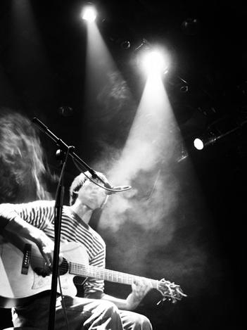
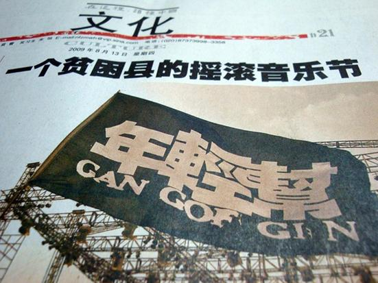
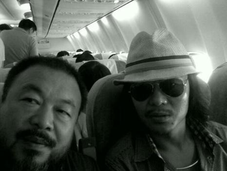

# 赋到沧桑句便工

# 赋到沧桑句便工

## 张北音乐节专题

**“国家不幸诗家幸，赋到沧桑句便工；**

**文章憎命达，魑魅喜人过”。**

**一** 在去音乐节现场之前，我在网上得到的反馈是骂声一片，习惯了城市空气的污浊，钢筋混凝土的冰冷，我理解他们想要看到心目中的绿色草原的心情，具有欺骗意味的海报让人们以为会到一个世外桃源，而不是一个荒芜凛冽，穷困潦倒的贫困县的荒郊野外。 先不论是否存在欺骗。它又一次印证了真正的音乐永远不会在幽静舒适的世外桃源上生根，而是一直走在寒风凛冽的荒滩与高原上，不能停步。 “国家不幸诗家幸，赋到沧桑句便工； 文章憎命达，魑魅喜人过”。 这些游走在边缘的音乐人，在这个娱乐和解构都做足了的年代，饱含着一方水土的沧桑味道，背负着时间带来的困顿和消磨，不同于八十年代的斗士们鲜活，高昂而安贫的理想主义，他们更坚忍，像一股暗流，倔强的拒绝着主流，不说话，不合作——什么也不必说，唱一首歌吧。 他们更像是饱经沧桑的诗人，你若细细听，每一首歌都是一首辗转的诗。 

**二** 在张北音乐节前，绿色旗帜音乐节上发生了荒唐的冲突。 姑且我们把它看做娱乐史上最有代表性的一幕。很多人大概是不爱也不恨李宇春的，到底是什么能掀起这场近乎报复性质的冲突呢？看过晓贝写的现场真相，让人不禁辛酸。在中国摇滚和主流音乐之间一直隔着一道不能逾越的沟壑，同是音乐，它们的景况没有人愿意拿来比较。若拿来比较，是谁会窘迫万分，又是谁会羞愧万分。 仅仅说这些年轻人不愿意选秀明星出现在自己的舞台上是不宽容的表现是太草率的。 主办方的唯利是图和势利并不是新闻，我们看惯了各色的商业演出和明星走场，主持人面具一样一个模子刻出来谄媚的嘴脸，七彩斑斓的灯光，妖艳的伴舞女郎，一股硫磺味的狼烟喷向舞台——主办方和观众都早已经不习惯，不记得所谓音乐原来是什么样，演出对于他们来说，就是一场买来的热闹。对于主办方来说，也不过是卖掉的热闹，一场欢喜终须散，最终什么都没有留下。 **三** 在张北，虽然有人高喊着退票，有人在他们没有意识到的寒风中瑟瑟发抖，有人在归途上大病一场，但是在一个本地人看来，这已经是个不可能完成的任务了。大约十几年来，张家口隔三差五的被主流文艺慰安，偶尔有几个明星以施舍的姿态心连心手拉手同一首歌走进这个离北京只有一百几十公里却贫富差距惊人的山城，当地会有一辈子都不会走出这里的人，如果不是敷衍，何能不感恩戴德？ 张家口其实是一个可以滋养摇滚的城市，我不奇怪当下的顶级民谣或摇滚歌手都出自西北西南边陲，贫穷是一把筛子，可以筛出困窘，也可以筛出愤怒，筛出对抗现实的坚忍。演出那天周围很多一口乡音的年轻人，对台上的一切如数家珍。 而从来没有见过这样场面的当地人，只知道他们是真唱，知道他们很卖力，知道他们在舞台上挥汗如雨，有不知道哪里来的莽撞少年赤裸着跳向人海，举着各色旗帜，近乎疯狂，而他们可能不知道心连心手拉手同一首歌的酬劳对于他们来说大概是天价了。 

**四** 二十年后的中国，选择像糖果一样的斑斓，些许音乐人可以过上不再潦倒的生活，可以肆无忌惮的摔烂赞助商给的吉他，可以连续的走场，可以在一些从没有涉足过的场合里低头摆弄着什么假装自己不存在，但是我们看到的是同样迷茫的两副表情。 乐者的，和观众的。 看似斑斓的景色下，为什么我们仍然不能互相选择？ 反思是什么给了李宇春曾轶可这样的异类站在那个商业驱使的舞台上？是听多了靡靡之音，情意绵绵的冶艳女子的歌唱之后的审美疲劳么？当初在中国一场颠覆性的不可思议的全民选举不知是成就了李宇春还是我们自己，现在看，有多少人仅仅是渴望不同？ 音乐真实得像一面镜子，有没有迎合，有没有欺心，是用心的人马上能听出来的，听多了臆造的王子白马，奇情外传，诈喜佯悲，当一首歌真实的如同生活一般，穷困潦倒，苦中作乐，我不禁呆了，击节长叹，难以释怀。虽然曾轶可也很真实，但或者她是没有力量。更多的人不知道除了曾轶可还有更多有力量的，深沉的，令人流泪满面的选择。 年轻的人们，或者安享着富足的生活，或者成为什么的奴隶，忙碌着，没有时间关心干涸的心灵，一盒快餐就能解除饥饿，一个小小的不同就能打破无聊的寂静。他们的理解力并不比张北的本地人更强。 **五** 八十年代，诗人与骑士的乌托邦，在双重夹击中终于崩坏在它生长的地方。比起二十年前，今天的歌者更多的是在现实中痛苦的沉吟，在体制的边上小心的游走。 左小说：我是个现实主义歌手。 他们是一群理想主义的人，唱着一曲现实主义的歌。他们为这个轻浮的很少有人会关心自己的世界悲歌，那声音来自自己体味过的辛酸苦辣，与对他人深刻的悲悯和同情。他们注定在人群中游吟，背着琴，哼着小调，一直在路上，并不奢求被理解，也不能也不愿意被主流劫持，或许绿色旗帜的风波也说明了那些深爱着他们的人其实很脆弱，守着没落贵族一样的自尊和在商业社会中悲愤的自卑，我们既不想看到他们潦倒，也不愿意他们被主流劫持。像守着童年的玩具一样固执，可这样他们还有没有站在台上向所有心灵干涸的人表达音乐的机会？当我连听一场很便宜的专场都囊中羞涩的时候有人用大把的票子去听巨星的演唱会，有的人只是想唱歌，无论眼前是上万的人潮，还是没有听众。 有人说，摇滚不是音乐，而是一种生活。流行乐只是调味品和麻醉剂，摇滚的世界真实得一丝不挂，甚至粗鄙肮脏，像电影里说的那样，见过磕长头的人吗?他们的脸和手都很脏,可是心灵却很干净。许多人陷入没有大麻就无法继续创作的境地，许多人也会因为太真实的生活和太高贵的理想而精神崩溃，这世界实在让人怀疑是庄生梦蝶，还是蝶梦庄生。他们无畏死亡，仍然前赴后继的向贫穷和黑暗死亡而去。 

结语 原本是想说说音乐节本身和我的见闻，可是又拉拉杂杂了这么多务虚的东西，音乐节会不会再来？这个贫瘠的高原或者更能痛击热爱音乐的心灵，但我不知道还有什么样的音乐还能履行这样的约定，能珍重和悲悯那些贫瘠的精神世界。或者，请主办方在赚钱之外，珍惜那些爱音乐的心。
