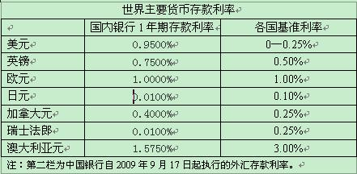
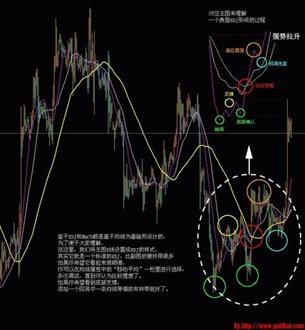

# 美元贬值下的财富机会

# 美元贬值下的财富机会 

## 文/张菲澳 

步入9月，外汇市场终于迎来了方向性的突破。受经济复苏预期和全球股市走高的影响，美元兑一篮子货币呈现了全线下跌的态势，美元指数从月初的78.11震荡走低，一度下探76.19。对于外汇投资者来说，美元贬值究竟意味着一场财富屠杀还是新一轮财富机遇呢？ 

如果你的资产大部分是以美元计价，而收入支出的是非美元资产（即非美货币计价），比如生活在中国的外籍人士，或者拥有外币资产的国内投资者，那你就得当心了。因为美元走软意味着财富蒸发。如果你身在美国，赚美元花美元，那么汇价波动也许不会令你感到头疼。

 **留学旅游大省预算** 有人说弱势美元是美国佬的诡计：用开动印钞机的方法滥发货币，达到稀释外部债务的目的。按此原理，中国学生也可向银行申请美元留学贷款，随美元贬值减轻未来的偿债负担。目前，国内银行均已推出外汇留学贷款产品，即借美元还美元。以当前的利率水平和美元走弱的预期而言，海外留学申请美元贷款比人民币贷款划算不少。 对于有计划前往非美国家留学旅游的朋友，现在借美元买相关货币也是个不错的选择，因为美元走弱的趋势短期很难改变。笔者朋友曹先生本月赴英国曼彻斯特大学深造，在本人的建议下，他早在今年5月初以1英镑兑1.52美元的价格（约合10.38人民币）买入英镑，截止上个月，英镑兑美元已升至1.63一线（相当于1英镑兑换11.2人民币）。半年不到的时间曹先生就省下了超过7%的留学成本。 **套息交易重新风靡** 所谓套息交易，是利用不同货币间的利息差：买入高息货币，卖出低息货币的行为。投资者可获得的收益是利息差和高息货币的升值部分。市场上通常以“零利率”的日元作为融资货币，并买入高息货币如澳元、纽元等。近期的三个月LIBOR利率显示，美元也沦为了廉价的低息货币，这是加剧美元跌势的主要推动力之一。 在现汇市场，具体的操作方法同上述留学贷款基本一致，即借入利息较低的美元，购买利息较高，且有升值潜力的非美货币，如欧元、加拿大元和澳大利亚元等货币。 

国内投资者在进行套息交易时需关注中外资银行的外币存款利率差异。在美元走软的大背景下，日元升值迅猛，但由于两国利率倒挂（日元利率低于美元），最佳的套息组合可能不是美日货币对。而是澳元兑美元。 

 **汇海淘金大赚一票** 鉴于汇市已形成方向性突破走势，不少朋友有意选择以外汇保证金交易的方式进行投资。在此笔者敬告广大投资者，外汇市场瞬息万变，专业度高，且该保证金交易杠杆较大（主流水平为100倍杠杆），投资者必须具备较高的风险承受能力。此外，保证金交易的门槛较高，一般至少为2万美金，约合13.6万人民币，并不适合所有投资者。投资者在选择交易平台时，一定要特别关注代理公司的规范和存管银行的资质。 以上所有操作建议仅供参考，不作为交易依据，投资者须谨慎投资。 

09年9月18日于上海
