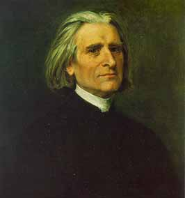
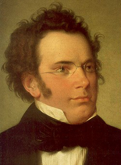
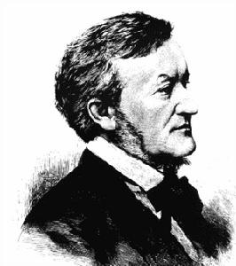
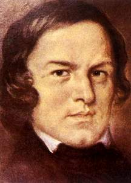

# 北斗电子书推荐——本期主题：伟大的西方作曲家

# 北斗电子书推荐 

## 本期主题：伟大的西方作曲家

**推荐书籍：**

**1、《伟大的西方音乐家传记丛书--李斯特》 2、《伟大的西方音乐家传记丛书--舒伯特》 3、《伟大的西方音乐家传记丛书--瓦格纳》 4、《伟大的西方音乐家传记丛书--舒曼》 5、《伟大的西方音乐家传记丛书--巴赫》 **

**读书成了件奢侈的事情 ** 这期主题的选定，让我想起我一开始与薄然筹划做北斗电子书时，对于推荐什么书毫无头绪。不知道还有几个人记得，第一期北斗电子书推荐是精选了《第一推动力系列丛书》中的五本。丛书就有这么个好处，自成主题，省去了命题的辛苦。至于挑选，那真是小学生都会做的事情。这次选取的都是英国OMNIBUS经典版本，重质重量。 现如今，阅读成了件方便的事，但读书成了件奢侈的事，我自己常每月看掉三五本书，已觉不容易。这是个知识大爆炸的时代，又是个获取知识途径之多元化前无古人的时代。那么古谚“书中自有黄金屋，书中自有颜如玉”中的那个“书”字是否还应该做狭义的解释？这是我时常思考的一个问题。 感谢海飒在我离开的这段时间里继续着这个不起眼的电子书事业，我也深知，很多书即使各位下了，多半也没有时间去读，更何况许多人与我一样，存着一硬盘的电子书却固执的喜爱纸质的触感。不管是为了学业还是事业，不论是为了上半身还是下半身的幸福，总之，留给书籍的时间是越来越少。正如我前段所言，读书成了件奢侈的事情。 有一天，你读着从北斗这下载的电子书，忽然想到，呦，这是从北斗那下的，这就是我花时间做今后每期电子书的动力之所在吧。冯唐易老，所以要用文字打败时间。人的内心终究要留存一种物质之外的信仰，这，可以靠读书来实现。 

**《伟大的西方音乐家传记丛书--李斯特》**

  弗朗兹•李斯特 （Franz Liszt,1811－1886），著名的匈牙利作曲家、钢琴家、指挥家，伟大的浪漫主义大师，是浪漫主义前期最杰出的代表人物之一。他生于匈牙利雷定，六岁起学钢琴，先后是多位钢琴名家的弟子。十六岁定居巴黎。李斯特将钢琴的技巧发展到了无与伦比的程度，极大地丰富了钢琴的表现力，在钢琴上创造了管弦乐的效果，他还首创了背谱演奏法，本人则具有超群的即兴演奏才能，他也因此获得了“钢琴之王”的美称。作曲方面，他主张标题音乐，创造了交响诗体裁，发展了自由转调的手法，为无调性音乐的诞生揭开了序幕，树立了与学院风气、市民风气相对立的浪漫主义原则。 1823年的一场大规模音乐会上，最引人注目的就是少年钢琴家李斯特，他的演奏曲目难度很大，是钢琴大师们才能演奏的曲谱，为他协奏的乐队队员和行家们都称赞“这孩子弹得跟莫扎特一样精彩”，在场的音乐大师梅特涅、罗西尼、贝多芬也都十分赞赏，音乐会结束后声望显赫的贝多芬走上台，双手抱起小李斯特，吻他的前额，对大家说：“这孩子将震惊世界！” **《伟大的西方音乐家传记丛书--舒伯特》 **   现代的艺术家——都市的流浪者，都拥有这样一个漂泊不定的灵魂。他们在繁华拥挤而又孤独寂寞的空间倾吐着无拘无束、绵绵不尽、悲欢交织的诗情，编织着甜美温馨、感伤忧郁的梦幻诗境。 对于舒伯特这样一个伟大的音乐家，人们常常存有误解，往往给他冠以歌曲之父的美名。实际上这样称谓本身就是错误的，并且掩盖了他作为一个杰出的器乐作曲家的形象。舒伯特生活在古典主义向浪漫主义转变的时期，他的交响乐、室内乐、钢琴奏鸣曲继承了古典主义的传统，而他的艺术歌曲和一些钢琴作品却完全是浪漫主义的。 舒伯特在感情的深度、表情的强度、悲剧的广度上都很像贝多芬。但他却反贝多芬的英雄气质以及对自我情感的反思和控制。他具有更多的诗人气质，并且以任性放纵的态度自发地挖掘了情感的所有微妙的生动之处。 舒伯特的一生是早期现代社会艺术家命运的象征——生前穷困潦倒，不受重视，去世极早，却流芳百世。他的音乐充满了青春的美丽、梦幻、忧郁和悲伤；充满了纯粹的理想主义和大自然的庄严。他和他的音乐一起成为了青春的化身，和莫扎特一样似乎为了这一化身命中注定要在青春期夭折。 **《伟大的西方音乐家传记丛书--瓦格纳》**  瓦格纳（Wagner，Wilhelm Richard，1813-1883），德国作曲家、剧作家、指挥家、哲学家。在德国音乐界，自贝多芬后，没有一个作曲家像瓦格纳那样具有宏伟的气魄和巨大的改革精神，他顽强地制定并实施自己的目标与计划，改革歌剧、倡导乐剧，从而奠定了在音乐史上的地位。同时，在世界音乐史上也几乎找不到像瓦格纳那样，在世界观、创作之间存在明显矛盾的音乐家。 据说希特勒曾叫人在拜罗伊特为他专门演出瓦格纳的作品，当时他感动得流泪，恨不得与这位上个世纪的天才执手亲谈。很多人在听瓦格纳音乐的同时要提到他的思想，无可否认音乐家本身的性格与思想对其创作作品有着很大的影响。瓦格纳的青年时期，其思想主要倾向于“德意志”，他受到费尔巴哈和巴枯宁的影响，写过许多狂热激进的文章，甚至参加过德累斯顿的革命。1848年欧洲资产阶级革命失败以后，瓦格纳逐渐接受了叔本华的悲观主义论调以及尼采的超人论等思想，以及后来戈比诺（Arthur de Gobineau)的雅利安种族主义理论，晚年的时候，瓦格纳也受到宗教神秘思想的影响。瓦格纳与尼采曾是关系很好的朋友，他们的友谊维持了十年，当瓦格纳改变其音乐风格之后，尼采与他决裂，称他是一个狡猾的人，称听他的音乐使人致疯。1878年1月3日，瓦格纳将《帕西法尔》赠送给尼采，尼采写了最后一封信给瓦格纳，并回赠自己的新书《人性，太人性的》，1888年，尼采写作《瓦格纳事件》和《尼采对瓦格纳》正式的表述出自己对这位昔日好友的看法。 值得一提的是，以色列一直因为瓦格纳的反犹太主义思想以及纳粹的原因，一直有一非正式的禁令，以色列国内从不上演瓦格纳的作品，不过这些年来稍有松动。 **《伟大的西方音乐家传记丛书--舒曼》**   1810年6月8日－1856年7月29日）德国作曲家、钢琴家，浪漫主义音乐成熟时期代表人物之一。舒曼生性热情敏感，富有民主主义思想。夫人克拉拉也是著名钢琴家。著名的作曲家勃拉姆斯受其帮助提携。 舒曼是浪漫主义音乐成熟时期的代表之一，他生性感情敏感，并且有民主主义思想。1834年他创办了《新音乐杂志》,对改变当时陈腐的音乐空气，促进浪漫艺术的发展，起了重要的作用。他关心和支持尚未为人所知的音乐家，如：肖邦、柏辽兹、李斯特、勃拉姆斯、瓦格纳等。1838年由于维也纳反动当局发现了他介绍舒怕特的《C大调交响曲》 ，迫使他无法工作，他遂于1839年回莱比锡。 1840年与当时有名的钢琴家克拉拉的结合，一直被人传为美谈，并促使他的创作热情空前高涨，结婚的一年间共写了138首歌曲，被称为“歌曲文萃”。1843年他在莱比锡音乐学院任教，1856年因患精神病逝世。 **《伟大的西方音乐家传记丛书--巴赫》 **   约翰•塞巴斯蒂安•巴赫（1685～1750），德国作曲家，是将西欧不同民族的音乐风格浑然溶为一体的开山大师。他萃集意大利、法国和德国传统音乐中的精华，曲尽其妙，珠联璧合，天衣无缝，对后来将近三百年整个德国音乐文化及至世界音乐文化产生了深远的影响。 直到1892年，当年轻的门德尔松在柏林首次上演沉睡将近一百年的《马太受难曲》之后，巴赫的艺术价值才被人更多地了解。瓦格纳曾说，巴赫是德国人民在完全黯淡的悲惨世纪中内在精神生活的记载。从德国的历史上看，新教圣咏（Chorale）在德国民歌中占有特殊的地位。而巴赫音乐就是通过新教圣咏将他的作品与德国民族文化结合在一起的。值得一提的是，巴赫曾写过不少世俗康塔塔。在他的《农民康塔塔》中，作品全部采用了民间舞曲及流行的民歌。这是了解巴赫不可缺少的一面。从某种意义上说，在巴赫的音乐中，跳动着的正是德国人民的脉搏，这也正是巴赫音乐的灵魂所在。 巴赫一生的主要功绩：第一，把音乐从宗教附属品的位置上解放了出来，使之平民化。音乐不总是歌颂上帝，也歌唱平凡的生命。 第二，他把复调音乐发展成主调音乐，大大丰富了音乐的表现力。 第三，他确立了键盘乐器十二平均律原则。 第四，除了声乐作品外，巴赫奠定了现代西洋音乐几乎所有作品样式的体例基础。因此巴赫被后世尊称为“西方音乐之父”。
