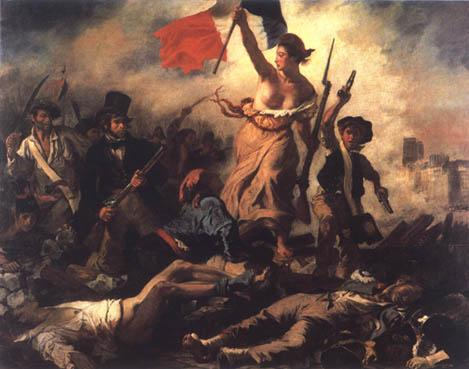
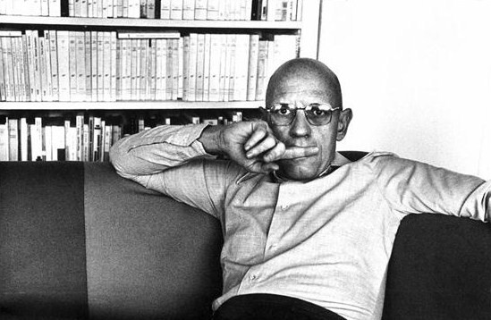

# 虚拟人类之存在及其自由

**“日本杰出的福柯研究学者樱井哲夫在他的《福柯：权力与意识》的末尾写道：……福柯提示给人们的是，思考与追寻自己的生存方式，人生道路是与解释世界的道理联系在一起的信念。无论怎样的学问研究，实际上都是从每个人对对内心的探求开始的。鼓足勇气踏入自己的内心世界，一切就从这里开始。”** ** **

# 虚拟人类之存在及其自由

## 文/云峰 （厦门大学）

我为何痛苦？ 为什么，人不能真正相亲相爱？为什么，男人间的爱，女人间的爱，男女间的爱，多种多样的爱，得不到宽容和允许？为什么，人们不能相互理解？为什么，千言万语也难以慰籍这强烈地孤独感？为什么，人是不自由的？ “如果与一个男人的性爱使我感到快乐，为什么要拒绝这种快乐？我们拥有权力，我们不应该放弃”（福柯语）。为什么？我们是自由的吗？难道是有什么权力在禁锢我们吗？我们为何不能打破和摆脱呢？ 福柯在苦苦地问，苦苦地答。福柯的书，并不难读。如果我们是对自己的苦恼和痛苦报以认真思考的态度的人，我们就容易进入他的世界。福柯的思想之所以看似难以理解，是因为有人想置福柯于精英的围墙之中。这也几乎是所以伟大先知者的共同命运，诸如马克思，尼采，陀思托耶夫斯基等人被别有用心地扭曲和利用，正道出了思想者们所无法避免的最悲哀之宿命。专家们意图玩弄特殊的隐语来满足他们的优越感。 一旦“人类”产生，即意味着某种专门的人之属性的被“制造”出来，所谓的人类社会也就被赋予了某种独立于自然的本质或超出自然界的涵义。是否人之不自由是从人被纳入所谓的人类社会开始的？经典观点认为人是社会属性和自然属性的结合体，且前者决定后者，占主导地位，对人具有支配性的影响。这种社会属性为何会存在？ 哈耶克在分析社会秩序（韦森称之为“制序”，即“制度+秩序”）形成过程时，提出了如下模式：个人习惯→群体习俗→惯例→制度化。他强调社会秩序绝不是建构而来的，那种建构主义的工具理性是无法“制造”出一个人类社会，更无法“制造”出现存的社会秩序。“人的理性又是文明和文化演进的结果，即理性本身就是在这一演进过程中被构造出来的”。他还说道，“任何个人试图凭借理性而成功地建构出比经由社会逐渐演化出来的规则更具效力的规则，都是不可能的”。这便是以哈耶克为代表的“奥地利学派”的“演进理性主义”观点。 既然所谓的人类社会以及其所衍生的秩序都不是人之理性可以驾驭的，而且人的各个方面均受演进而生的哈耶克所言的“人之合作的扩展秩序”，这种自生自发的秩序（制序）是在人与人的交往中所产生的，在基于双方共同利益与需求的条件下，经过自约定到共识、风俗、惯例再到法律最终到制度的漫长过程。这就是说，这种社会秩序并不是被强加规定的，而是由人与人之经过漫长的讨价还价的交易过程而来的。那么，权力自何而来？我们的不自由又自何来呢？ 是否这种自生自发的“人之合作的扩展秩序”其本身即包含了权力之出现的必然宿命？ 经典理论认为，从有剩余产品出现开始，压迫就出现了。而自由呢？或许从人与人结成氏族开始，即标志着个体自由的丧失？或者，更进一步，从与他人的合作（为了满足基本的欲求）开始，自由的丧失就已经产生了？是否任何一种规则的出现，都是以参与制定此规则的人之自由的丧失为基本前提的？规则本身是否就包含了某种权力的性质呢？即使这种规则是由势均力敌的多方通过交易协定产生的，甚至他们都拥有纯粹意义上相等的影响力，那么我们是否可以说：这种规则中的每一方都是自由的呢？ 或许，规则本身就是不自由的结果，而作为人与人扩展秩序而衍生的社会，其本身就是不自由的必然结果。 

国家作为人类历史上最主要的社会机器一直是社会以及其秩序最核心的部分。即使在中世纪的欧洲，教会对国家的约束与争斗也不可能有国家那样的渗透力，一般来说，大多数国家都是将宗教思想体制化或合法化，从而反过来控制教会和宗教。同时教会作为权力与土地的必然追逐者，其更明白国家机器的不可替代性。况且后来随着世俗君主权力的强化特别是市民阶层的兴起，宗教改革更是使教会完全失去了与国家机器对抗的机会。古代中国更是将其发挥到极致，几乎一切思想都被意识形态化了。 阿尔都塞在他最伟大的作品《意识形态和国家的意识形态机器——探求手记》中论述道，除作为自古以来就有的压制机器的国家机器以外，资本主义国家里还有从孩提时代就开始训练说话、思考方法、行动方法的学校制度为主轴，在家族、政党、宗教、媒体、组织等领域也作为使人民能自发服从的“国家意识形态机器”而发挥着作用。接着他睿智地察觉到，因为受到马克思的“意识形态里没有历史”和弗洛伊德的“潜意识不拥有历史“的影响，所以意识形态被潜意识化，无论是谁从表面上看都只认为没有受到意识形态的约束。更进一步，他还指出，在中世纪时期，“教会-家族”这种组合支配着人们，但是现在，是“学校-家庭”这种组合支配着人们。也就是说，家庭和学校“勾结”起来，使人们自发服从体制。 福柯曾说，“国家秩序，已不再容忍心灵的无秩序（精神障碍）”。心灵的秩序性即意味着标准化的被定义，人之自由由此必将丧失。 福柯在阿尔都塞的基础上，进行了更深邃和精辟独到的思考，随后在他最具代表性作品的《监视和处罚——监狱的诞生》中，对权力与刑罚的起源及其近代化进行了深刻的剖析和概括。 从“标准化身体”这一概念出发，福柯认为正是“标准化”权力的扩大使监狱成为失败的历史，不仅仅是面对犯罪者，不良行为的法官，从大学教授到医生，教育者，社会福利机构的工作人员都把自己作为进行判决的人（judge），努力使工作、行为、姿态与“符合标准的东西”相一致。这些支撑着现代社会的监禁体系。也正是这种“规范化=规则化”的、用以决定什么是正常，什么是异常的权力使这一判决体系得以空前膨胀与渗透，社会中的每个人都成为“服从的主体”，而这种权力对身体的管理技术发展到现代，即使监管者不在犯人也会服从规则成为可能，此即福柯所言的权力的自动化，非个人化。 “劳动是形成秩序的与规则正确性的原则，发挥则让人们懂得权力的尊严的作用。“劳动对于现代人来说是神的旨意”。福柯如是说。 现代社会是如何破坏人与人之情谊?的是如何消灭生活的礼仪和生之美好的？是如何侵入并统治人的内心世界的？为什么，我们认为每天去上学，上班是天经地义的？当我们去学校，去公司时没有感觉是在服从什么；但是当我们感到逃课，旷工是罪恶时，也许那“权力（监视）之眼“被移植至我们心中，并且在规制着我们的意识与行动。或者说，这种监督或管理的执行者不再是具体的法官或其他的个人主体，而这一切已经自动化，成为某种社会性的默契。一种习惯、惯例、习俗、规则、制度、体制随之降临，“人类”最大的悲剧出现了。 福柯以他强大的概括与洞察力，指出：解释则意味着启示与救济。他又援引加尔西亚（历史学家）的名言：从这个时代开始，健康是可以救济的。 于是，“标准化身体”的产生与“身体管理”几乎同时出现了。身体作为权力的对象，作为靶子被发现了；或者，人距离自我发现越来越远了。福柯认为正是这种对身体的细致管理，要求温顺有用身体的管理方法，才是应该叫做“监督”的方法。随着这种权力对身体无处不在的“监督”或“管理”，福柯引入了他最为卓越的创见，即学校，医院，工厂是权力最为盛行或肆虐的社会存在；而权力则是其秩序之基础。日常生活中的权力，某种无意识的构造，以一种牧羊人体系的方式支配着“人类”社会。 

在《词与物》（又译《言与文》）中，福柯认为，先是亚当·斯密和大卫·李嘉图使劳动成为价值的尺度，并因此通过直线上的因果关系来审视经济的历史。从此出发，福柯提出了“新人类”概念，也就是说，所谓“经济人”即为在资源稀缺性情况下，为了以劳动克服资源匮乏，将“死期”到来的日子暂时性延缓，并为此耗费一生的存在。换句话说，人类只不过是有限的存在。 从另一个角度来看，在经济学中，“时间”从以贫困走向富有的个体劳动时间，而演化为所投资本及由此得到运作的生产体制的时间。从个人到体制，个体的丧失，人之被“虚拟化”或“异化”，我们这个所谓文明现代的种群一次次愚弄和作贱了自我。“如果你想得到，就工作吧“，这种声音已经响彻世界。 在这部伟大的奇书中，福还探索了语言的形式化及其解释。他以为。语言并非为表现人类主体的意志与力量，也对与事物的认识无关，而是人类追求自由的结果，随着规定各种语言间类缘关系体系的新方法自然而然的产生，语言丧失了“语言本身即为知识的构造“这曾经拥有过的中心地位，从而走向形式化（记号理论学）和批判性的解释（批评）。这种丧失难道不可以推断为人类不自由的起源吗？进而，福柯认为，语言作为一种历史性产物的客观存在其所具有的形式上的结构性，在形态上又无不是基于历史上约定俗成的诸事项，因此，人类是从根本上讲，一直都受到由语言而生的某种意识形态的支配。 萨丕尔－沃尔夫假设（SapirWhorfHypothesis）认为：“语言的内面是思维模式”。到底是我们支配语言，还是我们为语言所支配呢？我们对世界的认识和理解，是否完完全全都受到语言的限制甚至玩弄呢？ 最后，福柯以惊天动地之势写道：“八世纪末以前，本不存在真正意义上的“人类”……那是因为在不足两百年以前，知识（学问体系）才被造物主亲手炮制出来。”他认为，在自然秩序中，人类是受环境，生产力及语言制约的有限存在，“近代人类”被规定为有血有肉，勤勉耐劳，具备语言能力的现实存在，正是表现为有限性的一种客观存在。福柯又分析了“规范”，“规则”，“系统”这些概念，论述了诸如礼仪与规则，以及“那种无意识的，某民族社会特有的，为维持秩序的记号体系及神话分析”，再次说明，沿用至今的“人类”这一概念，并没有很古老的历史，它只不过是最近才被发明的。因此，也仅仅处于能够感知其可能性的程度，以至于如若由某个事件直接导致知识（学问体系）基本构造发生改变的事态发生，那么人类就会象画在沙滩上的面孔一样，顷刻间被冲刷殆尽。 某些“无意识的构造”使人类这一概念被虚拟化了，“人类”，不过是人类这种存在制造出的机械与制度。福柯如是说。这种达尔文《物种起源》式的结论让现代人大受打击。“人类”，你究竟是什么呢，人类，你存在吗？既然连“人类”这一概念都存在着虚拟的可能性，那么，人之自由，是不是很可笑的事情了呢？既然连所谓的自由之“主体”都不存在，人之自由，是否也是虚拟的玩笑呢？ 弗洛伊德在“图腾与塔布（禁忌）”“性爱与文明”“文明及其不满”的论述中，自觉或不自觉地始终向世人强调着自马克思开始的“异化”观念，概括起来，或许可以称之为“文明即压抑”。压抑是道德的同义词，是文明的本质，是权力关系的天然属性。福柯认为，权力即是许多种社会意识形态和社会关系，权力（关系）在哪里都会发生。那种经典马克思主义所谓的推翻了作为“压迫者与剥削者”的资产阶级后，作为“被压迫者与被剥削者”的无产阶级即可获得自由与新生，压迫与剥削也会消失，“人类”社会也将进入一个没有剥削的、没有压迫的、自由的、以劳动为光荣的理想社会思想（意识形态）是值得再度反省的。 难道被压迫阶级内部就不会存在权力之压迫吗？一切革命不过是将这种压迫与剥削从“对立”的两个阶级之间转移到一个阶级（无产阶级或资产阶级）内部了，而且这种“一个阶级”的状态也将很快被打破，新的权力关系的发生与膨胀使得新的“两个阶级”的状态出现了，即一切又回到了最初的“对立阶级”之“压迫与剥削”的状态。历史或所谓的文明真的就因为这样的革命而得到进步与发展吗？ 自由，“虚拟”人类之自由通过推翻“牧羊人体系”及“日常生活中的‘权力’”就能变成实在（也许真的是存在的）吗？萨特说，他人就是地狱，其实，自己便是对自身最大的地狱，或是地狱最底层。什么时候，人类可以摆脱某种“对评价的欲望”，从而彻底免去自己对自身的约束与压迫？什么时候，“人类”之被定义，被命名，被统计，被分类，被测试，被判断等等真的可以消失？“人类”能够摆脱某种“无意识的构造”吗？人以及人之自由，难道真的是不可知的乌托邦吗？ 日本杰出的福柯研究学者樱井哲夫在他的《福柯：权力与意识》的末尾写道：……福柯提示给人们的是，思考与追寻自己的生存方式，人生道路是与解释世界的道理联系在一起的信念。无论怎样的学问研究，实际上都是从每个人对对内心的探求开始的。鼓足勇气踏入自己的内心世界，一切就从这里开始。 存在即战斗；真理即自由。 **参考书目：** 樱井哲夫（日本）——《福柯：知识与权力》 福柯——《疯癫与文明》 福柯——《监视和处罚——监狱的诞生》 邓正来——《规则秩序无知》 弗洛伊德——《性爱与文明》 弗洛伊德——《文明及其不满》 奥尔森——《权力与繁荣》 尼采——《查拉斯图拉如是说》 韦森——《社会制序的经济学分析导论》 维根特斯坦——《逻辑哲学导论》 卡夫卡——《卡夫卡集》 许章润——《宪法和帐单》
