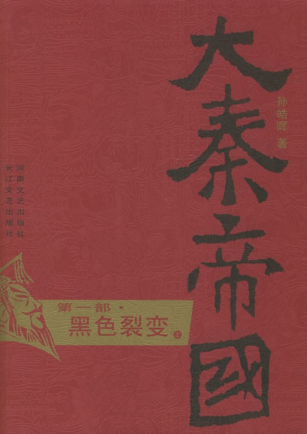
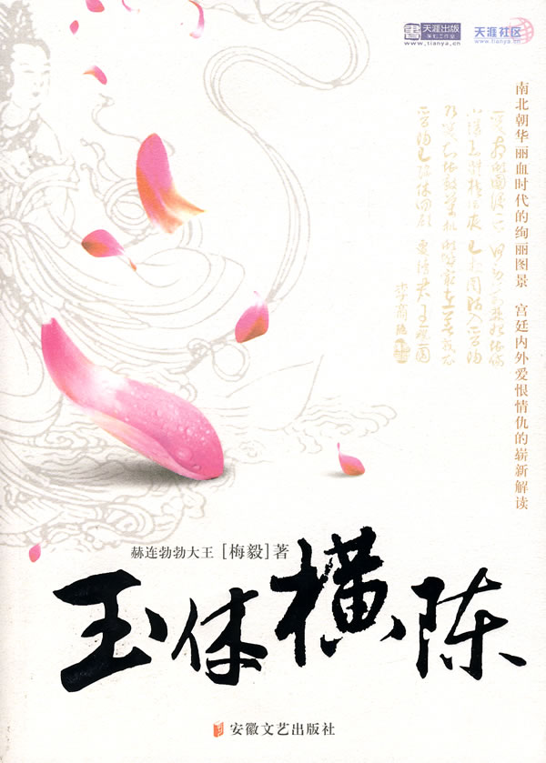
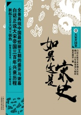

# 北斗电子书推荐

# 北斗电子书推荐

## 本期主题：历史小说的精彩纷呈

**历史始终是一个令人激动、让人向往的话题，它有着太多的故事与秘密。近年来兴起的历史热更是捧红众多学者，畅销起来的历史类书籍更是一波接着一波。冷板凳坐了多年的“历史”终于回到了大众热情的怀抱，可是这股热情到底能持续多久呢？ 小说，作为文学体裁中最有趣的一种表现方式。始终深讨众多读者的欢心。而当历史以小说的方式展现出来时，其独有的韵味更是吸引了无数眼球。** **在史海中体味阅读的快感，在小说中感受历史的厚重。** **本期电子书为大家带来几本历史小说的优秀之作，欢迎大家去论坛参与话题讨论。**

### 推荐书目：

1.《大秦帝国》

2.《玉体横陈》

3.《如果这是宋史》

### 撰稿人推荐书目：

《明》

### 推荐书籍：

** ** **1.《大秦帝国》** ** **

** ** 大秦帝国作为时代精神汇集的帝国，集中地体现了那个时代中华民族的强势生存精神。中华民族的整个文明体系其所以能够绵延如大河奔涌，秦帝国时代开创奠定的强势生存传统起了决定性的作用。 《大秦帝国》是一部描述秦兴亡生灭过程的长卷历史小说。秦帝国崛起于铁血竞争的群雄列强之际，建立了一个强大统一的帝国，开创了一个全新的铁器文明。但她只有十五年生命，像流星一闪，轰鸣而逝。这巨大的历史落差与戏剧性的帝国命运中，隐藏了难以计数的神奇故事以及伟人名士的悲欢离合。他们以或纤细、或壮美、或正气、或邪恶、或英雄、或平庸的个人命运奏成了这部历史交响乐。帝国所编织的社会文明框架及其所凝聚的文化传统，今天仍然规范着我们的生活，构成了中华民族的巨大精神支柱。 作者孙皓晖，2008年4月，历时16年创作的长篇历史小说《大秦帝国》全套在河南文艺出版社出版，共6部11卷，504万字。这是目前唯一全面、正面表现秦帝国时代的长篇历史小说。 **2.《玉体横陈》** ** **

****

** ** “历史写作狂人” 赫连勃勃大王以出人意料的“新感觉主义”的历史大手笔，生动无比地描绘了南北朝北齐国家那个梦幻般的、遥远的、艳丽绝伦而又血腥十足的疯狂时代。这是一部改变我们传统观念的新历史小说，无论是技巧还是语言，都会让人耳目一新。小说中，作家通过展现那么多“我”的华丽碎片，架构了南北朝华丽血时代的绚丽图景。娓娓道来的此多的“我”，以令人信服的“亲眼”所见，给人们展示了北齐国家波澜壮阔时代的帝王、后妃、军将、僧侣、平民等各色人等的生活侧面。读者在恍惚的沉迷中，陷入他笔下南北朝时代无数个鲜活的人生，或奇妙，或庸俗，或壮丽，或悲凄……赫连勃勃大王那处心积虑又巧夺天工的文学设计与叙述，总是让人处于不知疲倦的兴奋期待中，小说还为我们留下了无尽的悬念与思虑。 作者赫连勃勃大王（梅毅），男，籍贯天津，现居深圳。作家，翻译家。硕土毕业后，一直在深圳从事金融工作。著有《生命的伤口》、《赫尔辛基的逃亡》、《另类情感》、《表层》等多部中篇小说，并有“伪青春三步曲”——《南方的日光机场》、《失重岁月》、《城市碎片》等三部长篇小说出版(中国青年出版社等)，获国家、省、市等多项文学奖项。并出版有长篇社会学译著《人类行为》(中国社科出版社)。最近，出版奄长篇历史散文集《隐蔽的历史》(中国社会出版社)、《历史的人性》(当代世界出版社)等。 **3.《如果这是宋史》** ** **

****

** ** 白话正说全本宋朝大历史，揭示三百年的沧桑与疑问。 全景再现中国最绚丽王朝的盛开与谢幕，白话正说大宋帝国三百年兴衰历程，掀起2008大炑王趄热《如果这是宋史》——已经打开的全新宋史。 从远古流传至今的历史，本就是真假掺半的。也许就任那些古老优雅的繁体字刚刚组合成官方史书时，它们就已经是些谎言。为了皇权的尊严，为了统治的需要，或者儒家所说的（为尊者讳，为贤者隐），历代写史的人，把曾经的真相，隐藏任明暗交界的角落里，千年之后，只剩下了（如果）……尤其是宋史。宋朝盛产太多的（君子），随时定性别人是小人，无耻到根据需要篡改事实，甚至人身攻击……一切都太不可信了。更何况，我还要在此基础上，添加一些我个人的所谓发现和见解。所以，只能叫这个名字了。 作者高云流水，沈阳人，自由职业者，曾出版小说《潘多拉界面》、《血罂粟》。 

### 北斗撰稿人推荐

**本期为大家推荐图书的是撰稿人李伯凯。** **《明》之感叹** “兴，百姓苦，亡，百姓苦。”开篇一曲山坡羊，道出华夏百姓千年的心酸以及华夏社会的乱世循环。元朝末年，草莽英雄朱元璋，带领无数豪杰，经过多年的恶战，终于把蒙古人赶到了燕山以北，并建立明朝。似乎天下统一了，太平的日子也来了。 然而这会不会又是一个循环呢？21世纪的武安国的到来，到底会给这个世界带来什么呢?小说的作者并没有给出答案，他给出的，只是一个故事。 和大多数穿越比较夸张，人物比较无敌，古人比较白痴，情节比较YY的网络穿越小说不同。感觉《明》的风格比较平实，或者说，这篇小说有些煽情，有些人性；还有些让人感动并引人思考的地方。作者是酒徒，理工科出身。所以，这篇小说的主人公，也被设定成了一个年轻的学机械的工程师。 和其他穿越小说的主角不同，武安国并不是一个很有野心的家伙。他只是一个和善，乐于助人，重感情的并有些武艺的大块头。来到古代，他并没有想着要依靠现代知识成为天下至尊或者说进行什么民主变革。他所做的，都是一件件的小事，比如改进些机械，使大家做活不是那么辛苦，教几个蒙童，告诉他们真实的世界是什么样子，仅仅而已。 但作者并不是在写田园之乐，所以，武安国的故事，也很自然的开始了他不平凡的人生。面对着自己造出来的威力强大的火炮和火铳，武安国不知是福还是祸。21世纪非洲独裁者用机枪扫射反对派的影像一直在他脑中挥之不去。新式军队的创立，很可能使皇权的统治更加坚固。 “我听说过狼吃羊，从来没听说过狼吃狼，很多时候公平与否关键在于强弱之势是否均衡”借部将李陵之口，作者对小说的结尾做出了开放式的预言。 武安国一手创造了他心目中的北平工商阶层，尽管这个阶层无论实在影响力上还是在本身硬实力上，都显得微不足道。 而面对着已经被改变的大明帝国，武安国只有懵懵懂懂的走下去，用他在现代社会养成的一些习惯和思想，去影响着周围的朋友。随着小说情节发展，武安国的角色开始淡化，更多的配角开始走向读者的视野。他们或多或少都见识过甚至接触过武安国的思想。并与他们固有的思想进行了融合。这个阶段是小说的主体部分，大部分的故事情节都是产生于这个阶段。 这个阶段我也许应该称之为“武安国和他的伙伴们的英雄史诗”。故事情节继续发展，但已经明显脱离的原来的历史轨道。征蒙古伐高丽战争顺利结束，靖海之战也打压下了猖獗的倭寇。但与此同时，整个大明也在从内部开始这蜕变。 北平工商业在海洋贸易的刺激下迅猛发展，工商阶级开始摆脱对武安国的依赖，自己寻求可依赖的政治力量。对外探索的船队也被一拨又一拨的放出。大明新军用火铳给国库带来了充足的银子，货币系统的改革连同北平股市的改组在一场金融危机后，开始由商人主持实施。由武安国创办的北平书院，也慢慢成为大明基层领导力量的培养基地。 不过最吸引人的还是那些个小说角色的故事，他们的战斗，他们的妥协，以及，他们的选择。他们的所作所为，似乎处处让人感觉到人性化的色彩。 作者的文字很朴实，似乎没有任何感情的冲动，但读到精彩之处却又忍不住为之感慨。比如在平定云南的时候，斥候将军王飞雨以负伤之身独自狂追蒙古主帅百里，终将其斩于刀下，为死难的弟兄报仇。但回城后，看到激愤的明军将士准备屠杀全城蒙古百姓时，他又劫持自家主帅，要求放人。“我们都是长生天的孩子”在蒙古百姓被释放后，王飞雨的生命也走到了尽头。还有就是奸商李陵跳进黄河时，对蒙古主将轻描淡写说的那句话“我们大明的商人什么都敢卖，就是不敢卖自己的国家。”没有朝廷，没有皇帝，有的只是自己的家园，自己的国家。 小说主体部分描写的另一个重点，就是虚构的明王朝人们思想的变化了。小说中有很多有意思的片段，挺能让人回味。比如北平新儒学代表伯辰与南儒理学代表白正的君子之争。争论一开始，便引出“我不同意你的观点，但我誓死捍卫你说话的权利”的概念。二人在北平报纸上的理论观念交锋，其实也正代表着当时大明朝两股势力的对抗。北平新兴的工商业阶层与南方的官僚阶层。 对《明》的整体感觉就是，很自然，很理性。一个现代人的到来，给明朝带来了较为先进的机械，并无意识的培养出了工商业阶层。虽然这个阶层在开始的时候很弱小，但在主角和他的朋友们的努力下，一天天的变得强大。而他们的理念，也一天天的成熟、大胆，并被越来越多的人接受。可见，每次社会的变革，都需要一个新兴的阶层作为推动力啊。没有新兴的阶层，变革始终是修修补补，换汤不管药。 最后的结尾很有意思。在驱逐了建文之后，各路诸侯汇聚一堂，共商国是，约定大明朝是否保留皇位，皇帝到底有多大权力，都要在旧的一年年底，由国事会投票表决。而这时候的武安国，却是在悠闲的钓鱼。 “如果他们一致希望燕王当皇帝，恢复原来的制度，你就一点也不在乎？”白正的疑问显然道出大家的心声。 “那就让燕王当呗，反正是大伙的选择。”武安国笑嘻嘻的回答让人吐血。是啊，是百姓们自己的选择，而不是我们这帮所谓的精英替他们选择。这或许才是“民主”吧。我们没有权利选择我们所认为的那种“优越的制度”。而是百姓们共同的选择。可以吵，可以闹，甚至可以用鞋扔对方，然后，大家在各自妥协，制定出共同的规则。毕竟，用鞋子臭鸡蛋互相砍总好多白刀子进红刀子出。 “‘手执钢刀九十九，杀尽胡儿方罢手，我是汉家好儿郎，不给鞑子做马牛’。赶走了蒙古主子，却有多了一个汉族主子，这不是当年唱着烧饼歌走向战场的热血男儿们的梦想。这样一个以一人为君，天下人为奴隶的时代早该结束了。自从蒙古人被驱逐的那一刻起就该结束了。”或许这段原文，能很好的概括这篇小说的主旨吧。 本期电子书的下载地址为： [http://bbs.ibeidou.org/viewthread.php?tid=799&page=1&extra](http://bbs.ibeidou.org/viewthread.php?tid=799&page=1&extra)=
