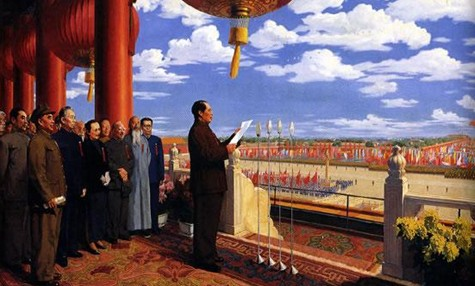
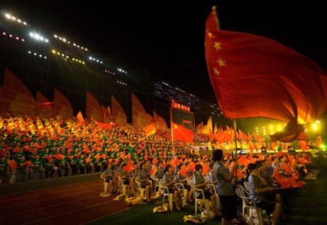
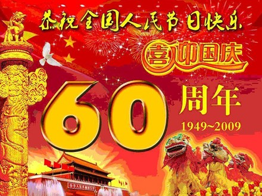

# 我们为什么要庆祝这个节日？

# 我们为什么要庆祝这个节日？

## 文/迦南

前几日查万年历，发现49年10月1日竟是个甲子日。这让我对开国诸领袖的印象又有了些改变，我本不曾想过，他们会挑选一个于传统中国有特殊意义的日子作为开国之日。 

甲子为干支中第一序位，是一个新纪元的开始，总使人萌生一切从新之意。无怪乎李慎之先生要为胡风那一句“时间开始了”的神来之笔而倾倒。 是啊，时间开始了。于国人而言，谁不愿抛弃过去，谋求一个新的开始。自英舰叩关以来，何等屈辱我国人不曾尝过？百姓一年到头求神拜佛，求的只是个平安，若能存一尺之地以容身，得一瓢之糠以果腹，谁愿提枪上阵，洒血抛颅？无论改良也好，革命也罢，终究是几个仁人的孤唱。殉道者虽终是少数，却不能因此否定天下人的思变之心。梁实秋先生一句话道了出来——“不满于现状”，_这算不得什么稀罕事，尤其是现在的中国，恐怕除了已经获到权势名利的“脸皮欠厚，心地欠厚”的少数人以外，没人能“满于现状”罢……在如今的中国，而能“满于现状”，这个人一定没有感觉，没有知识，没有良心。 _

思变，思变。思变之人十室有五，但晓得求变之法的，终还是少数人，而求变之法，却又千种万种。30年改革是“摸着石头过河”，而清末民初之中国，各种思潮涌动，各行其道，恐怕是连石头也摸不着。 时处三千年未有之大变局的先人们，怀揣不同主义，奔向共同的理想，那便是要我中华强。终于到了49年，我们扫清了一切障碍，终可以不受羁绊，跨步走在强国之路上了。这确是值得普天同庆的喜事。 结束了纷扰，废除了条约，抛弃了耻辱，从那一刻起，时间开始了。 一晃一甲子过去了。又是一年国庆日，当我们回头重新审视这六十个春秋，总要思索有何可喜，缘何而庆。 六十年后的今日，我国人不再颠沛流离，食可果腹，室可容身，是为可喜。 六十年后的今日，世上无人再敢小觑我国家，此为可庆。 六十年前的那句豪言依然掷地有声——“中国人民从此站起来了！” 这便是这段历史的结果，但真正钟情历史的人，不会仅仅关注这结果，他们还要窥探这段历史的过程。 

 1979年9月14日，北京大学党委召开会议，为马寅初彻底平反，恢复名誉。马老在轮椅上听了为他平反的通知，只道了一句：“二十年前中国的人口并不多，现在太多了，你们不要再误事了。” 二十年前，在普天盖地的大字报中，马寅初如堂吉诃德一般冲向了那荒谬的风车——“我虽年近八十，明知寡不敌众，自当单枪匹马出来应战，直到战死为止，决不向专以力压服，不以理说服的那种批判者们投降!” 这便是中国最出色的知识分子，不为穷人说话，不为富人说话，只为自己的专业知识说话。 马老曾言：“几十年以后，事实会说明我是对的。”这句话令我很自然地想起了卡斯特罗的那句名言：“历史将宣判我无罪。” 诚然，历史终归会还人清白，只可惜，历史不会将那错过的二十年还给我们。 在意识形态纷争所铸成的错误中，马老的遭遇仅是众多不幸中的一例。 我们无法统计，在那个年代，有多少优秀的人才含恨在荒芜的土地上劳改，其中的又有多少人，永远没有机会听到共和国那一声迟来的道歉。 更无法估量的是，这些人，原可为国家创造多少价值。 建国后，同是由于意识形态的纷争，英美法研究在我国被人为地中断了，直到入世前后，才重又引起足够的重视。然而，那些昔日东吴大学的英美法学菁英们，在被抛弃了几十年之后，早已弱冠变白头。即便如此，他们仍聚在一起，希望为国家填补上这个空白。 他们固然是值得尊敬的。但我们不可能指望所有人都如这些老人一般，在遭遇了巨大的不公之后，仍怀有为国奉献的热情。毕竟，国家的存在意义，便是要保护它的公民，若不能做到这一点，便不要指望公民能对它产生莫名的爱。 我们浪费了三十年的时间，去巩固我们的意识形态，去打压那些异见者，而凤阳小岗村18户农民的一纸生死契约便将这三十年的无谓付出羞辱得一文不值。我们花了三十年的时间，去明白一个道理，那便是一个开放的社会，才是阻止上述不幸发生的良方。 “为个人争人格，便是为国家争人格。”此话早有人说过，可是我们花了太长的时间才真正理解了这句话。 

 一个健全的现代国家，不需要克里斯马型领袖，只需要健全的法制和健全的公民。一个健全的国家，当人们谈及那些不言自明的真理时，不需要付出任何代价。 若要简单地概括这六十年的成就，那便是：前三十年，我们的国家崛起，后三十年，我们的国民崛起。前三十年，在集权的力量下，我们完成了工业化，后三十年，在改革的影响下，我们的公民意识萌发。 这便是今天我们所要庆祝的一切。 百余年之前，中国第一批留学生出洋求学，这些青年带回了科学与主义。百余年之后，我们这一代青年要在这个开放的时代，学做一个合格的公民，并建设起我们的公民社会。让强大不仅属于国家，也属于我们每个人。 这将是一个青年们发出自由声音的国家，这将是一个青年们摒弃意识形态的分歧，共同创造价值的国家。在这个国家里，我们的才能、知识和美好的年华将转化成滚滚财富。千人一面的时代正在慢慢远去，无论那整齐划一、令行禁止的口号和秩序令多少人难舍，它终究要离去了。在它身后，是一个个性张扬的时代。 在中国人民站起来了之后，还要让每一个中国人也站起来。 若干年后，当我们由子女搀扶着走在这片土地上时，我们总要笑着说道：“这是一个人民共和国，这也是‘我的’共和国。” 那时世上不仅无人小觑我国家，亦无人小觑我国民。那方是真正的强大。 我们今日载歌载舞，穿上节日的盛装。因为我们深知，这个美好的共和国，凝聚着父辈和我们的努力。 

迦南作于09年10月1日凌晨
