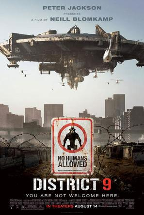

# 第九区：全人类的身份焦虑

# 第九区：全人类的身份焦虑 

## 北京大学学生

第九区，一部乍看起来一目了然的电影。影片开场似曾相识的贫民窟，形容丑陋肮脏的外星人，人权团体挥舞着牌子抗议对“难民”的强制安置的镜头，无一不暗示着一点：这是一部对当代人类困境进行放大乃至反思的电影。 我刚来美国的时候，就从好几个不同渠道听到了同一个故事：一群索马里难民被美国政府解救出来，安置到我们这个当时几乎是纯白人的富庶地区。开始人民表示接受，毕竟媒体宣传这是体现美国人民崇高社会道德价值的时候，每一个支持接收难民的公民都在道德上变得伟大，受到其他人的崇敬。但是后来问题接踵而至：曾经遍地都是的松鼠兔子变少了，偶尔你会找不到自家的狗了，街上开始出现闲晃的黑人，这些影响到了每一个人的生活。于是，索马里难民被强制搬迁到三幢专门为他们而建的高楼中，附近社区加派警察巡逻。他们被“隔离”了。这就是"show nice"的真相，人们的想法是有迹可循的：nice只不过是在自己谋取benefit的时候的副产品而已。如果我的nice并不影响到我自身，那么我可以choose the high way；但是如果他真真实实的影响到了我，那么这里就只有my way可以走了。 当然，我们根本不会去考虑一个问题：如果我们是那些黑人，怎么办？ 

 同样的社会学实验在动物群体里也曾经做过。我曾经在大学学报上看到过一个有趣的research report: 几个society behaviou的研究员观察了不同动物群体派出瞭望员警戒观察掠食者的行为。这一行为在过去曾经被认为是血亲群体互帮互助的范例，其行为基础是：即便我做出了牺牲，但我保护了群体，我的基因仍然能够延续。虽然谈不上伟大，但仍有些许自我奉献的崇高味。但是这些带有道德味的假设后来都被推翻了，深入的观察发现：瞭望行为只不过群体成员在自己吃饱肚子后的nice行为，而且瞭望者本身恰恰也是最易于保全生命的，而发出警告只不过是因为：这样也不会损失什么。如此而已。 影片有两个符号一般的人物：主人公，一个现代版变形记的主角；外星人，一个高等智慧生命最后的后裔，一个典型的知识分子。对于前者，我们讨论变形记和身份认同；对于后者，我们讨论人类诉诸伟大的途径。 我曾经深入探讨过这样一个问题：变形记中的事件是否给了我们很大启示。结论是，我的思考带有太过浓烈的感性色彩，我对于社会架构下人类社会身份缺失导致的后果理解远不深刻，或者说，我宁愿相信爱的存在是有可能可以架构在社会身份之上的，比如母爱。但是事实是，我们并不曾意识到社会身份的重要性。变形记所阐述的，就是这样一个极端例子，当主人公变成大甲虫之后，他的社会身份甚至为人的身份都被剥夺了。毛之不存，皮将焉附？ 人类一生贯穿的是对自身身份的焦虑。阿兰.德波敦的名著“身份的焦虑”给了我们一些有用的暗示，它表明了人在社会中存在的形态。 一切的人类活动的根源是社会，道德之存在仅仅在于他有利于为每个人谋取利益，因而其好处也是可以度量的，如果收益大于成本，那么这就是一个good deal，反之则是可以舍弃的累赘。这也就是先儒所说的：“事有经，有权。不同权变，不可谓知王者之道”。从这个角度看，主人公所受到的一切“非人道”的待遇都是正常的，当然他的反抗也是正常的，最后的博弈，只不过是看大家谁手上的筹码比较多而已。 在这里，我们看到了PJ这个商业片导演的商业影子：他塑造出了爱情的幻想。在我看来，这样的爱情的出现和在结尾的强化，简直是对其所要表达主题的亵渎。毫无疑问，这样的爱情也许是有可能的。但是他和变形记，1984一以贯之的对人类社会活动的伟大思考是完全相驳斥的。一部想要讨论人类社会活动终极规律的电影，却要把爱情摆在可以摆脱社会束缚的层面上，是可笑的。 最后，我们探讨那个在故事中永远穿着件红色衣服的外星人。有好几个层面暗示出了这是一个拥有智慧的伟大人物：他有家庭观念，对于自己的儿子非常疼爱；他掌握着高等智慧生命的技术，并且知道如何运用；最后，他有对外星人这一群体本身的终极博爱。影片有一点令我触动，那就是当他和主人公闯进人类研究外星人的实验室，看到实验桌上看到的被人类残忍解剖的同类尸体的时候，那不理智的长久注视。在这一刻，我认可了他，他是一个真正意义上的知识分子，不流于表面，不单纯只为自身着想（他随时有可能被射杀）。他拥有普世情怀，有拯救全民族的担当。在那一刻，他像摩西。 讽刺的是，这样的人，往往最先倒在自己人民的唾沫和石头之下。就像Jesus，他被犹太人自己出卖，死在十字架上。 传说中，当时的罗马总督在被迫签署命令处死耶稣的时候说：我们必将被诅咒。 不错，我们必将被诅咒。 ** **
