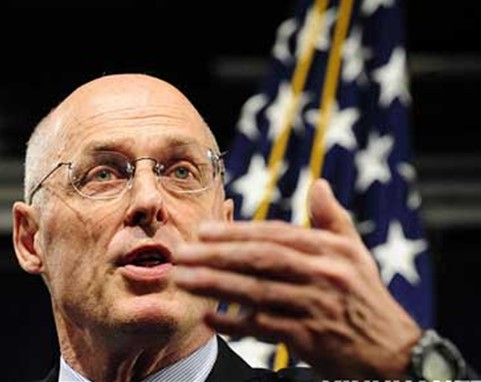
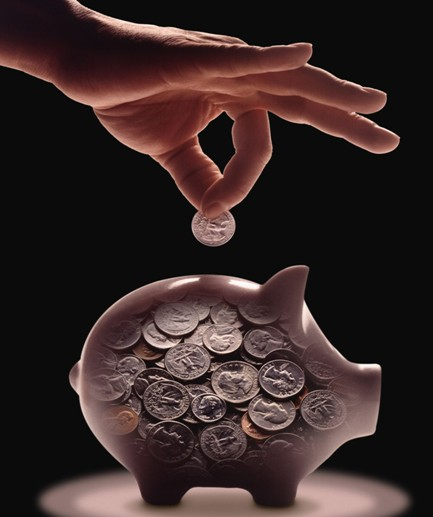

# 文化——难以篡改的历史

# 

# 文化——难以篡改的历史

## 文/袁磊

 回到法国已经1周了，每年回到法国的感觉都不一样，前天同法国BNP Paribas银行的驻大中华地区副总裁Christina打了一个电话，当我们聊到了关于文化同经济的影响力时，让我产生了一系列的发散性联想。未来美国同中国的金融经济平衡真的可以改变吗？ 1979年起中国开始实行渐进性质的改革开放，舍弃了由美国在IMF倡导的《华盛顿共识》改革方针。从那时起，邓小平先生的“摸着石头过河”的指导方针开始深入人心。其实，这就告诉了我们一个很有趣的道理，我把它归结为8个字：大胆假设，小心求证。 

当时创业潮很旺盛，每个人都有他们自己的个体化想法和方案去大浪掏金。一批又一批的企业开始崭露头角，银行业的放贷支撑性行为也愈演愈烈，这为之后90年代的坏帐拨备和中央政府的3000亿USD的此类坏帐剥离埋下了伏笔。由于是渐进性改革，那么是私有化改革初期进程的一个延伸形式，这也决定了如今的国有股转持和解禁的步调。不过，这些渐进性改革过程中诞生出来的，是一批以制造业为基础的庞大产业，而制造业的集中核心竞争力则完全体现在了廉价劳动力成本上，从而形成了一个影子形态的SOLOW MODEL雏形，为之后中国的出口投资型的经济体模式形成了铺垫和呼应。

 大家可以看到，历史和现实总是惊人的相似，似乎总有种发展过程中冥冥之中的联系。中国的国情形成了一个谦逊、节俭、中庸态势的文化传统，这种传统的文化沉淀其实到最后就演变成了我们对于出口型发展模式的依赖和对于创造性领域演化的落后形态，这不是偶然因素导致的。在长期的可持续发展过程中——这其中的“可持续”3个字不知道是个褒义词还是个贬义词——我们累积到了庞大的海外定单。随着2001年中国加入WTO塑造了一个全球化和贸易一体化的实体形态，中国大陆的国际贸易经常项目结算由最初的赤字到最后累计形成的巨额贸易顺差组成了外汇储备。 而贸易储备的递增显然加剧了RMB的升值结果，抑制了大陆出口品的绝对价格，中国中央银行决策者们开始使用限制外汇流通、USD/RMB双向反操作和投资美国国债使得资金回流的3大方案，使其达到了一个让RMB贬值并让资金成功回流到美国、拉低美国长期利率的双项目的，这也就形成了一个我们公认的金融恐怖平衡。 

再来看一下美国。

 自从1929年开始的股灾后，美国开始颁布一系列法案重整资本市场，因为HOVER总统之后的ROOSEVELT总统于1933年的上任开始了一段惊心动魄的改革史，这就是大家熟知的“罗斯福新政”。无论是农民的权利的回归，还是金融市场对于法令条案的深化，这都让美国人看到了希望，而这个希望本身则来自于美国人对于工业化向科技化转移过程中的创新天性。 创新的天性意味着美国人冒险、激进和热爱充满挑战的文化底蕴，大家可以比较一下之前我说的，中国人的谦虚、节俭和中庸。显然，美国人的字典里一直是拥有着“高调”和“霸气”这2个单词的。别小看文化的力量，文化的力量将会转变为我们对于财富追求回报率上的巨大差别。 举个很简单的例子，过去CITIBANK（花旗银行）是一家纯粹的商业银行，可是被TRAVERLER并购后，为何其创始人Sandy Weill可以把它做得全球NO.1，其实其转换的成功很重要，尤其是其利润率的大幅度飞跃。商业银行做的是零售业务银行的职能，利润率很低，其获利的额度大小完全取决于“量”的变迁，是“量”决定了银行部分的利润额，这就形成了一个“低利润率”产生“高利润额”的景象。之后的CITIGROUP为什么会变成全球第一呢？其实，理由很简单，TRAVERLER其实是从事财产和人生保险的，后来通过收购SMITH BARNEY形成了投资银行的氛围，而投资银行追求的是风险和回报成正比的业务模式，其追求的意识形态开始向创新形式发展，这就使得一个“高利润率”产出“更高利润额”的模型成为了最终的结果，最终CITIGROUP的势力也日益壮大。 

其实，中国和美国的发展模式完全体现在CITIBANK和之后的CITIGROUP的差异性上了，大家应该一看就明白了。

 产业链条中，高消费和低加工是上下游产业衔接过程中的隐形元素，拟合度的高低将直接决定产业规模化与否的判断。由于是一个高产出、高利润回报率的创新型产业链条，所以，美国人可以完全依赖技术自创和业务外包来达到一个锁定高利润的边界形态；另一方面，中国人完全利用了其自身天性的勤劳的奋发，获得了大量的以“量”堆积形成的贸易外汇，而这些贸易外汇则是通过环境和资源及人力的综合因素的廉价付出而获得的。因此，美国生产者——同时也是消费者——有充足的理由赚取生产和消费中间的套利差来提升自身的消费满意度系数，使得其生活质量的上升同中国生产、消费者的比较中产生了一个逐渐扩大的剪刀差。这是一个隐含成本的文化因素，我们甚至很难去发现和改变。 所以，大家会发现一点，其实所有的一切都不是所谓的美国人要使坏地来利用我们的人力和资源，一切的一切都预示着一个“创新能力缺失”的真实情景。因此，即使未来金融危机结束了，中国大陆内部的内需刺激计划也获得了一定的成就，但是，由于文化和历史性因素的不可逆原因，一旦美国的创新型工业产业再次形成巨大的、对于中国本土资源和人力的有效需求，那么这个号称在金融危机过程中被“完全破坏”的金融恐怖平衡便会死灰复燃，中国投资出口型发展模式和美国的创新消费发展模式的衔接会再次挂上钩，那么，下一轮所谓的“经济平衡”依旧是如此的形式。不过，唯一一点不同的则是这个模式的规模会越来越大，这也是为什么这次金融危机会超越30年代经济大萧条的原因之一，规模化和全球参与性决定了危机的脆弱程度和爆发规模。 归根结底，我们自身的创新能力如何被激发，如何才能利用好真正的全球化环境，我们应该如何去内部挖掘本国人才的潜能，使之更好地为本国服务，这不仅仅是一个简单的课题，更是一个衔接全民族未来的标志。产品的研发和投入、科技水平的不断进步、更加合理地使用对外贸易政策，这才是真正能够改变金融危机局势的方法。 当这批中国人觉醒时，我们的文化也将被逐渐颠覆。不过，我们应该保留好的一面，深化别人比我们强的一面，这也是我在“第一财经”频道上说过的“过度自信和自信如何合理转化”的奥妙境界之一吧，望大家传诵，使得我们这一代将这次的“危”真正转化为中华民族的“机”吧！
