# 在日本看病

# 在日本看病

## 文/张晓姗

  上周生病，头一次去医院，觉得还挺有意思的，说说流程并传几张照片上来的哈。 离住的地方不远有家“板桥区中央综合医院”，走路10分钟就能到，于是去的当然就是这里了。 

[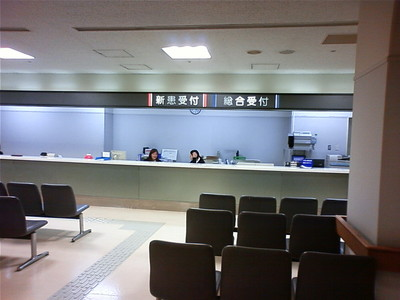](4d95b3ec-b283-44e3-8e5a-42776488d26a.bmp)

 到了以后先在接待处说了说自己的情况：外国人，头一次来日本的医院呢，不清太楚流程。接待处的人员（一个漂亮的姐姐！）听说如此，非常友好的拿出一张单子，告诉我由于是第一次来，先要半一张卡，之后看病全都得用它，并且把我的“国民健康保险卡”（来日本半年以上的外国人都必须参加的保险）要走复印。办好卡后，我告诉她我是感冒，于是她又拿出一张感冒的单子让我填，上面有感冒持续时间、有没有咳嗽、有没有痰、呼吸困不困难等一系列问题，填好后给我一个文件夹让我拿着交给内科的服务台。 

[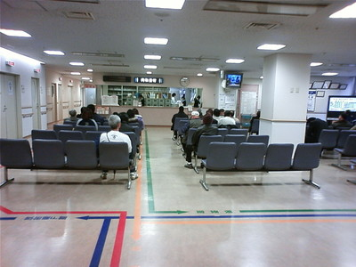](3824ebd4-fd4f-4a90-abef-645c0689b723.bmp)

 来到内科服务台，把文件夹交给工作人员以后就坐在大厅等着。每过一会就能看见有不同的护士从里面出来叫患者的名字，我心想这跟国内的叫号倒不一样。环顾一下周围，9成的人竟然都是老头老太太，日本可真不愧是老年社会呢！……囧 

[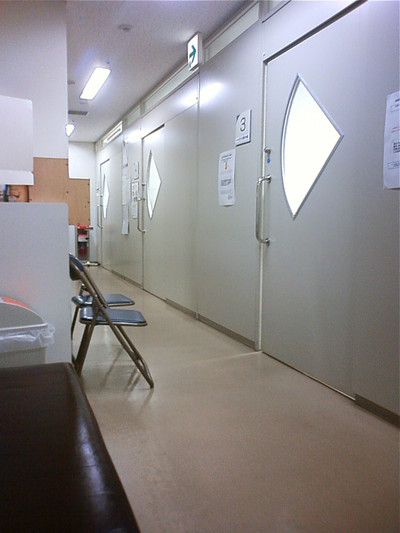](be706eb2-c8f5-4933-89ac-87b81a5db577.bmp)

 等了没太久自己就被叫到了，让我到里面排队。里面原来是一排房间，拐过弯来还有一排，一共10间。 

[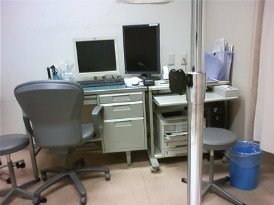](8c922063-49bc-49b5-9318-a6bbda158f55.bmp)

（这是房间里面的样子，是后来晚上打点滴时拍的。）

 之后就听见医生叫我的名字，不过他用的称呼是“sama”（大人），尽管其它每个房间的医生喊病人时都用的这个称呼，但这实在让在国内看病习惯的我冒了一身冷汗！医生仔细问了问我病情，然后听听诊，让护士给我量了一下体温，最后用一个小棍在我鼻子里搅了搅，把小棍放在塑料管里交给护士。然后告诉我说，由于不确定是不是禽流感（汗……），让我待会验个血做个胸透，但先回到外面等着。我又回到等候大厅，过了一会儿，护士就从里面出来，拿给我一张单子，让我去验血和做胸透，并且告诉我位置：验血处沿着地上绿色的线就能找到，胸透就在内科的旁边。 

[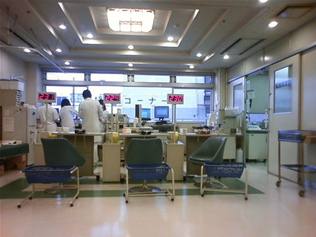](8e0a60f9-732e-4b37-8732-be780aadc6b7.bmp)

 果然，沿着绿色的线很容易就找到了验血处。把单子交给验血处的服务台，领到一个号，等着抽血。抽血的时候竟然抽了我7cc的血，真不知道要这么多干嘛——国内也抽不少，据说都用来做实验了呢，搞不好这里也是！：D然后去做胸透，还得换上件专门的衣服，可真麻烦。做好后把单子送回内科服务台，继续坐在等候大厅等叫名。这回等了半天才叫我进去。只见屋里的电脑屏幕上显示着我的肺部x光片的图，才明白数据可以直接传到医生的电脑里——哈哈，真有意思！ 医生告诉我不是禽流感，是肺炎，要连着打3天的点滴，然后周一再来复诊。估计是想着给我开什么药，医生先问我有没有怀孕，我一边乐一边摇头说没有，心想自己还生不出耶稣来——而且被人一本正经问这个问题是很逗的。接着问我对什么过敏，我一下呆住了——出门前咋没有上网查下那个单词呢，这么重要的事——这里提醒在国外的同学看病前一定要记得查下自己过敏药物的名字！……囧 由于当天就要开始打点滴，于是医生让我先去验尿——事实上我觉得验尿挺好玩的说，哈哈！回来后还是把单子交给内科服务台，过了会儿护士（也是一个漂亮的姐姐！之前给我量体温的也是她！）就带我到一个帘子后面扎针——本来打点滴都应该去注射科的，不过因为不知道我会不会过敏，得不时地测血压，所以就在内科打的点滴。那个护士姐姐极温柔，扎针时由于我手腕的血管不好找，我就让她扎在手背上，结果她很认真地摇头，说：“那会疼的！”我心说我从小到大打点滴都是扎手背上的，早习惯了。之后她在我两边手腕都找了半天最后扎在了右手手腕的内侧，然后还告诉我针管是软的，不会疼。扎针前先量了一次血压，然后每隔10分钟再量一次。中间她不时地过来看看我，问我有没有觉得不舒服什么的，还向我道歉，说让我在这么暗这么小的地方坐这么半天。半个小时以后由于没有出现异常状况，就把我转移到了一个有床的空屋子。护士姐姐亲自给我盖好被子，还端水给我喝——真是天使啊！！实在太感动了！——难怪听说日本有怪大叔会装病赖在医院不走呢！ 

[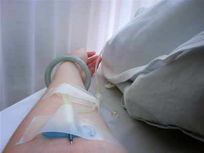](75706b8f-d462-4d0f-9e9a-be9219c646ce.bmp)

 之后周六打点滴就是在注射室了，一排帘子的小隔间，扎针时是躺着时扎的，这个位置的血管很好找，不过胳膊不能弯。可以听到隔壁人打呼噜的声音，哈哈～ 

[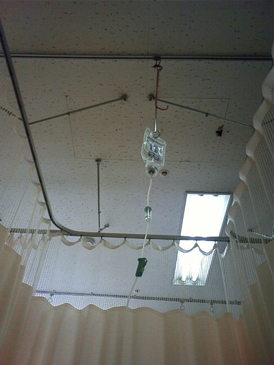](0417c561-6d8c-4051-a435-d7e267513110.bmp)

（在注射科打点滴时躺着时拍的。天花板有个洞，哈！）

打完点滴都7点多了，护士姐姐拿给我2张单子，一张是医生的药方，一张是下次复诊的通知单，并且告诉我明天直接到内科服务台说是打点滴就可以。再次感谢护士姐姐后到精算机前结账。——这里结账全是用精算机的说。 

[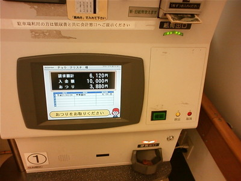](6c7b9095-5047-45d0-9411-299a84be73c5.bmp)

 把卡插进去自动就会显示金额，而且是保险之后的30%的部分——剩下的在学校参加的学生保险可以报销。把钱放进去按确认就可以。 

[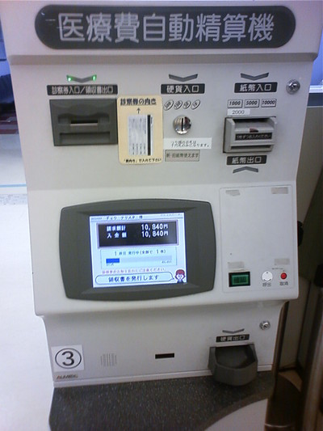](96ba92b3-12ec-4d31-a885-859f677900a8.bmp)

 找完钱后会打印一张收据，上面有详细花费，交款过程就算完成了，就可以离开医院了。 

[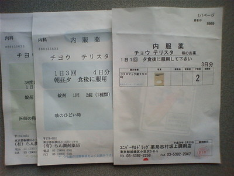](f01f5c18-d562-41db-be3c-be9f6de1f284.bmp)

 然后拿着药方去药剂局拿药，服务台的人会在把药交给你的时候亲自向你解说服用时间以及用量，每种药放在不同的袋子里，上面也印着说明。 

[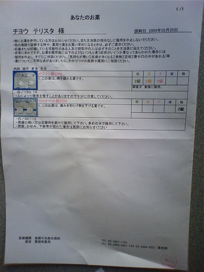](8f6a8a20-2de5-4696-a436-5112a292408d.bmp)

 还会给一张说明，印着副作用。药的作用原理什么的在网上很轻松的就能查到。 以上基本就是去医院看病的全过程了。 总结： 觉得日本的医院管理还是挺不错的。其主要工作人员分3类：医生、护士和接待处的文职人员。医生只用考虑病人的病情就可以了；护士负责协助医生的工作，包括安排病人的看病顺序、做检查等；接待处的文职人员负责文件管理，以及预约单和药方打印等。护士减轻医生负担、文职人员减轻护士负担。对于病人来说，缴费则在最后所有检查诊疗结束后一次性结算，比较省事。病人所有数据都是由电脑管理，非常方便。
