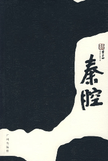
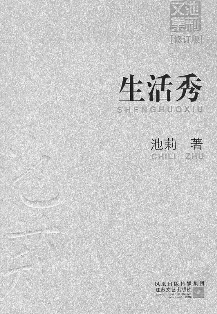
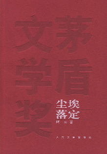
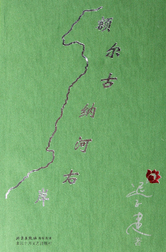

# 每周北斗电子书推荐

 从本期开始，电子书版块将会以主题的形式定期为大家推荐几本书籍。如果喜欢，还请读者们多来看看；如果有意见，还请多多指点。若是你需要的书籍不在我们推荐之列，可去北斗论坛发帖，在那你可得到满意的答复。 

## 本期主题：千姿百态的民间生活

**推荐书目：** 1.《废都》 2.《秦腔》 3.《生活秀》 4.《尘埃落定》 5.《额尔古纳河右岸》 **撰稿人推荐图书:** 《北京法源寺》 **主题详述：** 记得有部电影里说过：“有云的地方就会有人，有人的地方就会有生活！”而城市恰恰是这生活得直接载体。中国的幅员辽阔正是造成了不同地区间生活的千姿百态。每个城市都有着自己的精彩，而城市的人也都有着自己独特的生活方式。而这些生活色彩的绚丽，为一个个城市打下了自己的烙印。我们无法去一一体验这其中的百般滋味，也无法让自己的脚步踏上每一片异乡的土地。固然遗憾，但这并不能阻碍我们对多彩生活得向往。那些独特的生活习惯，那些独有的生活气息，无不令我们习惯性安逸的身体充满心向往之的冲动。既然我们无法亲临，那唯有慰藉一下躁动的心，才能让遗憾稍稍抹平。这个时候，去读读小说成为我们最好的办法。无数的字里行间势必将我们带到一个个陌生的地方，一段段生动的描写也将会让那些他乡的生活浮现在我们面前。我们的思绪搭载着文字的翅膀飞向遥远的乡村市井，一张张熟悉而又陌生的面庞擦肩而过着，我们终于知晓：生活不仅仅是一种平淡的味道。 本期的电子书，我们选择了五本小说，书虽不多，但味道绝不单调。这些文字描绘的画卷会将城市的生活节奏、乡村的淳朴民风、少数民族的风俗人情，漓尽致的展现在我们眼前。瞧完了古都西安的庄重，可再看看“九省通衢”武汉的热情；体会完藏民的平淡纯朴，再来到鄂温克人的原始部落。我们开始惊叹于生活得无尽面貌，而这种强烈的心理落差正促使我们不停的惊讶、不断的寻找。 我这碟开胃小菜已经上完，大餐马上开始！ 

### 北斗电子书组推荐书籍

**1.《废都》**

 该作40余万字，载《十月》1993年第4期。小说以历史文化悠久的古都西安当代生活为背景，记叙“闲散文人”作家庄之蝶、书法家龚靖元、画家汪希眠及艺术家阮知非“四大名人”的起居生活，展现了浓缩的西京城形形色色“废都”景观。 小说核心人物庄之蝶，在他身上可能影印了作者的痕迹。他集合了现代都市生活赋予一个名人复杂多面的特征：不喜拘束、洒脱行意、豪饮畅谈、学识渊博，颇具“魏晋风度”。然而，透过这些表象，古城墙夜里的埙声，实则契合了他内心深处最孤独的痛苦。 40万字篇幅中，作者以庄之蝶与几位女性情感的纠葛为主线，以阮知非等诸名士穿插叙述为辅线，笔墨浓淡相宜，时有“笑口常开”一类时政幽默小景展现，活跃了气氛，激活了读者思路，令人叫绝。 贾平凹不愧为写女性系列的大手笔，在诸多女性中，唐宛儿、柳月、牛月清为他塑造最为成功也最倾心的鲜明人物。在这些充满灵性、情感聪慧而富有古典悲剧色彩的人物身上，体现出作者至高的美学理想。这种美学观念植根于西京城现实生活的土壤上，却又被浸染了理想的光辉，因这理想的璀灿，造就了不同凡俗的品味，为作品埋下不可挽落的悲哀。这是自然美落入现代城市的悲哀，体现了人类现代文明发展自身的某种必然。唐宛儿被押潼关受辱，柳月嫁残疾的市长儿子，牛月清离婚、钟主编患癌辞世、阿灿避而不现、慧明堕胎与景雪荫官司败北，最后庄之蝶只有灰溜溜踏上南行列车，小说的结局弥漫了找不到出路的痛苦与孤独。 小说充满了浓厚的悲剧色彩。它将自然美有血有肉丰满地呈现给读者，然后再一件件将其撕毁。牛与破烂老者是小说中两个重要角色。以牛的独特视角这一荒涎手法的引用，寄托了作者强烈的回归自然意识，破烂老者不经意的民谣，传递出对现代生活的负面反讽。 这部小说还涉及了露骨性行为的描写，令人惊悚。这些最原始的描写，展现了人于无奈之下隐藏的自然冲动。在这里，性的结合只能是苟且的获得一丝动物性的安慰。也正是这性的展现，反映了庄之蝶内心深处纠缠着灵与肉的冲撞与追求。 《废都》的性描写、主题思想的某种颓废（隐约着对现代文明的悲观反思），成为《废都》引起争议的内在原因。近闻，某出版社要继续出版《废都》，建议作者进行适当的删节。对此，贾平凹执意不从。可以猜测，关于《废都》的文学、美学、社会学等诸方面意义的讨论，仍然会成为以后文学评论的一大关注点。但《废都》终是功不可没的，这不是因为它是作者的第一部城市长篇小说，而是因为它是贾平凹多年文学创作的集大成者。《废都》，毕竟是经过作者深思熟虑的，充分体现了现实主义意蕴的长篇力作。 **2《秦腔》**

《秦腔》是贾平凹的第十二部长篇小说，也是他近十年来最重要的一部作品。在这部被绝大部分评论家称为是一部书写当代中国农村具有史诗性意义的重要作品中，贾平凹在创作上达到了又一高峰。《秦腔》所受到的一片赞誉，以及被整个文坛的充分肯定，其一是敏感先锋地捕捉到了转型期农村巨变过程中的某种时代情绪，其二是对正在消逝的农耕乡村的一曲挽歌，其三他为“三农”问题专家提供了许多社会学意义上的经验和材料，其四它反映了当下中国农村面临的这一重要时期的面貌和变迁。另外，在其学术表现手法上，《秦腔》用瓷实精到的描写重塑了一个鲜活真实的世界。贾平凹以对农村农民过着的“一堆鸡零狗碎的泼烦日子”的痛切感受，从细枝末节、鸡毛蒜皮的日常事入手的描写，细流蔓延，汇流成海，浑然天成，直达本质的真实。从某种角度而言，也是对近年来许多临空高蹈、不无夸饰的宏大叙事的一种“拨乱反正”。《秦腔》看似日常、琐碎，实则坚韧、淡定。它显示出了贾平凹在叙事上一次冒险的“野心”，一次白描炫技的成功。或许贾平凹比任何人都看清了在现代化、城市浪潮的冲击下，新一代农村正不可避免地面临着古老的农村文化势不可挡地解体的洪流，因此，他借用中国最古老的剧种之一的秦腔，赋予它成为小说中一种民间文化载体的意义，同时利用这一传统文化的表征，讲述农村宿命般走向衰败萧瑟的必然，讲述他对故乡这块碑的挚诚。《秦腔》所表现的情感冲突，绝非剑拔弩张，而是一种渗透在农民骨子里、浸透在日常生活的嬗变中的一种无奈；一种所有人都被裹挟到浪潮中的身不由己。热爱土地而又无法守住土地、一步步从土地出走的农民带给作家的道义和矛盾、忧患与焦灼、迷惘和悲凉，使贾平凹付出挽歌的情感，写下了中国农村正发生着的千年未有的巨大变化；写下了原来乡村生活极其文化形态的分崩离析，写下了“中国一等伤心人”的心酸之情。 作者贾平凹，原名贾平娃，1952年出生，陕西丹凤人。1975年毕业于西北大学中文系。 著有小说集《贾平凹获奖中篇小说集》、《贾平凹自选集》，长篇小说《商州》、《白夜》、《怀念狼》、《高老庄》，自传体长篇《我是农民》等。《腊月・正月》获第3届全国优秀中篇小说奖；《满月》获1978年全国优秀短篇小说奖；《废都》获1997年法国费米娜文学奖；《浮躁》获1987年美国美孚飞马文学奖。 **3《生活秀》**

作家池莉的小说《生活秀》“火”得一塌糊涂：电影版的《生活秀》、电视版的《生活秀》相继播出，接着她又将《生活秀》话剧版的改编权无偿赠送给了北京姜之杰文化传播公司。这意味着观众可以循环着看完了小说看电影，看完了电影看电视，看完了电视看话剧，一部小说《生活秀》秀出了连珠炮似的衍生作品，这还是文艺界近些年少见的现象。 来双扬15岁时就挑起了抚养弟妹的重担，能干的她在吉庆街摆出了街上第一个个体摊子，小生意做得红红火火。可是，长大以后的弟妹并没有很好地报答双扬，弟弟双元吸毒，在电台做编辑的妹妹双瑗一心要曝光吉庆街的个体摊档。另一方面，双扬的哥哥在妻子的教唆下企图与双扬争老房子，双扬耍了一些手段，取得了房产权。双扬决定接受有妇之夫卓雄洲，但卓雄洲发现双扬并非他想象中的女人…… **4《尘埃落定》**

长篇小说《尘埃落定》，于2000年荣获第五届矛盾文学奖。评委认为这部小说视角独特，“有丰厚的藏族文化意蕴。轻淡的一层魔幻色彩增强了艺术表现开合的力度”,语言“轻巧而富有魅力”、“充满灵动的诗意”，“显示了作者出色的艺术才华”。 一个声势显赫的康巴藏族土司，在酒后和汉族太太生了一个傻瓜儿子。这个人人都认定的傻子与现实生活格格不入，却有着超时代的予感和举止，成为土司制度兴衰的见证人。小说故事精彩曲折动人，以饱含激情的笔墨，超然物外的审神目光，展现了浓郁的民族风情和土司制度的浪漫神秘。 作者阿来，藏族，1959年生于四川北部藏区马尔康县，现任《科幻世界》杂志社社长、总编辑。著有长篇小说《尘埃落定》，小说集《旧年的血迹》《月光下银匠》，长篇地理散文《大地的阶梯》，散文集《就这样日益在丰盈》，诗集《梭磨河》等。 **5《额尔古纳河右岸》**

部落是最后一位酋长的女人；诉说感天动地的民族故事，通灵萨满的旷世大爱为疲惫的人们点燃归航的明灯。 这是第一部描述我国东北少数民族鄂温克人生存现状及百年沧桑的长篇小说。似一壁饱得天地之灵气，令人惊叹却难得其解的神奇岩画；又似‘卷时而安恬、时而激越．向世人诉说人生挚爱与心灵悲苦的民族史诗。著名女作家迟子建，以一位年届九旬，这一弱小民族最后一个酋长女人的自述，向我们娓娓道来—— 在中俄边界的额尔古纳河右岸，居住着一支数百年前自贝加尔湖畔迁徙而至，与驯鹿相依为命的鄂温克人。他们信奉萨满，逐驯鹿喜食物而搬迁、游猎，在享受大自然恩赐的同时也艰辛备尝，人口式微。他们任严寒、猛兽、瘟疫……的侵害下求繁衍，在日寇的铁蹄、“文革”的阴云……乃至种种现代丈明的挤压下求生存。他们有大爱，有大痛，有在命运面前的殊死抗争，也有眼睁睁看着整个民族日渐衰落的万般无奈。然而，一代又一代的爱恨情仇，一代又一代的独特民风，代又一代的生死传奇，显示r弱小民族顽强的生命力及其不屈不挠的民族精神。 小说语言精妙，以简约之美写活了一群鲜为人知、有血有肉的鄂温克人。小说以小见大，以一曲对弱小民族的挽歌，写出了人类历史进程中的某种悲哀，其文学主题具有史诗品格与世界意义。 作者迟子建，女，中国作家协会第六届全委会委员，黑龙江省作家协会副主席，一级作家。1964年元宵节出生于中国的北极村——漠河，童年在黑龙江畔度过。1984年毕业于大兴安岭师范学校，1987年人北京师范大学与鲁迅文学院联办的研究生班学习。1990年毕业后到黑龙江省作家协会工作至今。 ** **

### 北斗撰稿人推荐

本栏目参与者为北斗撰稿人，推荐一本好书，写下自己的书评，和读者分享读书的乐趣，是大家共同的愿望。本期推荐者为北斗撰稿人刘一舟，其推荐书籍为李敖的《北京法源寺》。 **李敖的《北京法源寺》** 李敖最容易受到年轻人的崇拜，那是因为他表现出的精神特质：锐意、不羁、勇敢和一点的愤世嫉俗正符合年轻人的口味。很多年轻人，并不总是真地了解李敖，对他的崇拜也即对一个年轻所需要的符号的崇拜。等他们成熟了，放弃了年轻，也就忘记了李敖，甚至还会厌恶了他那种哗众取宠的刻意。可如果我们能稍微了解一点李敖的思想，也许就能撇开他符号化的外表，对他的风格也笑笑，像对待一个真正的思想家一样，去发掘他内部独到的精髓，并乐意受其影响了。我有这种经历，正是从读《北京法源寺》开始的。 李敖是一个评论家，评论是他的招牌和拿手绝活。《北京法源寺》这部小说并不太像文豪写的小说，而是直白评论的成分多一些。有人对此表示轻蔑。在我看来，《北京法源寺》可以看作一部穿着评论外衣的小说，也可以看作一篇穿着小说外衣的评论。体裁纯不纯粹是无关紧要的，李敖追求自己思想的强烈表达。《北京法源寺》情节精确，评论深刻，说明清晰。这样的作品也有个好处，它既适合只看得进小说的人长长见识，也适合埋在经史中无暇看小说的人放松放松。 《北京法源寺》以小说的手法记述了清末民初维新派的历史，书中的主角也就是维新派的主要人物：康有为、梁启超、谭嗣同。全书风格沉郁、悲壮，而且寄寓在一个佛教意象上。那么评述维新派的历史为什么要借助北京法源寺呢，我是这么理解的：不仅是因为北京法源寺同这几个主要人物有些瓜葛，作者更是要借助佛教的教义来阐释哲学思想，要借助佛教的气质来渲染人物的情怀。 书中并没有过多的描写，这对于一本小说而言看似有些反常。其中人物之间的对话占据了很大的篇幅，而恰恰是这些对话让我们在感知人物性格的同时更能体会到当年那种生活的压迫和曲折。没有人知道明天的自己会是怎样。先知先觉的人物们与小市民的生活形成鲜明的对照，京城的生活似乎在那一刻变得泾渭分明。 《北京法源寺》思想内容无所不包，书中还有很多对那个时代舞台上的其它角色的评价，西太后、光绪帝、李鸿章和义和团，习惯了普通生活场景的读者们大可从其中感受一些别样的风情。 可以清晰地看出《北京法源寺》最终要表达的是对历史和历史上的“大人物”的祭奠。它最想宣扬的是一种救世情怀和悲悯精神。这应该也是李敖的核心价值观念。救世的人的结局也许是悲壮的，就像谭嗣同为了人民去死，人民还要在他被砍头后去用馒头沾他的血，但这种悲壮是永恒的，就像北京法源寺的伫立。 这本书，你可以把它当作小说，也可以把它当作历史。这段很多人清楚却又不明白的故事，在李敖的笔下重新变得精彩。它告诉我们的不仅仅是一段历史，更是一幕幕活生生的生活场景。那年的北京城因为鲜血而变冷，见惯了大场面的京城子民的生活并没有因此而有所变化，他们不会关心死去之人与自己的生活有何关联，我宁愿相信这是一种麻木而非冷落。 如今的京城早已闻不到曾经的血腥气味，生活依旧热闹，城市依然精彩。物是人非的生活早已经成为一种模式，城还是那座城，可人早就换了好几拨。也许有一天，那座孤寂落寞的法源寺也会忘记曾经的故事。历史既然已是旧事，那它的存在之于我们的生活到底还剩下多少真实的意义？ 以上就是本期北斗电子书栏目的全部内容 本期电子书下载地址： [http://bbs.ibeidou.org/viewthread.php?tid=794&extra](http://bbs.ibeidou.org/viewthread.php?tid=794&extra)=
