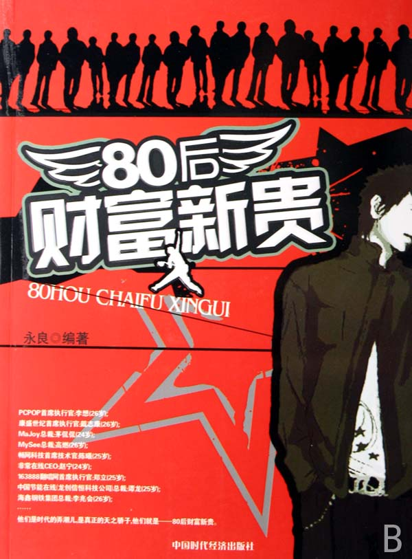

# 中国社会流动机制中的三种模式

# 中国社会流动机制中的三种模式

##  文\香港大学学生

社会流动是一个社会学名词，其含义中包含的地域概念并不十分明显，主要是指个人或群体在社会结构框架内的横向和纵向移动。我们关注的主要流动是群体纵向社会流动，因为一方面追求更好的生活是每个人和每个社会的天性，纵向社会流动最能体现一个社会的开放程度和自由程度；另一方面，个人的社会流动有很大的不确定性，个人的努力、才能以及意外机会都有可能造成个人的社会流动呈线性或非线性上升，而只有群体的社会流动能表现出较强的规律性。 目前，衡量社会流动的标准主要有三个：财富、权利和声望。不同历史时期，三个标准的重要程度不一样。在中国的封建社会时期，受到“士、农、工、商”思想的影响，权利的获取成为社会绝对追求的地位要素，在这个社会追求的同时，财富和声望也成为权利地位获取的附属品，“三年清知府、十万雪花银”，政治地位的获取成为实现财富和声望地位的主要途径。这种社会流动模式的影响一直波及深远，现在仍有很多人在进行这方面的尝试。但市场经济的建立彻底打破了这种平衡，财富成为中国社会中人们追求的主要目标，有钱没钱成为衡量人们社会地位的主要标准。一定程度上来讲，这是中国社会转型的良性表现，只要过度的拜金主义不是特别盛行，这种变化有利于市场经济的继续深入发展。 社会流动机制可以分为很多领域——经济、政治、文化等等。我在文中选择的社会流动机制的三种模式事实上着眼于中国社会目前人们追求的主要三个领域：商界、政界和学界。之所以成为三种模式，是因为中国社会目前这三个领域内及之间的社会流动已经在越来越有规律的运作，不确定性因素在逐步减少其作用，有效因素越来越明确。目前有生产能力的人大部分将自己的目标定位于这三个领域。在公司、政府和事业单位等组织内的人，不管其从事研发工作、事务性工作还是生产服务工作，不管其实现自己价值的途径如何，本质上还是在追逐权利、财富和声望。而另一方面，农业劳动和传统工业生产已经逐渐淡出人们追求的视野，即使有，也主要是和一定的商机结合在一起，通过资本运作，从中谋取利益。 这三个领域的运行机制大不相同，但又相互牵扯。商界目前主要的运行规律基本遵循市场经济的游戏规则，尽管可能受到来自其他因素的影响。改革开放以来，经济领域的改革主要是放宽放活，去除计划体制的影响，引入市场供求机制和信心激励机制，鼓励人们在市场领域自由流动，鼓励人们创业。鲁豫有约曾经做过一期节目叫“80后财富新贵”，采访的四个CEO都是二十几岁的亿万富翁——茅侃侃、李想、高燃和戴志康。他们通过做网络发家，在短短几年内迅速积累起上亿财富，成为一大批青年的偶像。在背后支持他们的是他们的聪明才智、对最新技术的利用以及抓住时机的能力，不过最关键的还是允许他们作为的社会机制。国家不断去除对市场的干预，人们对财富的追逐，社会对于自由的理念以及科技的进步，都成为促进社会机制良性运转的有益因素。再有，在企业工作的白领一族，面对着企业日益科学化的管理体制，逐渐享受更加公平自由的机会，晋升和跳槽成为他们社会流动的有效途径。 在政府部门，公务员体制、任命体制及政绩评估体制的改革逐渐在驱除着行政体制僵化的色彩。公务员考试为想进入仕途的人提供了一个很好的平台，任命体制和政绩评估体制为低层行政人员的晋升提供了有效的流通机制。29岁当选市长的周森锋就是一个很好的例子。从小出身贫寒，通过自己的努力考入清华大学，硕士毕业赴湖北襄樊市任建委副主任，接着几年后当选为宜城市县市长。尽管很多人对其晋升的速度和可能的途径进行了各种质疑，但无可否认的是，只有政治体制不断改革的情况下，这种情况才可能发生。 而学界目前的流动体制和政界有些相似。一个人短期内不可能拥有很高的学术地位，但是相对自由的学术环境还是让很多渴望实现“经世致用”的人做出对社会有用的研究贡献。一个学子本科毕业读研，接着读博，最后留校或到研究机构，从事各种项目，发表文章或出版专著，为政府和企业献计献策，这似乎已经成为人们印象中固定的学术道路。 但是，这些也只能说是好的一面，很多人仍然在不断的抱怨。这些年，民营企业的发展似乎走进了一个死胡同，相对落后的生产机制让大多数民营企业只能在低端生产徘徊，资本市场的限制掐住了民营企业最致命的咽喉，政府的支持若即若离，关系网络的盛行破坏了市场机制，这些因素让在民营企业工作或是想进入其中的人对自己社会流动的前景产生质疑；而国有企业内的流动机制相对死板，行政色彩依然强烈；寻租行为的发生使得企业不得不面对与政府的微妙关系，通过政治干预获得的商界社会流动使得一些人获得了大笔利益。政府内的流动机制受到关系网络的影响，使得“周森锋”式的人物很难出现，即使出现也要接受舆论的质疑；大部分人对政府的印象依然局限于其传统的角色，“工作枯燥，空闲时间多，福利保障好”的社会刻板印象笼罩在行政体制上挥之不去。学术腐败、无用论、垃圾制造者等评价使本应干净的学术界的价值大打折扣，甚至有一个学院系主任曾说，当了几十年的教授，蓦然回首，发现自己在制造着一些垃圾！大学学术抄袭成风，多少毕业生在copy着自己的毕业论文；学校关系复杂，与政府企业的关系也不再单纯，受到金钱和地位的吸引，使得本应安安心心做学者的人心浮气躁，做着昧良心的事情。这些东西不仅仅是被人诟病，他们确确实实存在着，确确实实是转型期中国的毒瘤，确确实实是社会流动中的消极因素。 但是怎么看这些问题呢？我认为在我们这个渐进式改革的国家，这些都是正常的，但今后的努力的方向应该是消除这些消极因素，促使积极因素的发展。有人说，一流人才在商界，二流人才在政界，三流人才在学界，我并不以为然。虽然这三个流动领域相互牵扯，但每个领域有自己该做的事情，并不存在高低。一二三流的划分其实也和社会体制的机构有关。在中国，市场经济确实打破了经济领域的计划体制，我们可以说当今的中国商界是个自由的商界，资本和才能是商界的主控因素；而学界和政界目前仍然是一个“等级领域”，并且就其功能来讲，这二者不可能是一个完全自由的领域。学术的资本不可能靠短期内的突击积累起来，长期的积累和潜心的研究是一个学者做出学术业绩的必要条件，这些都需要时间；政治地位的获取牵涉到太多的利益关系，选贤任能者不可能只坚持自己的评价标准，他要综合考虑体制内外的人的利益。至于关系网络，这是存在于中国文化中的沉疴，短期内不可能有太大改变，因为思想的稳定永远是国家第一要考虑的因素，是一切事业稳定进行的根本。 当然，以上的考虑并不是从“官本位”的角度出发，将每个人放在逐利者的角色地位。说太多为国家为社会服务的空话是无益的，追求自己理想的状态才是社会进步的根本。正如经济学里面的定理一样，每个人追求自己的利益，社会总体的福利会自然达到最大化。这也并不是说我们就该将我们的理想定位为个人私利，对更大层面利益的追求以及博爱之心的培养，都会使自己的理想实现起来更顺畅、更合理、更快捷。 帕累托曾说过，精英称号与能力的不平衡是精英衰败的表征。尽管中国社会流动体制内各种不合理因素的存在使得还有这么一些人在充当“食利者”、“寻租者”、“投机者”的角色，但这些终将不会是社会的主流，或者说不是社会潮流的方向。 

社会流动机制已经造就了一大批“80后财富新贵”“周森锋”“王铭铭”式的人物，尽管他们也可能在上升的过程中出现“寻租”“拉关系”“学术抄袭”的行为，但通过和历史作比，我们就会发现，这个社会的确越来越开放了，我们对这个社会不止要诟病，更要抱有希望！
