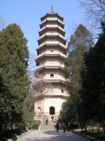
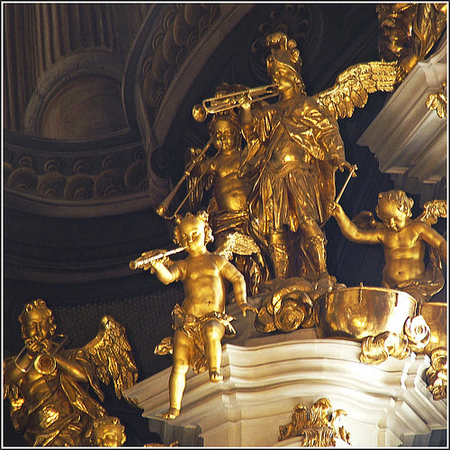

# “信”

**“有没有是它的事，信不信是你的事，朴树唱‘你的生命她不长，不要用她来悲伤’，——要不想只有活着的荒谬，就要信点儿什么。”**  

# “信”

## 文 / 陈酽(青岛理工大学学生)

  倒还记得，去年的三月，想去画湛山寺对面那座小红房子，没有画成，却蹩进湛山寺，站放生池边看游鱼。那红的绿的，正游着，有个和尚走来，说：“施主，你太执了。 

 我诚然知道他说的是屁话，可是还是很虔诚很耐心地问他，听他讲，就像我没事喜欢人摸我头发一样，轻痒，微酥。这些人，他不能我也不稀罕他，来给我个什么震动；可是他来扯扯什么，听他来讲讲我，猜猜我，点点我，叫我痒痒儿的蛮舒服，挺好。 就像这时翻着建筑史，忽然一亮，发觉1929年在南京的那国民革命军阵亡将士纪念塔，是建在灵谷寺里的。 

 是要超度的，是要护着的。不是竖立在大广场上，并且还只有领袖题字，没有人名，没有灵位，没有一个个亡魂，只有一大坨“精神”。（好像这些“英雄”，是专拿来炼出那“精神”的废柴而已似的。） 于是有叹焉。中秋在家时，读汪曾祺那《受戒》，看人家不真不假地做和尚，却又有声有色，还杀猪，还—— （“杀猪的时候，猪也是没命的叫”，这个“也”字，是多么神妙啊。天地万物，皆难免一劫，“也”“也”“也”，汪曾祺是懂得这佛家的俗谛啊。和尚杀猪吃肉，还会给即将升天的猪念一道“往生咒：“……一切胎生、卵生、息生，来从虚空来，还归虚空去.往生再世，皆当欢喜。南无阿弥陀佛！”读着我就笑了。若在没意思的人，怕又要控诉这封建迷信这资产阶级的虚伪吧。他们哪里知道，有时半真不假的面子活本身，本身就有着真实的——没有交流的真诚吧，却有的是尊重的诚心。） 他们还放焰口，为亡灵。亡灵在阴间做恶鬼，饥渴饮食如吐焰，所以要放焰口。还要唱经，有时还会放“花腔”，就是正经喂饱了恶鬼之后，还可以“和尚唱小调，拉丝弦，吹管笛，敲鼓板，而且可以点唱”。 倒叫我想起某年去看过圣弥爱尔大教堂里的圣体游行之后，心念着湛山寺是不是也有法事，可否去看看。问了好几个青岛人，都不知，就只好忘了。（我不理解为什么上边叫圣弥爱尔大教堂的正名是“浙江路天主教堂”，这像个什么。中南海能叫长安街XX号大院么？土蛋。） 

 就这么不真不假，却有声有色地信着，这，就是小民的信仰与生活了。于是我想到“信”这一层，对小老百姓，我们就得听他们信点儿有意思的，有意思才能是“迷信”，信了，也不会变坏。为什么？因为好玩嘛。就光玩的心，就是个玩咯。别信那些彪呼呼的假话，不好。你看我们今天人死了，都要开个表彰大会，表彰这人有多好多好，我们有多舍不得。其实人家没挂掉时，你也没怎么爱惜人家。人都死了，还要追究事情作评价，假不假？累不累？放过人家吧。我死了，诸位围着骨灰盒狂欢，喝醉了拿我骨灰冲咖啡泡喝了，别供着哭着，嗯，就这么定了。 忽然是想到这国民革命军阵亡将士纪念塔的设计人，是美国建筑师胡赛（H.Hussey）。那么，倒也不必太惊喜，西方的墓地，不就都在教堂么。倒是这西方人，又使我想到些别的。 这时代的中国人，信的是和古人不一样的。古人明显的是好玩，所以从容些；今人则俗不可耐多了，——对，“不可耐”，这是现代人的德行。我也莫办法，读西方建筑史一路到后现代，作者喟叹到后来人们都不认真了，建筑一片娱乐，肤浅花哨。 我，也跟着喟叹过。可是今天的感受却格外不同。就像这亡灵纪念塔，你要不信亡灵这回事儿，连塔也不必要，还用说放在寺庙里？所以，有没有是它的事，信不信是你的事，朴树唱“你的生命她不长，不要用她来悲伤”，——要不想只有活着的荒谬，就要信点儿什么。 建筑史里常说，经历了古希腊的洗礼，人们对可怖的神不再信了，而信人格的明亮的奥林匹斯山上的神；经历了启蒙运动的洗礼，人们对畸形曼妙的巴洛克不再信了，而信秩序明朗的古典主义；又经历了现代主义的洗礼，人们对古人的柱式山花不再信了，而信最新的飞机轮船的机器美学；经历了后现代主义的洗礼，人们对标准量化的平顶长窗不再信了，而信好玩难玩的各种，悉尼歌剧院、廊香教堂。 

 我的意思，你们大可不必这么想。你说的信了这波又信那波，是建筑史家是先锋建筑师的事，与大众不相干。不要觉得自己不信了古人，古意便都没格调了；也不要觉得现代主义“过时”了，就不配自己做了。艺术圈的“创新”，有时是噱头。这世界哪能有这么多新。 我的意思，就像最近一则旧闻，对美国人的测评，发现信上帝的人还是那么多。科学这么昌明，人心还不对等。所谓理性主义的“去魅”，多半还是史学者的视角，圈子。所以就是我所说的，有没有是它的事，信不信是你的事。人说信则灵，你要信了它，你能灵光起来，活得比咱们的唯物主义的马哲课本有意思，你就信么。信什么都由你，要的只是颗信它的诚心。这里面没有格调高下，因为信不信是你的事，有没有又是它的事。 所以金秋十月，锦帛缠树，十万金甲，我看也没什么。也不气愤，也不害怕。小老百姓，终究还是要信点儿什么的，信强大，倒也成。因为在这信强大底下，小老百姓还有自己的小算盘。小岗单干户，注册傻子瓜子，哪一样不是小老百姓的算盘算来的？上边会拉着理论做幌子，底下不也会？当然，像去年的小产权房，底下还是没玩过上边。但是，我们小知识分子，看明白跟上边玩的，不止是咱的笔，还有十几亿小算盘。信了这个不孤独，我们也就舒服些了。 上段说的是太政治了，下面转回建筑。业主信什么，那是业主的事，你管不着，也不必给人家扭过来，何必呢。你顶多给人家布置house，还管着人家home了？要我说，我明白写建筑文章，和做建筑项目不一样。到了我那时候，业主信什么，我就跟着信，我跟着发现了业主为什么信，信的哪里好玩，我就从哪里入手，叫他通过信他信的，来信我。你也可以说我是忽悠，可是，作出一座业主也满意，我也用心的建筑来，不算一件功德么？ 还有一样，主动去信人家，尊重人家的智商和品味，这才是办事的人；至于那些拿概念吓唬人催眠的建筑师们，还是另一说。 我们小知识分子呢，也不必对小百姓太认真。管信什么呢，你要做的不是辩论，辩论他们信的有没有，也不是批判，批判什么丑陋的民族性；你要做的是找出人的习惯，事的规律，个案，试点，潮流，叫人向善而行，好规则自然流传。打蛇要打七寸，不要去打蛇嘴，被咬了还出来装悲壮。你丫那是贪名想省事。
