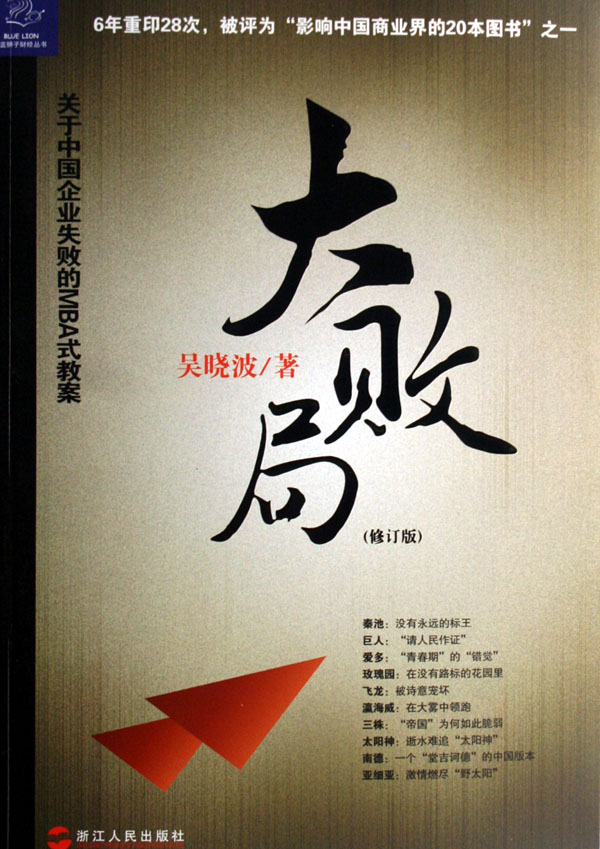
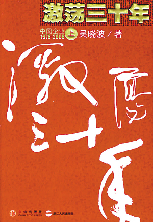
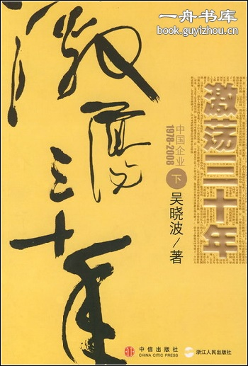
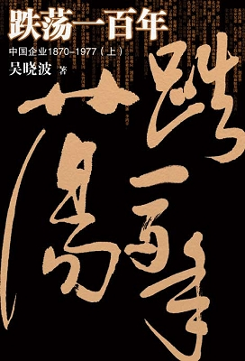

# 北斗电子书推荐——本期主题：吴晓波作品精选

# 北斗电子书推荐

## 本期主题：吴晓波作品精选

****

** ** **大家对吴晓波先生的作品应该是不陌生了。近年来，吴晓波先生一直致力于企业史的研究，希望借此梳理并寻找中国企业的渊源与出路。虽然中国的企业史只有短短的百十年，但其中的波澜壮阔并不被外人所熟知，通过晓波先生的作品我们可以感受到那段跌宕起伏的峥嵘岁月。一直很喜欢吴晓波先生的作品，从最初的《大败局》到新近出版的《跌荡一百年》，追寻着这条线，一副中国商业的百年历史画卷缓缓展现在眼前。借此，推荐给大家，希望大家闲暇之余能够关注一下那些逐渐被扫入历史角落的人与事。 我们将会把推荐书籍的电子版发到读者群里，有兴趣的读者可加群84862355，欢迎大家前去下载阅读。** **推荐书籍：** **1、《大败局》（上、下）** **2、《激荡三十年》（上、下）** **3、《跌荡一百年》（上、下）** ** ** **《大败局》 **

 这是一本放在手上令人发烫的书！一个个国内著名得很很著名的企业，突然在它们“花样年华”的日子里突然灰飞烟灭，突然无声无息的倒下了！如同一个个鲜活的生命突然的枯萎所给人们的震撼。这是一个令人激动的年代，无数的机会令人心动，一个伟大品派往往在一瞬间便打造而成；这也是一个冒险的年代，未知的风险又令每一个人不寒而畏，成功者往往在一瞬间灰飞烟灭。 

**《大败局Ⅱ》** 

 《大败局Ⅱ》所记录的败局均发生在2000年到2007年之间，将它们与《大败局》中的失败案例合在一起来阅读，你将可以看到过去10年里发生在中国商业界的众多兴衰往事。出现在本书中的企业家，都是他们那一代人中的不世豪杰。跟《大败局》中的众多草莽人物相比，一个让人印象深刻的区别是，他们中的不少人拥有令人羡慕的高学历，他们中有教授（宋如华）、发明家（顾雏军）、博士（仰融）、军医（赵新先）、作家（吕梁）以及哈佛商学院总裁班学员（孙宏斌）等等。他们也并非对风险毫不在意，如托普的宋如华在创业之初就曾经专门拜访落难中的牟其中和史玉柱，向他们当面讨教失败教训。甚至在公司规范化经营及战略设计上，这些公司也与当年《大败局》中的企业不可同日而语。华晨、德隆、三九及健力宝等公司都曾经重金聘请全球最优秀的咨询公司为其服务，德隆的唐万新甚至还有一个拥有150名研究员的战略研究部门。 在《大败局Ⅱ》中，我们更多地看到了一种“工程师+赌徒”的商业人格模式。他们往往有较好的专业素养，在某些领域有超人的直觉和运营天赋，同时更有着不可遏制的豪情赌性，敢于在机遇降临的那一刻，倾命一搏。 这是企业家职业中最惊心动魄的一跳，成者上天堂，败者落地狱，其微妙控制完全取决于天时、地利与人和等因素。 通过“大败局”系列，我们将强烈感受到中国企业的命运多舛，出路到底在哪，我想这个问题还将困扰下去，希望国人能尽早找到答案。 

**《激荡三十年》（上）**

 上卷记载1978-1992年间的企业变革。 《激荡三十年》的作者没有用传统的教科书或历史书的方式来写作这部作品，而是站在民间的角度，以真切而激扬的写作手法描绘了中国企业在改革开放年代走向市场、走向世界的成长、发展之路。改革开放初期汹涌的商品大潮；国营企业、民营企业、外资企业，这三种力量此消彼长、互相博弈的曲折发展；整个社会的躁动和不安……整部书稿中都体现得极为真切和实在。作者用激扬的文字再现出人们在历史创造中的激情、喜悦、呐喊、苦恼和悲愤。 尽管任何一段历史都有它不可替代的独特性，可是，1978年—2008年的中国，却是最不可能重复的。在一个拥有13亿人口的大国里，僵化的计划经济体制日渐瓦解了，一群小人物把中国变成了一个巨大的试验场，它在众目睽睽之下，以不可逆转的姿态向商业社会转轨。 

**《激荡三十年》（下）**

 下卷记载1993-2008年间的企业变革。 作者以写实的手法和犀利的风格，描绘了1993—2007年部分国企和民企在改革和崛起中的艰难历程。其中有柳传志、张瑞敏、王石、马云、吴仁宝等成功的典型，也有禹作敏、牟其中、姬长孔、沈太福等昙花一现的悲剧人物。书中用编年体的写法，将1993年以来发生在中国大陆经济体制改革中的大事作了全景式的描绘，其中有政府的决策，有高层领导的指示，有亚洲金融风暴的影响，更多的是企业界人士台前幕后的种种作为。许多事实经过作者生动的描写，使人们能从宏观上看出经济体制改革的艰难和民企在突围中的奋斗，无论成功与失败，都真实地映衬出中国腾飞中沉重的翅膀。作者在企业史的写作中，摒弃了从文件到概念的模式，以鲜活灵动的典型形象，以人物为主体，以事件为血肉，勾画出这一时期中国企业界的脉动，具有一种史诗般的力量。 作者在书中说：“过去的三十年是如此的辉煌，特别对于沉默了百年的中华民族，它承载了太多人的光荣与梦想，它是几乎一代人共同成长的全部记忆。”  **《跌荡一百年》（上）**

 上卷叙述1870～1937年间中国企业的变革。作者希望从历史中找到答案：当今中国企业家的成长基因及精神素质是怎么形成的？它是三十年的产物，还是应该放在一个更为悠长的历史宽度中进行审视？在三十年乃至百年的中国进步史上，企业家阶层到底扮演了一个怎样的角色？ 从曾国藩、李鸿章、盛宣怀、郑观应，到张謇、荣家兄弟、孔宋家族，寻找中国商业进步的血脉基因。 作者从一个特殊角度记录中国企业的发展历史，既有文献价值，又有生动故事…… **《跌荡一百年》（下）**

下卷叙述了1938~1977年间的中国企业的变革。作者按照编年体的形式记述了中国抗日战争时期、抗日战争胜利以后、解放战争时期以及新中国成立后，直至中国改革开放时期之前40年的中国商业史。作者试图在这些特定的历史背景下探寻中国商业人物和企业的成长基因、精神素质以及发展脉搏。在悠长的历史宽度中如何审视中国的商业发展？在百年的中国进步史上，企业家阶层到底扮演了一个怎样的角色？
