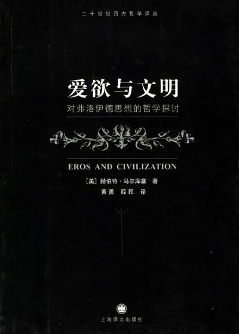

# 游向何处的栗之花

# 

# 游向何处的栗之花

# 

##  文/晨光荣耀

  加尔基，精液，栗子花。前者有中间者的形态，后者有中间者的气味。椎名林檎这个淫猥的专辑名常常让我想起过去读到的一些句子，那是一番上个世纪50年代末日本愤怒青年的自白。“从混杂着愉悦与屈辱的颓唐无赖的生活中摆脱出来的希望，从散发着番红花味道的洗涤液、五升的精液、7305次向污水的射精、微笑着的老死、一切的一切，从反行动的、反英雄的生活中摆脱出来的希望。” 

 在整个迷迷糊糊的高中时代，没有一个句子能比这个排比句更加打动我心了。那时候，我第一次有了动笔写小说的欲望，也第一次明白，写文章的人面对的绝非什么丰富的生活，而恰恰是意义的缺失；就像一个站在洗手间黑乎乎的便池开口前的少年想要反抗手淫后疲乏感的侵袭。可是我们毕竟不能确定的：如果写作也不是获得意义的方式，如果我们的生殖液永远无法长出明日之花，那么我们无处安放的冲动，是否定然要像那些无谓捐弃的精虫一样游走在青春庞大的地下水道。 在《我们的时代》开头，大江健三郎这样写：“一边进行快乐的动作，一边思考形而上学的问题、全力调动精神的机能，恐怕决非低级趣味。”这哪里是低级趣味，“快乐的动作”岂非就是形而上学本身？在《我们的时代》结尾，大江健三郎这样写：“我们知道自杀才是唯一的行为，而且没有任何东西可以阻止我们自杀。但我们不能鼓起勇气，纵身一跳。于是，我们只好活下去，去爱，去恨，去性交，去参加政治运动，去同性恋，去杀戮，去获取荣誉。然而一旦觉醒，发现自杀的机会就在眼前，等着你去决断。”也许吧，除了“爱”的冲动，我们还有死的冲动。 对寂寞、变态而年轻的这些生命，马尔库塞早有话说。 马尔库塞把人最原始最自然的爱欲的解放视为人的真正实现，并相信实施逐步解放的时日即将到来，因为高度发达的工业社会的成就既为统治阶级提供了施加不必要的压抑的手段，又为人类原欲的进一步满足准备了物质基础。弗洛伊德的“爱欲”概念既是人的本质属性，又是社会改革的最终目的。那么死呢？“向死亡退却也就是在无意识地逃离痛苦和缺乏，它表现了反痛苦、反压抑的永恒斗争。”在马尔库塞看来，受压抑的痛苦和人生真意的缺乏，可以辨正人向死亡的呼告，因为死欲本身并不是目的，而是反方向地对爱欲进行追求，也是爱欲与压抑的题中之义。 既然交合的快感是人类无法克服的诱惑，那么，何不给泄欲创造一副理性的说辞，一套公正的环境。既然劳动是人类本质的一个体现，是人类存在的一般方式，并且人类的历史正是在历史性的劳动中创造的，何不把它变为人类寻欢作乐的行为。在锄草施肥时勃起，在机器轰鸣中高潮，成了马尔库塞的毕生梦想。 文明，对马尔库塞来说不是象征进步和发展的词汇，而是有始有终的人扭曲人、人压迫人的历史。大江的主人公骄傲地宣称：“我的散发着栗子花一样味道的精液不成为受孕的原因。我的精液必须被散发着番红花味道的洗涤液冲洗，在冰冷黑暗的下水道里与污水混合在一起。”相应的，当一夫一妻制的婚姻和计划之内的妊娠似乎也并非“本我”的目的，而只是文明用来维护其稳定和延续而施加的规训时，精液的真实意义也成了需要解放的对象。像生活在“美丽新世界”里的人们一样，大江的主人公宁愿把诅咒投向“父亲”和“母亲”的圣名：“即将分娩的年轻的母亲的喜悦，啊，恶心。令人作呕。我诚心期待着未来的法院将宣判幸福地笑容满面的母亲、所有家庭幸福的信奉者有罪。”虽然马尔库塞宣扬的爱欲旗帜鲜明地反对现代文明，但他理论的根基，却正是人文主义、人道主义精神对人类本质的永恒向往；他轻视卢卡奇建立于阶级基础上的理论推论，鼓吹对活生生的个体人实存境况的分析，想建立“社会主义的生物学基础”。因此，即使对爱欲强大的破坏力量保有认识，也明白工业社会的新进化使劳动者得到更多满足，抵消了绝大部分反叛的念想，使得在经济领域推进他的改造计划变成几乎不可能，他仍然乐观地憧憬感性、审美维度上的革命。 这不是哲学，这简直是一首只属于年轻人的歌！克列蒙梭说过：“一个人如果30岁以前不是社会主义者，他的良知就有问题。”马尔库塞的这阙新马克思主义篇章，以最美妙和醉人的人道宣言谱曲，当它与年轻人们相遇时，不仅恰如其分地投射在他们向往正义和自由的心弦上，也实实在在地给他们指明一条释放力比多的绝学。这个被麦克莱伦称为“法兰克福学派研究所成员中唯一没有放弃他的早期革命观点的人”，带领无数热爱向污水射精的年轻人们走向街头，拿起砖块，喊出宣言：Boredom is counterrevolutionary. We don’t want a world where the guarantee of not dying of starvation brings the risk of dying of boredom. 哈哈，他们的口号不是革命宣言，是寂寞。他们的砖块不是砸向任何实体，是“异化”。六十年代的年轻人是马尔库塞的知音，而学生运动被他视为他批判理论最好的实践证明。虽然，那似乎是最初的也是最后的证明。 每个年轻人都不想让自己发出栗子花气味的精虫永远游走在下水道中，但是年轻人不止有一种，释放力比多的方法更远远不止一种。克列蒙梭的话也不止一半，他还说一个人如果30岁以后还是社会主义者，他的头脑就有问题。时至今日，马克思的继任者马尔库塞等人理论的道义感召力不仅式微，其理性说服力也受到极大质疑。当人的本质只能在“兽性”中去寻找的时候，当人的“本质”永远说不清的时候，讨论人的“异化”只能是个伪问题。或许，人的本质就是42，是我们不能理解的东西。 年轻人你去革命吧，年轻人你去做爱吧，年轻人你快点死吧……年轻人从欲仙欲死的大梦中醒转，世界仿佛已过千年。他们发现世界上大多数聪明人讨论的早已不是本性与异化的冲突，而是权力与责任、改革与传统、福利与税收、政府与个人、经济效率与可持续发展等等的制衡。有为的年轻人早已放下砖头酒瓶，投入大企业或研究所为开拓人类的各种可能性进行创造性工作。在劳动中，许多人确实实现了自我的解放，可惜的是，当年的那群年轻人对此没有贡献。而当年他们膜拜过的某些“反压迫”的伟人，竟然是以管理人的裤裆为自己忠实职责的“爱欲之敌”。在那些国家里，才依然存在着人性、人权与压迫的激烈斗争。剪除工业文明思想垃圾的运动制造出汗牛充栋的文化垃圾，反对工业文明“精神污染”的运动只允许年轻人收听领导者希望他们听到的音乐，年轻人们反对剥削阶级统治的战争把大独裁者拥上王座，很多谈“异化”、“压抑”而色变的人，反对垄断而迷恋“公有”的人，却反而成为被洗脑、被剥削最厉害的对象，自愿走上通往奴役的不归之路。到底谁成了施加更多“过度压抑”的权力者？谁被谁异化了？谁和谁的关系更接近人类最基本悲哀的真相？马尔库塞和老去了的那些年轻人，遭遇了理论和道义上的双重尴尬。 对社会改革的理论探讨一定没有尽头。只是，除了年轻人自己，还应该有人问起：我们无数虚掷在历史浪潮中的力比多，到底找谁归还？我们身体里充满神圣栗子花香的液体，到底流向了何方？
