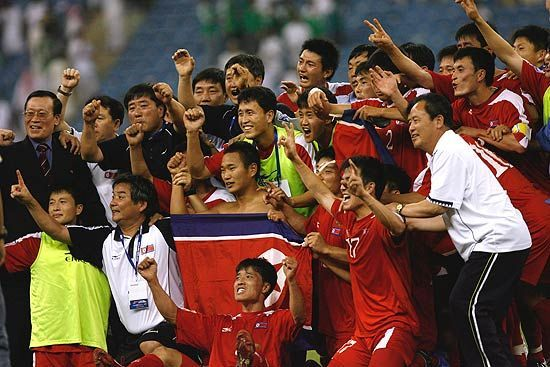
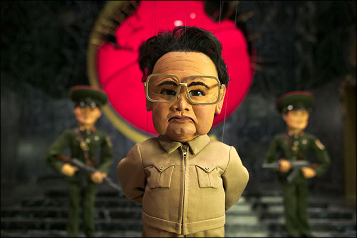
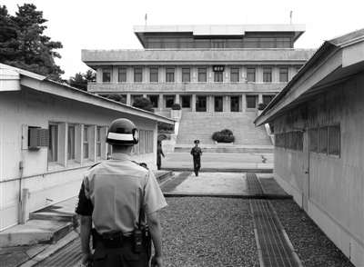
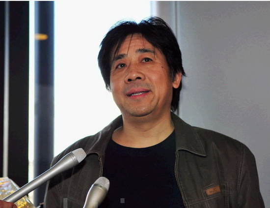

# 一种自认温情自甘堕落的向下的力量

# 一种自认温情自甘堕落的向下的力量

## 文 / 邓建永（四川外国语）

 朝鲜和巴西的比赛结束了好几天，许多人对朝鲜的赞美还在蔓延。我看了那场比赛，也对那场比赛中朝鲜队的竞技表现很赞赏和尊重。 

 这些天我没有看到喜欢德国队的球迷把对德国足球的热爱提升到爱德国的境界，也没有看到那些唾骂凤姐的人把对凤姐的唾弃延伸到对凤姐的祖国唾弃的地步。但是我却看到许多人将对朝鲜队的赞美扩大到郑大世的眼泪和朝鲜队喝别人剩下的饮料上，这让我很讶异地觉得：难道你们很羡慕他们喝不上饮料的穷困境地？难道你们没见过别人哭泣？更可笑的是那些看到朝鲜踢球踢得好就主张向朝鲜学习的人，按你们的逻辑，你们怎么不主张全世界所有国家学巴西呢？怎么不主张全世界公务人员学习宋朝公务员高俅呢？ 当你们赞赏四个朝鲜人凑钱买一听可乐的时候，是否知道金氏家族是轩尼诗全球第二消费商？而朝鲜和巴西比赛的晚上，维权律师倪玉兰的家却被强拆，她个人被殴打。 朝鲜队喝别人剩下的水，四个人凑钱买一瓶可乐。这说明了什么？这只能说明朝鲜队员也有物质追求，但他们买不起。那些对朝鲜队此举表示赞美的人，难道你们很羡慕这种物质境界吗？或者说是觉得他们这样很好？但是人家自己都不想过这样的生活，他们和我们一样对更好的物质与精神生活充满了向往。 即使郑大世流下一公升的眼泪，那也仅仅只是他个人的感慨与情愫。有一次比赛后记者采访同样流泪的郑大世为什么满含泪水，郑大世说那是因为他对那片土地爱的深沉，那是因为想到了他的祖国还没有统一。郑大世眼中的“祖国统一”意味着什么？意味着衣食安暖社会民主的韩国被朝鲜统一，意味着朝鲜半岛的人民都是金氏家的奴仆，一起堕落到食不果腹个人安危没有保证的境地。 

 郑大世的眼泪仅仅代表着他个人对他的祖国的热爱。就他个人而言这种爱可能炽热且真诚，但客观地说这种热爱是邪恶的。“爱国”是美好的情感，但“爱国主义”就显得生硬与危险。任何一种美好的情愫一旦打上某种“主义”的烙印往往都是邪恶的。一些野心家利用民众的美好情感打上“主义”的招牌维护自己的利益，他们将这种手段用得炉火纯青，现在的朝鲜和曾经以至于现在的我们中的许多人同样在被利用着。 

 一个球员的两行清泪：一行渴盼着他的祖国统一，统一后整个朝鲜半岛退步到集权统治的境地；一行闪耀着主体思想的光芒，这不比那些二战中为天皇而战的日本士兵的眼泪更高尚。 这种被洗脑被奴化被爱国主义和集体主义控制而泯灭个人秉性的流泪者是极其可悲与可怜的。 而这眼泪和这邪恶的爱却被一些人赞赏着，我想问那些赞美这些的人：你们知道什么叫做爱吗？ 我们的国家有着无数目睹自己流泪的机会，那些因为毒奶粉而肾结石的婴儿父母的眼泪，那些弱势群体们在自己的财产被侵犯时无助的眼泪，那些因为司法不公正而蒙冤者的眼泪……这些足够的眼泪难道不能使一些人为之比郑大世的眼泪更动容更牵扯你们极易泛滥的温情？ 这篇文字的开篇说到凤姐，说到那些唾弃凤姐的丑陋的人。我不知道凤姐伤害了谁？但那些道貌岸然却丑行昭著的人，无耻地、无休止地侵犯民众利益的人难道不更值得你们去唾弃吗？ 我失望地看到我们的时代里有这么一个群体：他们的温情与不齿放在错误的地方、面向错误的方向。他们的温情与不齿不侵犯当权不仁者的利益，不刺激大众的庸俗观点与喜好，他们不得罪任何人，他们安全地任由自己的温情与唾弃泛滥着。 这是一种自认温情自甘堕落的向下的力量。 

