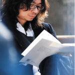
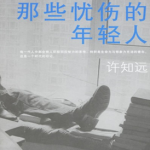
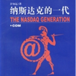
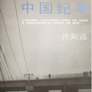
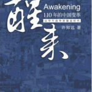
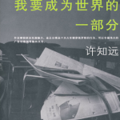

# 北斗电子书推荐——本期主题：许知远作品精选

# 北斗电子书推荐

## 本期主题：许知远作品精选

 许知远一直是我很喜欢的一个作家。从《那些忧伤的年轻人》的青涩，到《醒来》的深刻。人在变，书也在变。单向街图书馆，让更多的读书人心向往之，因为那里已不再是个单纯的书店，更成为了无数读书人心灵的港湾。暑假期间，我在单向街即将离开圆明园的那个日子偶然闯入，看到的却是单向街收拾行囊的忙忙碌碌，工作人员淡淡的对我说，单向街明天就要搬走了，就要离开这个成长的地方。在我走出书店的一瞬间，我恍然间觉得，吸引我来此的早已不是那些百年的废墟，而是单向街静谧的午后温暖的阳光。多年前，那个徜徉在大学校园的年轻人怀揣着梦；多年后，他还在坚持着。并将与单向街共同坚持下去。 我们将会把推荐书籍的电子版发到读者群里，有兴趣的读者可加群84862355，欢迎大家前去下载阅读。 

### 

### 推荐书籍： 

### 

**1、****《那些忧伤的年轻人》**

**2、****《纳斯达克的一代》**

**3、****《中国纪事》**

**4、****《醒来》**

**5、****《我要成为世界的一部分》**

** ****《那些忧伤的年轻人》**

****

本书作为许知远早期作品，体现了他对我们生活的这个年代的思考和试图与70年代生人建立共鸣的意识。作者生于70年代后期，有人说这个年代出身的是充满物质感的一代，显然这是个武断的结论，每一代人中都会有人积极回应智力的承传，特别是生命力与想像力充沛的青年。《那些忧伤的年轻人》是这个名叫许知远的青年在星巴克咖啡馆里、北大校园的男生宿舍床上、春天的北方城市街道边，一次次遭遇智慧或者青春的完成。许知远已试图搭建属于自己的某种具有自我信仰意味的文字领地，这信仰与精神的自由和智力锻炼有关。

本书初版于2001年，至今读来依然动人。那些才华横溢的文字，轻柔流淌出来的感情，不因时过境迁而褪色。每个人都有自己的青春，青春所凝聚的激情是不变的。正如作者所言：“它并没有改变我的生活，它只是让我意识到时间在我的短暂生命里的流尚，我还年轻，如此而已，而‘年轻就是天堂’。”

** **

** **

**《纳斯达克的一代》**

《时代》是20年代大众文化兴起的象征；《滚石》表现了60年代的摇滚精神；《财富》记载了商业世界令人震惊的变革；而在刚刚过运河的风潮中，新经济杂志充当了无可比拟的旗帜作用……这本随笔集试图呈现媒介与时代精神这间激动人心的关联。

** ** **《中国纪事》**

整个20世纪，国人用各种主义，各种理论解释中国。但中国人的真实生活总是被这些抽象的主义所吞噬。

历史的连续性，日常生活的细微性、个人的命运，总是被历史洪流冲刷。以至于作为一个30岁自认为是知识分子的青年人来说，谈起自己国家时倒像个陌生人。

这一系列文章，是一种个人经历的陈述，它激起的头脑风暴可能比它提供的清晰分析更多。但它的确是一个年轻知识分子看待自己国家的真实努力，尽管这种努力困难重重并可能注定失败。

但每个社会乃至每位个人，不都是在对自身命运与境况的探讨中，获得生活之意义吗？

** ** ** ****《醒来》**

这本书描述的年代跨越了一百一十年，从一八九四年夏天开始的甲午战争到眼前仍热情高涨的镀金时代，还有对未来岁月的模模糊糊的憧憬。它没给出什么值得倾听的结论，却代表着一个年轻知识分子对于自己国家的重新认识。他试图用好奇心与探索，来取代长期教条教育所造就的对历史的冷漠感。 作为人类历史上规模最为壮观的实验场，中国将为未来几代年轻人，提供一个超出想象的广阔舞台。这其中充满粗俗、不安、混乱，也可能激发起参与者身上的好奇心、创造力、对生活更深刻理解。** ** ** ** ** ** **《我要成为世界的一部分》**

本书作为许知远任职于《经济观察报》期间写的国际时政评论文集，其中的激情和理智总是在不经意中契合着 作为《许知远文集》的第二部，本书的文字充满诱惑力和无尽的想像，内容则理智而充满智慧。里面不无精辟的分析，还有许氏风格的幽默。 呈现在你眼前的是一位专栏作家的努力，其中很大一部分谈论的是政治人物，这些文字大多完成于 2002—2004年。那时候，许知远任职于一家报纸，他一心要为读者疏理“9·11”之后混乱的世界。在整整3年时间里，他痴迷于国际政治，在战争、谈判、谎言中，人的个性与内心冲突暴露无遗。用许知远的话说：“它也是在知识上朝秦暮楚的好奇心的延展，我偶然会好奇，我竟然在一无所知的情况下，喋喋不休地评论了那么多。这或许也暗合我对写作的不负责任的偏见，与其说它是为了读者而存在，不如说它仅仅是作家个人情绪的抒发。
