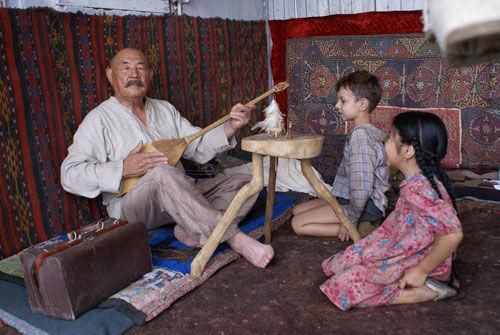
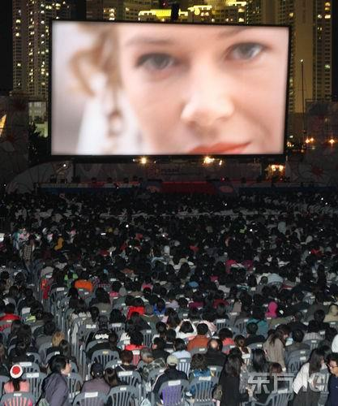

# 致黑暗年代里的被侮辱被损害被践踏被遗忘的人们

# 致黑暗年代里的被侮辱被损害被践踏被遗忘的人们

# ——评《给斯大林的礼物》

## 文 / 三戒法师

**据说，人要是虔诚的，那么他所写下的文字也将是虔诚的，一篇虔诚的文字就不是出自写作者之手，而是冥冥中，神选定了他写下神的启示。或许，我真的不虔诚，当我码下这些文字之后，我并没有热泪盈眶。原谅我的笔触不够虔诚，不能记录下他们的苦难以及影片的感人肺腑，然后，我还是决定把它张贴出来，为的仅仅是让你也能抽出一点时间观看此片。** **谨以此悼念那些被侮辱被损害被践踏被遗忘的人们，对于尘世，我已经无能为力。**

**——题记**

即使是在黑暗的时代中，我们也有权去期待一种启明（illumination），这种启明或许并不来自理论和概念，而更多地来自一种不确定的、闪烁而又经常很微弱的光亮。这光亮源于某些男人和女人，源于他们的生命和作品，它们在几乎所有情况下都点燃着，并把光散射到他们在尘世所拥有的生命所及的全部范围。像我们这样长期习惯了黑暗的眼睛，几乎无法告知人们，那些光到底是蜡烛的光芒还是炽烈的阳光。 

——汉娜.阿伦特，《黑暗时代的人们》

“那里去死亡的，读者，如像你我之辈，唯一的必经之路，就是通过逮捕”。和索尔仁尼琴一样，他们起先因种种“罪名”被逮捕。在大街上，在睡梦中，在单位里，无论你在各处，都逃不过“余粮收集队”、契卡、肃反委员会、人民警察等等“专政机关”的手掌。你没权保持沉默，也不会有律师胆敢为你辩护，官方的法官早就在准备好的宣判书上签上字，你的罪名或许在你出生的那刻就被决定了——为了伟大的苏维埃，那些反对苏维埃，不坚定执行苏维埃意志的，托派分子、孟尔什维克、那些犹太人、车臣人、亚美尼亚人，等等等等，这些苏维埃的敌人必须统统被消灭掉，哪怕他只是个孩子，是的，孩子，谁叫他们是狗崽子呢。定罪之后，你便不再是苏联公民，而是“国家的敌人”、“罪犯”，被剥夺了所有的财产、权利，像赶牲口一样被赶上了闷罐子车厢，冷峻的大兵将如秋风扫落叶一般毫不手软地对待这些可恨的阶级敌人。火车一路向东、向北、向南，几个星期的行程里，只有极其少量的水、食物，要是老天爷怜悯你，或许会下点雨，你唯有将杯子、盆子伸出窗口集些雨水润湿干裂的嘴唇。“幸运”的话，他们将被拉到遍布西伯利亚、高加索草原上各处的“格拉格群岛”里，你不再是人，是什么呢？对了，是“肉兔”，你将被扒光衣服搜身、“消毒”，编上编号发往拥挤的集体宿舍，然后是高强度的劳动，有句话怎么说来着？“劳动换取自由”，是的，你将获得自由——当你被饿死、病死、枪毙的时候，你的灵魂就自由了，它将凄苦地徘徊在无边的雪原或草原上。 “逃亡者的世界是没有地平线的”。要是“不幸”的是，你在行程中就被饿死、渴死、病死的话，你将在某个小站中被卸下，堆叠在一起，被随意挖个坑埋掉，没有墓碑也没有祷告。那些死去的人甚至不配被称作“死者”——你没看见吗？当列车长报告说“有7个死者时”，我们的苏军少校满脸愤怒地表情——列车长同志，“死者”多么神圣的字眼，它只能用来称呼“牺牲的同志”，这些肮脏的犹太人、反D分子、通敌分子、沙皇遗民的尸骸怎能“玷污”这个字眼呢？列车长赶紧修正了错误——“7具尸体”，它们只是要被卸下的“货物”。 倘若有人装死试图蒙混过关的话，我们英明神武的人民警察、红军怎么可能被这种小把戏所蒙骗呢？每具遗骸，不对，每具尸体都将被检查过，看看是不是伪装的——派出所长博加拜同志将用匕首一一刺进那些干瘪的尸体，第一具，第二具。。。第七具。。。就在所长同志的匕首就要刺进那个小孩的“尸体”时，长着一张丑陋的脸的哈树爷爷发话了：“博加拜，别碰那孩子”。 是的，哈树爷爷的“小头没坏，但大头坏了”，他竟胆敢掩护一个装死试图逃走的犹太小孩——犹太小孩沙士奇，他的爷爷是一个虔诚的犹太教徒，他在行程中就死去了，临死前对沙士奇说“以色列啊，你要听，耶和华我们的上帝是唯一的主”，然后祈祷文还没念完就死掉了，但愿他的灵魂能上天堂。只是，此刻，他的“尸体”就被堆在平板车上，就在沙士奇旁边，尸体上除了历经苦难的痕迹，还有所长博加拜同志刚刚刺下的刀痕。向来胆小、诙谐、尊敬长官的胖子，此时也居然“违背D性”，伙同哈树爷爷欺骗了所长同志，救下刀口下的沙士奇。 于是，故事由此开始，也将在这片土地上结束。 

### 男人和女人

薇拉，一个“人尽可夫的婊子”，一个“通敌分子的家属”，所长博加拜的情妇，当然，是被迫的情妇。我们无从知道，自从她被宣判为“通敌分子的家属”后遭受了多少次强奸、侮辱，要知道，我们的所长大人博加拜同志是一方的治安官员，除了时常从牧民家中拿走几只肥牛羊、苹果什么颐养操劳的身心外，也必须将D的种子撒满胆敢违抗斯大林同志意志的妇女的肚子，无论是对牧业集中化消极的牧民，还是被流放到此地的罪犯，他们无一例外是D的财产，理应由D员来“照料”。无论是沃兹涅先斯卡娅的《女人十日谈》，还是索尔仁尼琴的《古拉格群岛》，都提到过，在流放地、劳改营里，稍有姿色的“女犯人”必定要先被管教人员先“身体管教”，是的，英勇的苏维埃战士们就是这么干的。 亚齐，一个波兰人，我们不知道他是因什么罪名被逮捕的，这无关紧要，因为在我们的苏维埃，被逮捕需要理由吗？既然人民是伟大光荣正确的，那么人民的D也就是绝对伟大光荣正确的，D的国家法庭等等专政机关判一个人流放需要理由吗？特别是“该死的波兰人”，既然能在卡廷森林里枪杀一万多个波兰战俘，那么判处一个波兰人流放就不算什么，特别是亚齐，这个波兰人还穿西装会念圣经是一个知识分子，仅这点就足以判他几次流放都不过分。 广袤的苏联啊，上千万平方公里的国土，除了用来建设“人间天堂”外，也有足够的土地用来流放，沙皇时代是如此，列宁时代是如此，斯大林时代更是如此——历史上，有比斯大林时代更多的流放犯、劳改犯，更多的劳改营，更多的被剥夺一切的男人女人吗？没有吧，比什么都不要跟斯大林同志比铁腕。 这两个“肮脏”的男人和女人，原本生活在不同的国度，却因为斯大林同志的D机器的“垂青”而在哈萨克斯坦大草原上的一个无名村庄里相遇了。 沙士奇的到来，让薇拉、亚齐忙活了好一阵，她要帮这个在闷罐子车厢里待了两个多星期的一身蚤子、污垢的孩子洗澡，亚齐要帮他检查身体。在灿烂的阳光下，亚齐双膝跪下向这个可怜的女人隐隐约约求婚时，薇拉拒绝了她，她的双眼含着泪光，是的，她自己觉得自己是个“肮脏的贱人”，被无数道貌岸然的苏维埃战士玷污过，她自觉不配当亚齐的新娘。但亚齐不这样认为，在他看来，薇拉，这个善良的女子，“如同圣母一般”。历经曲折，当这两个可怜的人儿最终走到了一起时，醉醺醺的博加拜，这个玷污了薇拉并且尤为无耻地把薇拉“献给”少校的派出所所长突然闯入，一番搏斗后，亚齐，死在了薇拉的怀里。这个可怜的年轻人，甚至连戒指都还没来得及给薇拉带上。 失去了丈夫，又失去了亚齐的薇拉，呼号着质问上帝为何如此残酷地对待她，而上帝，并没有给她任何回答，虽然，在苦难的日子里，她是如此虔诚地向圣母、上帝祷告。 

### 罪与罚

是的，当无辜的人受难受苦，恶人穿上制服摇身一变成为“苏维埃公权力”肆意践踏无辜的人的身体、尊严时，上帝在哪里？安拉在哪里？当无辜的人虔诚地祷告可还是被剥夺掉生命、尊严，恶人却吃着苹果享受牧民们的孝敬时，上帝在哪里？安拉在哪里？当醉醺醺的博加拜强暴了青年苏丹的心上人时，上帝在哪里？安拉又在哪里？当斯大林同志及其D机器出台一个又一个法令随意宣判犹太人、波兰人、车臣人、亚美尼亚人、“孟尔什维克”、“持不同政见者”罪名成立时，他们的法律是不是真正的法？正义、公义又何在？ 早在几千年前，约伯就曾质问过上帝——你让我受苦，难道就仅仅是因为你比我强大吗？所谓神的“正义”在哪里？果真是如色拉叙马霍斯所说的“正义不是别的，就是强者的利益”吗？或者，干脆就是上帝自己的回答“我奠定大地根基的时候，你在哪里呢？”——潜台词就是：我造了你们，所以，你就什么都得听我的，我能给你的，也能拿走。果真是如此？若是真的，那么，上帝啊，你和斯大林有什么区别，你不过是比普通人更为强大，仅此而已，所谓正义不过是甜蜜话语包装过的强权？ 不对，都不对。你不懂神的正义，它不在奥古斯汀的“审美神义论”中，也不在司各特的“共时偶在性”中，甚至也不全在斯宾诺莎的“理性信仰”中，它在我们的心中。“上帝已死”的二十世纪，神权已经不再可能通过世俗法庭表达它的意志，在东正教、伊斯兰教被迫要么与官方合作要么转入地下的苏维埃，恶是整个体制的恶，它在每个参与建造、维护、从中得益的人的心中，甚至它不是流着脏东西的恶，单纯的、赤裸裸的恶以杀戮、强暴等等面目出现的恶并不是最可怕的恶，它会激起我们心中的反感，会被所有理智的人所唾弃。而，有一种恶，它披着正义、法、光明的外衣，它告诉迷茫的世人——消灭一部分人，我们就能建设一个美好的未来，献出你们所有的一切就能是为了集体的利益，为了正义就要流血。它描绘了一个美好的前景，它假借正义的名号肆意扩张权力，它以自由的名义让无辜者流血，整个二十世纪，正是急于实现一个虚无缥缈的“人间天堂”，才能“正义”沦为恶的奴仆。汉娜.阿伦特认为传统的战争只是“征服、扩张、维护既得利益，鉴于咄咄逼人的新权力崛起而拼命维持自己的权力”。只有革命宣称自己是“以自由对付暴政”，只有革命才会以自由的名义去正名那场开端的暴力”。而这种暴力的源头，就在我们每个人的心中，它与贪婪、恐惧、孤独同生。 索尔仁尼琴在描写苏维埃的士兵们时，就写道他们从来不考虑他们接受的意识形态教育是否是正确的，也不考虑他们这样对待“犯人”们是否残忍，他们只是麻木，在执行命令。或许，这就是汉娜阿伦特所说的“平庸的恶”。但事实远非如此，比如影片中的那个苏军少校和所长博加拜，就算是从苏联的法律来说，强奸、偷窃也都是犯罪吧？但是，在广袤的哈萨克斯坦草原上，苏联的法律又算什么？既然在恶的体制下，权力就是一切，那么拥有权力的少校、所长们当然可以肆意滥用权力为所欲为，特别是当他们的施虐对象是被剥夺掉所有权利的“流放犯”们时。这不仅是“平庸的恶”，更是一种“权力狂妄症”的恶。 在被这种恶压榨完一切的受害者面前，无数《圣经》解释者的长篇大论，无数法律实证主义者的逻辑推论等等等，都不过如鸿毛般轻飘飘。 没有道德，不问是否对错，不尊重人的天赋权利的法律；以压榨国民供庞大的官僚阶层享乐的政权；以牺牲无数人换取“效率”的国家。倘若它们的法律、政权是“正义”、“对”的话，那么，一个暴君随便出台一个法律然后D机器严密执行送千万人上断头台也要无辜的人伸出头来利索地让人砍掉吗？不是这样的，这不是真正的正义。索福克勒斯写道：“我敢，因为向我宣布这法令的不是宙斯，那和下界神同住的正义之神也没有为凡人制定这样的法令，我不认为一个凡人下—道命令就能废除天神制定的永恒不变的不成文律条”。 而这样的法令，理应就在我们每个人的心中，它不可能时时刻刻由神来现身来执行，它必须是每个清醒着的人自己行动起来来拯救自己和无辜的人——倘若自由权利在我们心中死去，那么无论是神的法律还是神都不可能拯救得了我们。 

### 拯救与逍遥

世上真的有神吗？或者，有很多神？犹太教一个神，伊斯兰教一个神，基督教一个神，等等等等？ 哈树爷爷是一个穆斯林，每天都在村子喇叭里的革命歌曲的鼓噪下做礼拜，虽然，以阿訇们的标准来看，他并是十分虔诚的，因为为了救患病的沙士奇，他求救过萨满巫师。薇拉是一个基督徒，在苦难的日子里，唯有胸前的十字架项链和墙壁上的圣母画像是她的精神支柱。沙士奇的爷爷是一个虔诚的犹太教徒，而他，一个小孩子，“只信一点点”。沙士奇说：“我们父母不信，我爷爷说他们就是为此被逮捕的”。 可怜的沙士奇的爷爷，他应该知道，苏维埃政权可是“无神论”的，况且，全知全能的神如果连这点雅量都没有，那么，他和嫉妒成性的希腊诸神就没什么区别了。很多精通文本的人或许能从经典中找出只言片语论证不信某某神者必定受惩罚——如同《约伯记》里以利法。但是，哈树爷爷说“神只有一个，对你对我都一样”、“都一样，都是同一个”、“他统统会说，重要的是说心里话”。 哈树爷爷，他也曾经年轻过，也追求过姑娘，结婚生子，然后呢？他所有的亲人都在苏维埃制造的大饥荒中被饿死了，然后呢？他上了战场参加了“卫国战争”，然后呢？他活了下来，收留了沙士奇，然后呢？在斯大林生日的前夜，苏联在哈萨克斯坦大草原上引爆了苏联的第一颗原子弹，他的故乡和村子里的所有人都被从地球上抹去了，无论人们是穆斯林还是基督徒。 在小女孩的歌声中，原子弹被引爆，一无所知的人们被自己国家的原子弹杀死在故乡里，千里之外的莫斯科，伟大领袖斯大林正在接受全国的鲜花和顶礼膜拜，哈萨克斯坦草原上的上千冤魂成了D机器献给斯大林同志的生日礼物——包括薇拉、胖子、阿珊宝拉、帕克等等等，还有沙士奇献给少校让他转交给斯大林试图让双亲出狱的那只小山羊。苏维埃是强大啊，可它却是建立在千万无辜者的骸骨之上的 哈树爷爷、薇拉是虔诚的，可无力对抗现实的不义和苦难。然而，这并不代表哈树爷爷所说的是错的，恰恰相反，历经苦难的人终将知道——“神只有一个，对你对我都一样”。影片的结尾，从莫斯科途径哈萨克斯坦一路流浪到耶路撒冷的沙士奇，不对，此时，他已经从了哈树爷爷改的名字萨博，回到了那片土地，那里埋葬着亚齐、哈树爷爷、薇拉、他的爷爷，他回来是以一个犹太教虔诚教徒的身份认穆斯林哈树为父，并且献上祷告——“愿他的名永被称颂，愿那圣者的名永被称颂，被高举、颂扬和赞美，愿他的名高于世上所有的赞美，高于世上所有尊崇与安慰，让我们说阿门”。 他将永远忘不了这片土地，忘不了悉心照料他的哈树爷爷、亚齐、薇拉、胖子、流浪儿们，他将永远铭记，在灿烂的阳光下，哈树爷爷骑着马行走在高高的山岭上吟唱的那首歌： 无风夜里的明月 月光闪耀在水面 村野之人深沉的心 有如湖水翻涌呼号 …… 无数沧桑尽在歌声中，它是献给那些被侮辱被损害被践踏被遗忘的人们的安魂曲，那些死去的人，在官方眼里甚至算不上“牺牲者”，然而纵使官方宣判他们有罪，纵使他们的名字与骸骨早已经消逝在漫漫黄沙中，纵使“天地不仁，天地不仁，以万物为刍狗”，纵使神并没有现身拯救他们，纵使对于世间的一切，我们无能为力，我仍要说：“你们，是我们的兄弟姐妹”。 **附录：** 20年代末30年代初，斯大林不顾各民族的意愿和经济发展水平，强行搞农业全盘集体化，给乌克兰和哈萨克斯坦等民族地区带来严重灾难。乌克兰这个“粮仓”有300万~400万人饿死（现在乌克兰称有上千万人饿死），哈萨克斯坦有230多万人死亡，这个落后的游牧地区的游牧民被强行定居，有90多万人不堪忍受而迁居他国，苏联用武力镇压反抗，严重伤害了民族感情。 在30年代的大清洗中，许多人被扣上“资产阶级民族主义者”的帽子，大批少数民族干部被迫害致死。在第二次世界大战前，斯大林对少数民族不信任，以维护国家安全为由，把居住在苏联西部的3万多波兰人、居住在远东的10多万朝鲜人、居住在伏尔加河流域的100多万德意志人等，从他们的居住地强行迁至中亚和西伯利亚。二战后期，斯大林又以与德军勾结为名，把卡拉恰耶夫人、卡尔梅克人、车臣人、印古什人、麦斯赫特土耳其人等整个民族驱逐到中亚。许多人在迁移中死亡，新居住地实际上成了他们的劳改营。这在世界历史上都是绝无仅有的，成为影响苏联社会稳定的一个重要因素。1939年，斯大林与希特勒达成秘密协议，把波罗的海三国划入自己的势力范围，并于1940年8月，强行把三国并入自己的版图，随后，又强迫数十万人迁往苏联内地，把大批俄罗斯人迁入这一地区。
