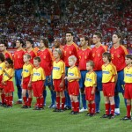

# 西班牙，半个世纪都在折翼的天使

# 西班牙，半个世纪都在折翼的天使

## 申宝（安徽工业大学）

 记得2000年6月23日凌晨我背着父母爬起来看球，当时离中考还有两天，我不管了，我要看西班牙，我要看劳尔。那场是2000年欧洲杯四分之一决赛：西班牙VS法国。那年的法国如日中天——最好的齐祖、最好的亨利、最好的维埃拉、最好的后防线……那是史上最好的法国，那是比如今差很多的西班牙，可是西班牙仍然将法国人摁在半场打。法国队中场完全被压制住，前后好几年时间只有西班牙做到这点。比赛的结果让我失望，西班牙1：2输掉了比赛，劳尔打飞了可以扳平比分的点球，西班牙习惯性折翼。 从那之后我知道了——控制、传递、流畅……这是西班牙的命根。即使面对世界上最强的球队，面对20年来最完美的中场大师，西班牙依旧勇敢的压出去，控制住球，压制对手。强者傲慢的姿态。 西班牙视传球控制如生命，可能会有人感觉这么踢磨叽绵软，但是踢球的人都知道这种踢法需要视死如归的勇气：横向传球若出现差池，防线立刻崩溃。西班牙球员就像11只蜘蛛，在球场上编制出一张大网——时紧时松，密不透风，用传球调度对手，消磨对手。可是这张网任何一点出现断裂，整张网立刻破碎。西班牙球员是一群走钢丝的人，手里捧得是青花瓷器，稍有不慎，万般破碎。 这种追求注定了悲情。 2004年欧洲杯，西班牙小组惨遭淘汰，西班牙举国悲痛。面对失利阿斯报说出了六个字——“艺术、勇气、价值”……坚守住信仰，坚持技术、流畅，锤炼成精。 这就是西班牙，足球世界中的殉道者。为了成绩，一支又一支激情四射的球队变得猥琐下贱。梦幻巴西82年、86年连续失利，从此世界再无桑巴，巴西人玩起了防守反击；2000年后的荷兰人再也没有起飞过，现在的这支荷兰队如果换上一身蓝没人怀疑他们不是意大利：从前到后全是些码头搬运工，除了汗水再无灵感的火花；甚至是桀骜不逊的阿根廷，也时不时徘徊在传统和务实之间。只有西班牙，只有西班牙人坚守住艺术，坚守住高贵，一如既往的漂亮，行云流水，轻舞霓裳。换来的是遍体鳞伤。能想象吗，西班牙半个多世纪以来一直是公认的豪强，可在此之前世界杯最好成绩只是一次前四。 在这个世界上每个人都有宿命的角色，西班牙的宿命已经被定义为华丽的死去。 在西甲，如果一名后卫为了求稳随意向前大脚破坏，会收到本队球迷的嘘声！能想象吗？球迷对于足球就是如此的苛刻：必须有板有眼，必须流畅华丽。足球在西班牙等同于艺术，必须是一场绚烂的征服，足球绝对不是丑陋不堪的苦力营生。这是共识，上至国王首相，下至平民乞丐。可以悲情地死，绝不能蝇营狗苟而生！西班牙每一寸草坪，每一块土场都在演绎着这种华丽的流畅。所以，全攻全守在诺坎普汹涌澎湃；所以，梅斯塔利亚的侧翼走廊会有嗜血的蝙蝠振翅滑翔；所以，安达卢西亚的红土场走出一拨一拨的斗士，生生不息。 仰望比利牛斯山，守望直布罗陀海峡，伊比利亚半岛像是欧洲大陆的孤儿。西班牙这个弃子自负的坚守中世纪的优雅与高贵。这是个有着浓重堂吉珂德气质的民族，同样的还有阿根廷。 自负换来的是悲痛，宿命般。50年，斑斑血泪…… 感谢阿拉贡内斯，这个倔强的老头强行给这支球队注入了沉稳与自信，以往那支患得患失的西班牙从此可以对之说再见。不敢相信，真的不敢相信，08年的西班牙会夺得冠军。我早已认同了西班牙悲剧性的气质，相信追随多年的球迷大多都会有这种感受。完美征服，完美风暴，不带一丝瑕丝，不可挑剔的登基，08年的西班牙绝对王者姿态。 从此，西班牙不再是软蛋；从此，艺术家学会了冷血；从此，斗牛士找准了公牛的心脏。 再见！悲情的诗人。 再见！被诅咒的宿命。 舰队已冲出云雾。向前！那是新大陆，迎着西半球的太阳欢笑！ 如果你对足球有兴趣，我建议你好好看看西班牙的比赛。西班牙不追求力量速度甚至不追求进球数，他们玩出的是足球的特质。力量和速度属于足球，但这些不是足球的特质，这是体育运动的共性。西班牙玩出的是足球的特质：细如发丝的传递，飘逸幻化的盘带，漫不经心间灵犀互通踢出不可思议的配合，最后射入匪夷所思的进球……这是西班牙的足球。必须是精品，必须美轮美奂。 好好看看西班牙的球，半个世纪来折落的羽翼编制成一幅恢弘画卷——2010年7月12日，百鸟朝凤！
