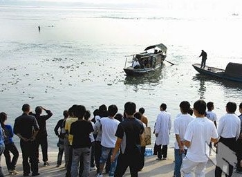
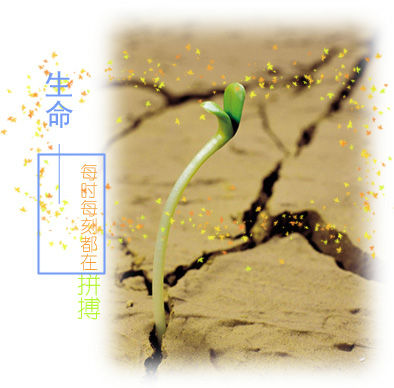

# 你的命到底值多少钱

# 你的命到底值多少钱

## 文/乔淼

在诗人、哲学家及一般感性的人看来，人命似乎是无价的；但在现实层面上，人命的价格至少可以部分地加以确定。当事时无暇顾及，容易把它作为赌注，来个“砍头不要紧，只要主义真”；事后要算帐，死亡成了不可弥补的赤字，才想起感慨“生命无价”来。——这真是极大的讽刺啊。 近来很受关注的两件事，大概可以用来参照。其一是长江大学众人下长江救人，多数不会游泳，最终三人不幸罹难；其二是浙大海归博士，心灰意冷于“学术环境”，以跳楼结束了自己的生命。死者已矣，本文的目的却不在悼念。作为彼时不在现场的活人，我们有时间、也有义务把死者不及考虑的问题想清楚：即所谓“To be or not to be, this is a question.” 

先说救人。两个孩子和三个大学生的价值是无法比较的，但不会游泳、是不是非得下水救人，我以为答案不言而喻。不会游泳意味着不具备救人的起码能力，明知道自己无能还要蛮干，岂止是不理智，简直有些愚蠢。这种蛮干（或者所谓“勇敢”）是不能被要求和提倡的，就像你不能教唆手无寸铁的人向坦克进攻一样。笔者有一位朋友，大冬天在公园里救起了一个落水的孩子，但此人身强力壮，又是游泳高手，还是军人：不救简直就是犯罪；但这几位大学生的情况又不是这样……总之，对逝者应该尊敬，但是否要响应“向某某同志学习”的号召，劝大家再想想，再想想。 

再说跳楼。人们对自杀的态度可以分为两种，一种认为个人有权结束自己的生命，一种认为没有。在情感上我支持前者，但仔细思考一下，后者似乎更有道理。最起码地，爹妈上辈子没有欠你，这辈子把你养大成人；你不赡养他们就罢了，还回报以极大的痛苦（一个人自杀，至少会给五个人造成严重打击），于情于理都说不过去。就算生命是自己的，烦请死前埋单先，不要在遗书上写什么“来生再报”这种废话。学术环境虽然恶心，但也并没像“文革”“反右”那样把你肉体和精神的价值都彻底抹掉……因此，对逝者我依然尊敬，但这样的结束，还是免了吧。 救人牺牲会得到追授的荣誉称号，会被造塑像，会有成千上万的陌生人参加葬礼，剧本会以黑字收尾；跳楼自杀的海归派会博得广大群众的同情（同时被扣上了“因病坠楼”的帽子）。加上亲属可能拿到的抚恤金，黑字大概到此为止。换而言之，社会以有限的资源为代价，收购了你丢弃的性命。千金散尽还复来，人死了却是无法复活的，仅此一点而言，赤字也将成为正无穷大，当然不合算。 

即使你不想丢弃它，也有可能被误取或强夺。活在这样一个吊诡逼仄的时代，你无法预测会被一辆“欺实马”撞飞，被一家“黑砖窑”榨干，抑或患上流感得不到及时治疗而死去。这个国家的法律为你规定了命价的上限：20年的可支配收入，只少不多。假如户口不幸还在农村，价格还会更贱。 但是你又不能不卖。一俟走上工作岗位，你就得化整为零地将生命变成时间，换取薪水来维系它本身的存在。把月薪除以工作日再除以小时数，你会发现自己的生命非但不是“无价”，简直是物美价廉了。可即使如此，加上你60岁后可以拿到的退休金，还是会比被横祸夺命和冲动送命的人要值钱许多。 一个大量廉价出卖性命的社会，到底谁在从中渔利，不是一句两句可以说清。但对于不掌握定价权的人来说，如何将这性命卖个好价钱，要如何将这点本钱加以利用，却是门值得下功夫的学问。活人依然活着，而且难免一死；死人已经死去，而且永不可能再活。到底什么时候“该”去死，怎么死最值得呢？借用阮小七的话讲，“这腔热血，只卖与识货的！” 如果想不明白，如果时候未到，不妨动心忍性，曾益其所不能。 

2009-10-30于北师大
