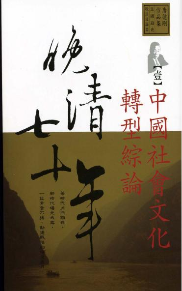
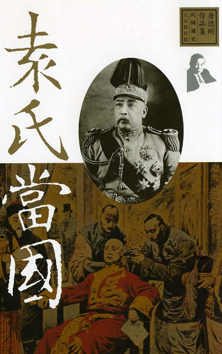
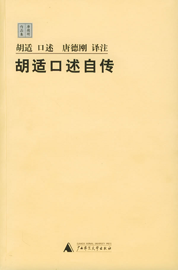
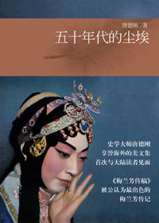
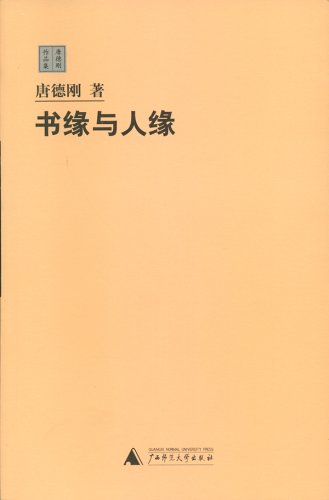

# 北斗电子书推荐——本期主题：唐德刚作品精选

# 北斗电子书推荐

## 本期主题：唐德刚作品精选

他上世纪40年代出国留学兼打工，50年代初获美国哥伦比亚大学哲学博士学位，60年代任纽约市立大学、哥伦比亚大学教授和亚洲学系主任，70年代尾随尼克松访华之后成为第一批被批准回中国探亲的人，80年代领导全球范围“胡学”(胡适研究)的“卷土重来”，90年代参与发起征集1亿人签名向日本讨还战争赔款的行动，赢得海外侨胞的尊敬……10月26日晚，著名美籍华人学者、“口述历史”的开山人之一唐德刚在美国旧金山家中因肾衰竭过世，享年89岁。 斯人已逝，唐德刚先生离去了。留下的是人们对他的无限追忆和对其著作的不断追读。让我们一起通过作品来领略大师的风采，来感悟历史的厚重。 

### 推荐书籍：

**1、《晚清七十年》**

**2、《袁氏当国》**

**3、《胡适口述自传》**

**4、《五十年代的尘埃》**

**5、《书缘与人缘》**

**《晚清七十年》**

《晚清七十年》这部著作是唐德刚教授用英文写成的中国近代史的一个“导论篇”，后经不断增删和改写而成一部中国近代史著作。本书由于作者观照历史的角度非同一般的历史学家，也因其极富个性和魅力的语言而在海外有极大影响；也正是因作者的历史观点与一般的历史学家晚清观点大不相同，《晚清七十年》在中国大陆迟迟未得出版。本版为国内首版，全书由“中国社会文化转型综论”、“太平天国”、“甲午与戊戌变法”、“义和团与八国联军”、“袁世凯、孙文与辛亥革命”五部分构成，并附有数十幅相关历史人物、历史事件的原始照片，极富历史震撼和可读性。 **《袁氏当国》**

上自孙文缔造共和肇始，下逮蔡锷护国运动兴起，寥寥数年，此乃袁世凯当国之年，国可谓不兴，民可谓不幸。 袁世凯如何在晚清政府和国民革命军政府之间养敌自重以觊觎总统宝座，宋教仁刺杀案的历史谜团到底暗示了什么背景，孙中山的个性对他改造国民党以谋求革命有何影响，袁氏当国时期的内政外交如何复杂多变，筹安会“六君子”与袁氏政府之间的关系到底如何，不该遗忘的古德诺教授的政治理念是什么。唐先生凭借其一贯的学者气节，不依风附草，不人云亦云，坚持论从史出，坚持言必有据。 **《胡适口述自传》**

一般人对口述自传的了解，大抵是从唐德刚这部《胡适口述自传》开始的。这是唐德刚根据美国哥伦比亚大学“中国口述历史学部”所公布的胡适口述回忆十六次正式录音的英文稿，和唐德刚所保存并经过胡氏手订的残稿，对照参考，综合译出的。这也是唐德刚在哥伦比亚大学与胡适亲身交往、提着录音机完成的一项傲人的“口述史传工程”。 在这里，胡适重点对自己的一生的学术作总结评价，而这评价反映出胡氏晚年的思想与他中少年期的思想简直没有什么出入。唐德刚将其英文口述译为中文后所作的注释评论，却是不可不读的好文章。这本书“传”与“注”已成为不可分割的整体，就学术价值和史料价值而言，注释部分的分量，恐怕还在传文之上。1970年代，海外史学界盛称《胡适口述自传》：“先看德刚，后看胡适。” **《五十年代的尘埃》**

《五十年代的尘埃》精选了作者1950年代在纽约发表的部分文章。 《梅兰芳传稿》既是作者的成名作，也是代表作。几十年来在海外反复刊载，被评家认为是所有写梅兰芳的传记、文章中最出色的。《我的女上司》等六篇小说的有趣，除了能让我们一窥五十年代留美知识分子的生活状况，更可以令读者领略一位优秀史学家的人生洞见和生命态度。《俄国的苍蝇和皮匠》由作者根据史学家何柄棣的一次旅行而记，文字亦十分有趣。 **《书缘与人缘》**

它们都是笔者平时意到笔随的札记的零星作品之汇积，没有显明的系统，也谈不到深度。不过笔者渐入老境之时，数十年国仇家难的煎熬和千百卷中西典籍的浸润，以及半辈子教读异邦、心怀故国的感慨，发而为文，也不能说没有发愤之作。只是我祖国文明深厚，当前世界学问无边。老骥伏枥，志在千里。终日栖栖遑遑，追随群贤，日夜进修之不暇，何敢以愚者点滴之得，故步自封？
