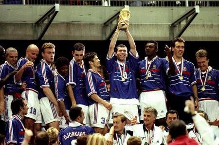
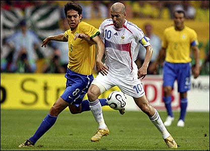
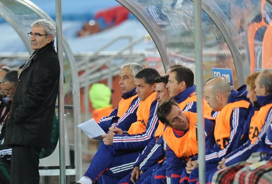
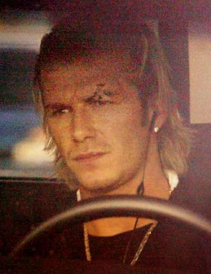
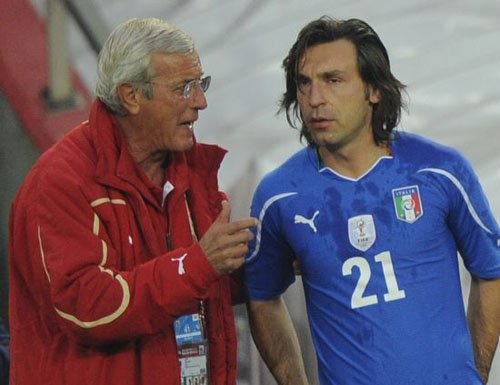
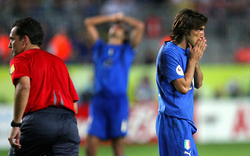
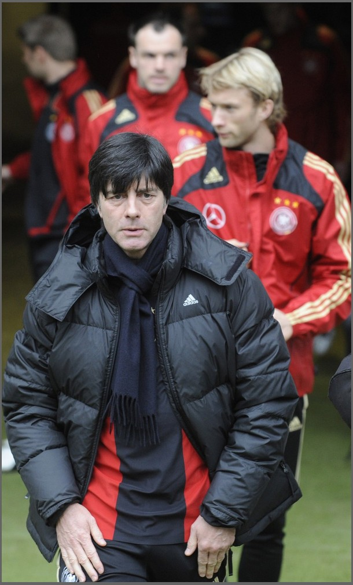

# 从“自由之殇”到“路径依赖”

# 从“自由之殇”到“路径依赖”

## 文 / 张弛（中国劳动关系学院）

 其实在06年的时候，法国队在小组赛中也是踉踉跄跄。但是幸运的是，领袖齐达内站了出来，于是我们才看到了世界足球史上的经典比赛之一：法国对巴西。我敢说，即便是当年风头正劲的意大利，也不一定能打破桑巴军团的魔幻四重奏。但是法国做到了，那帮老人们似乎都焕发了青春，特别是铁腰马克莱莱和维埃拉，如同两个动人的音符在欢呼雀跃。最后是齐达内的任意球，亨利的天才般的垫射，两个世界上顶级高手的几近完美的配合，绝杀巴西。 

 所以那时候我就说，法国是有很多天才的，但是：不能给他们过多的自由！比如亨利，如果不将其纳入整个的战术体系，不告诉他在场上的位置和作用，他将一无是处。自由与民主都是好东西，但是不是在任何场合都适用，因为它可能是散漫的和低效率的，特别是在这种团队的对抗性竞技比赛中。其实很多的教练都注意到了这一点，比如08年欧洲杯的西班牙队，就没有劳尔，而恰恰他们拿了冠军。教练的作用是从整体上做一个宏观的布局，比如今年的阿根廷队，有梅西这样的天才前锋，马拉多纳却将其作中场球员使用，虽然梅西迄今为止并未进球，但是他用一己之力激活了整条锋线！ 

 这便是马拉多纳的权威和智慧！与之对比的正是法国队主教练多梅内克的懦弱与无助。所以从精神分析的角度，多梅内克兼具“外射”（Projection）和“内射”（introjection)的双重性格，所谓之“外射”，是一种逃避责任，掩盖自己过错的技巧，即自己有了过错时不责备自己，却说是别人的错儿。在法国队的更衣室矛盾激化时，多梅内克并没有去检讨自己的过错，却是由自己来宣读球员的“罢训书”，这实际上是违反程序的，他这么做的目的实际上就是为了将球队失利的责任归结于球员，而他恰恰忘了，他才应该是球队的大脑！与之相仿的是某些中国前国脚在朝鲜队大比分失利后做的一些言论，实际上他们的很多言论是有道理的，但是其中的个别语句明显地渗透了他们的这种“外射”的情绪。比如：朝鲜队一天训练18个小时都没用，朝鲜在打肿脸充胖子云云。因为朝鲜队一有稍微上佳的表现，他们就免不了成为被攻击的对象，这也算是他们的一种自卫（defense）吧！ 所谓之“内射”， 是指一种过程。一个人利用它来吸收周围世界的各种感觉、欲望、观念和情绪态度。多梅内克就是这么一个没有主见的人！他知道自己可能管理不了某些球员，但是基于环境或者舆论的压力，他又不得不把他们招入麾下。另一方面，在出场阵型上，他有自己的思路，有自己钟爱的球员，但是又不断地受到他人的左右，于是造成了法国队的悲剧。而侧目巴西的教头邓加，就打造了一支属于自己的球队，弃用了很多大牌，朴质无华，但锋利无比。这些都是两支球队不同结局的根源。 

 如此看来，法国队的悲剧，从四年前齐达内退役，法国足协留任多梅内克那一刻起，就被注定了。当年的曼联，小贝和弗格森不和，只能是小贝远走他乡，这才叫主教练！多梅内克显然不具备成为一个法国队优秀主教练的“健全人格”与气质，他“试图与球员形成一种情同父子的关系”？对不起，那些优秀的天才的老资格的球员并不会买他的账，这个第一个公开承认使用心理战术的人，我真不明白他为什么不在自己的性格与情绪中来扬长避短。 或许意大利并不适合非洲战场，不管是北边的埃及还是南边的海岸。但是，昨天绝对不仅仅是意大利足球的耻辱日，整个欧洲，在这几天颜面尽失。前两天，我们送走了亨利，送走了里贝里，昨天，我们又送走了皮尔洛，送走了加图索，送走了卡纳瓦罗，而他们，都曾出现在06年世界杯的决赛。 

 昨天的比赛开始之前，我就说我很担忧，因为皮尔洛没能首发。06年意大利的如鱼得水，正是因为前后场分别有两个核心：托蒂和皮尔洛。没有了托蒂的意大利，前场的攻击力大为减弱，在打防守反击的时候会严重滞后。而皮尔洛，又正是后场的核心，意大利队的有效地进攻，很多时候都是靠他在后场发动。当托蒂和皮尔洛都不在场上，只好将整条后防线靠前来加强进攻，而这恰恰与意大利的经典或者说习惯打法是不相符合的，于是我们看到了一个如此糟糕的上半场，而且这条糟糕的后防直接导致了对方的进球。 下半场由于皮尔洛的替补出场情况有所好转，但是我们明显地看到前场少了一个组织者，皮尔洛参与进攻的话也只能在中线附近将球传出，进攻仍旧是很无序，说得直白说得通俗一点就是少了个托蒂！或许有人质疑说足球是11个人的运动，为什么这两个人如此重要？我想传奇足球教练梅诺蒂说得好：足球就是一项8个人抬钢琴3个人弹钢琴的运动。可惜了，意大利只有抬钢琴的。 

 我当时就在想我是里皮的话我该怎么解决，后来我发现没法解决，在现有的意大利的战术体系下，有些位置有些人是根本替代不了的！这就是惯性，在物理上叫惯性，在人类社会中叫“路径依赖”。而整个欧洲，都深受“路径依赖”的戕害。我们看法国，从98年以来中场就过度地依赖齐达内，当然了，这个浪漫的自由的国度对齐祖不光是场上的依赖，在更衣室里也是如此。 我们看英格兰，现在回想起来，小贝其实主宰了02年和06年的很多比赛，特别是06年，几乎是凭一己之力将英格兰送进8强。而且由于他的存在，英格兰的长传冲吊的打法发挥得淋漓精致，所向披靡。而他走了之后，英格兰就萎靡不振了。其实麦克阿伦当年剔除小贝的愿望是好的，是想打造一支崭新的英格兰队，可是他是空有其志，不见其威也不见其实。而且06年的时候，埃里克松的战术体系也是有问题的，如果他将小贝的位置稍微靠前，打前腰的话，结局可能不致于此了，当然，这是过气话。 而且欧洲似乎今年有点时运不济，德国在8分之1决赛将对阵英格兰，又将有一支传统劲旅要打包回家。但是这对欧洲足球未尝不是一个反省的机会。不要说我们的足球没有了托蒂没有了齐达内没有了贝克汉姆没有了巴拉克就没法看了，要知道，我们曾经也没有过范巴斯滕没有过普拉蒂尼没有过克林斯曼没有过罗伯特巴乔！而摒弃“路径依赖”的桎梏，打造一支“浚其源泉”的球队，正是这些欧洲国家要做的事。中国的古诗说得好：问渠那得清如许，为有源头活水来！ 

