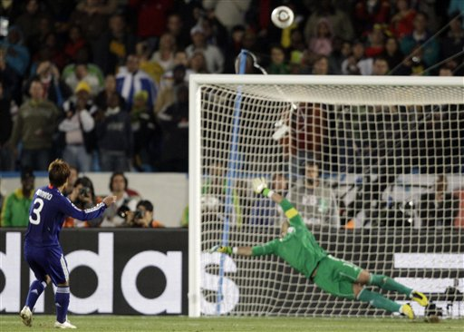
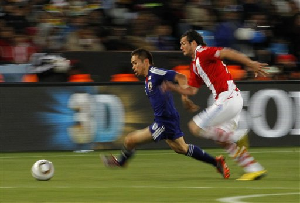
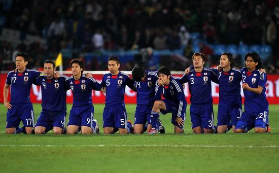
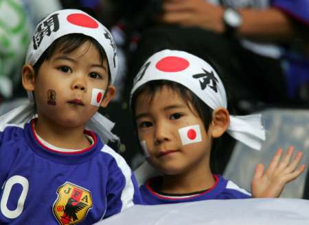

# 苍穹之泪：日本没跪出胜利却跪出了尊严

# 

# 苍穹之泪：日本没跪出胜利却跪出了尊严

## 文 / 井友至（辽宁外经贸）

 完完整整看完日本和巴拉圭120分钟闷战绝对是一种煎熬，除了中场休息广告里林志玲嗲嗲的说出理想的男性标准“成熟、勇敢、有掌控力”；以及段暄不甘寂寞几次伪高潮的大吼划破夜空；就只剩下催眠的元素了。甚至有球迷开始诅咒“龟缩太郎”日本队和“巴拉乌龟”巴拉圭队一起被淘汰，因为如此保守功利、如此缺乏营养的比赛，不该出现在世界杯的淘汰赛阶段。 以往的日本队靠地面层层渗透大打攻势足球，但因缺乏强力中锋，身体对抗普遍吃亏，效果并不理想；而如今的日本队立足防反，球员启动快、出脚灵的技术优势反而得到更好的凸显，主帅冈田武史固执的不在首发阵容里安排一名前锋，日本人学会了丑陋。日本和巴拉圭球员你来我往在中场把草皮都踩秃了，但都很难把战火燃烧到对方禁区，直到点球大战，好戏才刚开始。 

 一只眼睛大、一只眼睛小的远藤保仁长得很像《烈火金刚》里的猪头小队长，但人不可貌相，这位仁兄第一个点球顶住了重压，随后队长长谷部诚的怒射也不辱使命，然而第三个踢点球的驹野友一将球狠狠砸在横梁上——冈田武史难看的鞋拔子脸变得更加难看。头号球星本田圭佑假动作轻松罚进第四个点球，让命悬一线的大和民族保住了一线生机，此时惊人的一幕出现了…… 

 日本球员集体跪在绿茵场上默默祈祷，是在召唤天照大神快快显灵，是要用大和魂彼此激励，还是仅仅一种本能的情绪表达，我们不得而知。但那一刻起，我们看到了日本人对足球的虔诚，他们像宗教那样信奉着足球，这早已超出了胜负的范畴，可能是为国出战的使命感、可能是为亚洲正名的责任，更可能是要颠覆欧美列强的雄心壮志，总之日本队跪下了，没有跪出胜利，却跪出了尊严。 足球的归足球、政治的归政治，日本队对于足球的虔诚是值得我们中国人好好学习的，为什么中国足球冲不出亚洲，为什么中国足球丑闻不断，为什么中国足球沦为笑料，由此不难得出结论。中国国脚断然不会为足球下跪，让他们膝盖发软的估计只有婊子、票子和黑社会。香克利说“足球高于生死”，肯佩斯说“足球是一种信仰”，桑塔纳说“足球能净化灵魂”，而在中国，足球究竟是什么东西？ 

 日本历史自从诞生的那一刻起就深深信靠神性的力量，在他们的神话里，整个日本岛国都是伊邪那岐命和伊邪那美兄妹二神做爱的产物。日本足球队尽管球员身材猥琐、尽管不产优秀前锋，但他们对职业联赛的执着，对技术流风格的探索，对足球下跪的虔诚，不正是林志玲所谓的理想男性标准吗？上世纪80年代日本足球也就是比中国香港队强一点，赢中国队都算冷门，而现在赢中国算什么？仅仅从绿茵场上来说，我深深得敬重日本人。
