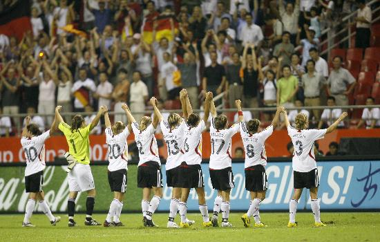
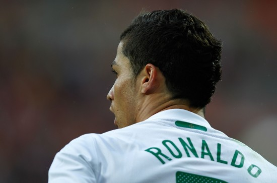

# 南非时刻

# 南非时刻

## 文 / 张菲澳（上海金融）

 据说奥巴马扬言，只要美国队在世界杯上进16强，那哥们儿就坐着“空军一号”来南非现场督战。南非组委会显然不愿美国队晋级，意大利和乌拉圭开赛前，当地的保安就因为组委会没能按期支付区区800人民币的酬劳发起大罢工。要是奥黑一来，这安保费用不double上去啊！在这个穷得只剩黄金和劫匪的国家要举办一届成功、精彩、难忘的世界杯谈何容易，毕竟是当地的财力、和谐程度远不及我天朝。 

 想当年德国世界杯的时候，我看完意大利队第一场比赛就和老爸打赌冠军出现了，即使东道主德国队呼声再高也无法改变自己的立场。冠军是有气场的，战术上也能顺利地解决任何问题。从本届杯赛登场各队的表现来看，只有德国和阿根廷能够初步达到这样的标准。 

 这届比赛我不看好欧洲球队。足球比赛讲究“天时地利人和”，“人和”很好理解，就是裁判嘛。这地利指的是当地的气候、风土人情，历史上欧洲球队还没有在欧洲本土之外夺冠的记录。再说，今年欧洲风水不好，南欧经济体的主权债务危机席卷欧洲大陆，这不，希腊国债的评级被穆迪连降4级，沦为“垃圾级”。希腊首战输给了韩国，好在是韩国赢了，不然雷哈格尔（希腊主帅）都有成为韩国人的危险。历史同时告诉我们，身处内忧外困国家的球队也不是都是扶不起的阿斗。2006年蓝衣军团意大利队一举捧得大力神杯，为陷入“电话门”赌球风波的亚平宁半岛重新点燃了希望的火种。2007年，饱受内战摧残的伊拉克人民奇迹般收获了本国历史上第一个亚洲杯冠军。如果按照股市里的逻辑，目前欧洲利空尚未出尽，欧洲球队没戏！ 

 不过单纯从“地利”上看，气候原因不应该是强队发挥不佳的借口，高洪波的球队就在类似环境拿下法国嘛，后来弄得新闻发布会上法国人都不敢提这场热身赛。平心而论，今年亚洲球队的表现可圈可点，韩国人真成了“棒子”，敲晕了欧洲冠军希腊队；日本虽说小，昨天也没在非洲雄狮面前乱了阵脚；中国队也牛，双料冠军法国队都不在话下，人家还都是全主力。咱亚洲球队真的不差，朝鲜队更是放出狠话，“金日成将军会给我们力量，我们的技术不输任何对手”。赛前已有不少网友大胆预测本场比分……其实能打平就不错了。最差劲的就是澳大利亚队，老迈的后防线（后防线加起来都140多岁了）在平均年龄只有25.4岁的德国战车的冲击下已经一塌糊涂了，真的一塌糊涂。其实说到底他们也不能算亚洲球队，只是貌似代表亚洲。 最后说说比赛用球吧，阿迪达斯每届比赛都要整个新的玩意儿，02年的叫飞火流星，06年的是团队之星，这次到挺“中国风”叫“普天同庆”。英格兰门将格林肯定不会同意这个叫法，应该叫“落地杯具”。高科技是要付出代价的，研发团队将8块球皮通过无缝技术拼接成一只能飞出飘逸路线的足球，也怪不得格林的手套这么油了。不过这也为任意球高手们提供了机会，等下看C罗的吧！ 

 等看完第一轮再预测吧。
