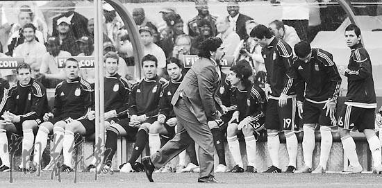
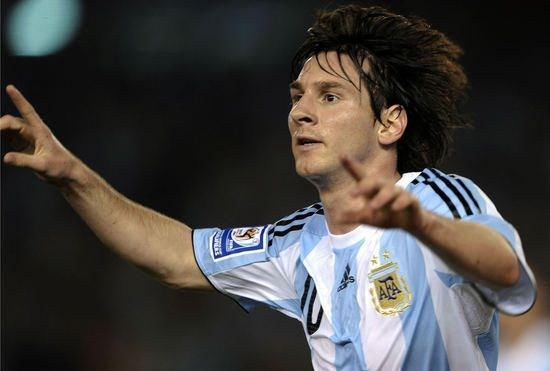
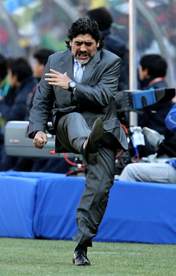
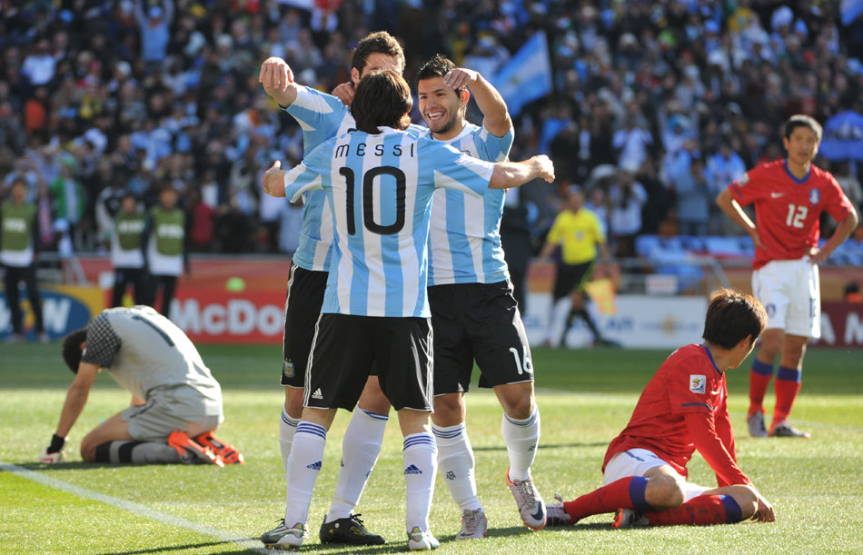

# 稳定压倒一切和像坏人一样勤奋

# 稳定压倒一切和像坏人一样勤奋

## Limbose7en（复旦大学）

 阿根廷终于醒了，时间和四年前一样，都是第二轮小组赛。当时面对国家分裂无心恋战维迪奇还重伤退赛的塞黑，比分更大一些但是梅西和特维斯的一条龙进球多少都有点假。而今天，面对首战出色气势汹汹的百度神兽之一的高丽蚌，阿根廷打出来的足球依然让人血脉贲张，比起四年前的意义深刻了太多，球迷可以展开的遐想也太多。 潘帕斯雄鹰的天赋和激情足以秒杀看客的各种理智。任何一支在状态的阿根廷不是那种让你边看边优雅地微笑鼓掌的球队，你甚至描述他们的进攻不能说“漂亮”要说“真他妈的漂亮”……就像顶级金属乐队的演出，观赏的时候不用组织语言不用思考只需要打出金属的手势高喊motherfucker。 

 这样的阿根廷出现在了昨天的足球城体育场。请忘记德米的失误和廉基勋的单刀吧，在回想起那场比赛的时候。韩国人尽力了，他们一直试图把比赛掌控进自己的节奏，并且一直没有放弃努力，最后时刻朴智星还在尝试射门。只不过换下寄成庸让人觉得十分不解。然而他们遇上了打疯了的阿根廷——和对尼日利亚相比，本场比赛阿根廷的几处细节上的改变可以说对球队的整体运行起到了关键的蝴蝶效应。一是伊瓜因和特维斯本场比赛互换了位置，二是下半场阿昆的替补出场。上一场野兽拉在右边显得不够犀利，西瓜在突前的位置上也放不开手脚，然而这场比赛，伊瓜因到了右边，而特维斯被顶到了中路偏左的位置，刚好是最适合野兽在各种反击中开足马力奔袭和内切大力轰门的位置。由此阿根廷的进攻被集中在了左路和中路，而这时出现在远点的伊瓜因便可以站在他擅长解决问题的位置上。再加上位置后撤的梅西——想起来最后竟然是梅西让人忘记里克尔梅还是有些不可思议的。马拉多纳没有把梅西定位成巴萨的进球机器，而是把梅西拉到中场让小跳蚤的灵动和创造力尽可能完整地覆盖草皮，这样的构想在几场比赛的试验之后终于开花结果，梅西依然由于运气问题没有收获进球，然而奉献了助攻更统治了球场，特维斯和伊瓜因，包括下半场上场的阿昆，都多次受益于梅西的做球。而且即使位置回撤梅西也没有被防守什么的束缚，马斯切拉诺和马克西为他打理了一切。马克西是今天的奇兵，看到经验丰富的边路老将回到中路调度我总能想起吉格斯。好了跑题了，总之当全世界都在看老马如何模仿巴萨的时候，老球王用砖家们看不到的视野让手中最华丽的一颗棋子变得更像自己。 

 说道马拉多纳的执教水平，其实马拉多纳草草收场的第一次执教经历很少被人研究。当时老马执教一支低级别球队，球员的资质普遍太差理解不了老马的思路，于是最终不欢而散。而现今的阿根廷有着足够多的天才有很大的可能和老马真正形成默契。看看老马现在做的这些事情，偏执中不乏反思，阿根廷从4312到3412再到4213，梅西从3到2变成1，直到最近两场比赛终于走出困境……是的，老马王不愿意当和事佬，因此弃用了很多可能影响到他在更衣室权威的大牌和硬汉，然而他手中的球员依然不乏天赋和精明，并且都能唯他马首是瞻，都能为球队服务。关于临场指挥，本场比赛他在下半场遣上自己女婿堪称画龙点睛之笔，阿昆速度比特维斯更快，和梅西的配合也更默契，果不其然地刚刚上场就和梅西合力一通旋风快打给心气颇高的韩国人开了眼也把比分改写成三比一。并且，最近两场比赛努力创造机会让博拉蒂和米利托这些本不在他计划内的球员上场也体现了老马的义气。最后，老马必然是所有坐在教练席上最勤奋的一位——我们不把他当好人，然而按老罗的说法，这个世界上往往坏人会更努力一些。从这个角度讲世界是一个怪胎，怪才总是要被卫道士们带着愚夫愚妇诽谤污蔑一通又一通，然而那帮占着茅坑不拉屎的穿西装打领带的流氓庸才却选择性失忆地对谁开拓了文明表示无知……好了又跑题了。 上一场比赛小烟枪受到的非议有些不公平，对阵尼日利亚他获得的机会多少都需要一点即兴发挥，对于一名国家队的新手除非像马里奥•戈麦斯那样把门前半米的空门打飞你不能苛求他上来就任督二脉畅通无阻。而本场比赛西瓜为自己正了名，三个进球捡漏的成分居多但是能把漏捡得滴水不漏也值得被用帽子戏法奖励，就好像平日那些难题不会做简单题不丢分的童鞋大多都是考试成绩不错的童鞋……在皇马从最底层一步步奋斗到当家花旦的位置，西瓜不缺少勤勉和扎实，而要在大赛中走的更远这都是不可或缺的品质。另外一个第一轮赛后得到恶评的是迪马利亚，本场比赛承担了更少的防守任务以后天使之翼的表现也很有改观，在本菲卡的那些花哨过人和精准传中本场比赛有所闪现，只不过阿根廷最近一个出彩的纯边锋……得追溯到1978年了。总之，尽管仍然有一些不足，比如后防线的失误太多，比如今后遇到长人林立的球队阿根廷的定位球还能否为他们打开僵局尚未可知，然而他们毕竟成为了第一支在真刀真枪硬碰硬的比赛中打出看点的球队。阿根廷或许持续着冠军相的缺失，然而一向只有他们能为球迷奉献真正激情的夜晚。不过本届杯赛注入了老马的霸气和梅西的鹤立鸡群以及小快灵思路的统一，我们完全可以期望他们走的比想象中更远。 

