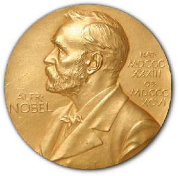
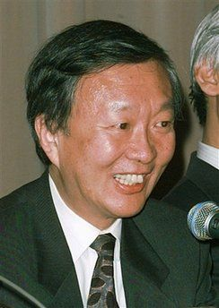

# 诺贝尔的葡萄有点酸

# 诺贝尔的葡萄有点酸

## 文/华东理工大学学生

  栋梁是个农村走出来的大学生，小时候饱尝过家贫的滋味。在上海这样的城市里，栋梁难免有这样那样的憧憬，不过他一直很清楚，为他准备的路没有那么多可能，从小树立并被反复强化的理想有两个，一曰钱，一曰权。读书从来都是并且也将继续是获得这些的途径，文商理工法只是就业率数字上的区别。小学的作文本里也曾隐约出现过生命科学家的稚字，终究随那些方格本一一散佚了。作为工科学生，栋梁也许读着读着也能成个科研工作者，或者更幸运些，能在学位帽下面添一身官服，那就再好不过了。 栋梁的老爸很崇拜小平同志，尽管他没能随三十多年前的天赐良机飞上枝头，但他的儿子终于有了得到非农户口的机会，兴许还有个非农户口的儿媳妇，真是想想都忍不住要笑出来。从他们那一辈人起，“读书改变命运”和“科技是第一生产力”是不容置疑的真理，决不允许任何人擅自更改为“知识改变命运”或“科学是人类对自然与社会的探索”。到这里，你该明白了栋梁的故事告诉我们什么道理。 

 自中国从集体政治生活的热潮开始涌向经济发展的“复兴之路”以来，科学便一直颤颤巍巍地跟在技术和产业的后面，托着那位风头一时无两的经济姑娘红得扎眼的卡其布长裙裙摆。对经济数据尤其是GDP不顾后果的狂热追求使公共政策在制定之时便注定了只能是一个接一个的“五年规划”，科学的发展也逃不脱“边扔石头边过河”的悲剧。在成熟的市场经济和独立的学术体制没有完全建立之前，我国的科学事业发展仍然只能主要依靠国家力量的支持。事实上，所谓“三十年来的重大科学成就”几乎都在国家重点攻关的涉及国防与经济命脉的方面。然而，现实是我国与科学相关的政策制定和财政审批时千篇一律采用量化评价标准，更对中短期效益提出迫切要求，原本就不多的支持科学事业发展的政策与财政一股脑地给了“经济正确”与“政治正确”的项目，难以预期收益的高端科学与开创性科学的发展举步维艰。诚然，在经济发展初期花很多的人财物力去引进技术、开发基础应用科技这些都可以理解，这里要说的是意识问题。 

 人始终是最重要的因素。对于中国科学的发展来说，这也恰恰是最大的软肋。一方面，科学传统积淀不足和求富求权的社会风气使愿意且有能力从事科学研究的人比例极少，另一方面，八十年代末的政治风波让爱国主义成了笑话，大批具有良好科学素养和巨大发展潜力的人才飞赴美利坚英吉利，诚可谓釜底抽薪。 在诺奖希望屡次落空后，很多人习惯于将矛头指向现行教育体制，虽然我对中国教育尤其是大学扩招以来的高等教育没什么好感，但让教育体制来一力承当诺奖失利的责任着实有些冤屈。毕竟，即使是老三届的学生到今天也才刚刚迈入科研的黄金年龄（什么？你说七七年以前？我还真不知道那时候有什么教育......），有那么一点出成果的可能，而众所周知，诺贝尔奖总是会“迟到”那么十几二十年，要说中国的教育培养不出诺贝尔奖，还得等些时候。澄清这一点不意味着当前教育不需要反思改革，只是，要真正发展好高端科学与开创性科学，不能只拿教育体制说事儿。毕竟诺贝尔奖终究会花落中国，通过反思改革创建出正常、健康而有发展活力的教育和科研环境，才是我们这些分不到诺贝尔奖金的人最应该关注的。 至于文学奖，我想没什么好抱怨的。一个简单的道理，并不是你努力你优秀人家就一定会喜欢你。 

 至于和平奖，我不怀好意的揣测，只怕我党和政府为了不让中国候选人获奖花了不少的功夫，使了不少的手腕。 至于经济奖，我还是泼一瓢冷水吧。我们实在不该在经济危机中为中国的“一枝独秀”大开香槟，不该为G20和金砖四国就觉得扬眉吐气，这还远远不是中国主导的时代，这还远远不是西方经济学向中国取经的时代。 只是，只是，诺贝尔的葡萄还真是有点酸......
