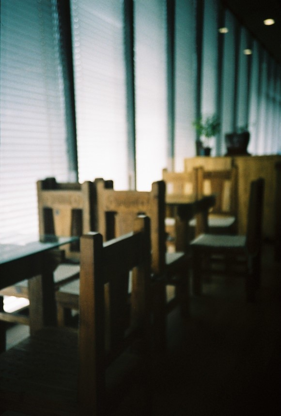
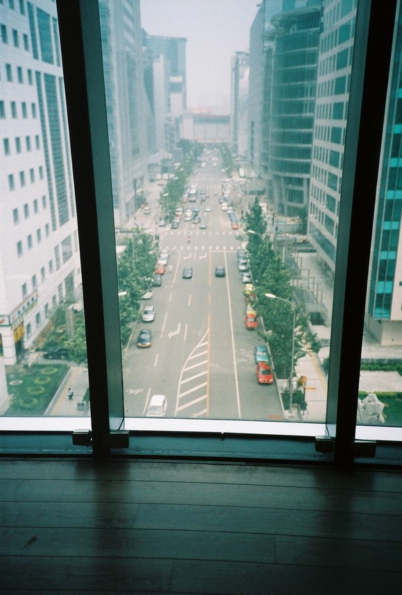
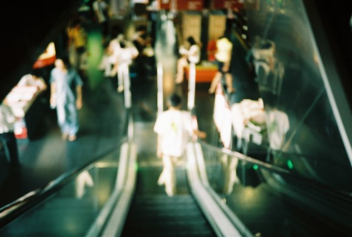

# 再见，第三极

**“如果有一天，这些有人情味，有自己的选书眼光的书店们彻底消逝在你我的世界，你我只能选择愁眉紧缩地走过大卖场似的新华书店们，宁愿生活中不再有书店，也不愿看着书们被毫无生气地堆放着。……再也不会有意外发现一本好书的惊喜，也再也享受不到那样一个下午，盘腿坐在书店的角落，晒着太阳，看着书。 也再也碰不到那样的店员，累得满头大汗的帮你找一本书，然后对你说：‘啊，我们有这本书的第一版。’”**  

# 再见，第三极

## 文/中国农业大学学生

  第三极书局终究还是搬离了那栋通透明亮的20层大厦，屈身于大厦旁边的昊海楼地下一层，没有窗，再见不到阳光。与中关村图书大厦打了三年的价格战，终于以亏损4600万惨烈收场，民营书店始终是斗不过后台强大的国营书店。 大一的时候把第三极当作我周末得以逃离集体生活的藏身之地，如无要事，几乎每周准点报道。刚去的时候，6楼有一个“舶来书馆”，专售港台图书与外文图书，由于人少且港台图书设计精良，价格昂贵，于是我便热爱蜗居在它的一脚小心翼翼的蹭一本有一本的台版书看......后来，“舶来书馆”这个名字变成了“港台图书”，那一区的书也被挪到了一个角落。再后来，港台图书们被堆在五楼，一堆鸡肋CD的旁边，一律7折出售，却也依然鲜有人问津。每每经过它们时，我就产生一阵负罪感，我曾经一毛不花的把人家看光光并有所收益，如今它被贱价销售，我却装作不认识的潇洒走过，岂不是流氓？后来一想，当流氓也那么多年了，非法下载音乐百G，盗版软件也用得很自如，一次装腔作势的假惺惺的以贱价将其买之的行为并不足以消除我流氓的罪名。而且，我不过是云云流氓中的一员，此种侵权的流氓行径分分秒秒都在我所生活的这个世界绽放着一朵又一朵看上去很强盛的奇葩。 第三极所亏损的4600万，其实都是为我等流氓所消耗，它给了我们舒适的环境，明亮宽大的落地窗，可以席地而坐的木地板，冬暖夏凉。最新最全的图书与杂志供你随意翻阅......而以上这些服务，是不收取任何服务费用的。在你享用了一切免费的服务之后，它笑脸盈盈地告诉你，买书可以打8折。可是你却拽拽的说：“网上比你便宜，谁在你这买啊。 ” 真是一个占尽了一切便宜之后，不仅不卖乖还恶言相对的流氓！ 而我们却不知道，在它告诉你买书可以打8折的笑脸之下是一具怎样日益消瘦的病体。网上说，9折是这家书店可以维持收支平衡的底线......三年之中，第三极曾经去找过中图商议“复价”，也就是把图书价格提上去，可是中图拒绝了它。有新华书店集团撑腰的中图不怕亏，咱国有的怎么也不怕亏。 终于，那个风光的独占四层的第三级被中图逼死了，被你我占尽便宜之后耗死了......现在的第三极，是一具蜷在昊海楼地下一层的病体，看不见阳光的它，还能活多久？ 其实，老之将至的民营书店并不止第三极一家，光和作用已不靠卖书赚钱，雨枫书馆则连续亏顺，单向街也搬离圆明园，三联书店销量逐年下降，备受瞩目的万圣书园芳草地店也已经关门歇业...... 如果有一天，这些有人情味，有自己的选书眼光的书店们彻底消逝在你我的世界，你我只能选择愁眉紧缩的走过大卖场似的新华书店们，宁愿生活中不再有书店，也不愿看着书们被毫无生气地堆放着。然后回家打开电脑，网上购书，或者无耻download电子书。 再也不会有意外发现一本好书的惊喜，也再也享受不到那样一个下午，盘腿坐在书店的角落，晒着太阳，看着书。 也再也碰不到那样的店员，累得满头大汗的帮你找一本书，然后对你说：“啊，我们有这本书的第一版。” 也不可能遇到那样一个老板，微笑着对你说，“我们书店啊，几乎不赚钱，可是我要是关了，你们去哪呢？” 这个老板是我家楼下那家书店的老板，从7岁起我就每日去店里玩，看书，或者与老板聊天，那里是我们一堆人的根据地。老板看着我们长大，我们也参加了他的婚礼，他小孩的满月酒......的确，如果没有那家店，我们那一堆人以后去哪聚集，如果没有那家店，我想，我们也不会成长我现在的我们。 一家有人情味的书店存在的意义绝对不是一个图书买卖的场所，如果当时的伦敦没有莎士比亚书店，《尤里西斯》何能被世人所知；如果当时的台湾没有文星书店，台湾的文化怕是不会像现在一样精彩。 试想一下，如果现在的台湾失去24小时营业的诚品书店，贵阳失去西西弗书店，厦门失去光和作用书房与晓风书屋，南京失去先锋书店，上海失去季风书店，北京失去万圣书院与三联书店......也许有人会说，这些书店的存在与否根本不会扬起他生活中的一粒沙，可是对那些在这一家家书店的帮助之下所成长起来的人们呢？你们是否也能无动于衷的看着他们在你眼前慢慢老去，甚至死去。 我不知道在未来会不会如同当年印刷本取代抄写本一样，今天的印刷本也将不可避免的被电子阅读所取代，但我知道电子阅读与纸质阅读的区别并不仅仅是文字载体的不同。越来越多的人已经意识到电子阅读对我们的思考方式已经产生了不可逆的改变。有人说，互联网与电子阅读的方式让我们越来越愚蠢。 这个话题对我来说，讨论起来很吃力，我现在脑中很混乱，我知道基于纸质的的学习方式与基于电子的学习方式的是有巨大的不同的，然而不同在哪，我却没有能力却说清楚。孰是孰非？我的上一辈人说电子阅读让人变得无法集中精力与粗浅，而我的同辈人却说电子阅读让生活更加快捷与方便，获取咨询跟快，更多。 粗浅的我无法对其进行评价。 不管未来会怎样，不管这些书店们会不同纸质阅读的方式一起成为历史， 我想，为了避免这些可爱的书店们先于纸质阅读被无情毁灭，我们应该有意识的去收敛我们的流氓行径，起码在愉快分食那些免费的资料的同时认识到这是一个流氓勾当。当我们的国家离所谓共产主义还无法估算的远时，我们就高举着文化产业“共享主义”的大旗，似乎是不对的，越来越多的唱片公司与出版商，书店在这面大旗的挥舞之下早夭了......然而我们从中真的获益了么？ 这也的确是一个我不够资格去讨论的问题。这是个几乎人人都对文化产业耍流氓的世界，文化产业也已一种不太适合的方式来应战。呃......这是个大问题，只有流氓头子们才能真正解决的大问题，我这种自以为还有些良知的小流氓也只能发发牢骚之后继续听从流氓头子的安排。 那个曾经位于北京市北四环西路66号的第三极书局，再见了。  **附：曾经在第三极随手拍的一些照片** 

谢谢你曾经提供这样好的阅读环境。

谢谢你曾经提供如此的好风景。

而那栋美丽依旧的大厦里，再也不会出现如此的风景。
