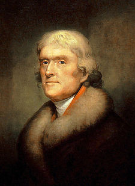
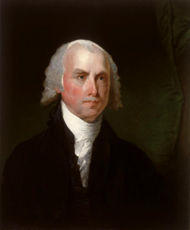
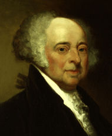
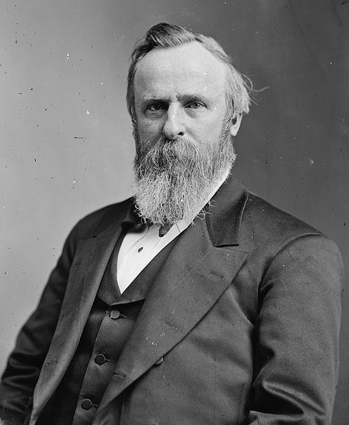
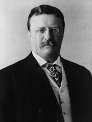

# 北斗电子书推荐——本期主题：曾经的美国总统们

 

# 北斗电子书推荐

## 本期主题：曾经的美国总统们

  **推荐书籍：**

### 1、《美国民主的先驱 托马斯•杰斐逊传》

### 2、《美国宪法之父 詹姆斯•麦迪逊传》

### 3、《被遗忘的总统 约翰•亚当斯传》

### 4、《重建时代的领袖 拉瑟福德•B.海斯传》

### 5、《鲁莽的麋鹿 西奥多•罗斯福传》

 **当奥巴马获得09年诺贝尔和平奖的消息一经被爆出，立即成为了当下的热门话题，美国总统这个职位又一次走到了聚光灯下，当然了，这个位置上的人始终也未曾离开过媒体们的视线。只是这一次的出现显得那么特殊，至于特殊之处，世人在谈论着自己的观点。爱出风头的小布什终于走了，没想到刚接班的奥巴马更是接连为舆论界提供了更加吸引眼球的热点素材。也许我们应该回头去看看，看看那些隐藏于史海却又影响了现代美国甚至世界的美国总统们。放下不停的争论，只是让我们去领略他们的不朽人生。** 

### 《美国民主的先驱 托马斯•杰斐逊传》

 托马斯•杰斐逊(1743—1826)，美国第三任总统。他起草了举世闻名的《独立宣言》，以不可思议的低价购买了路易斯安那……在政治舞台上，托马斯•杰斐逊可谓功盖千秋。但退稳山林之后，他却面临另一种生活境况。8年总统生涯的微薄收入根本无法支付各种开销，反而使杰斐逊欠下5万多美元的债务。1826年7月4日，在《独立宣言》发表50周年的当天，杰斐逊在弗吉尼亚州的家中与世长辞。 

### 《美国宪法之父 詹姆斯•麦迪逊传》

 詹姆士•麦迪逊（1751—1836年），美国第四任总统。他曾与汉弥尔顿等人合著了《联邦党人文集》，亦被一些人视为“美国宪法之父”。本书叙述了麦迪逊政治生涯中的重要事件，并阐述了麦迪逊的性格对其政治生涯的影响，是国内读者了解这位美国宪法之父的优秀读物。 

### 《被遗忘的总统 约翰•亚当斯传》

 约翰•亚当斯（1735—1826年）是美国第一任副总统，其后接替华盛顿成为美国第二任总统。 亚当斯一直处于华盛顿与杰斐逊的阴影之下。冲动易怒的性格让他看起来并不适合当一个总统，但是，在许多方面，比如能力、经历与威望上，他又是华盛顿的继任者。在亚当斯任职时期，除了保持中立与恢复和平外，他还创立了美国海军部，使得海军站稳了脚跟，并留下了偿付能力巨大的金库。虽然他是北方的联邦同盟盟员，但是他却努力建构温和的政党体制。到最后，这被证明是亚当斯最大的失败，也是后来的领导者接受的最有意义的一课。本书叙述了这位似乎被历史遗忘的总统的政治生涯。 

### 《重建时代的领袖 拉瑟福德•B.海斯传》

 拉瑟福德•B.海斯(1822年—1893年)，第十九任美国总统，其和党人。海斯出生于俄亥俄州，曾做过律师。任总统前，他曾任自俄亥俄州第二选区选出的美国众议员(1865年—1867年)和俄亥俄州州长(1868年—1872年，1876年—1877年)。1893年卒于俄亥俄州。海斯被称为美国重建时代的领袖，本书叙述了其有争议的政治生涯。 

### 《鲁莽的麋鹿 西奥多•罗斯福传》

 西奥多•罗斯福(1858年—1919年)，美国军事家、政治家，第二十六任总统。曾任海军部副部长，在西班牙战争前主张作战，并在战争中成为英雄。他最先预见到保护自然资源的重要性，并且为之做了不懈的努力；他积极推行反托拉斯法令；在国际事务中，他常常出奇制胜，让人惊叹不己。他那传奇般的经历更让整个世界为之赞叹。事实上，西奥多•罗斯福是第一位走出国门的美国总统，他预见到了美国作为世界一级在国际事务中所要扮演的重要角色。
