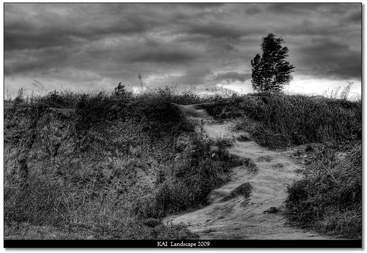
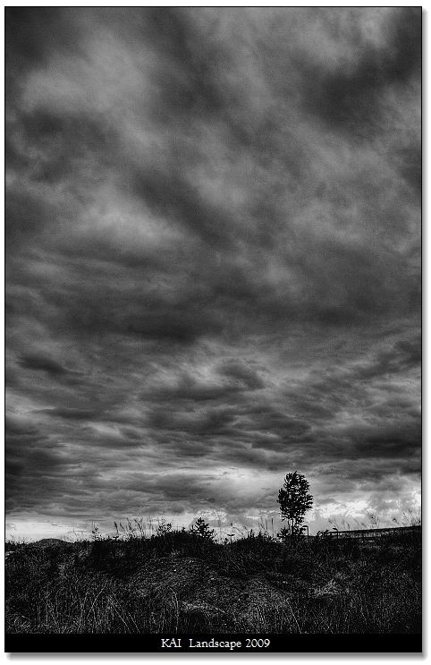
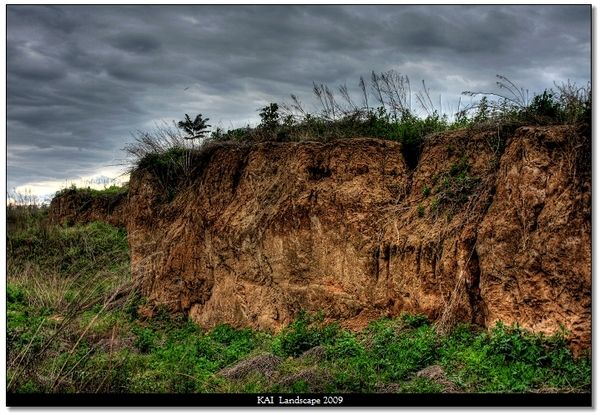
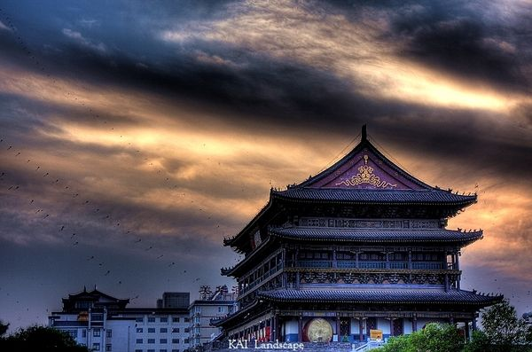
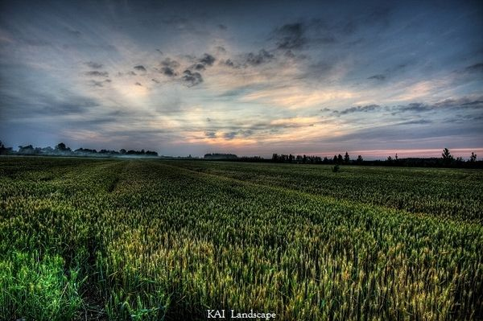
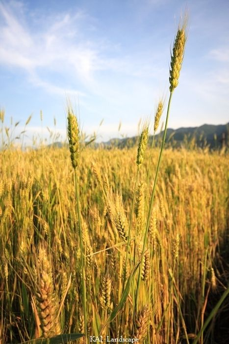

# 风景，随拍

# 风景，随拍

## 图文 / 西北政法大学学生

 

忽然发现，黑白的层次更引人入胜

像安塞尔亚当斯致敬

摄于陕西省西安市长安区西北政法大学校内

2009 5 26

摄于张汤墓山坡

2009 5 25 多云 大风

摄于西安鼓楼广场

2009 5

麦田日暮

摄于陕西省西安市黄良镇

2009 5

丰

摄于秦岭脚下

祈年殿

摄于北京天坛公园

09 5 1 阵雨

摄于北京天坛公园

09 5 1 雨 人巨多

龙魂归

摄于北京天坛公园 回音壁

09 5 1 阵雨转晴

小太阳

09 4

摄于北京朝阳公园

无题

09 4

摄于北京玉渊潭

正阳门朝阳

09 4 26 6时左右 晴 无风

摄于北京天安门

日暮五龙亭

2009 4 24 风 阴转晴

摄于北京北海公园

东方美

东方建筑艺术之美在于其精巧与宏大的完美结合。大红、金黄的完美结合，彰显其中国之魂。

2009 4 24

摄于北京北海公园

北海 白塔 景山 国贸三期

2009 4 24

摄于北京北海公园五龙亭

白塔

2009 4 24 阴转晴 大风

摄于北京北海公园

北海五龙亭

2009 4 24日暮 阴转晴 大风

摄于北京北海公园

风&竹

09 4 24 阴转晴 大风

摄于北京北海公园

天地集

摄于西北政法大学

09.4

麦子地

2009 4摄于西安

日落社会主义新农村

摄于陕西西安某农村
