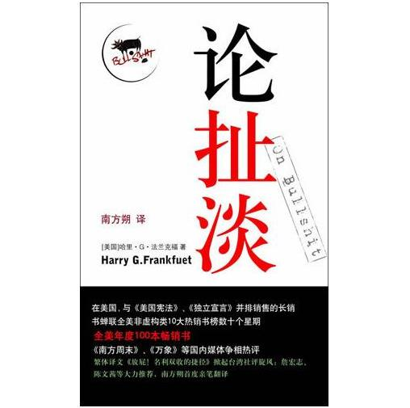

# 作为反真相和反价值的扯淡——《论扯淡》

### 

### 

# 作为反真相和反价值的扯淡

# ——《论扯淡》

### 

## 荐书人 / 谷卿（暨南大学）

### 

### 

普林斯顿大学哲学系前主任哈里•G•法兰克福教授凭借这一本薄薄的[《论扯淡》](http://ishare.iask.sina.com.cn/f/11339928.html)（On Bullshit）成为亚马逊十大畅销作家之一，国内首个译本的译者是台湾的时评家南方朔先生。我几年前就买得一本[《论扯淡》](http://ishare.iask.sina.com.cn/f/11339928.html)，一直没有认认真真地去阅读它。春节得空，将这本一百一十多页的小书一气读完，它也成为我今年逐字读完的第一本书。 高手惯于以小题目做大文章，以俗题目做雅文章，法兰克福的[《论扯淡》](http://ishare.iask.sina.com.cn/f/11339928.html)就是如此。春节假期，无非是在外同学聚会、在家乱看电视，这中间就充斥着很多扯淡，也许生活就是需要扯淡，没有扯淡的生活是不正常甚至不存在的，有时我们可能发现，扯淡的社会功用是不可替代的。法兰克福发现了我们或许已经注意到的，关注了我们可能忽视的，最终写出了我们无法写出的[《论扯淡》](http://ishare.iask.sina.com.cn/f/11339928.html)。 

### 

### 扯淡的目的

扯淡的目的显得十分具有当下性和即时性，比如小范围间的聚会交流、短短几分钟的相声小品，这中间扯淡的最主要目的不是为了传递某种信息或交换关于某一事件和主题的意见，而只是单纯地为了活跃现场气氛，使之热烈、欢快，并且每一个扯淡者自己并不这样认为也知道在场的所有人不会这样认为：他们的话语有信息层面上的意义、有见解层面上的价值。如果你看见别人因为小品中的某个包袱而发笑时，站起来严肃地说：“他说的是废话！”“他说的不是真相！”“他的话毫无意义！”“他在扯淡！”那就是你还没有认识到你此刻处在一个什么样的话语现场。扯淡时在场的人们应当有前设的心理准备，否则扯淡难以为继，或者毫无“笑果”。就如法兰克福以“公牛大会”为例所讨论的那样：“参加‘公牛大会’的每个人，都依赖于这样一种共识：他们所表现和所说的，不会当作是心里话，也不会被认为是他们信以为真的话。他们谈话的目的，不是要沟通信念。”没有目标和任务，纯粹打发时间和活跃气氛（或制造一种自己需要的气氛）才是扯淡的目的。 

### 

### 扯淡与说谎

扯淡与说谎，两者有着巨大的差别，这个差别是本质性的。说谎者有着明确的目的，他知道真相为何，并希望掩盖它或以假象取代真相，他通过说谎“企图引导我们偏离对事实的理解，我们不知道他要我们相信的，是他已知为假”的事情。而扯淡者由于扯淡的目的与说谎完全不同，故显得根本不在意其表述的内容是否有真实的价值。说谎者要成功，他的心中必须十分明确何为真相何为假相，如何让假相从逻辑上等各个层面更像真相，更令人信服，所以他们在某种程度上说仍对真相是尊重、认同的。可是对扯淡者而言，根本就无所谓真和假，他们对此毫不上心，扯淡的创作模式根本无须考虑真相问题。法兰克福认为扯淡虽然不是说谎，却是真理最大的敌人。它让我们甚至毫不关心何为真何为假，失去了批判力和鉴别力，在一片笑声和激奋中逐渐丧失追索真理的动力。 说谎者就像真小人，一旦我们知道某人说谎，就会有意识地疏远他、开始对他的一言一行进行多番审视；而扯淡者并不因为他的话语不符合事实而遭到人们的厌弃，甚至让我们对之愈加欢迎、喜爱。于是，真假掺杂的扯淡便流播益广，真理也往往在这种不激不厉的状态下被消解殆尽。对于这种可能生成的结果，法兰克福这样表述：“人在说谎或陈述事实的时候，都被他们对事实真相的认知所导引，这种认知指引他们正确或欺妄地描述世界。基于这种理由，说谎并不会造成一个人不再适合讲老实话；但扯淡却会造成一个人不去讲老实话。毫无节制地扯淡，也就是做任何论断时只想着这场合适合说什么，而毫不在意所说内容的真假，于是，关注真相这样一个人的正常习惯会愈来愈差，甚至消失。” 

### 

### 扯淡的泛滥

扯淡为什么难以避免并呈现出泛滥的态势呢？在权力社会，政治强人往往也被视作无所不知的全才，对于某件事或某个具体的物件，他们都可以任意发表自己的见解，这些见解常常是废话或扯淡，但有着明显的目的，即表示权力拥有者的博学多识，更能起到忽悠大众的效用，通过扯淡，让这些人看上去充满使命感，人们开始相信他们在主持公道、倡导进步，是应和天意、崇尚真理的。作为权力社会的另一极，受到权力制约、压迫的人们，为了应付权势者的钳制和强行灌输而不得不进行附和，甚至也参与到扯淡的行为中来。而在现代社会，扯淡却更加泛滥，首先是新媒体的发展，带来知识和信息的爆炸，每个能够利用传播媒介汲养的人都会认为自己所理解与认识到的是真理，出于对知识的自信，他们任意地谈论一些自己其实毫无研究或并未理解的东西；同时，在公共生活中，人们也往往被迫地被要求就某个大家关心的问题谈论自己的想法和意见，为了不失面子、不影响大局，势必会说一些打不中要害也无关痛痒的扯淡型话语。苏友贞在[《论扯淡》](http://ishare.iask.sina.com.cn/f/11339928.html)的附录“读趣二”中就说，现代社会提供着种种制造狗屁的文化氛围，正是这样的氛围平添出大量与真理挂搭不上的狗屁。”此外，民主社会中公民意识的高扬也是导致扯淡泛滥的重要原因，法兰克福说：“当今人们普遍相信，作为民主社会的公民，有责任要对所有的事或至少有关国家的任何事都发表意见，这就导致大家纷纷扯淡。”“更别说当某些人相信，作为一个有良知的道德角色，自己有责任来评论全世界各个角落的事件与情势。而当他的观点和他对现实的理解缺乏有效的关联时，问题就会变得更为严峻。”可见，不论权力社会还是民主社会，其客观环境与主观心理都诱发着各种扯淡的不断生发。 然而，在法兰克福看来，扯淡泛滥的深层原因（其实更可称之为思想诱因或理论支持）是后现代主义的思维与认知方式，“各类怀疑主义大行其道，它否认我们对某一客观事物的掌握途径是可信的，认为我们不可能知道何为真相。”简言之，即后现代的理论否定客观真实的存在，坚持一种不可知论，以解构的方式将阐释世界、解释真理的方式极度多元化，认为真假间的差异并不存在，这些只取决于每个“自我”感知的不同，即从忠于真实转为忠于自己，由此生出许多“真实的扯淡”——这些言谈或许是忠于说话者自己的，但它毫无信息意义与参考价值。然而对于自我的理解来自各个支持判断的参照物，既然人们坚信一切都是值得怀疑的，那这些不确的参照物又怎么能支持人们看到一个真实的自己呢？法兰克福在书的最后写道：“这样一来，‘诚意’本身就是扯淡！” [《论扯淡》](http://ishare.iask.sina.com.cn/f/11339928.html)本是法兰克福教授撰写于三十年前的一篇讲稿，禁不住学生与网友的一再敦促，他才答应出版，孰料在极短的时间内一跃成为畅销书。面对记者关于此书如何意外成为畅销作品的提问时，法兰克福犀利地回答道：“什么叫意外？难道买书人不知道他们买的是什么书吗？” 

### 

（编辑：徐毅磊）

### 

### 
