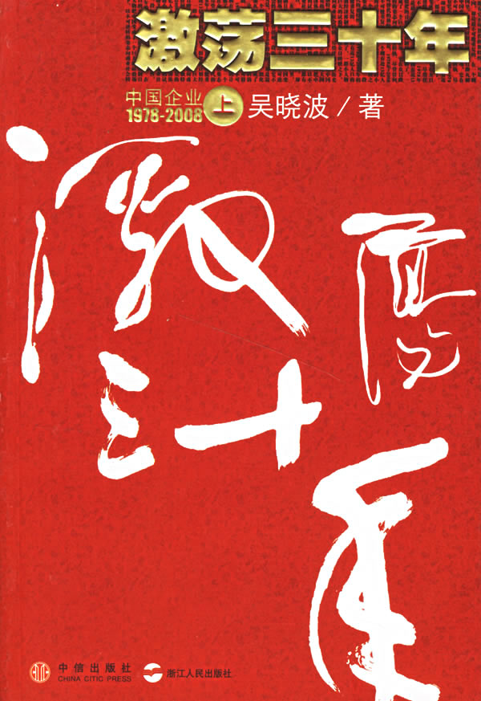

# 本期主题：三十年的激情与哀痛

 

# 本期主题：三十年的激情与哀痛

## 荐书人 / 郭钦（长江大学）

 

#### 推荐书籍（点击书目可下载）：

[**《激荡三十年》**](http://ishare.iask.sina.com.cn/f/11344685.html)

 狄更斯在《双城记》的开头写道：“是最好的时代,也是最坏的时代；这是智慧的时代,也是愚蠢的时代；这是笃信的时代,也是疑虑的时代；这是光明的季节,也是黑暗的季节；这是希望的春天,也是绝望的冬天；我们什麼都有,也什麼都没有；我们全都会上天堂,也全都会下地狱。”同样，这样的评价也适用中国自78年来的三十多年改革开放，这是一个充满变革的时代，是摆脱僵化的体制寻求无限可能的时代。著名财经作家吴晓波的《激荡三十年》以其冷峻之笔为我们展现了这一段不可复制的历史。 很难说这是一本财经书还是历史书，这样的划分也毫无意义。但对于我来说，阅读本书更多带来的是读史的乐趣，结合自身混沌的零散记忆，书中的细节恰如其分地勾起一种历史存在感，诸如健力宝、乐百氏、长虹等企业的兴衰、几乎具备一切社会功能的国企的变革、“万元户”名词的消失等等。作者笔下的历史是可以触摸的，是可以被感知的。哪怕是我这个没有经历那个激情与哀痛并存、笃信与疑虑同在的年代的年轻人，也不禁为之神往。而对于我们的上一辈来说，本书再次把他们带回那个四处散发着青春荷尔蒙的年代——那是他们那一代人的集体记忆，他们的过去构成成了这激荡三十年的图景。这或许就是写当代史的幸运，很能激起人的感同身受，可亦是写当代史的难处，要把当下人的集体记忆刻成文字难免要有些吃力不讨好的心理准备。 作者力图跳出时代的局限来为我们展现出这三十年，这种新闻人客观公正的叙述态度使中国企业在这其间的跌宕起伏真实地呈现在读者面前。然而，书写当代史的人很难完全摆脱时代局限及当下的意识形态影响。可以说这三十年来的所有变革都是政治的伴生品，并且催生了一些重大的政治事件的发生。由于众所周知的原因，这些与改革有着千丝万缕联系的重大事件及人物毫无意外地缺席，不能不说是个遗憾——不过这是作者不能掌握的。除此之外，商业界本就是一个充满偶然性的领域，加之在充满变革的时代大背景下，这种衍变具有不可预知性。作者也清楚地明白这种局限，他在书中写到：“也许今天我们陈述的细节，会在未来的某一时刻出现新的甚至截然相反的诠释，而过了若干年后，再度产生有趣而陌生的新意。” 可以肯定的是，几乎人人都感受到了这巨大的变革，其间充满了激情美好，亦有哀痛和失望。从改革初以满足温饱为目标到现在的向小康社会迈进，三十年的历史就是整个中国与贫穷落后坚决告别，共同求富的进程。但与此同时，改革带来的腐败、利益分配不均等种种问题日益凸显。不仅如此，三十年的改革史，绝少不了一些草莽英雄的书写，他们是一群充满激情与梦想的人，小心翼翼地规避着各种危险，游走在法律的边缘地带，他们努力冲破体制之困。然而，任何改革都无先例可循，改革者先天的违法违规特质让他们深陷牢狱，甚至带来了性命之忧。当今天“投机倒把”一词彻底从人们视野中消失时，年轻的我们又怎能想到曾有人因此枪决，而更多的企业家因为“法罪错位”落马。这种犯事于东，获罪于西的现象让获罪 的企业家获得了众多同情，其代表者为褚时健、牟其中。虽然身陷囹圄，许多著名企业家将之视为偶像。王石对褚时健一再拜访，潘石屹、冯仑身上都可以看出深受牟其中的影响。正如有人所说：“改革是从违规开始的。”悲情企业家李荣融眼睁睁看着自己一手创办的健力宝贱价出卖而无能为力。这一些矛盾可以让我们一窥转型时期法制的模糊和迷茫。 本书完稿于07年底，在此处出版的三年后，辉煌依旧，骄躁、不安、亦然。甚至有不少学者指出，改革出现了停滞、甚至倒退的趋势。在刚刚过去的2010年里，我们成为了世界第二大经济体，但同时通货膨胀及高房价压得我们喘不过气来；国资委主任李荣融卸任时自豪地称自己为功臣，但同时民营企业生存条件依然堪忧；8月深圳迎来了经济特区成立30周年，但同时富士康民工的N连跳让人们开始关注年轻工人的生存状态。此外，商界的刀光剑影从未终止：李书福收购沃尔沃、黄光裕和陈晓控股权之争、QQ和360绑架用户利益相互掐架、蒙牛伊利深陷诽谤门••••••而距1996提出的“500强梦想”战略已有14年之久，尽管这种图腾深深地植入中国企业家的意识之中，却没有一家企业能荣膺此冠，并且依然不乐观。 历史仍在继续，我们努力前行。光荣和梦想的实现从来都不是一蹴而就，会有更多的奇迹和精彩发生，尽管它一定会带着破茧成蝶的痛苦。忘了在哪里看到的一句话：人们很难看清楚历史，因为那都是一些过期的垃圾，但是即使不了解历史，我们绝对有理由相信，一个时代的能量会在一阵谣言的闪光之后趋于成熟，为何如此，当时没有人了解，事后回顾，也没有办法解释清楚。  

（采编：徐毅磊 责编：徐毅磊）

 
