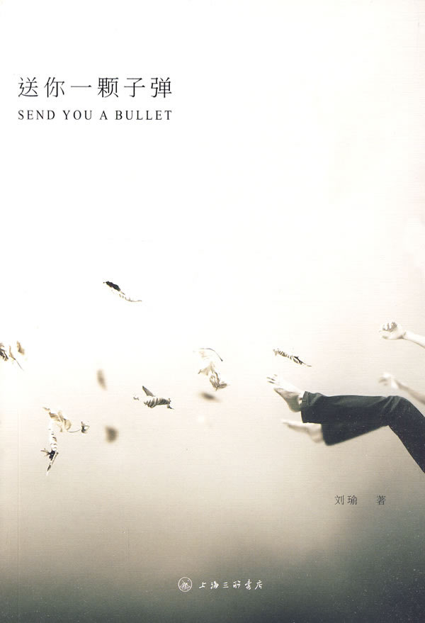
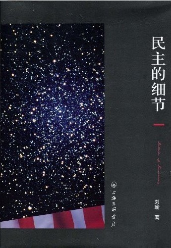
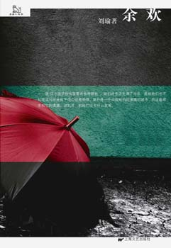

# 本期主题：刘瑜的留美生涯

# 

# 

# **本期主题：刘瑜的留美生涯**** **

## **荐书人**** ****/ ****尹犬儒（南广学院）**

#### 推荐书籍（点击蓝色书目可下载）：

[**1****、《送你一颗子弹》**](http://ishare.iask.sina.com.cn/f/15297184.html)

** **

[**2****、《民主的细节》**** **](http://ishare.iask.sina.com.cn/f/11586062.html)

** **

[**3****、《余欢》**](http://ishare.iask.sina.com.cn/f/12704998.html)

 我对留美学生的印象一直都像是隔着一层纸看皮影，算得上生动，但不鲜活。就如同不知道方鸿渐是怎么回事就会觉得唐骏形象单薄一样。直到我看了刘阿姨的书，才觉得，与别人相比她不虚此行。 不论是艺术界思想界还是文学界，每块地界都与政治圈子有一部分交集，而刘瑜，算是其中的一块儿界标。 刘瑜，女，本科毕业于中国人民大学，美国哥伦比亚大学政治学博士、哈佛大学博士后。现为清华大学人文社科学院政治系副教授（个人认为其实学历是个相对片面的东西）。同样是人民大学毕业，同学之间的思想差别，还是很大的（毛新宇也是人大毕业的）。我更愿意用《民主的细节》这样一部对当代美国政治观察随笔的作品来注释她。 关于人们对她的评价，林达说她是一个充满灵气和悟性的独立思想者、江艺平说她擅长通过讲故事来讲道理，既让你阅读轻松，又令你获益匪浅、梁文道说她的评论正是这时代最需要的营养剂。要我说，她的时评像是一扇离热爱自由的人最近、风景最好、永远敞开的窗户。 她的思想是社会文明发展到一定阶段必然会出现的一种产物，不偏激，不谄媚，特立独行却又有规律可循。是一种对自己负责的同时肩负起对祖国责任的态度，她是剑桥的讲师，她完全可以待在自己喜欢的地方，偶尔去另一个地方体验一下生活，但她写文章，希望改变，个人认为这是一种反熵的行为，但却值得后人效仿。 同时作为一名大龄待嫁（从可考证资料来看，不排除已经结婚）文艺女青年。她的可贵之处在于在教师这个严肃职业面具下有着一张活泼的、热爱生命的童颜。不同的人对人生对命运有不同的理解，有些属于自己的见解只属于个人，不适合被公开出来，有些则属于全人类，应该被许多人阅读、理解、学习、批判。那么，我相信大多数人读完后都会同意其中的某些观点。 本期荐书第一本书是散文集，关于作者对生活的感悟，有部分是体现世界观人生观的，有部分是表达政治观价值观的。因为有着许多共同点，所以喜欢看王小波的人大概会在这本书中找到乐趣。第二本比起电子书更推荐纸质书，她的书很容易见到。但凡大一点儿的书店都可以买到，有的时候纸质书的感觉确实是电子书所不能相比的。从这本书里可以窥到她在美国生活的点点滴滴，特别建议身在美国、尤其是纽约的留学生们看一看。而第三本，则是一部小说。  

（采编：尹默 责编：徐毅磊）
