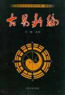
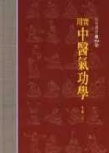
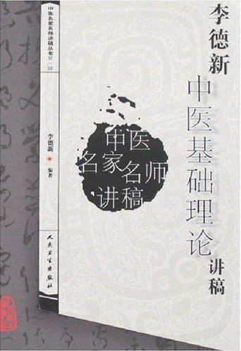
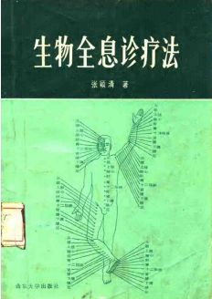
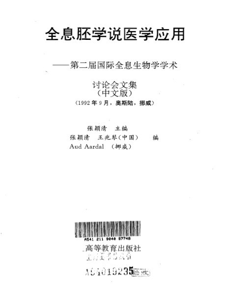
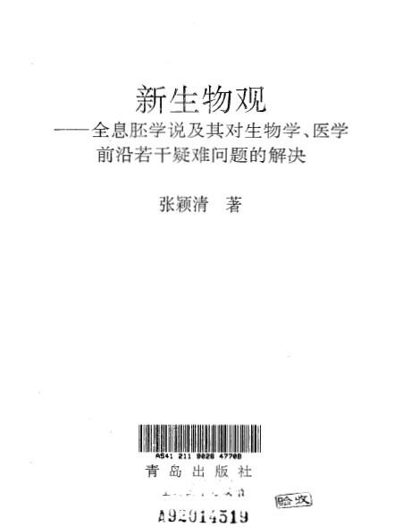

# 本期主题：古阴阳学派——西学今释

ibeidou.org ibeidou.org

# 本期主题：古阴阳学派——西学今释

ibeidou.org

## 荐书人 / 钟瑞源（上海大学）

ibeidou.org ibeidou.org 中国传统文化，由三部分组成：民间生活习俗，帝王政治教化，上古文明遗迹。（越来越多的考古证据显示，地球上出现过很多个文明世纪，而且各个都比现代文明发达，有些学者认为上个文明灭亡于大洪水，星球大战。于是，活下来的人类进入了蛮荒时代） 中国在700多年前，之所以一直处于世界领先地位，其主要原因是由于上古智慧的启蒙。那些上古遗人教导未开化的野人，步入华夏文明。如伏羲女娲，炎黄，大禹，周文王，先秦诸子百家…，先贤们一死，或者各个隐退与后继无人。文明就在逐渐衰退，就像那些不得教义的学生只会引用数学老师的结论与答案，如果题目条件稍一变化，便各个傻眼。而由于他们不得教义，所以宁愿老实本分地死扣先贤的字眼，这就是中国士大夫。 纵观人类历史长河，世界各地文明都经历过一批先贤上古智者的开化，这些证据如柏拉图的《理想国》，《山海经》，各宗教经书都有影射，还有世界各地的金字塔和海底城市，而中华大地的先贤数量最多。 换句话说，中国过去的强大，离不开我们众多的‘远古奶妈’。整个人类历史长河，随处可见的规律，就是在文明起步时突然很强大，然后一路下滑到中期，然后再慢慢上升。 西方文明的强大离不开的是：文艺复兴，也就是低谷时期的觉醒。重新拾回上古智慧，发现父母的强大。 而奶妈最多的中国，却像一个富二代那样不思进取、吃着老本。而当遭到别人家勤奋的穷二代狂殴时，却丢掉真正的祖宗，认贼作父，殊不知现在奴隶的他，过去是太子。中国现在最需要莫过于文艺复兴，寻找遗失在沙土里的‘奶瓶’。 纵观世界民族文明的下滑，无非不是传统文化三部分中的帝王政治化的上升与上古智慧的下降。比如西方中世纪的宗教文化与中国帝王封建文化。总结一下，人类的落后，一切都是政治惹的祸，越是喜欢搞政治的民族，就越是落后。因为政治起源于骗术与奴役术！ 中国人喜欢用圣人说事，这种心理很好理解，就像小孩子喜欢听父母的，何况他的父母就是地球村里最强大的。上古文明对现代人类的影响随处可见，譬如黄金，珠宝首饰，水晶。事实上，地球上的白银储量低于黄金，有一位地质学家发现，地球其实是个大金库，金子都在地心中，为何黄金会成为财富的象征？钻石，珠宝，玉石翡翠，到底对野蛮人有多少实用价值？仅仅是好看吗？这种说法过于牵强。现在物理学发现：人类崇拜的水晶，宝石，黄金，玉石翡翠等稀有资源。只有在高科技领域，才有用武之地，而且这些石料的结构特殊，属高能物质。如果利用特殊频率就可以激发出巨大的能量，如红宝石激光器。这让我们想到一个很有趣的事情，当猩猩在树上看见人类拿着枪打斗时，它也意识到了枪的威力。于是，它们也偷了一把铁棍子指着人类。只不过，他不知道用食指扣动扳机。或许我们智人也是当年的猩猩。 中华民族要想崛起，一定要正本清源，拾回丢失的文化，找回上古先贤的大智慧，实现华夏文艺复兴，重新发现中华文化之美。 ibeidou.org

#### 推荐书籍（点击书目可下载）：

ibeidou.org

**1、[《古易新编》](http://ishare.iask.sina.com.cn/f/14963474.html)**

**ibeidou.org**

**2、[《实用中医气功学》](http://ishare.iask.sina.com.cn/f/14963476.html)**

**ibeidou.org**

**3、[《李德新-中医基础理论-讲稿》](http://u.115.com/file/f8a41b1cc1)**

**ibeidou.org**

**4、[《全息生物学-上册》](http://ishare.iask.sina.com.cn/f/14963477.html)**

**ibeidou.org**

**5、[《全息胚学说医学应用》](http://ishare.iask.sina.com.cn/f/14963478.html)**

**ibeidou.org**

**6、[《新生物观》](http://ishare.iask.sina.com.cn/f/14963475.html)**

ibeidou.org

ibeidou.org

（采编：徐毅磊 责编：徐毅磊）

ibeidou.org

ibeidou.org
