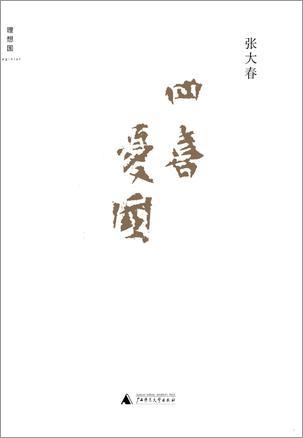
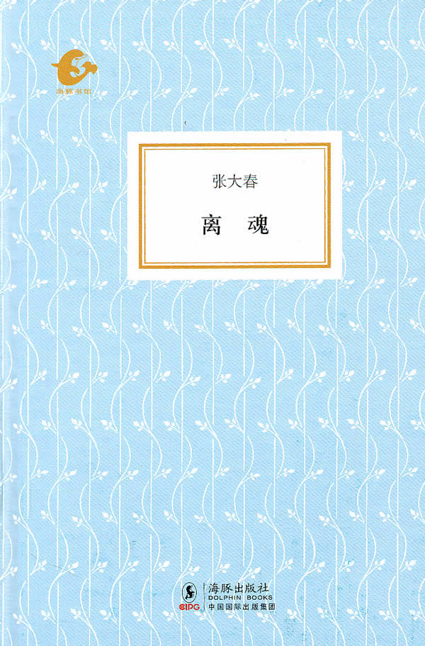
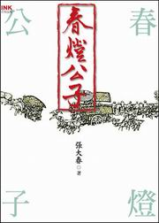
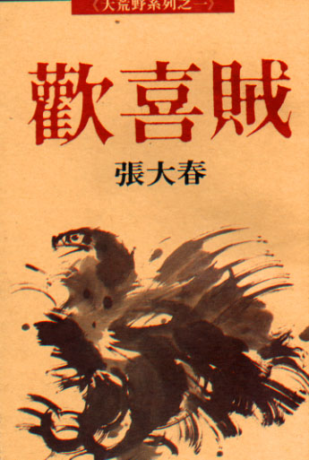
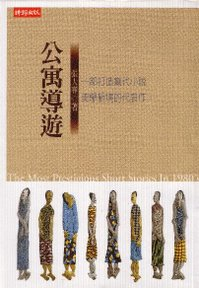
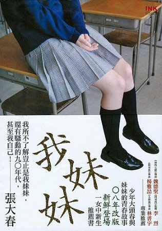

# 本期主题：四喜忧国张大春

### 

### 

# 本期主题

## 四喜忧国张大春

** **

### 荐书人 / 谷卿（暨南大学）

 上周末，北斗泛珠三角处女饭醉在暨南大学广州天河区校本部附近举行，北斗的几位编辑、撰稿人和读者十多人进行了小规模的聚餐活动。当时选定暨大为聚会地点，有一个重要的原因是早些时候得知台湾作家张大春先生将以“终结的武林：这就是民国”为题来暨大进行一场讲座，时间正是3月6日晚上。于是我们的想法和安排是，中午聚餐、下午喝茶聊天，晚上去张大春讲座现场。可惜因为母亲卧病，大春老师不能远游，故取消了此次广深之行，当晚在暨大的演讲活动一并取消。后来，大春老师还以诗记事，以表“春深乍晴，失远约”之憾：“此岁何如昨，当春讵料晴。晨寒随雾散，鸟啭出云清。侍药怀诗草，娱亲剥柳橙。天涯凭望接，笳鼓数灯明。”我们也考虑到近期《城邦暴力团》多次荣登众多图书销售、评介机构观测调查的畅销书目排名榜首，故本周向大家推荐几部张大春先生的作品。 所读第一本张大春是《认得几个字》，是我的姑姑买来准备看后教小弟学习汉字之用的。这本书和一般的文字学专业著作有着巨大的不同，即以情感胜，书中还有很多大春和他的一对儿女张容、张宜的生活照，而几乎每个篇章都以孩子们天真的问询或言谈结束，充满了不尽的温情。上一期《文字与字源》的荐书人黄霄君已对之做过推介，兹不赘述。 不久前去二沙岛参观王贵忱先生的学艺回顾展，路上为了打发时间，抓起一本《离魂》来看，顿时放手不下。之前从俞晓群先生那里知道这本书，是他负责编辑的“海豚书馆”系列丛书中的一种，不过一直没读；一旦读起来，飞快，当晚便“结果”了它。《离魂》是张大春的笔记体短篇小说集，小说中事多借旧籍故典敷衍，多荒诞吊诡，头些篇什有唐宋传奇的味道，写科场的几篇似乎又见《聊斋志异》的影子。而我最喜欢的还是《日南至·野女出》和《巴图鲁》两篇，一个是“我所知道的结局最完美的性侵害未遂案”，一个则是诗歌本事即为风月佳话的例子，在稀奇诡怪的氛围之中，透出一丝可爱的人情味。 广西师范大学出版社出版的小说集《四喜忧国》比台湾版多收纳了张大春的六篇小说，其中《将军碑》最受刘绍铭先生激赏。虽然此集所收多为大春早期作品，但读来毫无隔世远今之感。师兄卢十四读过后在豆瓣上写了一篇日志《乌龙》，这里摘取下来，聊供一笑： 今天看张大春《四喜忧国》。此书由广西师大理想国出版。先读简体版序言《偶然之必要》。张大春老师在第12页说： “近二十年来，随着台湾社会的各种变化，俗滥套语也浮泛成灾。其中我最厌恶的一句就是：‘提供另一种可能。’有时这句话也会化身成‘也许还有另一种可能。’或者‘我们还有诸多可能。’多元化社会尚未成真，但是关于多元的乐观想象和虚妄期盼却早已在绝大多数的人心中扎根了，仿佛人人都能自主地开展丰富的生活。” 读到这里我不由哈哈大笑，翻到书的扉页，那里赫然印着广西师大理想国的slogan： “想象另一种可能” 顺便说一句，大春老师的自序也是一种不容错过的精彩，除了这篇《偶然之必要》外，还有《小说稗类》的序《志怪应逢天雨粟》，其从陈散原的七律、沈增植的书论写到法兰克福书展上遇故人和对自己与文学艺术紧密相关的人生的叩问，满含文化的哲思与自省的情怀，极好，诚可细细品读。 今年情人节流行写什么三行情书，我的人人网状态栏里总是提醒、提醒，干脆，也打了三行字上去：“一笑前朝诸巨手”、“二王只合为奴仆”、“三生石上旧精魂”，分别是白石、定盦和东坡的句子。后来作家老砖看见了，说，“后面何不加上‘四喜忧国张大春’凑全四句呢？”一笑；又，大春老师微博地址为“四喜忧国”的全拼，姑以之作为本周荐书栏目的标题吧。 （因本次所荐均为小说，故每本书后不再单独附荐书人语。） 

**推荐书籍（点击书目可下载）：**** **

** **

[**1、****《四喜忧国》**](http://ishare.iask.sina.com.cn/f/10909221.html)

### 

### 

[**2****、《离魂》**](http://ishare.iask.sina.com.cn/f/13715666.html)

### 

### 

[**3****、《城邦暴力团》（上、下）**](http://ishare.iask.sina.com.cn/f/13461210.html)

### 

### 

**4****、《春灯公子》**

### 

### 

[**5****、《欢喜贼》**](http://ishare.iask.sina.com.cn/f/13176808.html)

### 

** **

### 

[**6****、《公寓导游》**](http://ishare.iask.sina.com.cn/f/9334893.html)

### 

### 

[**7****、《我妹妹》**](http://ishare.iask.sina.com.cn/f/9743748.html)

### 

### 

### 

**8****、《战夏阳》**

### 

 附： 张大春新浪微博 [http://t.sina.com.cn/sixiyouguo](http://t.sina.com.cn/sixiyouguo) 北斗泛珠三角处女饭醉影像 [http://blog.sina.com.cn/s/blog_4e4ec1da0100qe5b.html](http://blog.sina.com.cn/s/blog_4e4ec1da0100qe5b.html)

### 

### 

（编辑：徐毅磊）

### 

### 
