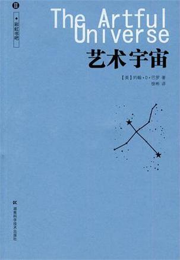
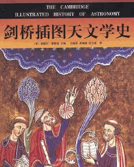
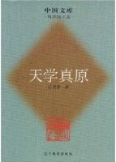
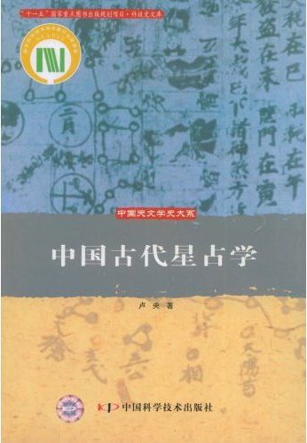
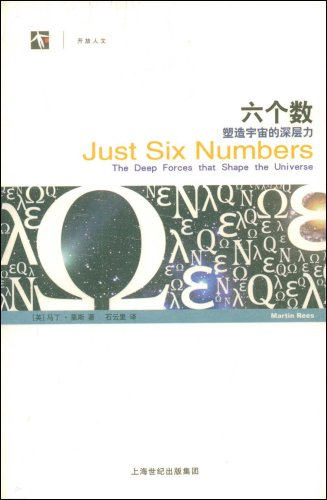

# 本期主题：天上的街市

# 本期主题：天上的街市

## 荐书人 / 谷卿（暨南大学）

 史蒂芬•霍金在《时间简史》第一章《我们的宇宙图像》中，有这样一段记述：“一位著名的科学家（据说是贝特郎•罗素）曾经作过一次关于天文学方面的讲演。他描述了地球如何绕着太阳运动，以及太阳又是如何绕着我们称之为星系的巨大的恒星群的中心转动。演讲结束之时，一位坐在房间后排的矮个老妇人站起来说道：‘你说的这些都是废话。这个世界实际上是驮在一只大乌龟的背上的一块平板。’这位科学家很有教养地微笑着答道：‘那么这只乌龟是站在什么上面的呢？’‘你很聪明，年轻人，的确很聪明，’老妇人说，‘不过，这是一只驮着一只一直驮下去的乌龟群啊！’”对于宇宙和世界的构成，我们似乎有着太多太多的想象和观念，霍金在这里提到老妇人的这种奇怪而有趣的看法只是其中之一，人类几乎在意识萌生伊始，就开始了对天地的探索与思考，屈原《天问》里一个个神奇而美丽的提问，我们今天都已经一一解答了吗？ 中国古代天文学极为发达，不仅出于自然观测与记录的目的，天人合一的世界观使得天文历法与礼仪职官等紧密结合在一起，《礼记》说：“人者，其天地之德、阴阳之交、鬼神之会、五行之秀气也。”“礼，必本于大一，分而为天地，转而为阴阳，变而为四时，列而为鬼神，其降曰命，其官于天也。”又说：“天秉阳，垂日星，地秉阴，窍于山川，播五行于四时，和而后月生也。是以三五而盈，三五而阙，五行之动，迭相竭也。五行、四时、十二月，还相为本也。五声，六律，十二管，还相为宫也。五味，六和，十二食，还相为质也。五色，六章，十二衣，还相为质也。”然而观览历史，我们遗憾地发现，在这样一整套的学说与理论框架内，过于发达的天文学在后来反而成为政治神学的附庸，而科学技术在帝制时代更被长久地视为“奇技淫巧”。 记得原来读书时，看到北大中文系主任陈平原教授说的一则趣话，他说，火车上经常有人问他是做什么的，答是研究小说的，此时对方一脸不屑，也随之侃侃而谈，大有非专业人士比专业人士更懂小说的意思。后来陈平原学聪明了，再有人问他是做什么的，便答是“研究天体物理的”，对方无不闭口缄默，屡试不爽。这则趣话好似张宗子《夜航船》中的“且待小僧伸伸脚”，读来颇可一哂。 

#### 推荐书籍（点击蓝色字体书目可下载）：

**1、《艺术宇宙》**

 

**2、[《剑桥插图天文学史》](http://u.115.com/file/bhb7d5zr)**

**3、[《天学真原》](http://ishare.iask.sina.com.cn/f/6582096.html)**

**4、[《中国古代星占学》](http://ishare.iask.sina.com.cn/f/11866090.html)**

****

**5、[《六个数：塑造宇宙的深层力》](http://ishare.iask.sina.com.cn/f/12447516.html)**

**6、[《银河系漫游指南》](http://ishare.iask.sina.com.cn/f/8803105.html)**

** **

（采编：徐毅磊 责编：徐毅磊）
