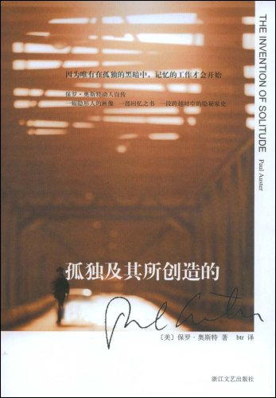
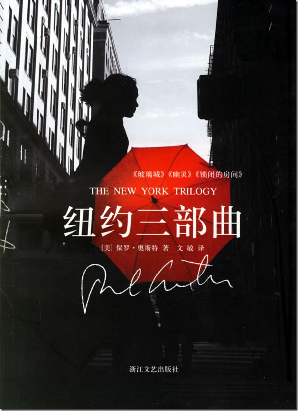
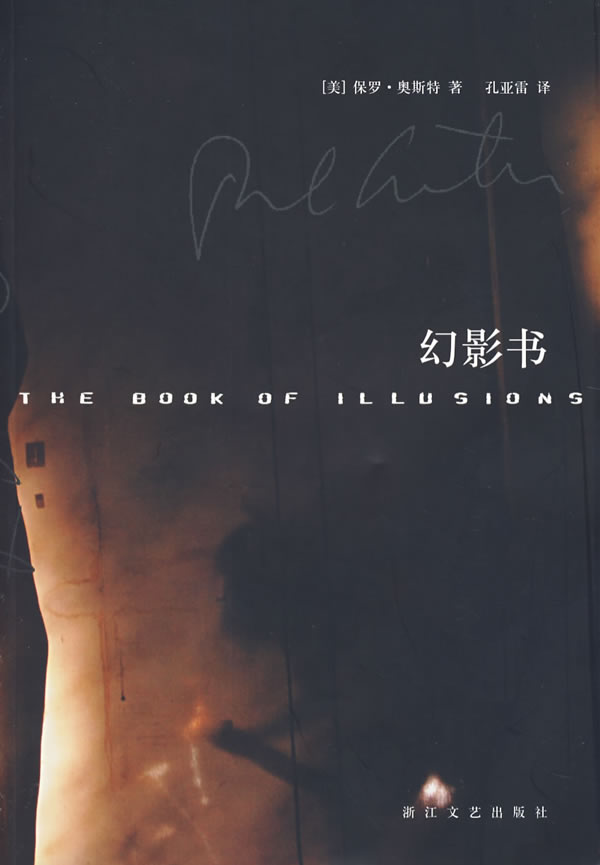
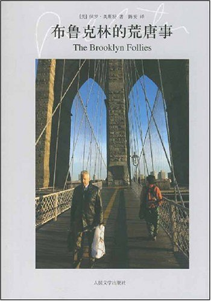

# 本期主题：密室里的孤独——保罗·奥斯特专题

# 

# 

# 本期主题

### 

## 密室里的孤独——保罗·奥斯特专题

# 

 保罗·奥斯特有许多身份：小说家、诗人、翻译、编剧、导演、犹太人、美国当代最勇于创新的小说家之一、穿胶鞋的卡夫卡（奥斯特本人确实长得像卡夫卡）、诸多奖项的获得者。吸引我看他作品的是这一个——村上春树最推崇的美国当代小说家。 看喜欢的作家喜欢的作家，如果不能在你喜欢的作家列表里增添一位的话，也至少能让你对原先喜欢的作家的了解更进一层。而保罗·奥斯特恰好就将这两者都做到了。 奥斯特的小说谈论的多是人生的无常与无限，擅长用故事套故事的结构，亦真亦幻，简直叫人分不清哪是故事哪是现实。贯穿其中的，是一种近乎绝望的孤独。他又喜用密室这一意向，黑暗的房间，上锁的房间，一个人在其中孤独地写下这些故事——颇有点自传的意味，但话说回来，没有哪位作家写作时是不带上自身的经历和感受的。 有一点我要提醒你，阅读时，千万不要猜测后面的情节如何，因为作家往往会和你开玩笑！ 本期荐书人：徐芳园，就读于中国矿业大学，文艺女青年一枚，喜欢各种小文艺书籍 

### 推荐书籍（点击书目可下载）：

1、《孤独及其所创造的》

[2、《纽约三部曲》](http://ishare.iask.sina.com.cn/f/9093581.html)

[3、《幻影书》](http://ishare.iask.sina.com.cn/f/8101090.html)

4、《布鲁克林的荒唐事》

5、《黑暗中的人》

 《孤独及其所创造的》 

 这本书是作者的处女作，也是其自传。由两部分组成：《一个隐形人的画像》和《记忆之书》，前者是对刚死亡的父亲的回忆，后者是对自己生活的描述。这是一本完完全全关于孤独的书，父亲的孤独是“隐退意义上的孤独”，是“不必看见自己，不必看见自己为他人所见”，他自己则是待在一个小小的房间里面对白纸写作的孤独。写这本书时奥斯特还未开始写小说，在后来的作品中，我们或多或少可以在《孤独及其所创造的》里找到一定程度的联系。 《纽约三部曲》 

 既然是三部曲，则必定有三个故事：《玻璃之城》、《幽灵》和《密锁的房间》。其实它们在情节上并没有直接关系，只不过都发生在纽约而已。这本书是奥斯特重回美国传统文学的起点（之前他一直受法国诗歌和戏剧影响），他在书中刻意营造一个典型的侦探小说的结构，有失踪、有侦察、有监视，但是千万别被表象欺骗，作者的叙述野心比这大得多，他要写的不只是侦探小说。接下来他就开始瓦解前面的结构，侦探怎么也找不到要找的人，生活进入死胡同。这一切如何解决呢？不不不，作者从来没想过要解决它，因为问题从一开始就不存在。 《幻影书》 

一开始故事的齐默教授就被抛入了一个绝望的境地：空难夺走了他的妻子和两个孩子。生活顿时失去了意义，然而一部默片让他发现自己还有笑的能力，于是追寻莫名失踪的默片主演海克特的影片成了他生活中唯一的意义，并撰写了一本关于海克特的书。此时他却收到一封自称来自海克特妻子的信，邀请他过去。这才是故事真正的开始。真真假假至此变得难以分辨，是幻影的，到底是齐默教授写的那本，还是我们此刻正在阅读的这本呢？ 《布鲁克林的荒唐事》 

 布鲁克林是纽约的一个区，也是作者的现居地。在这里，生活着许许多多有趣的人：餐馆的女招待、二手书店老板、BPM（bestperfect mother最佳完美母亲）……如你所见，这是一本关于小人物的书。和奥斯特的很多书一样，这本书从孤独和绝望开始：“我在寻找一个清静的地方去死，有人建议布鲁克林。”身患癌症、家庭破碎的内森·格拉斯回到童年居住过的布鲁克林，却发现了身边许多小人物不为人知的生活，他们的命运开始交织在一起。书上写着这本书是没读过保罗·奥斯特的读者最好的开始，没有复杂的结构和显得有点不知所云的结尾，是一个切切实实的关于布鲁克林的故事。 《黑暗中的人》 

 这个故事源自于“作者对2000年美国大选的失望和厌恶”，他在小说里创造出一个平行世界，在那个世界里，“九·一一”事件没有发生，二〇〇二年的总统大选造成美国分裂，新的内战爆发了……而这又是故事里的故事，平行世界是一个遭遇车祸的老人在失眠的黑暗中编造出来的。说到这里你可能会很感兴趣，但是这仍然是探索内心的一本书，老人在编造故事的过程中和失去男友的孙女相互治疗内心的伤痛。要知道，虽然是由于对政治失望而写的作品，但文学始终是文学。 另外，奥斯特已翻译出版的还有《神谕之夜》、《月宫》、《在地图结束的地方》等，都是值得一读的作品。
