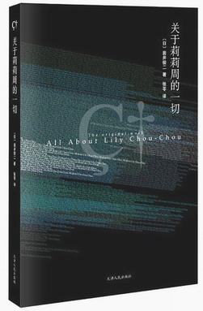
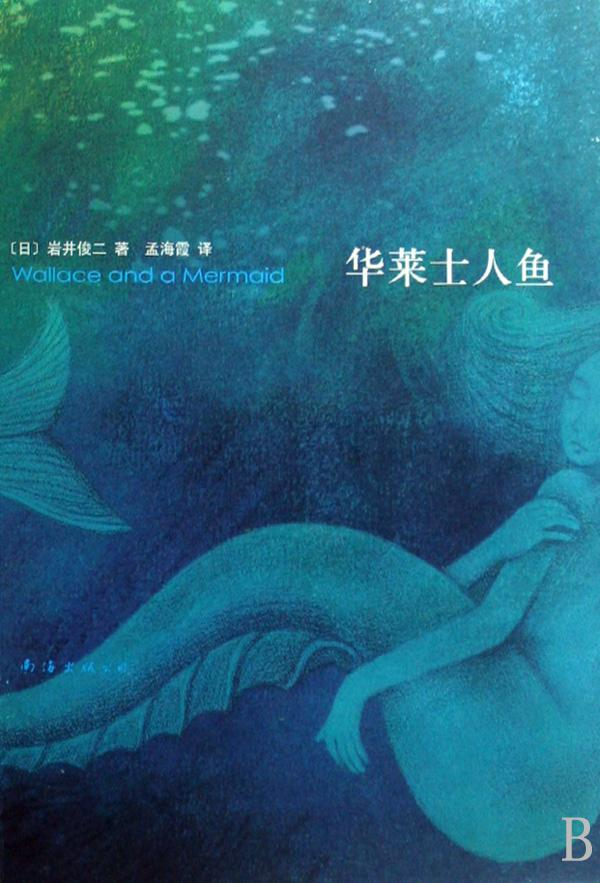
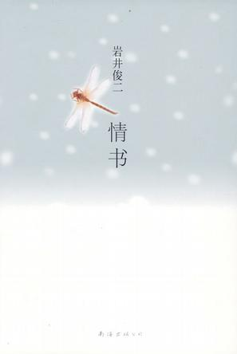
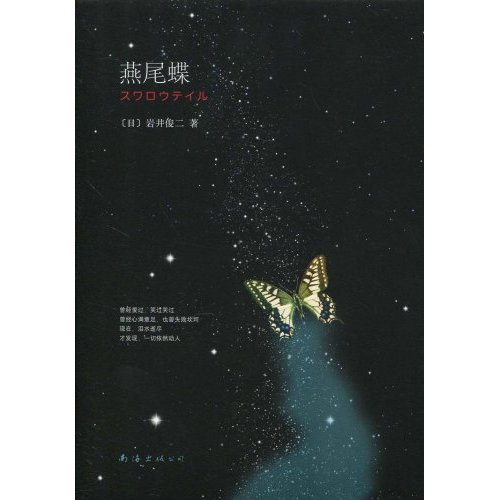

# 本期主题：岩井俊二专题

 

# **本期主题：岩井俊二专题**** **

# **——不守规矩的文字与不守规矩的想象力**** **

 

## **荐书人**** ****/ ****徐毅磊（上海理工大学）**** **

   严格来说，在称呼岩井为作家之前，他首先是一名导演和编剧，他所著的文学作品也大多是其影视作品的一种注解、预告或平行诠释。也正因为这一层关系，他的文字往往都是那么地“不守规矩”。从表现形式上他的小说可以是一封信、一些零碎的片段甚至是一个网站！而从故事结构上甚至有的作品你把主角给剔除掉对故事本身居然毫无影响。 无规矩的文字给了读者一种清新的感觉，更重要的是，这使得文字作为表达思想的一种载体对岩井自身那非凡的想象力的约束降到了最低。“像电影的小说，像小说的电影”，这是岩井电影迷与书迷对他的评价，恐怕他之所以选择同时运用这两种方式来诠释作品就是为了能够让其互相弥补不足，使自己思想的全部都能展现给观众和读者。 如果你只是作为一个资深的电影迷了解到他，并对于他的作品中将富有日本特色的细腻的情感与出人意料的病态两大特点完美结合深深打动，那么在这一个领域继续去领略岩井的奇妙物语，也许就不会仅仅认为他是一个好导演了。  

#### **推荐书籍（点击书目可下载）：**** **

[**1****、《关于莉莉周的一切》**** **](http://ishare.iask.sina.com.cn/f/6281134.html)

[**2****、《华莱士人鱼》**** **](http://ishare.iask.sina.com.cn/f/14894016.html)

[**3****、《情书》**** **](http://ishare.iask.sina.com.cn/f/9577935.html)

[**4****、《燕尾蝶》**](http://ishare.iask.sina.com.cn/f/5597580.html)

  **《关于莉莉周的一切》** 

****

 这部小说的结构被岩井生生地劈成了两半，两者联系紧密却完全可以分成两个故事来看。前半部分就是一个网站，以一个歌迷论坛中的帖子形式来表现。通过网站中一个个个性鲜明的ID互相的交流、争论与回忆，引出了一件现实中杀人事件的真相与下半部分的那个青春悲剧。善于刻画青春中喜怒哀乐的岩井在本作后半段的表现是急转直下而又过分沉重的。对于青春中的黑色片段它显得过于沉重到夸张，却又富含了合理性，也算得上是日本人性文学的佳作。遗憾的是网络上找不到本书的电子版本，只能找到网站形式的前半段，当然实体书在图书馆很容易就能找到。再说到本书出版时网络的发展情况，那么岩井对这一媒体的生动描写与敏锐洞察就是在令人叹为观止了。   **《华莱士人鱼》**

****

根据一本冷门偏僻的《香港人鱼志》，引出了这一部将美丽传说与现代社会完美结合的长篇作品。人鱼在日本文学中一直有着其特殊的地位，为了写好这部作品，岩井经过了数年的严谨探求与请教，使得对于作品中出现的人鱼有了一种合适的科学解释。当然，岩井并不是一个科幻作家，从作品中体现人性才是他的本职工作。不过，小说中站在动物角度的那些对于科学的思考一定也能让你感到震撼。

**《情书》**

****

   对日本上世纪90年代的电影感兴趣的同学想必对这本书的电影版并不陌生，男主角在故事还未发生时就已经去世，故事由两位女主角的书信交往展开，引出了一段尘封十年的围绕着一对本名男女所发生的恋爱故事。作品一直到了最后一句话女主角才发现那是一段初恋，这种淡淡的后知后觉，也许才正是我们当初淡淡的少年时代和淡淡的初恋。  **《燕尾蝶》**

 生活在社会最底层、做着各种不干净勾当的人们有梦想么？答案显然是肯定的。而且许多成功的人也许都有过类似的经历，在生存中如蝼蚁般苦苦地挣扎，突然梦想实现的机会从天而降有些东西却变了味，然后绚丽的烟花瞬间熄灭，虽然残酷但总能拾回什么。岩井习惯于描绘那种青春在光鲜的最高点突然碎裂的感觉。  

（采编：徐毅磊 责编：陈轩）
