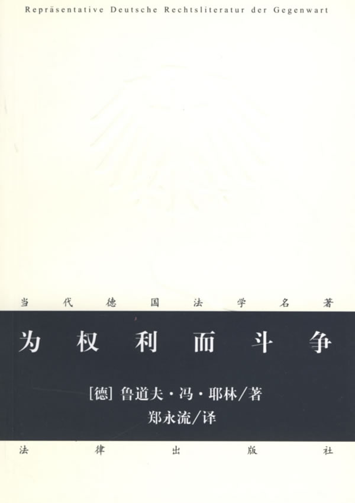
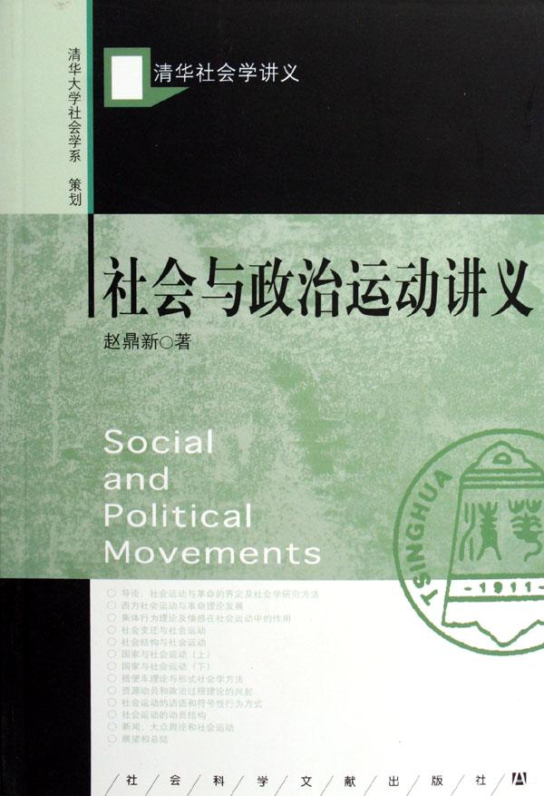
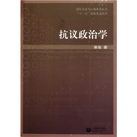
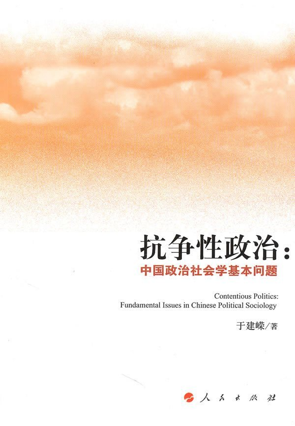
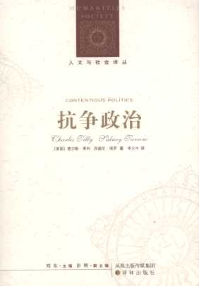

# 本期主题：抗争

### 

### 

# 本期主题：抗争

### 

## 荐书人 / 黄霄（北斗撰稿人）

### 

### 

法律史必须记载下的一切丰功伟绩是：奴隶制和农奴制的废除、土地财产自由、经营自由、信仰自由，如此等等。所有这一切，只有必须经过最激烈的、常常是持续几百年的斗争才能赢得；在这条法律走过的路上，不难见血流成河，到处是被蹂躏的法律。 

——《为权利而斗争》

### 

先聊聊笔者本人。也许是早年跟家里有矛盾的关系，天性谨慎内敛的我此生最吊诡之处就在于喜欢去关注跟自己性格强烈相悖的东西，如轻兵器、篮球、街舞，以及现在的社会运动/抗争政治，而最悲剧之处就在于一旦兴趣深入到实践层面就开始犯怂，最后变得只是喜好收集相关周边。最近兴致大发，创建了一个有关抗争与社会运动的[电影豆列](http://movie.douban.com/doulist/988515/)，应该是笔者最为上心的一个豆列了，在此推荐给各位。 闲言碎语休多讲，且进入正题。先来说说笔者为何要关注抗争。抗争的意义，很多人在形而上学、积极生活的伦理以及民主转型等方面都有充分的阐述，而最形象和最能够概括的莫过于老罗的一个状态： “我住的小区冬天取暖达不到规定温度，我和小区论坛的刺儿头一起天天去折磨物业，一个月后他们终于崩溃同意加锅炉。再后来我看到一臭傻逼在论坛说，最近屋里好温暖啊，其实大家不必整天抱怨，要相信生活会慢慢变好的——有感于‘你们怎么总是盯着阴暗面啊’。” **抗争宣扬人的主体性，使人不至于被强势的他人物化；抗争提倡一种积极生活的态度，将自身当做创造力的源泉，一个积极的动力系统，也即崔卫平诗意的“你的心中有一千道光芒”；在社会权力层面上，抗争形塑权力的边界。“权力无所不在，抵抗也无所不在。”只有汪洋般的公民不服从，才能束缚权力，把坏世界从高山变成小岛。** 这时候必然有人会说，中国人的奴性太重，缺少反抗精神，那么随便翻开史书，白莲教起义、千年王国叛乱、捻军起义、太平天国等等超大规模的民众抗争比比皆是（古代欧洲规模最大的1525年德国农民战争中卷入的人口也不过十几万）；“但他们都只反贪官不反皇帝。”那么“天下苦秦久矣”、“苍天已死，黄天当立”、“今同苦朝政，各兴大义”、“吾疾贫富不均，今为汝均之”这些口号又何来？况且抗争的目标及其影响也是要分开考察的；“无论如何，当下的中国人就是发动不起来。发动起来了也不会导向民主，只会有破坏性而无建设性，造成各种乱象”等等等等。这些问题我们都可以细细讨论，但与其苛责别人，不如身先士卒，我想这应该是最好的启蒙吧。 

#### 推荐书籍（点击书目可下载）：

**1、[《为权利而斗争》](http://ishare.iask.sina.com.cn/f/7218875.html)**

**2、[《社会与政治运动讲义》](http://ishare.iask.sina.com.cn/f/11999030.html)**

**3、《抗议政治学》**

**4、[《抗争性政治》](http://ishare.iask.sina.com.cn/f/14371526.html)**

**5、《抗争政治》**

### 

**[《为权利而斗争》](http://ishare.iask.sina.com.cn/f/7218875.html)**

### 

### 

### 

一本经典的法学著作，由德国法学家耶林的一次演讲整理而来，薄薄的一册，充满了激情。在这本书中耶林指出，“法非不费吹灰之力便降临与民众，他们必须为之角逐和争夺、斗争和流血，正是这种情况把他们与他们的法紧密地联系起来，正如分娩时母亲与孩子以自己的生命为代价。……民众用以来信奉和主张自己法的爱的毅力，取决于他们为获得法而付出的辛劳和努力。把民众与他们的法连在一起的牢固纽带，不是习惯，而是牺牲……法所要求的斗争，不是不幸，而是恩典。”耶林还认为主张权利是对自己的义务，为权利而斗争是对整个社会的义务。斗争将为社会建立“健全的是非感的理想主义”，而对于一个国家而言，“没有比民族的是非感更值得它必须去守卫和呵护的财富了。”最后耶林以极其有力的一段话结束：“这是智慧最后的结论：唯有每天为自由和生活奋斗者，才配享有它们。” 

### 

**[《社会与政治运动讲义》](http://ishare.iask.sina.com.cn/f/11999030.html)**

### 

### 

### 

颇受好评的中国的社会运动理论教材。其作者赵鼎新教授的学术生涯很值得一书的一点是，他在1990年获得昆虫学博士学位之后才去转攻社会学并将研究方向锁定在社会运动，其中机缘，笑而不语。教授也曾为此事件写了本[专著](http://ishare.iask.sina.com.cn/f/9352381.html)。 本书通篇都将集体行动、社会运动和革命纳入同一个框架进行考察，三者处于一个连续统一上，共同点是它们都被看做是制度外的集体性政治行为，都属于查尔斯蒂利所说的“对抗政治”。本书的看点之一，就是作者在介绍了西方各种主流理论之后，都会指出其中的缺陷和不足，并在囊括了主流理论的各种诠释之后，试图提出自己的理论框架。研究社会运动和革命的学者在理论构建时，往往希望找到几个决定社会运动产生和发展的充分必要条件及其这些条件的一个固定的逻辑关系，而本书强调，影响社会运动产生和发展的因素之间不存在一种非历史性的、一成不变的联系。作者提出，影响和决定社会运动产生和发展的宏观结构因素可以概括为变迁、结构和话语。本书主要采用“国家-社会关系”分析范式来分析社会运动的起源和发展，认为**一个国家是否发生革命的一个重要原因，就是国家将社会运动制度化的能力，而这一能力又是由国家的性质、社会的性质以及国家与社会的关系来决定的。目前有些西方学者之所以将西方社会描述为“社会运动社会”，就是因为西方社会的大多数社会运动已经被制度化了。这样，西方虽然社会运动很多，但革命的可能性几乎为零。**

### 

**《抗议政治学》**

### 

### 

### 

谢岳是国内另一个较著名的社会运动研究学者，现任上海交通大学国际与公共事务学院副教授，研究方向为抗争与民主转型、媒体与民主和公民社会。本书是作者最新出版的一部“为抗议政治研究提供最新版的‘地图’”的专著。本书从以下三个板块来组织章节：集体抗议的动力因素（社会变迁、抗议的政治机遇及其限制、组织与网络、行动的意义、认同的力量），抗议手法及相应的处理，抗议的影响及民主转型。本书的最后一章，即抗议与民主化的关系，应该是大家最为关心的了，谢岳也曾写过一本讨论两者关系的专著，对此笔者将在日后的相关专题荐书中开列。 

### 

**[《抗争性政治》](http://ishare.iask.sina.com.cn/f/14371526.html)**

### 

### 

### 

于建嵘是最近很火的学者，这与他关注的社会稳定、农民与工人维权、群体性事件、信访制度四大领域的高度社会敏感性有关，也在于他是个崇尚行动的人。从2001年进入学界以来，他一反学术坐台的作风，遍走全国，开展了岳村政治、安源工人、衡阳农会、信访制度、家庭教会、乐清命案等调查，最近还发起了有名的随手拍解救乞讨儿童行动。据称，他在北京宋庄的农庄有一个屋子塞满了上访者向他递送的材料，可见他与底层民众接触的程度。而本书最有价值的部分，也就是他关于上述四个领域的丰富而极有价值的调查成果及原创观点。于建嵘在研究社会冲突与社会稳定时，使用“刚性稳定”和“韧性稳定”的概念，用以解释中国社会政治稳定。**他认为，“刚性稳定”是一个社会的政治和社会结构缺乏必要的韧性和延展性，没有缓冲带，执政者时刻处于高度的紧张状态，企图运用一切资源来维系其“专政”地位，最终可能因不能承担十分巨大的社会成本而使政治统治断裂和社会管治秩序失范；**他在2000年对农民维权抗争的调查中详细描述了如何在抗争的农民中产生出“减税代表”并相互沟通，最终成立农会的过程，并提出了“以法抗争”的概念，区别于欧博文和李连江著名的“依法抗争”，强调了农民维权抗争过程的进取性；他在2004年有关信访制度的调查得到了许多令人震惊的调查结果，报告提交中央后得到了重视并推动了信访制度改革。这些原创部分都极有参考价值，至于本书的其他部分则多属老生常谈，理论拼凑。另外，于建嵘的今年出版的时评集《底层立场》，观点重复率高，新观点和材料不多，因此不推荐购买，翻翻即可。 

#### 

**《抗争政治》**

#### 

#### 

#### 

**查尔斯•蒂利绝对是抗争政治领域的禽兽级学者，其在50年的学术生涯中发表了600多篇论文，51本专著**，横跨社会学、政治学和历史学三大领域，其中不凡开创性和经典著作。他目前为学术界广泛赞誉的学术创造包括：历史社会学的奠基性贡献；抗争政治理论的创立；民族国家理论的开创性研究；方法论的创新。据说他每天4点半就起床思考、写作。对于这样一个写书比我们读书速度还快的人，真是伤不起啊伤不起……《抗争政治》由查尔斯•蒂利和西德尼•塔罗两位社会运动和抗争政治巨擘所写，是他们一生探索社会运动、民主化、民族主义和革命所整合的抗争政治理论，也是对2001年《斗争的动力》所做的更为详细的解释。蒂利和塔罗在本书中讨论了抗争政治的各种形式，包括革命、社会运动、宗教和伦理冲突、民族主义和公民权利以及跨国界运动等。它还为各种不同抗争的研究、比较和解释提供了一套分析工具和程序，阐释了抗争剧目和抗争表演的关系。作者还分析了历史上和当前的许多案例，包括二战后的波兰、巴以冲突、本•拉登问题和苏丹内战。 

### 

### 

（采编：徐毅磊 责编：徐毅磊）

### 

### 
