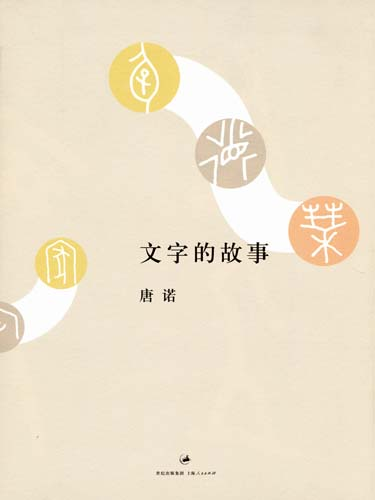
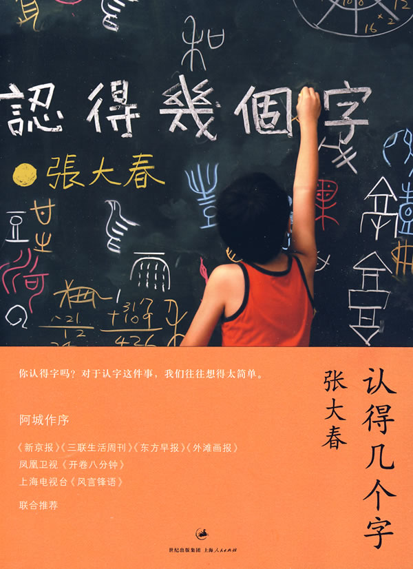
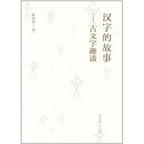
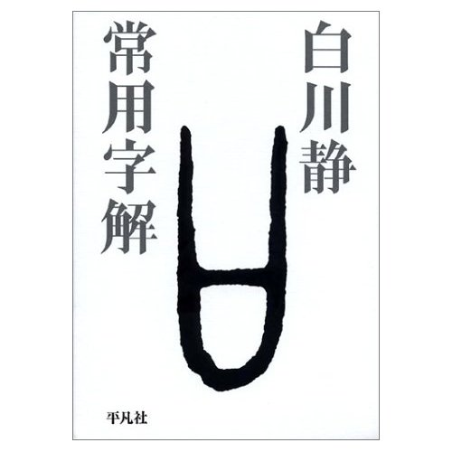
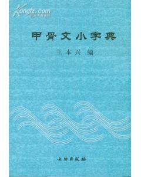

# 本期主题：文字与字源

### 

### 

# 本期主题

### 

##  文字与字源

### 荐书人 / 黄霄（北斗撰稿人）

** ** 每当笔者谈及最近在读有关文字的书以及顺手抄几个甲骨文的时候，别人都撇撇嘴，露出不可思议的样子，似乎我在干一件早该干过的事。其实笔者本意是自觉幼学颇浅，想恶补一下国学，但又总觉得非通过正体字不能进入国学正宗，而不懂字源又不能真正理解文字，于是老老实实从最根本的地方开始，建筑自己学识的根基。至于在我们这个阶段还该不该学习文字，张大春在《认得几个字》里说，我们“对于认字这件事想得太简单。生命在成长以及老去的同时，我们觉得自己已经脱离了‘某一个阶段’或‘某些个阶段’，一如豆娘伸长了翅膀、蝉蜕了壳儿那样，认字这个活动应该已经轮到儿孙辈的人去从事、去努力了。往往也就在这个时候，我们的心智开始萎缩，我们的语言趋于乏味，我们被口头禅包围攻占乃至于侵蚀、吞噬。”乃至于“误读、误写、误以为是”。 同样的，唐诺在《文字的故事》里提到“博尔赫斯在谈诗时，会兴味盎然地立刻谈到字源学，温和如卡尔维诺在谈文字使用时会显得那么气急败坏到接近愤怒：‘我觉得人类最特出的才能——即用字遣词的能力——似乎感染了一种瘟疫。这种瘟疫困扰着语言，其症状是缺乏认知和临即感，变成一种自动化反应，所有的表达化约为最一般性、不具个人色彩而抽象的公式，冲淡了意义，钝化了表现的锋芒，熄灭了文字与新状况下碰撞所迸发的火花。’”因此他认为对文字钝化效应的对抗之道，就要回到文字的始生，在于“临即感”，不让它流于抽象性的自动化，获得“临即感”和对实感的再认知再把握，“使它有机会召唤回文字被乍乍铸成或说被如此使用的原初‘惊异’，这个惊异联结了彼时生长它的现实土壤和具体图像，带着尚未被消灭的强大隐喻想象力量。” 而且甲骨文并不像人们下意识猜想的那样难看难辨，恰恰正相反，它仅用寥寥几笔就能勾画出所指事物的主要特征。如着重刻画一个人畏缩低头时眼睛朝下的“臣”字，母抱子哺乳实况的“乳”字。看看一个字的初文，常常令人恍然大悟，啧啧称奇，若有所思。 所以，我们去认几个字，如何？ 

**推荐书籍（点击书目可下载）：**** **

** **

[**1、****《文字的故事》**** **](http://ishare.iask.sina.com.cn/f/13730921.html)

****

[**2、****《****认得几个字****》**](http://ishare.iask.sina.com.cn/f/13357874.html)

** **

[**3、****《****汉字的故事——古文字趣谈****》**](http://ishare.iask.sina.com.cn/f/11832477.html)

** **

**4、****《****常用字解****》**

** **

**5、****《****甲骨文小字典****》**

 ** ** **《文字的故事》**

### 

 最文学的文字书。据说这本书是唐诺读《说文解字》未能过瘾，转而到甲骨文中寻找中国文字原貌，遂深深地为之吸引。作者大致把本书分为两个部分。第一部分是按“六书”（即象形、指事、会意、形声、假借、转注）的分类方法例举编排文字。第二部分是按一些有意思的分类，如寻找可以组成时钟指示盘的甲骨文、最本雅明的字、低贱的字、性爱和生育图示、可怕的字、简化字、死去的字等。虽然一簇一簇地介绍文字较为有趣亦能加深印象，但作者对每个字都介绍不多，可能是因为作者不是古文字专家出身而只是一个作家吧。本书也并不专旨在解字，而常常用文学化的语言发表作者对文字使用和演变的看法。如作者对简化字的看法就很有启发性，他认为他如使用简体字所省下来的时间一辈子加总起来，大概不够“让我睡一场‘睡到自然醒’的午觉”，而且写字耗用的时间常常不取决于书写速度而是思考速度，更何况日常书写本来用的就是自然简化后的行书体。即使在乘数上动脑筋，也不过从不够一个人睡一场午觉变成不够每个人睡一场午觉。另外，“当能量均匀散落在广大空间时，能量往往是毫无意义的，原因是你无法有效回收，或者说回收这些能量你得耗用远大于如此所得的能量。”而且普遍的电脑输入也使笔画的繁简多寡失去的意义。作者建议，若要省大笔时间，“最简单、最正常、最不伟大地做好日常管理工作就行了。”最后，作者提出，文字是“极坚忍世故的动物”，合理和荒谬的东西它都吞下作为发展资料。“你要善待它，并不是因为要保护它，而是只有这样它才会开放给你最丰富的讯息；你苛刻它，老实说也于它无损，你只是封闭了自身程度不等的沟通渠道，有些话它因此不会告诉你，变成呆子笨蛋的也不会是它，而是你。” 

### 

### 

 **《认得几个字》**

### 

### 

最温情的文字书。这不仅仅是一本文字书，也是一部散文集，一本育儿宝典，一本“有体温的书”（阿城语）。张大春绝对是当代鬼才，莫言说他是“台湾最有天分、最不驯，好玩得不得了的一位作家”，王家卫评他的《城邦暴力团》是“狂书”，“吃人不吐骨头”。大春稔熟典故，字书里信手拈来，辅以文史典籍，卷帙浩繁，有他以字符串联，撷取成趣，使得本书传统味极浓。一双小儿女，童言无忌，儿女情态，舐犊情深，每每抢白，总以其奇诡犀利而成为每篇文章的点睛之笔。此书令人汗颜，以至产生轻易不敢生小孩的念头，以免以后连最简单的文字都讲不好，如大春之父对他的鄙夷之辞：“连字都不懂几个，你算老几啊。”更不消说小孩好奇心而致的铺天盖地的十万个为什么了。 

### 

### 

**《汉字的故事——古文字趣谈》**

### 

解字最详尽的文字书。作者陈炜湛先生1938年9月出生于江苏常熟，将毕生精力投身于古文字（甲骨学）的研究与教学工作，退休后仍不辞辛劳往返于各大院校普及古文知识。本书是先之以日月山川草木，次之以鸟兽虫鱼，又次之以杂物奇怪，再次之以世间人事，复以稍具综合性之娄文殿后，合作者先前所写的时间跨度有二十年的三本书为一集，共收录文章92篇，一般一文讲一字，先讲古型，再辅以典故，十分详尽。值得一提的是，作者对简化字持赞成态度，认为1956年国务院正式公布的《汉字简化方案》，乃是“汉字简化趋势的历史的发展，也是对汉字自楷书以来千百年中所出现的简化字的一次历史性总结。”汉字字形的趋于简化使汉字的表意性逐渐减弱，而使其符号性、记号性更为增强，更符合文字系统所面临的指代更为抽象的概念的任务。（作为对比，唐诺曾提到，各原始文明在造字的时候都曾经历过象形阶段，之后所要表述的抽象概念越来越多，仅靠象形字已不敷用，其他文明放弃了象形，转而使用拼音文字，使得文字成为纯粹的符号。而中国文字则走上了指事会意阶段。）而且这次汉字简化手段也并非完全没有根据，如有一部分利用草书楷化而来，或采用古体，或采用历史上曾出现过的生僻字以简化常用的繁体字，等等。 

### 

### 

**《常用字解》**

### 

 必备的文字书。白川静被誉为日本“最后的硕学”，毕生立足汉字学、考古、民俗，旁及神话和文字。他亲自抄录十万字的甲骨文资料，综合文化考古学研究成果，以三十年的笔耕不辍写成《字统》、《字训》、《字通》三书。本书为《字统》的普及本。白川静说，我们要把文字理解为一种文化史的事实，他的这本书也是这么向我们展现的。文字初创时期的殷商时代，“圣俗同在，阴阳对流，天地未分，鬼灵并存，神人合体”，先人每事必占，自然使得大量祝咒仪式和对这个鬼灵并存的世界的理解沉淀、再现于文字系统中，比如“口”字，在甲骨文和金文里从来都不表示嘴巴，而是一种非常常用的祝咒之器，因此大量有“口”部或“曰”部的字，结合对先民祝咒文化的还原，得到了合理的解释。（当然，随着社会习俗的变迁，另有不少出现较晚的字所带之“口”已开始指代嘴巴。）而《说文解字》因为没有看到甲骨文金文，所以很多字常常附会，看不到初文的原型。 

### 

### 

**《甲骨文小字典》**

### 

 编者以“六书”为准则，借助《说文解字》、《甲骨文字诂林》、《康熙大字典》等，肯定了共识的甲骨文字，弃除了尚未定论的字，辨析确定了一些存疑待定的文字，归纳了诸多通假文字，尽力从方便、易查、易记出发，收录了1292个甲骨文字。不过本字典未对文字有任何解释，需要查阅者对甲骨文中的常见字素稍有了解，而且价格稍贵，28元。 ** **

### 

（编辑：徐毅磊）

### 

### 
